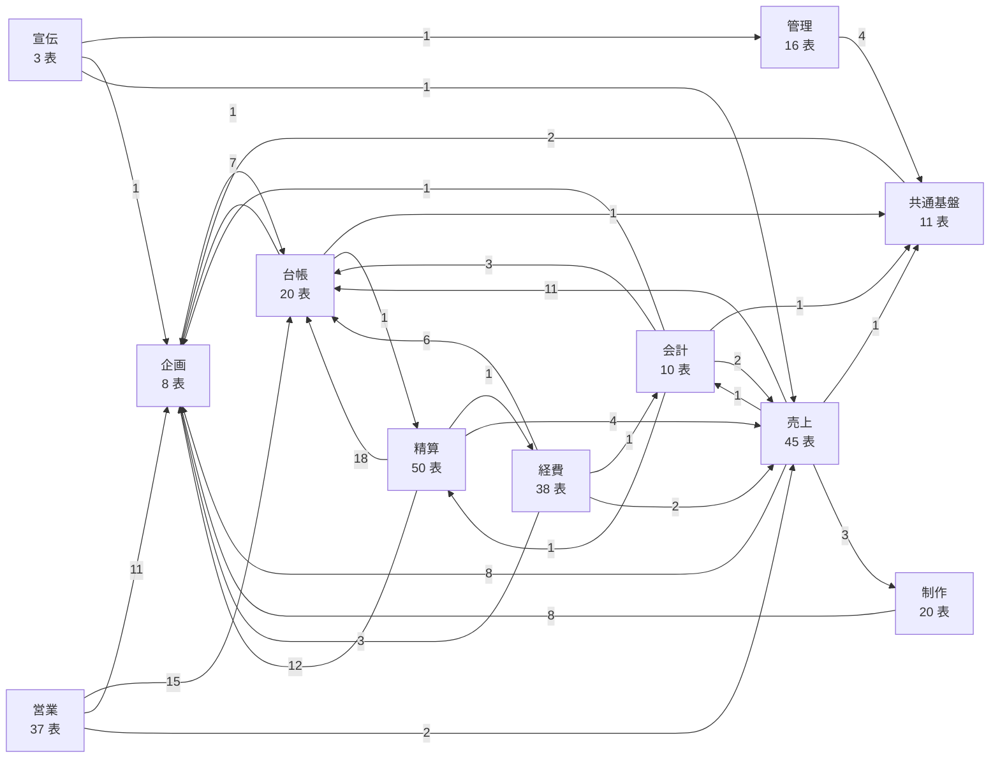

<!-- 生成物。直さない。正本は DB の定義（src/**/*.sql）と docs/database/dictionary.json。作り直しは node scripts/build-db-docs.mjs -->
# データベース定義書（統合システム）

統合システムの DB（本番は Cloudflare D1、手元とテストは SQLite）の全表を、領域ごとに説明する。型・NULL・既定値・制約・索引・トリガーは空の DB から読み、表の領域・論理名・説明は辞書（`dictionary.json`）に書く。説明の末尾が「（推測）」のものは、コードの使われ方から読み取った推測で、確かめを待っている。

- 表 258・列 2,561・参照 628・索引 125・トリガー 540
- 説明のうち推測: 2 件
- Excel 版は `node scripts/build-db-docs.mjs --xlsx` で `docs/database/_build/` に書き出す（git の対象外）

## 改訂履歴

| 版数 | 日付 | 改訂者 | 改訂内容 |
|---|---|---|---|
| 1.0 | 2026-09-30 | Claude（代表の依頼） | 初版。全表の領域・論理名・説明と全列の説明を、コードの読み取りから下書きし、別の確かめ役が直した |
| 1.1 | 2026-10-01 | Claude（代表の依頼） | D-026・D-028 に合わせて領域を直した。作品・権利の調達の4表・支払MGの契約と仕入先を企画へ移し、案件・作品・調達・請求書の領域の要確認を外した。受取MGと共有するMGの表は、D-026 で分けるまで精算に置く |
| 1.2 | 2026-10-04 | Codex（代表の依頼） | 移行0011で集約した分析の状態・ジョブの2表を追加した（PG移行計画 #28） |

## 目次

| 領域 | ページ | 表の数 |
|---|---|---|
| 企画 | [planning.md](planning.md) | 8 |
| 制作 | [production.md](production.md) | 20 |
| 営業 | [sales.md](sales.md) | 37 |
| 宣伝 | [publicity.md](publicity.md) | 3 |
| 売上 | [revenue.md](revenue.md) | 45 |
| 経費 | [expenses.md](expenses.md) | 38 |
| 精算 | [settlement.md](settlement.md) | 50 |
| 会計 | [accounting.md](accounting.md) | 10 |
| 台帳 | [ledger.md](ledger.md) | 20 |
| 共通基盤 | [core.md](core.md) | 11 |
| 管理 | [admin.md](admin.md) | 16 |

## 領域が要確認の表

どの領域が受け持つかを決めきれなかった表。領域の境界（`docs/requirements/README.md` の要確認4）と合わせて決める。

| 表 | 論理名 | いまの領域 | 迷った点 |
|---|---|---|---|
| [ai_usage](admin.md#ai_usage) | AIの利用回数 | 管理 | AI接続の利用枠を数える共通の仕組みとして共通基盤にしたが、いま数えるのは管理の追加項目のAI提案だけ。（確かめ役が直した: 書くのは src/app.mjs:1038-1046 の /api/proposals/ai だけで、呼ぶ画面は管理の拡張項目（src/admin/ExtensionsPage.jsx:117、src/shell/nav-model.mjs:93）。共通基盤（画面の枠・ログイン・組織・利用者・権限・監査）には当たらない） |
| [catalog_product_windows](ledger.md#catalog_product_windows) | 商品別の販売ウィンドウ（版） | 台帳 | 販売ウィンドウと条件は営業の受け持ちだが、いまは作品・商品マスタの画面から作り、移設計画では ledger に置く。（確かめ役が直した: 書くのは src/catalog.mjs:14（POST /api/work-catalog/windows。作品・商品マスタ WorkCatalog.jsx の販売ウィンドウ）だけで、broadcast/broadcast-windows-routes.mjs:92 は読むだけ。plans/2026-09-29-integrated-src-restructure.md:56 で catalog.mjs・WorkCatalog.jsx は ledger） |
| [change_proposals](admin.md#change_proposals) | 追加項目の提案 | 管理 | 管理の追加項目画面で提案と採否を行うため管理にしたが、設計の分類（design-model）では宣伝に入れている。 |
| [committee_investment_payments](accounting.md#committee_investment_payments) | 委員会への出資の払込 | 会計 | PL・BS の「作品別の残高」から記録し現預金と未払込を出すので会計に置いたが、製作委員会の記録として精算とも読める。 |
| [distribution_master](ledger.md#distribution_master) | 流通区分マスタ | 台帳 | 支給された流通IDの台帳で他の領域が参照するため台帳にしたが、移設計画の下書きは流通マスタを売上に置いている。 |
| [distribution_types](ledger.md#distribution_types) | 流通の種類 | 台帳 | 営業・売上・会計が共通で参照する流通IDの発番元なので台帳にしたが、移設計画の下書きは流通マスタを売上に置いている。 |
| [gl_account_class_versions](expenses.md#gl_account_class_versions) | 勘定科目の分類（版） | 経費 | 勘定科目の借貸・流動区分・支払での役割を決める会計の設定だが、いまは経費の会計設定からだけ作る（移設計画では expenses）。（確かめ役が直した: 行を作るのは経費の会計設定だけ。src/expense-sheet/expense-routes.mjs:23（POST /api/expense-accounting/:kind、accounting-model.mjs:3 の 'account-classes'）・src/expense-accounting/settlement-routes.mjs:16（決済科目の初期採用）・src/expense-accounting/adoption.mjs（費目の初期採用）。plans/2026-09-29-integrated-src-restructure.md:53 で expense-accounting/ は expenses） |
| [intake_settlement_links](settlement.md#intake_settlement_links) | 調達と分配契約の関連 | 精算 | 分配契約（精算）の側の記録として精算に置いたが、調達の画面（POST /api/intakes/:id/settlement-links）でつなぐので、調達ケースに合わせて企画（D-026・D-028）とも読める。 |
| [metric_definitions](admin.md#metric_definitions) | 指標の定義 | 管理 | 宣伝の観測値が使う指標の定義だが、行を足すのは管理の追加項目画面での採用のため。（確かめ役が直した: 行を足すのは src/app.mjs:1055-1062 の提案の採用（管理者だけ）で、画面は src/shell/nav-model.mjs:89-93 の管理・設計の「拡張項目」。同じまとまりで状態を変える change_proposals も admin にしている） |
| [mg_suppliers](planning.md#mg_suppliers) | MGの仕入先 | 企画 | 支払う MG の相手（権利元）なので、権利の調達（企画。D-026・D-028）に合わせた。取引先（partners、台帳）へ寄せてこの表をやめるかは未決。 |
| [org_profile_versions](accounting.md#org_profile_versions) | 会社の法人情報の版 | 会計 | PL・BS の「会社の設定」で管理者が入れるので会計に置いたが、組織の情報として共通基盤（core）とも読める。 |
| [partner_payment_term_versions](expenses.md#partner_payment_term_versions) | 取引先の支払条件（版） | 経費 | 取引先に付く条件だが、経費の請求書の締め日・出金予定日の計算に使い、経費の会計設定から作る。 |
| [report_issuance_voids](accounting.md#report_issuance_voids) | 帳票の発行の取消 | 会計 | 帳票の発行記録に合わせて精算に置いた。src の組み直し計画では会計（帳票）に置いている。（確かめ役が直した: 帳票の発行記録（report_issuances）と同じ画面・同じファイル（src/report-issuance-routes.mjs:319-340）で作るため。plans/2026-09-29-integrated-src-restructure.md でも accounting） |
| [report_issuances](accounting.md#report_issuances) | 帳票の発行記録 | 会計 | 権利元へのロイヤリティ報告書とMG売上報告の発行を記録するので精算に置いた。src の組み直し計画では会計（帳票）に置いている。（確かめ役が直した: 発行は帳票センターの IssuePanel から行う（src/design-model.mjs:94、src/reports/registry.jsx）。要件の会計は「帳票を毎回計算して出す」（docs/requirements/README.md）。plans/2026-09-29-integrated-src-restructure.md でも report-issuance.* は accounting。精算の「報告の記録」とも読めるので要確認） |
| [report_sale_dimensions_versions](accounting.md#report_sale_dimensions_versions) | 売上の部門分類（版） | 会計 | 帳票センターで売上明細に部門を付け、帳票を部門別に集計する手順のため会計にしたが、売上明細の属性として売上もありうる。 |
| [sale_distribution_versions](accounting.md#sale_distribution_versions) | 売上の流通区分（版） | 会計 | 帳票センターで分類する手順で作るため会計にしたが、売上集計シートや取引先リストも読む売上明細の属性なので売上もありうる。 |
| [sale_royalty_basis_versions](revenue.md#sale_royalty_basis_versions) | ロイヤリティ計上の基準（版） | 売上 | 売上明細1件ごとの値で売上集計シートから入れるが、中身はロイヤリティ（精算）の計上月・額の基準。 |
| [tax_calculation_lines](revenue.md#tax_calculation_lines) | 税計算の明細 | 売上 | 請求・入金の画面で請求を確定するときに書くので売上に置いたが、src の再編の計画では税の表を会計に置く。 |
| [tax_calculation_snapshots](revenue.md#tax_calculation_snapshots) | 請求の税計算 | 売上 | 請求・入金の画面で請求を確定するときに書くので売上に置いたが、src の再編の計画では税の表を会計に置く。 |
| [tax_invoice_rate_totals](revenue.md#tax_invoice_rate_totals) | 税計算の税率別合計 | 売上 | 請求・入金の画面で請求を確定するときに書くので売上に置いたが、src の再編の計画では税の表を会計に置く。 |
| [work_finance_versions](ledger.md#work_finance_versions) | 作品の費用（版） | 台帳 | 作品・商品マスタから入れるが、製作費・宣伝予算・出資は企画の収支試算と出資の準備にも当たる。 |
| [workbench_analysis_snapshots](admin.md#workbench_analysis_snapshots) | 分析用の読取記録 | 管理 | 作業台（表編集・加工・承認）の表だが、src 再編の計画は workbench.sql を revenue に置いているため。 |
| [workbench_applications](admin.md#workbench_applications) | 変更セットの反映 | 管理 | 作業台（表編集・加工・承認）の表だが、src 再編の計画は workbench.sql を revenue に置いているため。 |
| [workbench_change_sets](admin.md#workbench_change_sets) | 変更セット（承認申請） | 管理 | 作業台（表編集・加工・承認）の表だが、src 再編の計画は workbench.sql を revenue に置いているため。 |
| [workbench_drafts](admin.md#workbench_drafts) | 表編集の下書き | 管理 | 作業台（表編集・加工・承認）の表だが、src 再編の計画は workbench.sql を revenue に置いているため。 |
| [workbench_lineage](admin.md#workbench_lineage) | 加工の試し実行の記録 | 管理 | 作業台（表編集・加工・承認）の表だが、src 再編の計画は workbench.sql を revenue に置いているため。 |
| [workbench_recipe_versions](admin.md#workbench_recipe_versions) | 加工手順の版 | 管理 | 作業台（表編集・加工・承認）の表だが、src 再編の計画は workbench.sql を revenue に置いているため。 |
| [workbench_recipes](admin.md#workbench_recipes) | 加工手順 | 管理 | 作業台（表編集・加工・承認）の表だが、src 再編の計画は workbench.sql を revenue に置いているため。 |
| [workbench_snapshots](admin.md#workbench_snapshots) | 表編集の元データ | 管理 | 作業台（表編集・加工・承認）の表だが、src 再編の計画は workbench.sql を revenue に置いているため。 |
| [workbench_source_artifacts](admin.md#workbench_source_artifacts) | 表編集の原本 | 管理 | 作業台（表編集・加工・承認）の表だが、src 再編の計画は workbench.sql を revenue に置いているため。 |
| [workbench_validations](admin.md#workbench_validations) | 表編集の検証 | 管理 | 作業台（表編集・加工・承認）の表だが、src 再編の計画は workbench.sql を revenue に置いているため。 |
| [workflow_raw_artifacts](production.md#workflow_raw_artifacts) | 受領した原本 | 制作 | 台本（制作）と売上報告（売上）の両方の原本を持つが、src 再編の計画は workflow.sql を制作に置いているため。 |

## 領域どうしのつながり

矢印は参照する側から参照される側へ。数は参照（外部キー）の本数。

組織（organizations・memberships）への参照は、ほぼ全表にあるので図から省く。

## 読み方

- **データ型**: SQLite の型。括弧の中は CHECK 制約から読み取った中身（年月 YYYY-MM・日付・真偽 0/1・列挙・JSON）
- **NULL**: 不可＝必ず値が入る
- **制約**: PK＝主キー、Unique＝一意、FK →＝参照先、値:＝入れられる値の一覧、CHECK:＝その他の条件
- **表の制約**: 複数の列にまたがる一意・参照・CHECK と、索引・トリガー（書き換えや削除を止めるものを含む）
