<!-- 生成物。直さない。正本は DB の定義（src/**/*.sql）と docs/database/dictionary.json。作り直しは node scripts/build-db-docs.mjs -->
# 会計（accounting）の表

[目次へ戻る](README.md)

## ER 図

```mermaid
erDiagram
  committee_investment_payments {
    INTEGER id PK "行のID"
    INTEGER org_id FK "組織（organizations）。データの持ち主"
    INTEGER term_version_id FK "製作委員会の条件版（committee_term_versions）"
    INTEGER partner_id FK "払い込んだ参加者（partners）"
    INTEGER reverses_id FK "取り消す払込（committee_investment_payments）"
  }
  fiscal_settings {
    INTEGER org_id PK "組織（organizations）。1組織に1行"
    INTEGER updated_by FK "最後に変えた利用者（users）"
  }
  gl_accounts {
    INTEGER id PK "行のID"
  }
  gl_manual_amounts {
    INTEGER id PK "行のID"
    INTEGER org_id FK "組織（organizations）。データの持ち主"
    INTEGER account_id FK "勘定科目（gl_accounts）"
    INTEGER work_id FK "作品（works）。任意"
    INTEGER reverses_id FK "取り消す元の行（gl_manual_amounts）"
  }
  org_profile_versions {
    INTEGER id PK "行のID"
    INTEGER org_id FK "組織（organizations）。データの持ち主"
    INTEGER self_partner_id FK "自社を表す取引先（partners）"
  }
  report_issuance_voids {
    INTEGER id PK "行のID"
    INTEGER org_id FK "組織（organizations）。データの持ち主"
    INTEGER issuance_id FK "取り消した発行（report_issuances）"
  }
  report_issuances {
    INTEGER id PK "行のID"
    INTEGER org_id FK "組織（organizations）。データの持ち主"
    INTEGER previous_issuance_id FK "再発行の前の版（report_issuances）"
  }
  report_sale_dimensions_versions {
    INTEGER org_id PK, FK "組織（organizations）。データの持ち主"
    INTEGER sale_id PK, FK "売上明細（sale_lines）"
    INTEGER version_no PK "版番号（明細ごとに1から）"
  }
  sale_distribution_versions {
    INTEGER id PK "行のID"
    INTEGER org_id FK "組織（organizations）。データの持ち主"
    INTEGER sale_id FK "売上明細（sale_lines）"
    TEXT distribution_code FK "流通ID（distribution_types）"
  }
  tax_rule_versions {
    INTEGER id PK "行のID"
    INTEGER org_id FK "組織（organizations）。データの持ち主"
    INTEGER partner_id FK "取引先（partners）。取引先別のときだけ"
  }
  committee_investment_payments }o--o| committee_investment_payments : "reverses_id"
  committee_investment_payments }o--|| committee_term_investments : "term_version_id,partner_id"
  fiscal_settings }o--o| users : "updated_by"
  gl_manual_amounts }o--o| gl_manual_amounts : "reverses_id"
  gl_manual_amounts }o--o| works : "work_id"
  gl_manual_amounts }o--|| gl_accounts : "account_id"
  org_profile_versions }o--o| partners : "self_partner_id"
  report_issuance_voids }o--|| report_issuances : "issuance_id"
  report_issuances }o--o| report_issuances : "previous_issuance_id"
  report_sale_dimensions_versions }o--|| sale_lines : "sale_id"
  sale_distribution_versions }o--|| sale_lines : "sale_id"
  sale_distribution_versions }o--|| distribution_types : "distribution_code"
  tax_rule_versions }o--o| partners : "partner_id"
```

主キーと参照の列だけを載せる。組織（organizations・memberships）への参照は省く。

## 表の一覧

| 表 | 論理名 | 説明 |
|---|---|---|
| [committee_investment_payments](#committee_investment_payments) | 委員会への出資の払込 | 1行は、製作委員会の参加者が出資額（committee_term_investments）を払い込んだ1回。最新の条件版に記録し、合計は出資額まで。取消は負の額の行を足す。 |
| [fiscal_settings](#fiscal_settings) | 年度の設定 | 組織の年度の設定（期首の月）。1組織1行で、行が無ければ期首5月とする。管理者が年度の設定で上書きする。 |
| [gl_accounts](#gl_accounts) | 勘定科目 | 1行は、PL・BS に使う組織の勘定科目1つ。管理者が初期値を入れるか1つずつ足す（経費の会計の採用でも足す）。変更・削除はできない。 |
| [gl_manual_amounts](#gl_manual_amounts) | 勘定科目の手入力額 | 1行は、システムに無い額（全社費用・借入金・期首残高など）を勘定科目×月で手入力した記録。直すときは符号を逆にした取消の行を足す。 |
| [org_profile_versions](#org_profile_versions) | 会社の法人情報の版 | 1行は、組織の法人情報の1つの版（法人名・番号・住所・資本金・自社を表す取引先・期首の基準月）。直すときは新しい版を足す（変更・削除はできない）。 |
| [report_issuance_voids](#report_issuance_voids) | 帳票の発行の取消 | 帳票の発行を取り消した記録1件（理由つき）。1つの発行に1回だけで、変更も削除もできない。 |
| [report_issuances](#report_issuances) | 帳票の発行記録 | ロイヤリティ報告書・MG売上報告を発行した記録1件。サーバーが同じ条件で作り直した本体とハッシュを残し、変更も削除もできない。取り消すと同じ条件で次の版を発行できる。 |
| [report_sale_dimensions_versions](#report_sale_dimensions_versions) | 売上の部門分類（版） | 売上明細1行に付けた部門の版1つを表す。帳票センターで分類するたびに足して変更・削除できず、最大の版番号が今の部門。 |
| [sale_distribution_versions](#sale_distribution_versions) | 売上の流通区分（版） | 売上明細1行の流通区分・地域・サービス名・精算方式の分類の版1つを表す。帳票センターで分類するたびに足して変更・削除できず、最大の版番号が今の分類。 |
| [tax_rule_versions](#tax_rule_versions) | 税ルールの版 | 1行は、請求の税計算のルールの1つの版（組織の既定か取引先別）。適用開始日から効き、変更・削除はできない。管理者だけが登録する。 |

## committee_investment_payments

**委員会への出資の払込** — 1行は、製作委員会の参加者が出資額（committee_term_investments）を払い込んだ1回。最新の条件版に記録し、合計は出資額まで。取消は負の額の行を足す。

| No | カラム名 | データ型 | 説明 | NULL | デフォルト値 | 制約 |
|---|---|---|---|---|---|---|
| 1 | id | INTEGER | 行のID | 不可 | - | PK |
| 2 | org_id | INTEGER | 組織（organizations）。データの持ち主 | 不可 | - | FK → organizations.id |
| 3 | term_version_id | INTEGER | 製作委員会の条件版（committee_term_versions） | 不可 | - | FK（複合）→ committee_term_investments |
| 4 | partner_id | INTEGER | 払い込んだ参加者（partners） | 不可 | - | FK（複合）→ committee_term_investments |
| 5 | paid_on | TEXT | 払込日。取消の行は取消日 | 不可 | - | CHECK: paid_on GLOB '[0-9][0-9][0-9][0-9]-[0-1][0-9]-[0-3][0-9]' |
| 6 | amount_yen | INTEGER | 払込額（円）。取消の行は負。税込か税抜かは未確認 | 不可 | - | - |
| 7 | method | TEXT（列挙） | 方法（振込・現金・カード・相殺・その他） | 不可 | - | 値: transfer / cash / card / offset / other |
| 8 | note | TEXT | 備考。取消の行は理由 | 可 | - | CHECK: note IS NULL OR length(note)<=500 |
| 9 | reverses_id | INTEGER | 取り消す払込（committee_investment_payments） | 可 | - | FK（複合）→ committee_investment_payments |
| 10 | created_by | INTEGER | 作成した利用者（users） | 不可 | - | FK（複合）→ memberships |
| 11 | created_at | TEXT | 作成日時 | 不可 | 現在時刻 | - |

表の制約:

- 複合の一意: (org_id, id)
- 複合の参照: (org_id, created_by) → memberships(org_id, user_id)
- 複合の参照: (org_id, reverses_id) → committee_investment_payments(org_id, id)
- 複合の参照: (org_id, term_version_id, partner_id) → committee_term_investments(org_id, term_version_id, partner_id)
- CHECK: (reverses_id IS NULL AND amount_yen>0) OR (reverses_id IS NOT NULL AND reverses_id<>id AND amount_yen<0 AND note IS NOT NULL AND length(trim(note))>0)
- 索引 committee_investment_payments_by_version: (org_id, term_version_id, partner_id)
- 索引 committee_investment_payments_reversal: (org_id, reverses_id) 一意 WHERE reverses_id IS NOT NULL
- トリガー committee_investment_payments_no_delete: 削除の前
- トリガー committee_investment_payments_no_update: 更新の前
- トリガー committee_investment_payments_reversal_scope: 追加の前

## fiscal_settings

**年度の設定** — 組織の年度の設定（期首の月）。1組織1行で、行が無ければ期首5月とする。管理者が年度の設定で上書きする。

| No | カラム名 | データ型 | 説明 | NULL | デフォルト値 | 制約 |
|---|---|---|---|---|---|---|
| 1 | org_id | INTEGER | 組織（organizations）。1組織に1行 | 不可 | - | PK、FK → organizations.id |
| 2 | fiscal_start_month | INTEGER | 期首の月（1〜12） | 不可 | - | CHECK: fiscal_start_month BETWEEN 1 AND 12 |
| 3 | confirmed | INTEGER（真偽 0/1） | 期首の月の解釈（決算月との対応）を確かめたか。0＝未確認、1＝確認済み | 不可 | 0 | - |
| 4 | updated_by | INTEGER | 最後に変えた利用者（users） | 可 | - | FK → users.id |
| 5 | updated_at | TEXT | 最後に変えた日時 | 不可 | 現在時刻 | - |

## gl_accounts

**勘定科目** — 1行は、PL・BS に使う組織の勘定科目1つ。管理者が初期値を入れるか1つずつ足す（経費の会計の採用でも足す）。変更・削除はできない。

| No | カラム名 | データ型 | 説明 | NULL | デフォルト値 | 制約 |
|---|---|---|---|---|---|---|
| 1 | id | INTEGER | 行のID | 不可 | - | PK |
| 2 | org_id | INTEGER | 組織（organizations）。データの持ち主 | 不可 | - | FK → organizations.id |
| 3 | code | TEXT | 科目コード（組織の中で一意） | 不可 | - | CHECK: length(code) BETWEEN 1 AND 20 AND code NOT GLOB '*[^0-9A-Za-z_-]*' |
| 4 | name | TEXT | 科目名 | 不可 | - | CHECK: length(trim(name)) BETWEEN 1 AND 60 |
| 5 | section | TEXT（列挙） | 区分（売上・売上原価・販管費・営業外・特別・法人税等・資産・負債・純資産） | 不可 | - | 値: sales / cogs / sga / non_operating_income / non_operating_expense / extraordinary_gain / extraordinary_loss / income_tax / asset / liability / equity |
| 6 | source | TEXT（列挙） | 出どころ（system システムが計算・manual 手入力） | 不可 | - | 値: system / manual |
| 7 | system_key | TEXT | システムが計算する行のキー（own_sales・royalty など） | 可 | - | CHECK: system_key IS NULL OR (length(system_key) BETWEEN 1 AND 40 AND system_key NOT GLOB '*[^a-z0-9_]*') |
| 8 | cash_effect | INTEGER（真偽 0/1） | 1＝手入力の額が現預金を動かす（減価償却費などは0） | 不可 | 1 | - |
| 9 | sort_order | INTEGER | 表示の順 | 不可 | - | CHECK: sort_order BETWEEN 0 AND 100000 |
| 10 | note | TEXT | メモ | 可 | - | CHECK: note IS NULL OR length(note)<=500 |
| 11 | created_by | INTEGER | 作成した利用者（users） | 不可 | - | FK（複合）→ memberships |
| 12 | created_at | TEXT | 作成日時 | 不可 | 現在時刻 | - |

表の制約:

- 複合の一意: (org_id, id)
- 複合の一意: (org_id, code)
- 複合の参照: (org_id, created_by) → memberships(org_id, user_id)
- CHECK: (source='system' AND system_key IS NOT NULL) OR (source='manual' AND system_key IS NULL)
- 索引 gl_accounts_system_key: (org_id, system_key) 一意 WHERE system_key IS NOT NULL
- トリガー gl_accounts_no_delete: 削除の前
- トリガー gl_accounts_no_update: 更新の前

## gl_manual_amounts

**勘定科目の手入力額** — 1行は、システムに無い額（全社費用・借入金・期首残高など）を勘定科目×月で手入力した記録。直すときは符号を逆にした取消の行を足す。

| No | カラム名 | データ型 | 説明 | NULL | デフォルト値 | 制約 |
|---|---|---|---|---|---|---|
| 1 | id | INTEGER | 行のID | 不可 | - | PK |
| 2 | org_id | INTEGER | 組織（organizations）。データの持ち主 | 不可 | - | FK → organizations.id |
| 3 | account_id | INTEGER | 勘定科目（gl_accounts） | 不可 | - | FK（複合）→ gl_accounts |
| 4 | month | TEXT | 月（YYYY-MM） | 不可 | - | CHECK: month GLOB '[0-9][0-9][0-9][0-9]-[0-9][0-9]' AND substr(month,6,2) BETWEEN '01' AND '12' |
| 5 | kind | TEXT（列挙） | 種類（flow PL の発生額・balance BS の月末の残高） | 不可 | - | 値: flow / balance |
| 6 | amount_yen | INTEGER | 金額（円）。発生額は税抜、残高は月末の額 | 不可 | - | - |
| 7 | tax_yen | INTEGER | 発生額の消費税額（円）。残高は0 | 不可 | 0 | - |
| 8 | work_id | INTEGER | 作品（works）。任意 | 可 | - | FK（複合）→ works |
| 9 | basis | TEXT | 根拠 | 不可 | - | CHECK: length(trim(basis)) BETWEEN 1 AND 500 |
| 10 | status | TEXT（列挙） | 確認状態（unverified 未確認・reviewed 確認済み） | 不可 | - | 値: unverified / reviewed |
| 11 | reverses_id | INTEGER | 取り消す元の行（gl_manual_amounts） | 可 | - | FK（複合）→ gl_manual_amounts |
| 12 | created_by | INTEGER | 作成した利用者（users） | 不可 | - | FK（複合）→ memberships |
| 13 | created_at | TEXT | 作成日時 | 不可 | 現在時刻 | - |

表の制約:

- 複合の一意: (org_id, id)
- 複合の参照: (org_id, created_by) → memberships(org_id, user_id)
- 複合の参照: (org_id, reverses_id) → gl_manual_amounts(org_id, id)
- 複合の参照: (org_id, work_id) → works(org_id, id)
- 複合の参照: (org_id, account_id) → gl_accounts(org_id, id)
- CHECK: reverses_id IS NULL OR reverses_id<>id
- CHECK: kind='flow' OR tax_yen=0
- 索引 gl_manual_amounts_by_month: (org_id, month)
- 索引 gl_manual_amounts_reversal: (org_id, reverses_id) 一意 WHERE reverses_id IS NOT NULL
- トリガー gl_manual_amounts_kind: 追加の前
- トリガー gl_manual_amounts_no_delete: 削除の前
- トリガー gl_manual_amounts_no_update: 更新の前
- トリガー gl_manual_amounts_reversal_scope: 追加の前
- トリガー gl_manual_amounts_tax_cash: 追加の前

## org_profile_versions

**会社の法人情報の版** — 1行は、組織の法人情報の1つの版（法人名・番号・住所・資本金・自社を表す取引先・期首の基準月）。直すときは新しい版を足す（変更・削除はできない）。

| No | カラム名 | データ型 | 説明 | NULL | デフォルト値 | 制約 |
|---|---|---|---|---|---|---|
| 1 | id | INTEGER | 行のID | 不可 | - | PK |
| 2 | org_id | INTEGER | 組織（organizations）。データの持ち主 | 不可 | - | FK → organizations.id |
| 3 | version_no | INTEGER | 版番号（1から順） | 不可 | - | CHECK: version_no>0 |
| 4 | legal_name | TEXT | 法人名 | 不可 | - | CHECK: length(trim(legal_name)) BETWEEN 1 AND 200 |
| 5 | corporate_number | TEXT | 法人番号（13桁） | 可 | - | CHECK: corporate_number IS NULL OR (length(corporate_number)=13 AND corporate_number NOT GLOB '*[^0-9]*') |
| 6 | invoice_registration_number | TEXT | 適格請求書の登録番号（T＋13桁） | 可 | - | CHECK: invoice_registration_number IS NULL OR invoice_registration_number GLOB 'T[0-9][0-9][0-9][0-9][0-9][0-9][0-9][0-9][0-9][0-9][0-9][0-9][0-9]' |
| 7 | postal_code | TEXT | 郵便番号 | 可 | - | CHECK: postal_code IS NULL OR postal_code GLOB '[0-9][0-9][0-9]-[0-9][0-9][0-9][0-9]' |
| 8 | address | TEXT | 住所 | 可 | - | CHECK: address IS NULL OR length(trim(address)) BETWEEN 1 AND 300 |
| 9 | capital_yen | INTEGER | 資本金（円） | 可 | - | CHECK: capital_yen IS NULL OR capital_yen>=0 |
| 10 | self_partner_id | INTEGER | 自社を表す取引先（partners） | 可 | - | FK（複合）→ partners |
| 11 | opening_month | TEXT | 期首残高の基準月（その月末の残高を手入力する） | 可 | - | CHECK: opening_month IS NULL OR (opening_month GLOB '[0-9][0-9][0-9][0-9]-[0-9][0-9]' AND substr(opening_month,6,2) BETWEEN '01' AND '12') |
| 12 | reason | TEXT | 版を作る理由 | 不可 | - | CHECK: length(trim(reason)) BETWEEN 1 AND 1000 |
| 13 | created_by | INTEGER | 作成した利用者（users） | 不可 | - | FK（複合）→ memberships |
| 14 | created_at | TEXT | 作成日時 | 不可 | 現在時刻 | - |

表の制約:

- 複合の一意: (org_id, id)
- 複合の一意: (org_id, version_no)
- 複合の参照: (org_id, created_by) → memberships(org_id, user_id)
- 複合の参照: (org_id, self_partner_id) → partners(org_id, id)
- トリガー org_profile_versions_no_delete: 削除の前
- トリガー org_profile_versions_no_update: 更新の前
- トリガー org_profile_versions_sequence: 追加の前

## report_issuance_voids

**帳票の発行の取消** — 帳票の発行を取り消した記録1件（理由つき）。1つの発行に1回だけで、変更も削除もできない。

| No | カラム名 | データ型 | 説明 | NULL | デフォルト値 | 制約 |
|---|---|---|---|---|---|---|
| 1 | id | INTEGER | 行のID | 不可 | - | PK |
| 2 | org_id | INTEGER | 組織（organizations）。データの持ち主 | 不可 | - | FK → organizations.id |
| 3 | issuance_id | INTEGER | 取り消した発行（report_issuances） | 不可 | - | Unique、FK（複合）→ report_issuances |
| 4 | reason | TEXT | 取消の理由（1〜1000字） | 不可 | - | CHECK: length(trim(reason))>0 AND length(reason)<=1000 |
| 5 | voided_by | INTEGER | 取り消した利用者（memberships） | 不可 | - | FK（複合）→ memberships |
| 6 | voided_at | TEXT | 取り消した日時 | 不可 | 現在時刻 | - |

表の制約:

- 複合の参照: (org_id, voided_by) → memberships(org_id, user_id)
- 複合の参照: (org_id, issuance_id) → report_issuances(org_id, id)
- トリガー report_issuance_voids_no_delete: 削除の前
- トリガー report_issuance_voids_no_update: 更新の前

## report_issuances

**帳票の発行記録** — ロイヤリティ報告書・MG売上報告を発行した記録1件。サーバーが同じ条件で作り直した本体とハッシュを残し、変更も削除もできない。取り消すと同じ条件で次の版を発行できる。

| No | カラム名 | データ型 | 説明 | NULL | デフォルト値 | 制約 |
|---|---|---|---|---|---|---|
| 1 | id | INTEGER | 行のID | 不可 | - | PK |
| 2 | org_id | INTEGER | 組織（organizations）。データの持ち主 | 不可 | - | FK → organizations.id |
| 3 | report_kind | TEXT（列挙） | 帳票の種類（royalty＝ロイヤリティ、mg-sales＝MG売上） | 不可 | - | 値: royalty / mg-sales |
| 4 | conditions_json | TEXT（JSON） | 発行の条件（期間・宛先・作品など） | 不可 | - | - |
| 5 | conditions_hash | TEXT | 条件の SHA-256 | 不可 | - | CHECK: length(conditions_hash)=64 |
| 6 | content_json | TEXT（JSON） | 発行した帳票の本体（サーバーが作り直したもの） | 不可 | - | - |
| 7 | content_hash | TEXT | 帳票の種類・条件・本体をまとめた SHA-256 | 不可 | - | CHECK: length(content_hash)=64 |
| 8 | recipient_type | TEXT（列挙） | 宛先の種類。partner＝取引先、supplier＝MGの仕入先 | 不可 | - | 値: partner / supplier |
| 9 | recipient_id | INTEGER | 宛先のID（partners か mg_suppliers） | 不可 | - | CHECK: recipient_id>0 |
| 10 | recipient_name | TEXT | 発行時の宛先の名前 | 不可 | - | CHECK: length(trim(recipient_name))>0 |
| 11 | work_ids_json | TEXT（JSON） | 帳票に含む作品（works）のIDの一覧 | 不可 | - | - |
| 12 | headline_yen | INTEGER | 見出しの金額（円・税の扱いは未確認）。例: 当期の権利元額 | 不可 | - | - |
| 13 | version_no | INTEGER | 同じ帳票・同じ条件での版番号。再発行で1つ進む | 不可 | - | CHECK: version_no>0 |
| 14 | previous_issuance_id | INTEGER | 再発行の前の版（report_issuances） | 可 | - | FK（複合）→ report_issuances |
| 15 | note | TEXT | 発行のメモ（1000字まで） | 可 | - | CHECK: note IS NULL OR length(note)<=1000 |
| 16 | issued_on | TEXT（日付 YYYY-MM-DD） | 発行日 | 不可 | - | - |
| 17 | issued_by | INTEGER | 発行を記録した利用者（memberships） | 不可 | - | FK（複合）→ memberships |
| 18 | issued_at | TEXT | 発行を記録した日時 | 不可 | 現在時刻 | - |

表の制約:

- 複合の一意: (org_id, id)
- 複合の一意: (org_id, report_kind, conditions_hash, version_no)
- 複合の参照: (org_id, issued_by) → memberships(org_id, user_id)
- 複合の参照: (org_id, previous_issuance_id) → report_issuances(org_id, id)
- CHECK: (version_no=1 AND previous_issuance_id IS NULL) OR (version_no>1 AND previous_issuance_id IS NOT NULL)
- 索引 report_issuances_by_conditions: (org_id, report_kind, conditions_hash)
- トリガー report_issuances_no_delete: 削除の前
- トリガー report_issuances_no_update: 更新の前
- トリガー report_issuances_one_active: 追加の前
- トリガー report_issuances_previous_voided: 追加の前

## report_sale_dimensions_versions

**売上の部門分類（版）** — 売上明細1行に付けた部門の版1つを表す。帳票センターで分類するたびに足して変更・削除できず、最大の版番号が今の部門。

| No | カラム名 | データ型 | 説明 | NULL | デフォルト値 | 制約 |
|---|---|---|---|---|---|---|
| 1 | org_id | INTEGER | 組織（organizations）。データの持ち主 | 不可 | - | PK（複合） |
| 2 | sale_id | INTEGER | 売上明細（sale_lines） | 不可 | - | PK（複合）、FK（複合）→ sale_lines |
| 3 | version_no | INTEGER | 版番号（明細ごとに1から） | 不可 | - | PK（複合）、CHECK: version_no>0 |
| 4 | department_name | TEXT | 部門名。空は未分類 | 可 | - | CHECK: department_name IS NULL OR length(trim(department_name)) BETWEEN 1 AND 100 |
| 5 | reason | TEXT | 分類した理由 | 不可 | - | CHECK: length(trim(reason)) BETWEEN 1 AND 1000 |
| 6 | created_by | INTEGER | 作成した利用者（users） | 不可 | - | FK（複合）→ memberships |
| 7 | created_at | TEXT | 作成日時 | 不可 | 現在時刻 | - |

表の制約:

- 複合の主キー: (org_id, sale_id, version_no)
- 複合の参照: (org_id, created_by) → memberships(org_id, user_id)
- 複合の参照: (org_id, sale_id) → sale_lines(org_id, id)
- トリガー report_dimensions_immutable_delete: 削除の前
- トリガー report_dimensions_immutable_update: 更新の前

## sale_distribution_versions

**売上の流通区分（版）** — 売上明細1行の流通区分・地域・サービス名・精算方式の分類の版1つを表す。帳票センターで分類するたびに足して変更・削除できず、最大の版番号が今の分類。

| No | カラム名 | データ型 | 説明 | NULL | デフォルト値 | 制約 |
|---|---|---|---|---|---|---|
| 1 | id | INTEGER | 行のID | 不可 | - | PK |
| 2 | org_id | INTEGER | 組織（organizations）。データの持ち主 | 不可 | - | - |
| 3 | sale_id | INTEGER | 売上明細（sale_lines） | 不可 | - | FK（複合）→ sale_lines |
| 4 | version_no | INTEGER | 版番号（明細ごとに1から） | 不可 | - | CHECK: version_no>0 |
| 5 | distribution_code | TEXT | 流通ID（distribution_types） | 不可 | - | FK → distribution_types.code |
| 6 | territory | TEXT | 地域 | 可 | - | - |
| 7 | service_name | TEXT | サービス名 | 可 | - | - |
| 8 | settlement_method | TEXT（列挙） | 精算方式（未確認・ロイヤリティ・MG・FLAT・その他） | 不可 | - | 値: unverified / royalty / MG / FLAT / other |
| 9 | reason | TEXT | 分類した理由 | 不可 | - | CHECK: length(trim(reason)) BETWEEN 1 AND 1000 |
| 10 | created_by | INTEGER | 作成した利用者（users） | 不可 | - | FK（複合）→ memberships |
| 11 | created_at | TEXT | 作成日時 | 不可 | 現在時刻 | - |

表の制約:

- 複合の一意: (org_id, sale_id, version_no)
- 複合の一意: (org_id, id)
- 複合の参照: (org_id, created_by) → memberships(org_id, user_id)
- 複合の参照: (org_id, sale_id) → sale_lines(org_id, id)
- トリガー distribution_no_delete: 削除の前
- トリガー distribution_no_update: 更新の前

## tax_rule_versions

**税ルールの版** — 1行は、請求の税計算のルールの1つの版（組織の既定か取引先別）。適用開始日から効き、変更・削除はできない。管理者だけが登録する。

| No | カラム名 | データ型 | 説明 | NULL | デフォルト値 | 制約 |
|---|---|---|---|---|---|---|
| 1 | id | INTEGER | 行のID | 不可 | - | PK |
| 2 | org_id | INTEGER | 組織（organizations）。データの持ち主 | 不可 | - | FK → organizations.id |
| 3 | scope_type | TEXT（列挙） | 適用先（default 組織の既定・partner 取引先別） | 不可 | - | 値: default / partner |
| 4 | partner_id | INTEGER | 取引先（partners）。取引先別のときだけ | 可 | - | FK（複合）→ partners |
| 5 | version | INTEGER | 版番号。適用先ごとに1から順 | 不可 | - | CHECK: version>0 |
| 6 | base_version | INTEGER | もとにした版の番号（初版は0）。同時の更新を防ぐ | 不可 | - | CHECK: base_version>=0 |
| 7 | effective_from | TEXT | 適用開始日 | 不可 | - | - |
| 8 | effective_to | TEXT | 適用終了日。空は終わりなし | 可 | - | - |
| 9 | basis | TEXT（列挙） | 計算の起点（exclusive 税抜起点・inclusive 税込起点） | 不可 | - | 値: exclusive / inclusive |
| 10 | grouping_mode | TEXT（列挙） | 参考の計算の単位（invoice 請求書・voucher 伝票） | 不可 | - | 値: invoice / voucher |
| 11 | rounding_mode | TEXT（列挙） | 端数処理（切り捨て・四捨五入・切り上げ） | 不可 | - | 値: truncate / half_up / ceil |
| 12 | precision | INTEGER | 参考の税額の小数の桁数（0〜4） | 不可 | - | CHECK: precision BETWEEN 0 AND 4 |
| 13 | reason | TEXT | 登録の理由 | 不可 | - | CHECK: length(trim(reason)) BETWEEN 1 AND 1000 |
| 14 | evidence | TEXT | 根拠 | 不可 | - | CHECK: length(trim(evidence)) BETWEEN 1 AND 4000 |
| 15 | created_by | INTEGER | 作成した利用者（users） | 不可 | - | FK（複合）→ memberships |
| 16 | created_at | TEXT | 作成日時 | 不可 | 現在時刻 | - |

表の制約:

- 複合の一意: (org_id, id)
- 複合の一意: (org_id, scope_type, partner_id, version)
- 複合の参照: (org_id, created_by) → memberships(org_id, user_id)
- 複合の参照: (org_id, partner_id) → partners(org_id, id)
- CHECK: (scope_type='default' AND partner_id IS NULL) OR (scope_type='partner' AND partner_id IS NOT NULL)
- CHECK: effective_to IS NULL OR effective_to>=effective_from
- 索引 tax_rule_scope_start_uq: (org_id, scope_type, （式）, effective_from) 一意
- 索引 tax_rule_scope_version_uq: (org_id, scope_type, （式）, version) 一意
- 索引 tax_rules_resolve_idx: (org_id, scope_type, partner_id, effective_from, effective_to, version)
- トリガー tax_rule_immutable: 更新の前
- トリガー tax_rule_no_delete: 削除の前
