<!-- 生成物。直さない。正本は DB の定義（src/**/*.sql）と docs/database/dictionary.json。作り直しは node scripts/build-db-docs.mjs -->
# 管理（admin）の表

[目次へ戻る](README.md)

## ER 図

```mermaid
erDiagram
  ai_usage {
    INTEGER org_id PK "組織（organizations）。行のIDを兼ね、1組織1行"
  }
  bulk_import_batches {
    INTEGER id PK "行のID"
    INTEGER created_by FK "作成した利用者（users）"
  }
  bulk_import_previews {
    TEXT token PK "プレビューの鍵（ランダムな文字列）"
    INTEGER user_id FK "読み込んだ利用者（users）"
  }
  change_proposals {
    INTEGER id PK "行のID"
    INTEGER requested_by FK "提案した利用者（users）"
    INTEGER decided_by FK "採否を決めた管理者（users）"
  }
  metric_definitions {
    INTEGER id PK "行のID"
  }
  schema_meta {
    INTEGER org_id PK "組織（organizations）。1組織に1行"
  }
  workbench_analysis_snapshots {
    TEXT id PK "行のID"
  }
  workbench_applications {
    TEXT id PK "行のID"
    TEXT change_set_id FK "反映した変更セット（workbench_change_sets）"
  }
  workbench_change_sets {
    TEXT id PK "行のID"
    TEXT draft_id FK "下書き（workbench_drafts）"
    TEXT validation_id FK "使った検証（workbench_validations）"
  }
  workbench_drafts {
    TEXT id PK "行のID"
    TEXT source_snapshot_id FK "元にしたデータ（workbench_snapshots）"
    TEXT source_artifact_id FK "元にしたファイル（workbench_source_artifacts）"
  }
  workbench_lineage {
    TEXT id PK "行のID"
  }
  workbench_recipe_versions {
    TEXT id PK "行のID"
    TEXT recipe_id FK "加工手順（workbench_recipes）"
  }
  workbench_recipes {
    TEXT id PK "行のID"
  }
  workbench_snapshots {
    TEXT id PK "行のID"
  }
  workbench_source_artifacts {
    TEXT id PK "行のID"
  }
  workbench_validations {
    TEXT id PK "行のID"
    TEXT draft_id FK "下書き（workbench_drafts）"
  }
  bulk_import_batches }o--|| users : "created_by"
  bulk_import_previews }o--|| users : "user_id"
  change_proposals }o--o| users : "decided_by"
  change_proposals }o--|| users : "requested_by"
  workbench_applications }o--|| workbench_change_sets : "change_set_id"
  workbench_change_sets }o--|| workbench_validations : "validation_id"
  workbench_change_sets }o--|| workbench_drafts : "draft_id"
  workbench_drafts }o--o| workbench_source_artifacts : "source_artifact_id"
  workbench_drafts }o--o| workbench_snapshots : "source_snapshot_id"
  workbench_recipe_versions }o--|| workbench_recipes : "recipe_id"
  workbench_validations }o--|| workbench_drafts : "draft_id"
```

主キーと参照の列だけを載せる。組織（organizations・memberships）への参照は省く。

## 表の一覧

| 表 | 論理名 | 説明 |
|---|---|---|
| [ai_usage](#ai_usage) | AIの利用回数 | 組織ごとのAI接続の呼び出し回数の累計を表す。AIに追加項目の候補を作らせる前に上限と比べ、呼ぶたびに1足す。 |
| [bulk_import_batches](#bulk_import_batches) | 一括登録の記録 | Excel 一括登録を1回行った記録（件数つき）。登録と同時に足し、変更も削除もできない。 |
| [bulk_import_previews](#bulk_import_previews) | 一括登録のプレビュー | Excel 一括登録で読み込んだ内容のプレビュー1件。登録の時に予定を作り直して照合し、一度使ったら used_at を入れる。期限は30分。 |
| [change_proposals](#change_proposals) | 追加項目の提案 | 宣伝の指標などを追加したいという提案1件と、その採否を表す。依頼文から規則かAIで候補を作って保存し、管理者が採用すると指標の定義（metric_definitions）に足す。 |
| [metric_definitions](#metric_definitions) | 指標の定義 | 宣伝で記録する指標1つ（項目キー・型・単位・集計方法）を表す。管理者が追加項目の提案を採用したときに足す（手元の DB の初期データでは、試作組織に3件入れる）。 |
| [schema_meta](#schema_meta) | 項目定義の版 | 組織ごとに、追加項目（宣伝の指標など）の定義の版番号を1行で持つ。管理者が提案を採用すると1つ進み、取込のプレビューから登録までに定義が変わっていないかを確かめるのに使う。 |
| [workbench_analysis_snapshots](#workbench_analysis_snapshots) | 分析用の読取記録 | 分析のために DB の行をある時点で読んだことを、件数と照合値で1行に残す。行そのものは持たない。 |
| [workbench_applications](#workbench_applications) | 変更セットの反映 | 承認済みの変更セットを DB へ反映した記録を1行で持つ。変更セット1つにつき1行で、同じキーでの二重の反映を止める。 |
| [workbench_change_sets](#workbench_change_sets) | 変更セット（承認申請） | 検証を通った下書きを、理由をつけて承認に出した申請を1行で持つ。管理者の承認と DB への反映のときに状態と日時を書き換える。 |
| [workbench_drafts](#workbench_drafts) | 表編集の下書き | 利用者が表を直している途中の下書きを1行で持つ。保存のたびに行と手順を書き換えて版を1つ上げ、承認に出すと状態が submitted になる。 |
| [workbench_lineage](#workbench_lineage) | 加工の試し実行の記録 | 加工の手順を試しに実行したときの、入力と結果の照合値と経過を1行で持つ。試すたびに1行足す。 |
| [workbench_recipe_versions](#workbench_recipe_versions) | 加工手順の版 | 加工手順の中身を版ごとに1行で持つ。直すたびに次の版を足し、変更も削除もできない。 |
| [workbench_recipes](#workbench_recipes) | 加工手順 | 保存した加工手順の名前を1行で持つ。手順の中身は版の表（workbench_recipe_versions）に積む。 |
| [workbench_snapshots](#workbench_snapshots) | 表編集の元データ | 表編集の下書きや突き合わせの元にする行を、その時点のまま固定した写しを1行で持つ。DB から読んだ行か、取り込んだファイルのシートから読んだ行を入れ、変更も削除もできない。 |
| [workbench_source_artifacts](#workbench_source_artifacts) | 表編集の原本 | 表編集に取り込んだ Excel・CSV のファイルを原本のまま1行で持つ。同じ中身のファイルは組織で1つだけで、変更も削除もできない。 |
| [workbench_validations](#workbench_validations) | 表編集の検証 | 下書きの1つの版を全件で確かめた結果を1行で持つ。承認に出すにはこの結果が要り、変更も削除もできない。 |

## ai_usage

**AIの利用回数** — 組織ごとのAI接続の呼び出し回数の累計を表す。AIに追加項目の候補を作らせる前に上限と比べ、呼ぶたびに1足す。

| No | カラム名 | データ型 | 説明 | NULL | デフォルト値 | 制約 |
|---|---|---|---|---|---|---|
| 1 | org_id | INTEGER | 組織（organizations）。行のIDを兼ね、1組織1行 | 不可 | - | PK、FK → organizations.id |
| 2 | calls | INTEGER | AIを呼んだ回数の累計（上限と比べる） | 不可 | 0 | CHECK: calls>=0 |

## bulk_import_batches

**一括登録の記録** — Excel 一括登録を1回行った記録（件数つき）。登録と同時に足し、変更も削除もできない。

| No | カラム名 | データ型 | 説明 | NULL | デフォルト値 | 制約 |
|---|---|---|---|---|---|---|
| 1 | id | INTEGER | 行のID | 不可 | - | PK |
| 2 | org_id | INTEGER | 組織（organizations）。データの持ち主 | 不可 | - | FK → organizations.id |
| 3 | entity | TEXT（列挙） | 登録の種類（取引先・案件・作品・商品・経費） | 不可 | - | 値: partners / projects / works / products / expenses |
| 4 | file_name | TEXT | 登録したファイル名 | 不可 | - | - |
| 5 | content_hash | TEXT | 登録した内容の SHA-256。同じ内容の再登録に気づくのに使う | 不可 | - | - |
| 6 | inserted_count | INTEGER | 追加した行の数 | 不可 | - | CHECK: inserted_count>=0 |
| 7 | updated_count | INTEGER | 更新した行の数 | 不可 | - | CHECK: updated_count>=0 |
| 8 | unchanged_count | INTEGER | 変更がなかった行の数 | 不可 | - | CHECK: unchanged_count>=0 |
| 9 | approval_count | INTEGER | この画面では反映しなかった既存行の修正の数（表編集の承認で直す行と、案件のように直せない行を合わせた数）。承認の申請は自動では作らない | 不可 | - | CHECK: approval_count>=0 |
| 10 | created_by | INTEGER | 作成した利用者（users） | 不可 | - | FK → users.id |
| 11 | created_at | TEXT | 作成日時 | 不可 | 現在時刻 | - |

表の制約:

- トリガー bulk_import_batches_no_delete: 削除の前
- トリガー bulk_import_batches_no_update: 更新の前

## bulk_import_previews

**一括登録のプレビュー** — Excel 一括登録で読み込んだ内容のプレビュー1件。登録の時に予定を作り直して照合し、一度使ったら used_at を入れる。期限は30分。

| No | カラム名 | データ型 | 説明 | NULL | デフォルト値 | 制約 |
|---|---|---|---|---|---|---|
| 1 | token | TEXT | プレビューの鍵（ランダムな文字列） | 可 | - | PK |
| 2 | org_id | INTEGER | 組織（organizations）。データの持ち主 | 不可 | - | FK → organizations.id |
| 3 | user_id | INTEGER | 読み込んだ利用者（users） | 不可 | - | FK → users.id |
| 4 | entity | TEXT（列挙） | 登録の種類（取引先・案件・作品・商品・経費） | 不可 | - | 値: partners / projects / works / products / expenses |
| 5 | file_name | TEXT | 読み込んだファイル名 | 不可 | - | - |
| 6 | content_hash | TEXT | 読み込んだ内容（種類・見出し・行）の SHA-256 | 不可 | - | - |
| 7 | rows_json | TEXT | 読み込んだ見出しと行 | 不可 | - | - |
| 8 | fingerprint | TEXT | 登録予定（追加・更新・変更なしと変更点）の要約。登録時に照合 | 不可 | - | - |
| 9 | created_at | TEXT | 作成日時 | 不可 | 現在時刻 | - |
| 10 | expires_at | TEXT | 期限（作ってから30分） | 不可 | - | - |
| 11 | used_at | TEXT | 登録に使った日時。空なら未使用 | 可 | - | - |

## change_proposals

**追加項目の提案** — 宣伝の指標などを追加したいという提案1件と、その採否を表す。依頼文から規則かAIで候補を作って保存し、管理者が採用すると指標の定義（metric_definitions）に足す。

| No | カラム名 | データ型 | 説明 | NULL | デフォルト値 | 制約 |
|---|---|---|---|---|---|---|
| 1 | id | INTEGER | 行のID | 不可 | - | PK |
| 2 | org_id | INTEGER | 組織（organizations）。データの持ち主 | 不可 | - | FK → organizations.id |
| 3 | requested_by | INTEGER | 提案した利用者（users） | 不可 | - | FK → users.id |
| 4 | request_text | TEXT | 提案のもとになった依頼文（JSONを貼り付けたときは「AI JSON貼付」が入る） | 不可 | - | - |
| 5 | field_key | TEXT | 追加する項目キー | 不可 | - | - |
| 6 | label | TEXT | 追加する項目名 | 不可 | - | - |
| 7 | value_type | TEXT | 値の型（整数・小数・文字・はい/いいえ） | 不可 | - | - |
| 8 | unit | TEXT | 単位 | 可 | - | - |
| 9 | aggregation | TEXT | 集計方法（合計・平均・最新・集計しない） | 不可 | - | - |
| 10 | sample_header | TEXT | 報告書での見出しの例 | 不可 | - | - |
| 11 | meaning_reason | TEXT | 項目の意味と追加の理由 | 不可 | - | - |
| 12 | affected_apps_json | TEXT | 使う先（宣伝の入力・CSV取込・分析） | 不可 | - | - |
| 13 | base_schema_version | INTEGER | 提案時の項目定義の版（schema_meta） | 不可 | - | - |
| 14 | proposal_hash | TEXT | 提案の内容の照合値（組織内で一意） | 不可 | - | - |
| 15 | source | TEXT（列挙） | 候補の出どころ（offline-rule=規則、ai-json=AIのJSONを貼り付け、workers-ai=AI、service=外部サービス） | 不可 | - | 値: offline-rule / ai-json / workers-ai / service |
| 16 | status | TEXT（列挙） | 採否（pending=確認待ち、adopted、rejected） | 不可 | pending | 値: pending / adopted / rejected |
| 17 | created_at | TEXT | 作成日時 | 不可 | 現在時刻 | - |
| 18 | decided_at | TEXT | 採否を決めた日時 | 可 | - | - |
| 19 | decided_by | INTEGER | 採否を決めた管理者（users） | 可 | - | FK → users.id |

表の制約:

- 複合の一意: (org_id, proposal_hash)

## metric_definitions

**指標の定義** — 宣伝で記録する指標1つ（項目キー・型・単位・集計方法）を表す。管理者が追加項目の提案を採用したときに足す（手元の DB の初期データでは、試作組織に3件入れる）。

| No | カラム名 | データ型 | 説明 | NULL | デフォルト値 | 制約 |
|---|---|---|---|---|---|---|
| 1 | id | INTEGER | 行のID | 不可 | - | PK |
| 2 | org_id | INTEGER | 組織（organizations）。データの持ち主 | 不可 | - | FK → organizations.id |
| 3 | field_key | TEXT | 項目キー（英小文字・数字・_。組織内で一意） | 不可 | - | CHECK: length(field_key) BETWEEN 1 AND 40 AND substr(field_key,1,1) GLOB '[a-z]' AND field_key NOT GLOB '*[^a-z0-9_]*' |
| 4 | label | TEXT | 項目名 | 不可 | - | - |
| 5 | value_type | TEXT（列挙） | 値の型（整数・小数・文字・はい/いいえ） | 不可 | - | 値: integer / decimal / text / boolean |
| 6 | unit | TEXT | 単位（回・% など） | 可 | - | - |
| 7 | aggregation | TEXT（列挙） | 集計方法（合計・平均・最新・集計しない） | 不可 | - | 値: sum / average / latest / none |
| 8 | active | INTEGER（真偽 0/1） | 使っているか（1=使う） | 不可 | 1 | - |
| 9 | created_at | TEXT | 作成日時 | 不可 | 現在時刻 | - |

表の制約:

- 複合の一意: (org_id, id)
- 複合の一意: (org_id, field_key)

## schema_meta

**項目定義の版** — 組織ごとに、追加項目（宣伝の指標など）の定義の版番号を1行で持つ。管理者が提案を採用すると1つ進み、取込のプレビューから登録までに定義が変わっていないかを確かめるのに使う。

| No | カラム名 | データ型 | 説明 | NULL | デフォルト値 | 制約 |
|---|---|---|---|---|---|---|
| 1 | org_id | INTEGER | 組織（organizations）。1組織に1行 | 不可 | - | PK |
| 2 | version | INTEGER | 項目定義の版番号。提案を採用するたびに1つ進む | 不可 | - | CHECK: version>0 |

## workbench_analysis_snapshots

**分析用の読取記録** — 分析のために DB の行をある時点で読んだことを、件数と照合値で1行に残す。行そのものは持たない。

| No | カラム名 | データ型 | 説明 | NULL | デフォルト値 | 制約 |
|---|---|---|---|---|---|---|
| 1 | id | TEXT | 行のID | 可 | - | PK |
| 2 | org_id | INTEGER | 組織（organizations）。データの持ち主 | 不可 | - | - |
| 3 | dataset | TEXT | 対象のデータ。works＝作品、sales_import＝売上取込など | 不可 | - | - |
| 4 | change_set_id | TEXT | きっかけの変更セット（workbench_change_sets）。空欄あり | 可 | - | - |
| 5 | source_boundary_json | TEXT | 読んだ時刻と範囲（案件・作品）のJSON | 不可 | - | - |
| 6 | content_hash | TEXT | 読んだ行の照合値 | 不可 | - | - |
| 7 | row_count | INTEGER | 読んだ行の数 | 不可 | - | - |
| 8 | created_by | INTEGER | 作成した利用者（users） | 不可 | - | - |
| 9 | created_at | TEXT | 作成日時 | 不可 | 現在時刻 | - |

## workbench_applications

**変更セットの反映** — 承認済みの変更セットを DB へ反映した記録を1行で持つ。変更セット1つにつき1行で、同じキーでの二重の反映を止める。

| No | カラム名 | データ型 | 説明 | NULL | デフォルト値 | 制約 |
|---|---|---|---|---|---|---|
| 1 | id | TEXT | 行のID | 可 | - | PK |
| 2 | org_id | INTEGER | 組織（organizations）。データの持ち主 | 不可 | - | - |
| 3 | change_set_id | TEXT | 反映した変更セット（workbench_change_sets） | 不可 | - | FK → workbench_change_sets.id |
| 4 | idempotency_key | TEXT | 二重の反映を止めるためのキー | 不可 | - | - |
| 5 | result_json | TEXT | 反映した行などの結果のJSON | 不可 | - | - |
| 6 | applied_by | INTEGER | 反映した利用者（users） | 不可 | - | - |
| 7 | created_at | TEXT | 作成日時 | 不可 | 現在時刻 | - |

表の制約:

- 複合の一意: (org_id, idempotency_key)
- 複合の一意: (org_id, change_set_id)

## workbench_change_sets

**変更セット（承認申請）** — 検証を通った下書きを、理由をつけて承認に出した申請を1行で持つ。管理者の承認と DB への反映のときに状態と日時を書き換える。

| No | カラム名 | データ型 | 説明 | NULL | デフォルト値 | 制約 |
|---|---|---|---|---|---|---|
| 1 | id | TEXT | 行のID | 可 | - | PK |
| 2 | org_id | INTEGER | 組織（organizations）。データの持ち主 | 不可 | - | - |
| 3 | draft_id | TEXT | 下書き（workbench_drafts） | 不可 | - | FK → workbench_drafts.id |
| 4 | revision | INTEGER | 申請の版。いまは1のまま、承認の照合に使う | 不可 | 1 | - |
| 5 | draft_revision | INTEGER | 申請した下書きの版 | 不可 | - | - |
| 6 | validation_id | TEXT | 使った検証（workbench_validations） | 不可 | - | FK → workbench_validations.id |
| 7 | content_hash | TEXT | 申請の中身の照合値（承認の照合に使う） | 不可 | - | - |
| 8 | reason | TEXT | 変更の理由 | 不可 | - | - |
| 9 | status | TEXT | submitted＝申請中、approved＝承認済み、applied＝反映済み | 不可 | - | - |
| 10 | submitted_by | INTEGER | 申請した利用者（users） | 不可 | - | - |
| 11 | approved_by | INTEGER | 承認した管理者（users） | 可 | - | - |
| 12 | approved_at | TEXT | 承認した日時 | 可 | - | - |
| 13 | applied_at | TEXT | DB へ反映した日時 | 可 | - | - |
| 14 | created_at | TEXT | 作成日時 | 不可 | 現在時刻 | - |

## workbench_drafts

**表編集の下書き** — 利用者が表を直している途中の下書きを1行で持つ。保存のたびに行と手順を書き換えて版を1つ上げ、承認に出すと状態が submitted になる。

| No | カラム名 | データ型 | 説明 | NULL | デフォルト値 | 制約 |
|---|---|---|---|---|---|---|
| 1 | id | TEXT | 行のID | 可 | - | PK |
| 2 | org_id | INTEGER | 組織（organizations）。データの持ち主 | 不可 | - | - |
| 3 | user_id | INTEGER | 下書きを作った利用者（users） | 不可 | - | - |
| 4 | dataset | TEXT | 対象のデータ。works＝作品、sales_import＝売上取込など | 不可 | - | - |
| 5 | project_id | INTEGER | 範囲の案件（projects）。空欄あり | 可 | - | - |
| 6 | work_id | INTEGER | 範囲の作品（works）。空欄あり | 可 | - | - |
| 7 | revision | INTEGER | 下書きの版。保存のたびに1増える | 不可 | 1 | - |
| 8 | status | TEXT | draft＝編集中、submitted＝承認申請済み | 不可 | draft | - |
| 9 | source_snapshot_id | TEXT | 元にしたデータ（workbench_snapshots） | 可 | - | FK → workbench_snapshots.id |
| 10 | source_artifact_id | TEXT | 元にしたファイル（workbench_source_artifacts） | 可 | - | FK → workbench_source_artifacts.id |
| 11 | rows_json | TEXT | 編集中の行のJSON | 不可 | - | - |
| 12 | steps_json | TEXT | 加工の手順の一覧のJSON | 不可 | [] | - |
| 13 | lookup_refs_json | TEXT | 突き合わせに使う参照（名前と workbench_snapshots）のJSON | 不可 | [] | - |
| 14 | recipe_version_id | TEXT | 使った加工手順の版（workbench_recipe_versions） | 可 | - | - |
| 15 | updated_at | TEXT | 最後に保存した日時 | 不可 | 現在時刻 | - |

## workbench_lineage

**加工の試し実行の記録** — 加工の手順を試しに実行したときの、入力と結果の照合値と経過を1行で持つ。試すたびに1行足す。

| No | カラム名 | データ型 | 説明 | NULL | デフォルト値 | 制約 |
|---|---|---|---|---|---|---|
| 1 | id | TEXT | 行のID | 可 | - | PK |
| 2 | org_id | INTEGER | 組織（organizations）。データの持ち主 | 不可 | - | - |
| 3 | run_type | TEXT | 実行の種類。いまのコードは preview（試し実行）だけを書く | 不可 | - | - |
| 4 | source_id | TEXT | 元にしたデータの識別子。いまのコードは書かない（推測） | 可 | - | - |
| 5 | engine_version | TEXT | 加工の部品の版 | 不可 | - | - |
| 6 | input_hash | TEXT | 入力（行・手順・参照）の照合値 | 不可 | - | - |
| 7 | result_hash | TEXT | 結果の行の照合値 | 不可 | - | - |
| 8 | detail_json | TEXT | 各段の経過と行の由来のJSON | 不可 | - | - |
| 9 | created_by | INTEGER | 作成した利用者（users） | 不可 | - | - |
| 10 | created_at | TEXT | 作成日時 | 不可 | 現在時刻 | - |

## workbench_recipe_versions

**加工手順の版** — 加工手順の中身を版ごとに1行で持つ。直すたびに次の版を足し、変更も削除もできない。

| No | カラム名 | データ型 | 説明 | NULL | デフォルト値 | 制約 |
|---|---|---|---|---|---|---|
| 1 | id | TEXT | 行のID | 可 | - | PK |
| 2 | org_id | INTEGER | 組織（organizations）。データの持ち主 | 不可 | - | - |
| 3 | recipe_id | TEXT | 加工手順（workbench_recipes） | 不可 | - | FK → workbench_recipes.id |
| 4 | version_no | INTEGER | 手順ごとの版の番号 | 不可 | - | - |
| 5 | steps_json | TEXT | 加工の手順の一覧のJSON | 不可 | - | - |
| 6 | lookup_refs_json | TEXT | 突き合わせに使う参照（名前と workbench_snapshots）のJSON | 不可 | [] | - |
| 7 | steps_hash | TEXT | 手順の照合値 | 不可 | - | - |
| 8 | created_by | INTEGER | 作成した利用者（users） | 不可 | - | - |
| 9 | created_at | TEXT | 作成日時 | 不可 | 現在時刻 | - |

表の制約:

- 複合の一意: (org_id, recipe_id, version_no)
- トリガー workbench_recipe_version_immutable_delete: 削除の前
- トリガー workbench_recipe_version_immutable_update: 更新の前

## workbench_recipes

**加工手順** — 保存した加工手順の名前を1行で持つ。手順の中身は版の表（workbench_recipe_versions）に積む。

| No | カラム名 | データ型 | 説明 | NULL | デフォルト値 | 制約 |
|---|---|---|---|---|---|---|
| 1 | id | TEXT | 行のID | 可 | - | PK |
| 2 | org_id | INTEGER | 組織（organizations）。データの持ち主 | 不可 | - | - |
| 3 | dataset | TEXT | 対象のデータ。works＝作品、sales_import＝売上取込など | 不可 | - | - |
| 4 | name | TEXT | 手順の名前 | 不可 | - | - |
| 5 | created_by | INTEGER | 作成した利用者（users） | 不可 | - | - |
| 6 | created_at | TEXT | 作成日時 | 不可 | 現在時刻 | - |

## workbench_snapshots

**表編集の元データ** — 表編集の下書きや突き合わせの元にする行を、その時点のまま固定した写しを1行で持つ。DB から読んだ行か、取り込んだファイルのシートから読んだ行を入れ、変更も削除もできない。

| No | カラム名 | データ型 | 説明 | NULL | デフォルト値 | 制約 |
|---|---|---|---|---|---|---|
| 1 | id | TEXT | 行のID | 可 | - | PK |
| 2 | org_id | INTEGER | 組織（organizations）。データの持ち主 | 不可 | - | - |
| 3 | dataset | TEXT | 対象のデータ。works＝作品、sales_import＝売上取込など | 不可 | - | - |
| 4 | scope_json | TEXT | 読んだ範囲（案件・作品。ファイルから読んだときは原本・シート・見出し行）のJSON | 不可 | - | - |
| 5 | rows_json | TEXT | 固定した行（DB の行かファイルの行）のJSON | 不可 | - | - |
| 6 | content_hash | TEXT | 行の照合値 | 不可 | - | - |
| 7 | created_by | INTEGER | 作成した利用者（users） | 不可 | - | - |
| 8 | created_at | TEXT | 作成日時 | 不可 | 現在時刻 | - |

表の制約:

- 索引 workbench_snapshots_reuse: (org_id, dataset, created_by, content_hash)
- トリガー workbench_snapshot_immutable_delete: 削除の前
- トリガー workbench_snapshot_immutable_update: 更新の前

## workbench_source_artifacts

**表編集の原本** — 表編集に取り込んだ Excel・CSV のファイルを原本のまま1行で持つ。同じ中身のファイルは組織で1つだけで、変更も削除もできない。

| No | カラム名 | データ型 | 説明 | NULL | デフォルト値 | 制約 |
|---|---|---|---|---|---|---|
| 1 | id | TEXT | 行のID | 可 | - | PK |
| 2 | org_id | INTEGER | 組織（organizations）。データの持ち主 | 不可 | - | - |
| 3 | name | TEXT | ファイル名 | 不可 | - | - |
| 4 | media_type | TEXT | ファイルの種類（拡張子で xlsx か csv を決める） | 不可 | - | - |
| 5 | raw_base64 | TEXT | ファイルそのもの（base64） | 不可 | - | - |
| 6 | source_hash | TEXT | ファイルの照合値（SHA-256） | 不可 | - | - |
| 7 | byte_length | INTEGER | ファイルの大きさ（バイト） | 不可 | - | - |
| 8 | extraction_json | TEXT | 読み取ったシート・警告・文字コードのJSON | 不可 | - | - |
| 9 | created_by | INTEGER | 作成した利用者（users） | 不可 | - | - |
| 10 | created_at | TEXT | 作成日時 | 不可 | 現在時刻 | - |

表の制約:

- 複合の一意: (org_id, source_hash)
- トリガー workbench_source_artifact_immutable_delete: 削除の前
- トリガー workbench_source_artifact_immutable_update: 更新の前

## workbench_validations

**表編集の検証** — 下書きの1つの版を全件で確かめた結果を1行で持つ。承認に出すにはこの結果が要り、変更も削除もできない。

| No | カラム名 | データ型 | 説明 | NULL | デフォルト値 | 制約 |
|---|---|---|---|---|---|---|
| 1 | id | TEXT | 行のID | 可 | - | PK |
| 2 | org_id | INTEGER | 組織（organizations）。データの持ち主 | 不可 | - | - |
| 3 | draft_id | TEXT | 下書き（workbench_drafts） | 不可 | - | FK → workbench_drafts.id |
| 4 | draft_revision | INTEGER | 確かめた下書きの版 | 不可 | - | - |
| 5 | input_hash | TEXT | 確かめた入力の照合値 | 不可 | - | - |
| 6 | result_hash | TEXT | 結果（変更の一覧）の照合値 | 不可 | - | - |
| 7 | result_json | TEXT | 変更の一覧・警告・行の由来などのJSON | 不可 | - | - |
| 8 | status | TEXT | 結果の状態。いまのコードは valid（通った）だけを書く | 不可 | - | - |
| 9 | created_by | INTEGER | 作成した利用者（users） | 不可 | - | - |
| 10 | created_at | TEXT | 作成日時 | 不可 | 現在時刻 | - |

表の制約:

- トリガー workbench_validation_immutable_delete: 削除の前
- トリガー workbench_validation_immutable_update: 更新の前
