<!-- 生成物。直さない。正本は DB の定義（src/**/*.sql）と docs/database/dictionary.json。作り直しは node scripts/build-db-docs.mjs -->
# 共通基盤（core）の表

[目次へ戻る](README.md)

## ER 図

```mermaid
erDiagram
  audit_log {
    INTEGER id PK "行のID"
  }
  cloud_analytics_jobs {
    TEXT id PK "分析実行のID（ハイフンを除いたUUID）"
  }
  cloud_analytics_state {
    INTEGER org_id PK "組織（organizations）。データの持ち主"
  }
  invitations {
    INTEGER id PK "行のID"
    INTEGER org_id FK "組織（organizations）。データの持ち主"
    INTEGER project_id FK "参加させる案件（projects）"
  }
  memberships {
    INTEGER org_id PK "所属する組織（organizations）"
    INTEGER user_id PK, FK "利用者（users）"
  }
  org_switch_events {
    INTEGER id PK "行のID"
  }
  organizations {
    INTEGER id PK "行のID"
  }
  project_memberships {
    INTEGER org_id PK, FK "組織（organizations）。データの持ち主"
    INTEGER project_id PK, FK "案件（projects）"
    INTEGER user_id PK "利用者（users）"
  }
  sessions {
    TEXT id_hash PK "セッションの鍵（ブラウザに渡す値）の SHA-256"
    INTEGER user_id FK "ログインした利用者（users）"
  }
  transaction_guards {
  }
  users {
    INTEGER id PK "行のID"
  }
  invitations }o--|| projects : "project_id"
  memberships }o--|| users : "user_id"
  project_memberships }o--|| projects : "project_id"
  sessions }o--|| users : "user_id"
```

主キーと参照の列だけを載せる。組織（organizations・memberships）への参照は省く。

## 表の一覧

| 表 | 論理名 | 説明 |
|---|---|---|
| [audit_log](#audit_log) | 操作の記録 | 利用者が行った書き込みの操作1回を表す。各業務の手順が書き込みのたびに足し、多くは書き込みと同じまとまりで入れる。トリガーでは止めていないが、コードに変更・削除する処理は無い。 |
| [cloud_analytics_jobs](#cloud_analytics_jobs) | 分析の写しの更新ジョブ | 分析更新ごとの状態・基準日・定義版・監査記録の上限と、R2の成果物の検証結果を持つ。検証を終えた実行だけを有効な写しとして選ぶ。 |
| [cloud_analytics_state](#cloud_analytics_state) | 分析の写しの現在状態 | 組織ごとの分析更新の世代・実行中のロック・検証済みの有効な写しを持つ。成果物はR2に保存し、この表で有効な実行を選ぶ。 |
| [invitations](#invitations) | チームへの招待 | 管理者が準備したチームへの招待1件（案件と役割つき）。参加の確定や取消で状態を変える。メールは送らない。 |
| [memberships](#memberships) | 組織の所属 | 利用者がどの組織に、どの役割で所属するか。初期データや招待の参加の確定で作る。すでに所属している人の参加を確定すると、有効に戻して期限を上書きする。役割は変えない（役割が違うと確定を止める） |
| [org_switch_events](#org_switch_events) | 組織の切替の記録 | 利用者が操作する組織を切り替えた記録1件。切り替えるたびに足し、変更も削除もできない。業務データの変更ではないので監査ログには入れない。 |
| [organizations](#organizations) | 組織 | システムを使う組織（データの持ち主）1つ。初期データや投入の手順で作り、画面からは作らない。 |
| [project_memberships](#project_memberships) | 案件ごとの権限 | 管理者以外の利用者が、どの案件にどの権限で入れるか。管理者以外が案件を作ったときや、招待の参加を確定したときに作り、参加済みの招待を取り消すと消す |
| [sessions](#sessions) | ログインのセッション | 手元の試作でログインしたときのセッション1件。ログインで作り、退出で消す。本番は Cloudflare Access で入るので使わない。 |
| [transaction_guards](#transaction_guards) | 書き込みの条件確認 | まとめて行う書き込みの途中で条件を確かめるための表。条件に合わないときに値0を入れて失敗させ、同じまとまりの書き込みをすべて取り消す。行は残らない。 |
| [users](#users) | 利用者 | ログインする利用者1人。メールで本人を見分ける。招待の参加を確定したときや初期データで作る。 |

## audit_log

**操作の記録** — 利用者が行った書き込みの操作1回を表す。各業務の手順が書き込みのたびに足し、多くは書き込みと同じまとまりで入れる。トリガーでは止めていないが、コードに変更・削除する処理は無い。

| No | カラム名 | データ型 | 説明 | NULL | デフォルト値 | 制約 |
|---|---|---|---|---|---|---|
| 1 | id | INTEGER | 行のID | 不可 | - | PK |
| 2 | org_id | INTEGER | 組織（organizations）。データの持ち主 | 不可 | - | - |
| 3 | user_id | INTEGER | 操作した利用者（memberships） | 不可 | - | FK（複合）→ memberships |
| 4 | action | TEXT | 操作の種類（create・update・void・link など） | 不可 | - | - |
| 5 | entity_type | TEXT | 操作した対象の種類（shooting_day など） | 不可 | - | - |
| 6 | entity_id | TEXT | 対象のID（文字列。「作品:報告」の形もある） | 不可 | - | - |
| 7 | version_hash | TEXT | 対象の版の照合値（ある操作だけ） | 可 | - | - |
| 8 | detail_json | TEXT | 詳細（変更前後の値や理由など） | 不可 | - | - |
| 9 | at | TEXT | 操作日時 | 不可 | 現在時刻 | - |

表の制約:

- 複合の参照: (org_id, user_id) → memberships(org_id, user_id)

## cloud_analytics_jobs

**分析の写しの更新ジョブ** — 分析更新ごとの状態・基準日・定義版・監査記録の上限と、R2の成果物の検証結果を持つ。検証を終えた実行だけを有効な写しとして選ぶ。

| No | カラム名 | データ型 | 説明 | NULL | デフォルト値 | 制約 |
|---|---|---|---|---|---|---|
| 1 | id | TEXT | 分析実行のID（ハイフンを除いたUUID） | 可 | - | PK |
| 2 | org_id | INTEGER | 組織（organizations）。データの持ち主 | 不可 | - | - |
| 3 | generation | INTEGER | 開始時に割り当てた組織内の分析更新の世代 | 不可 | - | - |
| 4 | status | TEXT | 実行状態（running・verified・failed・expired）。状態の更新はアプリが行う | 不可 | - | - |
| 5 | as_of | TEXT | 分析の確認日（YYYY-MM-DD） | 不可 | - | - |
| 6 | definition_version | TEXT | 分析に使った定義の版 | 不可 | - | - |
| 7 | audit_through | INTEGER | 写しに含めた組織内の監査記録のIDの上限 | 可 | - | - |
| 8 | manifest_hash | TEXT | 検証したverification.jsonのSHA-256 | 可 | - | - |
| 9 | error | TEXT | 失敗または期限切れの理由 | 可 | - | - |
| 10 | created_at | TEXT | 作成日時 | 不可 | - | - |
| 11 | finished_at | TEXT | 終了日時（UTCのISO日時） | 可 | - | - |

表の制約:

- 索引 cloud_analytics_jobs_org: (org_id, created_at)

## cloud_analytics_state

**分析の写しの現在状態** — 組織ごとの分析更新の世代・実行中のロック・検証済みの有効な写しを持つ。成果物はR2に保存し、この表で有効な実行を選ぶ。

| No | カラム名 | データ型 | 説明 | NULL | デフォルト値 | 制約 |
|---|---|---|---|---|---|---|
| 1 | org_id | INTEGER | 組織（organizations）。データの持ち主 | 不可 | - | PK |
| 2 | generation | INTEGER | 分析更新を開始するたびに増える世代。古いジョブの反映を防ぐ | 不可 | 0 | - |
| 3 | lock_job | TEXT | 実行中の分析ジョブのID。ロックが無いときはNULL | 可 | - | - |
| 4 | lock_until | TEXT | 実行中のロックの有効期限（UTCのISO日時） | 可 | - | - |
| 5 | active_run | TEXT | 現在有効な検証済み分析ジョブのID | 可 | - | - |
| 6 | active_hash | TEXT | 現在有効な分析のverification.jsonのSHA-256 | 可 | - | - |

## invitations

**チームへの招待** — 管理者が準備したチームへの招待1件（案件と役割つき）。参加の確定や取消で状態を変える。メールは送らない。

| No | カラム名 | データ型 | 説明 | NULL | デフォルト値 | 制約 |
|---|---|---|---|---|---|---|
| 1 | id | INTEGER | 行のID | 不可 | - | PK |
| 2 | org_id | INTEGER | 組織（organizations）。データの持ち主 | 不可 | - | FK → organizations.id |
| 3 | email | TEXT | 招待するメール（小文字）。試作では .invalid だけ | 不可 | - | CHECK: email=lower(email) |
| 4 | project_id | INTEGER | 参加させる案件（projects） | 不可 | - | FK（複合）→ projects |
| 5 | role | TEXT（列挙） | 付ける役割。editor＝編集担当、production＝制作担当 | 不可 | - | 値: editor / production |
| 6 | expires_at | TEXT | 招待の期限。参加後の所属と権限もこの日時で切れる | 不可 | - | - |
| 7 | status | TEXT（列挙） | 招待の状態。pending＝招待中、accepted＝参加済み、revoked＝取消済み。expired＝期限切れはコードから入れる所が無く、期限を過ぎた招待中を画面で期限切れと出す | 不可 | pending | 値: pending / accepted / revoked / expired |
| 8 | created_by | INTEGER | 作成した利用者（users） | 不可 | - | FK（複合）→ memberships |
| 9 | created_at | TEXT | 作成日時 | 不可 | 現在時刻 | - |

表の制約:

- 複合の一意: (org_id, email, project_id, status)
- 複合の参照: (org_id, created_by) → memberships(org_id, user_id)
- 複合の参照: (org_id, project_id) → projects(org_id, id)

## memberships

**組織の所属** — 利用者がどの組織に、どの役割で所属するか。初期データや招待の参加の確定で作る。すでに所属している人の参加を確定すると、有効に戻して期限を上書きする。役割は変えない（役割が違うと確定を止める）

| No | カラム名 | データ型 | 説明 | NULL | デフォルト値 | 制約 |
|---|---|---|---|---|---|---|
| 1 | org_id | INTEGER | 所属する組織（organizations） | 不可 | - | PK（複合）、FK → organizations.id |
| 2 | user_id | INTEGER | 利用者（users） | 不可 | - | PK（複合）、FK → users.id |
| 3 | role | TEXT（列挙） | 役割。admin＝管理者、editor＝編集担当、production＝制作担当 | 不可 | - | 値: admin / editor / production |
| 4 | active | INTEGER（真偽 0/1） | 所属が有効か。1＝有効、0＝停止 | 不可 | 1 | - |
| 5 | expires_at | TEXT | 所属の期限。空なら無期限 | 可 | - | - |

表の制約:

- 複合の主キー: (org_id, user_id)

## org_switch_events

**組織の切替の記録** — 利用者が操作する組織を切り替えた記録1件。切り替えるたびに足し、変更も削除もできない。業務データの変更ではないので監査ログには入れない。

| No | カラム名 | データ型 | 説明 | NULL | デフォルト値 | 制約 |
|---|---|---|---|---|---|---|
| 1 | id | INTEGER | 行のID | 不可 | - | PK |
| 2 | org_id | INTEGER | 切り替えた先の組織（organizations） | 不可 | - | - |
| 3 | user_id | INTEGER | 切り替えた利用者（users） | 不可 | - | FK（複合）→ memberships、FK（複合）→ memberships |
| 4 | from_org_id | INTEGER | 切り替える前の組織（organizations） | 不可 | - | FK（複合）→ memberships |
| 5 | at | TEXT | 切り替えた日時 | 不可 | 現在時刻 | - |

表の制約:

- 複合の一意: (org_id, id)
- 複合の参照: (from_org_id, user_id) → memberships(org_id, user_id)
- 複合の参照: (org_id, user_id) → memberships(org_id, user_id)
- CHECK: org_id<>from_org_id
- トリガー org_switch_events_no_delete: 削除の前
- トリガー org_switch_events_no_update: 更新の前

## organizations

**組織** — システムを使う組織（データの持ち主）1つ。初期データや投入の手順で作り、画面からは作らない。

| No | カラム名 | データ型 | 説明 | NULL | デフォルト値 | 制約 |
|---|---|---|---|---|---|---|
| 1 | id | INTEGER | 行のID | 不可 | - | PK |
| 2 | code | TEXT | 組織コード（一意） | 不可 | - | Unique |
| 3 | name | TEXT | 組織の名前 | 不可 | - | - |

## project_memberships

**案件ごとの権限** — 管理者以外の利用者が、どの案件にどの権限で入れるか。管理者以外が案件を作ったときや、招待の参加を確定したときに作り、参加済みの招待を取り消すと消す

| No | カラム名 | データ型 | 説明 | NULL | デフォルト値 | 制約 |
|---|---|---|---|---|---|---|
| 1 | org_id | INTEGER | 組織（organizations）。データの持ち主 | 不可 | - | PK（複合） |
| 2 | project_id | INTEGER | 案件（projects） | 不可 | - | PK（複合）、FK（複合）→ projects |
| 3 | user_id | INTEGER | 利用者（users） | 不可 | - | PK（複合）、FK（複合）→ memberships |
| 4 | permission | TEXT（列挙） | edit＝編集（財務も扱える）、production＝制作だけ | 不可 | - | 値: edit / production |
| 5 | expires_at | TEXT | 権限の期限。空なら無期限 | 可 | - | - |

表の制約:

- 複合の主キー: (org_id, project_id, user_id)
- 複合の参照: (org_id, user_id) → memberships(org_id, user_id)
- 複合の参照: (org_id, project_id) → projects(org_id, id)

## sessions

**ログインのセッション** — 手元の試作でログインしたときのセッション1件。ログインで作り、退出で消す。本番は Cloudflare Access で入るので使わない。

| No | カラム名 | データ型 | 説明 | NULL | デフォルト値 | 制約 |
|---|---|---|---|---|---|---|
| 1 | id_hash | TEXT | セッションの鍵（ブラウザに渡す値）の SHA-256 | 可 | - | PK |
| 2 | user_id | INTEGER | ログインした利用者（users） | 不可 | - | FK（複合）→ memberships、FK → users.id |
| 3 | org_id | INTEGER | ログイン時の既定の組織（organizations） | 不可 | - | - |
| 4 | expires_at | TEXT | セッションの期限（ログインから8時間） | 不可 | - | - |
| 5 | created_at | TEXT | 作成日時 | 不可 | 現在時刻 | - |

表の制約:

- 複合の参照: (org_id, user_id) → memberships(org_id, user_id)

## transaction_guards

**書き込みの条件確認** — まとめて行う書き込みの途中で条件を確かめるための表。条件に合わないときに値0を入れて失敗させ、同じまとまりの書き込みをすべて取り消す。行は残らない。

| No | カラム名 | データ型 | 説明 | NULL | デフォルト値 | 制約 |
|---|---|---|---|---|---|---|
| 1 | value | INTEGER | 1だけ入れられる。0を入れると失敗し、書き込みを止める | 不可 | - | CHECK: value=1 |

## users

**利用者** — ログインする利用者1人。メールで本人を見分ける。招待の参加を確定したときや初期データで作る。

| No | カラム名 | データ型 | 説明 | NULL | デフォルト値 | 制約 |
|---|---|---|---|---|---|---|
| 1 | id | INTEGER | 行のID | 不可 | - | PK |
| 2 | email | TEXT | メールアドレス（小文字・一意）。ログインで本人を見分ける | 不可 | - | Unique、CHECK: email=lower(email) |
| 3 | display_name | TEXT | 画面に出す名前 | 不可 | - | - |
