<!-- 生成物。直さない。正本は DB の定義（src/**/*.sql）と docs/database/dictionary.json。作り直しは node scripts/build-db-docs.mjs -->
# 経費（expenses）の表

[目次へ戻る](README.md)

## ER 図

```mermaid
erDiagram
  expense_accounting_versions {
    INTEGER org_id FK "組織（organizations）。データの持ち主"
    INTEGER id PK "行のID"
    INTEGER expense_id FK "会計を確かめた経費明細（expenses）"
    INTEGER category_version_id FK "費用区分の版（expense_category_versions）"
    INTEGER tax_category_version_id FK "税区分の版（expense_tax_category_versions）"
    INTEGER withholding_category_version_id FK "源泉区分の版（expense_withholding_category_versions）"
  }
  expense_card_debits {
    INTEGER org_id FK "組織（organizations）。データの持ち主"
    INTEGER id PK "行のID"
    INTEGER card_id FK "カード（expense_cards）"
    INTEGER cash_account_class_version_id FK "引落口座の科目の分類版（gl_account_class_versions）"
  }
  expense_card_debits_voids {
    INTEGER org_id PK, FK "組織（organizations）。データの持ち主"
    INTEGER record_id PK, FK "取り消す引落（expense_card_debits）"
  }
  expense_card_versions {
    INTEGER org_id FK "組織（organizations）。データの持ち主"
    INTEGER id PK "行のID"
    INTEGER card_id FK "カード（expense_cards）"
    INTEGER cash_account_class_version_id FK "引落口座の科目の分類版（gl_account_class_versions）"
  }
  expense_cards {
    INTEGER id PK "行のID"
  }
  expense_categories {
    INTEGER id PK "行のID"
  }
  expense_category_alias_versions {
    INTEGER org_id FK "組織（organizations）。データの持ち主"
    INTEGER id PK "行のID"
    INTEGER category_version_id FK "当てる費用区分の版（expense_category_versions）"
  }
  expense_category_versions {
    INTEGER org_id FK "組織（organizations）。データの持ち主"
    INTEGER id PK "行のID"
    INTEGER category_id FK "費用区分（expense_categories）"
    INTEGER account_class_version_id FK "費用の科目の分類版（gl_account_class_versions）"
  }
  expense_credit_links {
    INTEGER org_id PK, FK "組織（organizations）。データの持ち主"
    INTEGER expense_id PK, FK "減額の経費明細（expenses。負の額）"
    INTEGER original_expense_id FK "減額のもとになった経費明細（expenses）"
    INTEGER original_invoice_id FK "元の明細が載る請求書（expense_invoices）"
  }
  expense_details {
    INTEGER org_id PK, FK "組織（organizations）。データの持ち主"
    INTEGER expense_id PK, FK "経費明細（expenses）。1明細に1行"
    INTEGER invoice_id FK "明細が載る請求書（expense_invoices）"
    TEXT distribution_type_code FK "流通区分（distribution_types）"
    INTEGER product_id FK "商品（products）"
  }
  expense_import_batches {
    INTEGER org_id FK "組織（organizations）。データの持ち主"
    INTEGER id PK "行のID"
    INTEGER file_id FK "取り込んだ原本（expense_source_files）"
  }
  expense_import_events {
    INTEGER org_id FK "組織（organizations）。データの持ち主"
    INTEGER id PK "行のID"
    INTEGER batch_id FK "取込の束（expense_import_batches）"
    INTEGER version_id FK "使った下見の版（expense_import_versions）"
  }
  expense_import_row_commits {
    INTEGER org_id FK "組織（organizations）。データの持ち主"
    INTEGER id PK "行のID"
    INTEGER row_id FK "取込の原行（expense_import_rows）"
    INTEGER version_id FK "登録に使った下見の版（expense_import_versions）"
    INTEGER expense_id FK "作った経費明細（expenses）"
  }
  expense_import_rows {
    INTEGER org_id FK "組織（organizations）。データの持ち主"
    INTEGER id PK "行のID"
    INTEGER batch_id FK "取込の束（expense_import_batches）"
  }
  expense_import_versions {
    INTEGER org_id FK "組織（organizations）。データの持ち主"
    INTEGER id PK "行のID"
    INTEGER batch_id FK "取込の束（expense_import_batches）"
  }
  expense_invoice_file_links {
    INTEGER org_id FK "組織（organizations）。データの持ち主"
    INTEGER id PK "行のID"
    INTEGER invoice_id FK "請求書（expense_invoices）"
    INTEGER file_id FK "原本（expense_source_files）"
  }
  expense_invoice_file_unlinks {
    INTEGER org_id PK, FK "組織（organizations）。データの持ち主"
    INTEGER link_id PK, FK "取り消す紐づけ（expense_invoice_file_links）"
  }
  expense_invoice_versions {
    INTEGER org_id FK "組織（organizations）。データの持ち主"
    INTEGER id PK "行のID"
    INTEGER invoice_id FK "請求書（expense_invoices）"
    INTEGER payment_term_version_id FK "使った支払条件の版（partner_payment_term_versions）"
  }
  expense_invoices {
    INTEGER org_id FK "組織（organizations）。データの持ち主"
    INTEGER id PK "行のID"
    INTEGER partner_id FK "請求書を出した支払先（partners）"
  }
  expense_line_voids {
    INTEGER org_id PK, FK "組織（organizations）。データの持ち主"
    INTEGER expense_id PK, FK "取り消す経費明細（expenses）"
    INTEGER replacement_expense_id FK "訂正後の経費明細（expenses。無いときは空）"
  }
  expense_payment_accounting {
    INTEGER org_id PK, FK "組織（organizations）。データの持ち主"
    INTEGER payment_id PK, FK "出金（expense_payments）。1出金に1行"
    INTEGER accounting_version_id FK "出金時の明細の会計版（expense_accounting_versions）"
    INTEGER cash_account_class_version_id FK "出金元の現預金科目の分類版（gl_account_class_versions。カード・相殺では空のことがある）"
  }
  expense_payment_settlements {
    INTEGER org_id PK, FK "組織（organizations）。データの持ち主"
    INTEGER payment_id PK, FK "出金（expense_payments）。1出金に1行"
    INTEGER card_version_id FK "カード払いのときのカードの条件版（expense_card_versions）"
    INTEGER counter_account_class_version_id FK "相殺した相手の科目の分類版（gl_account_class_versions）"
    INTEGER billing_invoice_id FK "相殺した売上の請求書（billing_invoices）"
    INTEGER billing_receipt_id FK "相殺で作った売上の入金（billing_receipts）"
  }
  expense_payments {
    INTEGER id PK "行のID"
    INTEGER org_id FK "組織（organizations）。データの持ち主"
    INTEGER expense_id FK "経費（expenses）"
    INTEGER reverses_id FK "取り消す出金（expense_payments）"
  }
  expense_pending_resolutions {
    INTEGER org_id FK "組織（organizations）。データの持ち主"
    INTEGER id PK "行のID"
    INTEGER pending_id FK "解消した保留（expense_pending_rows）"
    INTEGER expense_id FK "登録した経費明細（expenses）"
  }
  expense_pending_rows {
    INTEGER org_id FK "組織（organizations）。データの持ち主"
    INTEGER id PK "行のID"
    INTEGER project_id FK "案件（projects）"
  }
  expense_refund_receipts {
    INTEGER org_id FK "組織（organizations）。データの持ち主"
    INTEGER id PK "行のID"
    INTEGER credit_expense_id FK "返金のもとの減額明細（expense_credit_links）"
    INTEGER partner_id FK "返金した支払先（partners）"
    INTEGER cash_account_class_version_id FK "入金先の現預金科目の分類版（gl_account_class_versions）"
  }
  expense_refund_receipts_voids {
    INTEGER org_id PK, FK "組織（organizations）。データの持ち主"
    INTEGER record_id PK, FK "取り消す返金（expense_refund_receipts）"
  }
  expense_source_files {
    INTEGER id PK "行のID"
  }
  expense_tax_categories {
    INTEGER id PK "行のID"
  }
  expense_tax_category_versions {
    INTEGER org_id FK "組織（organizations）。データの持ち主"
    INTEGER id PK "行のID"
    INTEGER tax_category_id FK "税区分（expense_tax_categories）"
  }
  expense_withholding_allocations {
    INTEGER org_id FK "組織（organizations）。データの持ち主"
    INTEGER id PK "行のID"
    INTEGER remittance_id FK "源泉の納付（expense_withholding_remittances）"
  }
  expense_withholding_categories {
    INTEGER id PK "行のID"
  }
  expense_withholding_category_versions {
    INTEGER org_id FK "組織（organizations）。データの持ち主"
    INTEGER id PK "行のID"
    INTEGER withholding_category_id FK "源泉区分（expense_withholding_categories）"
  }
  expense_withholding_remittances {
    INTEGER org_id FK "組織（organizations）。データの持ち主"
    INTEGER id PK "行のID"
    INTEGER cash_account_class_version_id FK "納付元の現預金科目の分類版（gl_account_class_versions）"
  }
  expense_withholding_remittances_voids {
    INTEGER org_id PK, FK "組織（organizations）。データの持ち主"
    INTEGER record_id PK, FK "取り消す納付（expense_withholding_remittances）"
  }
  expenses {
    INTEGER id PK "行のID"
    INTEGER org_id FK "組織（organizations）。データの持ち主"
    INTEGER project_id FK "案件（projects）"
    INTEGER work_id FK "作品（works）。空なら案件共通の経費"
    INTEGER partner_id FK "取引先（partners）"
  }
  gl_account_class_versions {
    INTEGER org_id FK "組織（organizations）。データの持ち主"
    INTEGER id PK "行のID"
    INTEGER account_id FK "分類する勘定科目（gl_accounts）"
  }
  partner_payment_term_versions {
    INTEGER org_id FK "組織（organizations）。データの持ち主"
    INTEGER id PK "行のID"
    INTEGER partner_id FK "支払先の取引先（partners）"
  }
  expense_accounting_versions }o--o| expense_withholding_category_versions : "withholding_category_version_id"
  expense_accounting_versions }o--|| expense_tax_category_versions : "tax_category_version_id"
  expense_accounting_versions }o--|| expense_category_versions : "category_version_id"
  expense_accounting_versions }o--|| expenses : "expense_id"
  expense_card_debits }o--|| gl_account_class_versions : "cash_account_class_version_id"
  expense_card_debits }o--|| expense_cards : "card_id"
  expense_card_debits_voids }o--|| expense_card_debits : "record_id"
  expense_card_versions }o--|| gl_account_class_versions : "cash_account_class_version_id"
  expense_card_versions }o--|| expense_cards : "card_id"
  expense_category_alias_versions }o--|| expense_category_versions : "category_version_id"
  expense_category_versions }o--|| gl_account_class_versions : "account_class_version_id"
  expense_category_versions }o--|| expense_categories : "category_id"
  expense_credit_links }o--|| expense_invoices : "original_invoice_id"
  expense_credit_links }o--|| expenses : "original_expense_id"
  expense_credit_links }o--|| expenses : "expense_id"
  expense_details }o--o| products : "product_id"
  expense_details }o--|| expense_invoices : "invoice_id"
  expense_details }o--|| expenses : "expense_id"
  expense_details }o--o| distribution_types : "distribution_type_code"
  expense_import_batches }o--|| expense_source_files : "file_id"
  expense_import_events }o--|| expense_import_versions : "version_id"
  expense_import_events }o--|| expense_import_batches : "batch_id"
  expense_import_row_commits }o--|| expenses : "expense_id"
  expense_import_row_commits }o--|| expense_import_versions : "version_id"
  expense_import_row_commits }o--|| expense_import_rows : "row_id"
  expense_import_rows }o--|| expense_import_batches : "batch_id"
  expense_import_versions }o--|| expense_import_batches : "batch_id"
  expense_invoice_file_links }o--|| expense_source_files : "file_id"
  expense_invoice_file_links }o--|| expense_invoices : "invoice_id"
  expense_invoice_file_unlinks }o--|| expense_invoice_file_links : "link_id"
  expense_invoice_versions }o--o| partner_payment_term_versions : "payment_term_version_id"
  expense_invoice_versions }o--|| expense_invoices : "invoice_id"
  expense_invoices }o--|| partners : "partner_id"
  expense_line_voids }o--o| expenses : "replacement_expense_id"
  expense_line_voids }o--|| expenses : "expense_id"
  expense_payment_accounting }o--o| gl_account_class_versions : "cash_account_class_version_id"
  expense_payment_accounting }o--|| expense_accounting_versions : "accounting_version_id"
  expense_payment_accounting }o--|| expense_payments : "payment_id"
  expense_payment_settlements }o--o| billing_receipts : "billing_receipt_id"
  expense_payment_settlements }o--o| billing_invoices : "billing_invoice_id"
  expense_payment_settlements }o--o| gl_account_class_versions : "counter_account_class_version_id"
  expense_payment_settlements }o--o| expense_card_versions : "card_version_id"
  expense_payment_settlements }o--|| expense_payments : "payment_id"
  expense_payments }o--o| expense_payments : "reverses_id"
  expense_payments }o--|| expenses : "expense_id"
  expense_pending_resolutions }o--|| expenses : "expense_id"
  expense_pending_resolutions }o--|| expense_pending_rows : "pending_id"
  expense_pending_rows }o--|| projects : "project_id"
  expense_refund_receipts }o--|| gl_account_class_versions : "cash_account_class_version_id"
  expense_refund_receipts }o--|| partners : "partner_id"
  expense_refund_receipts }o--|| expense_credit_links : "credit_expense_id"
  expense_refund_receipts_voids }o--|| expense_refund_receipts : "record_id"
  expense_tax_category_versions }o--|| expense_tax_categories : "tax_category_id"
  expense_withholding_allocations }o--|| expense_withholding_remittances : "remittance_id"
  expense_withholding_category_versions }o--|| expense_withholding_categories : "withholding_category_id"
  expense_withholding_remittances }o--|| gl_account_class_versions : "cash_account_class_version_id"
  expense_withholding_remittances_voids }o--|| expense_withholding_remittances : "record_id"
  expenses }o--o| partners : "partner_id"
  expenses }o--o| works : "project_id,work_id"
  expenses }o--|| projects : "project_id"
  gl_account_class_versions }o--|| gl_accounts : "account_id"
  partner_payment_term_versions }o--|| partners : "partner_id"
```

主キーと参照の列だけを載せる。組織（organizations・memberships）への参照は省く。

## 表の一覧

| 表 | 論理名 | 説明 |
|---|---|---|
| [expense_accounting_versions](#expense_accounting_versions) | 経費明細の会計確認（版） | 経費明細1件ごとの、費用区分・税区分・源泉区分と確かめた源泉額の版。案件の財務の権限がある利用者が、経費の登録・整備・取込や会計の確認のときに積む。支払済みの明細には次の版を積めない。 |
| [expense_card_debits](#expense_card_debits) | カードの引落 | カード払いの代金が口座から引き落とされた1回の記録。全案件の財務の権限がある利用者が書き、取消は expense_card_debits_voids に追記する。 |
| [expense_card_debits_voids](#expense_card_debits_voids) | カード引落の取消 | カードの引落1件を取り消した記録。取消日から効き、元の行は消さず書き換えない。 |
| [expense_card_versions](#expense_card_versions) | 経費カードの条件（版） | カードごとの名前・引落口座の科目・締め日・引落日の版。管理者が経費集計シートで積み、書き換えない。 |
| [expense_cards](#expense_cards) | 経費カード | 経費の支払に使うカード1枚を見分けるコード。管理者がカードを初めて設定するときに書き、書き換えない（条件は expense_card_versions）。 |
| [expense_categories](#expense_categories) | 費用区分 | 費用区分を見分ける組織内のコード1件。管理者が会計設定で費用区分を初めて作るときに書き、書き換えない（中身は expense_category_versions）。 |
| [expense_category_alias_versions](#expense_category_alias_versions) | 費用区分の別名（版） | 取込や旧データの費目の文字を、どの費用区分の版に当てるかの版。管理者が会計設定や費目の初期採用で積み、書き換えない。 |
| [expense_category_versions](#expense_category_versions) | 費用区分の版 | 費用区分ごとの名前・費用の科目・費用にする時期の版。管理者が経費の会計設定や費目の初期採用で積み、書き換えない。 |
| [expense_credit_links](#expense_credit_links) | 減額と元の明細 | 減額（負の額）の経費明細と、元の経費明細・元の請求書の対応。減額の証憑で経費を登録するときに作り、書き換えない。 |
| [expense_details](#expense_details) | 経費明細の補足 | 経費（expenses）1件に1行の補足。どの請求書に載るか・計上日・旧22列の品番や仕様・数量などを、経費の登録や取込のときに書き、書き換えない。 |
| [expense_import_batches](#expense_import_batches) | 経費取込の束 | 経費の Excel・CSV を1ファイル取り込んだ単位。最初の下見のときに作り、同じ中身のファイルは同じ束になる。 |
| [expense_import_events](#expense_import_events) | 経費取込の登録と取消 | 取込の束を登録した記録と、登録を取り消した記録。束ごとに登録と取消が1回ずつまでで、書き換えない。 |
| [expense_import_row_commits](#expense_import_row_commits) | 取込行と経費の対応 | 取込の原行1行と、そこから作った経費明細の対応。登録のときと、保留を解消して後から登録したときに作り、書き換えない。 |
| [expense_import_rows](#expense_import_rows) | 経費取込の原行 | 取り込んだファイルの1行を、受け取った値のまま保存したもの。最初の下見のときに作り、書き換えない。 |
| [expense_import_versions](#expense_import_versions) | 経費取込の下見（版） | 取込の下見（登録できる行と保留の行の判定）を保存した版。補足を直して下見し直すたびに積み、登録は最新の版で行う。 |
| [expense_invoice_file_links](#expense_invoice_file_links) | 請求書と原本の紐づけ | 請求書と原本ファイルを用途つきで結んだ記録。画面で結ぶほか、取込の登録のときに原本を補足資料として自動で結ぶ。 |
| [expense_invoice_file_unlinks](#expense_invoice_file_unlinks) | 原本の紐づけの取消 | 誤った紐づけを取り消した記録。原本も元の紐づけの行も消さず、書き換えない。 |
| [expense_invoice_versions](#expense_invoice_versions) | 請求書の日付・番号（版） | 請求書ごとの請求日・締め日・出金予定日・番号・種類・支払方法の版。訂正や取消のたびに積み、支払条件を後で変えても過去の版の日付は変わらない。 |
| [expense_invoices](#expense_invoices) | 経費の請求書 | 支払先から受け取った請求書・領収書など1通。経費の登録や取込で作り、支払先は書き換えない（日付や番号は expense_invoice_versions に版で持つ）。 |
| [expense_line_voids](#expense_line_voids) | 経費明細の取消 | 経費明細1件を消さずに無効にした記録。支払済みや精算に使った明細は取り消せず、訂正後の明細があればそれを指す。 |
| [expense_payment_accounting](#expense_payment_accounting) | 出金の源泉と現預金科目 | 出金（expense_payments）1件ごとの、控除した源泉額と出金元の現預金の科目。出金を記録するときに作る（記録済みの出金に後から付ける口もある）。書き換えず、取消のときは符号を反転した行を足す。 |
| [expense_payment_settlements](#expense_payment_settlements) | カード・相殺の支払補足 | カード払いか相殺で出金したときの補足（カードの条件版、または相殺の相手の科目・摘要・売上請求書への入金）。出金を記録するときに作り、書き換えない。 |
| [expense_payments](#expense_payments) | 経費の出金 | 1行は、経費1件の出金1回（出金日・金額・方法）。出金の合計は経費の税込額まで。取消は負の額の行を取消日に足す。変更・削除はできない。 |
| [expense_pending_resolutions](#expense_pending_resolutions) | 保留の解消 | 保留1件を経費明細として登録して解消した記録。保留1件につき1回までで、書き換えない。 |
| [expense_pending_rows](#expense_pending_rows) | 経費の保留 | 金額が未確認などで、まだ経費に登録できない入力を、そのまま保留した1件。空の金額を0円として登録しないために、財務の権限がある利用者が書く。 |
| [expense_refund_receipts](#expense_refund_receipts) | 返金の入金 | 減額の明細について、支払先から返金を受けた1回の記録。全案件の財務の権限がある利用者が書き、取消は expense_refund_receipts_voids に追記する。 |
| [expense_refund_receipts_voids](#expense_refund_receipts_voids) | 返金入金の取消 | 返金の入金1件を取り消した記録。取消日から効き、元の行は消さず書き換えない。 |
| [expense_source_files](#expense_source_files) | 経費証憑の原本 | 受け取った請求書・領収書や取込ファイルの原本1件。アップロードや取込のときに書き、同じ中身のファイルは二重に登録しない。 |
| [expense_tax_categories](#expense_tax_categories) | 経費の税区分 | 経費の税区分を見分ける組織内のコード1件。管理者が会計設定で初めて作るときに書き、書き換えない（中身は expense_tax_category_versions）。 |
| [expense_tax_category_versions](#expense_tax_category_versions) | 経費の税区分（版） | 税区分ごとの課税の種類・税率・端数処理の版。管理者が経費の会計設定で積み、書き換えない。 |
| [expense_withholding_allocations](#expense_withholding_allocations) | 源泉納付の対象月の内訳 | 源泉の納付1回を、対象の支払月ごとに割り当てた内訳。納付を記録するときに未納付の月へ自動で作り、書き換えない。 |
| [expense_withholding_categories](#expense_withholding_categories) | 源泉区分 | 源泉区分を見分ける組織内のコード1件。管理者が会計設定で初めて作るときに書き、書き換えない（中身は expense_withholding_category_versions）。 |
| [expense_withholding_category_versions](#expense_withholding_category_versions) | 源泉区分（版） | 源泉区分ごとに、源泉の対象外か、根拠を確かめた手入力の控除かを決めた版。管理者が経費の会計設定で積み、税法による自動の判定はしない。 |
| [expense_withholding_remittances](#expense_withholding_remittances) | 源泉の納付 | 預かった源泉を納めた1回の記録（納付日・額・対象の支払月・口座の科目）。全案件の財務の権限がある利用者が書き、取消は expense_withholding_remittances_voids に追記する。 |
| [expense_withholding_remittances_voids](#expense_withholding_remittances_voids) | 源泉納付の取消 | 源泉の納付1件を取り消した記録。取消日から効き、元の行は消さず書き換えない。 |
| [expenses](#expenses) | 経費 | 案件や作品にかかった経費1件（予算と実績）。経費の入力（請求書つき）や経費集計シートの取込で作る。請求書につながった行（expense_details がある行）は書き換えも削除もできず、取消と新しい経費で直す。請求書につながっていない整備前の行だけ、版を確かめて書き換える |
| [gl_account_class_versions](#gl_account_class_versions) | 勘定科目の分類（版） | 勘定科目（gl_accounts）ごとの、残高の借貸・流動か固定か・支払や消込での役割の版。管理者が経費の会計設定（初期の採用を含む）で積み、書き換えない。 |
| [partner_payment_term_versions](#partner_payment_term_versions) | 取引先の支払条件（版） | 支払先ごとの締め・支払日・支払方法の版。管理者が経費の会計設定で積み、請求書の日付を計算するときに適用開始日で選ぶ。 |

## expense_accounting_versions

**経費明細の会計確認（版）** — 経費明細1件ごとの、費用区分・税区分・源泉区分と確かめた源泉額の版。案件の財務の権限がある利用者が、経費の登録・整備・取込や会計の確認のときに積む。支払済みの明細には次の版を積めない。

| No | カラム名 | データ型 | 説明 | NULL | デフォルト値 | 制約 |
|---|---|---|---|---|---|---|
| 1 | org_id | INTEGER | 組織（organizations）。データの持ち主 | 不可 | - | FK → organizations.id |
| 2 | created_by | INTEGER | 作成した利用者（users） | 不可 | - | FK（複合）→ memberships |
| 3 | created_at | TEXT | 作成日時 | 不可 | 現在時刻 | - |
| 4 | reason | TEXT | この版を登録した理由 | 不可 | - | CHECK: length(trim(reason)) BETWEEN 1 AND 1000 |
| 5 | id | INTEGER | 行のID | 不可 | - | PK |
| 6 | expense_id | INTEGER | 会計を確かめた経費明細（expenses） | 不可 | - | FK（複合）→ expenses |
| 7 | version_no | INTEGER | 明細ごとの版の連番 | 不可 | - | CHECK: version_no>0 |
| 8 | active | INTEGER（真偽 0/1） | 1＝有効、0＝この版で無効にした | 不可 | - | - |
| 9 | category_version_id | INTEGER | 費用区分の版（expense_category_versions） | 不可 | - | FK（複合）→ expense_category_versions |
| 10 | tax_category_version_id | INTEGER | 税区分の版（expense_tax_category_versions） | 不可 | - | FK（複合）→ expense_tax_category_versions |
| 11 | withholding_category_version_id | INTEGER | 源泉区分の版（expense_withholding_category_versions） | 可 | - | FK（複合）→ expense_withholding_category_versions |
| 12 | withholding_yen | INTEGER | 確かめた源泉の総額（円。未確認のときは空） | 可 | - | CHECK: withholding_yen IS NULL OR (typeof(withholding_yen)='integer' AND withholding_yen BETWEEN 0 AND 9007199254740991) |
| 13 | withholding_state | TEXT（列挙） | unverified＝源泉が未確認、confirmed＝確認済み | 不可 | - | 値: unverified / confirmed |

表の制約:

- 複合の一意: (org_id, expense_id, version_no)
- 複合の一意: (org_id, id)
- 複合の参照: (org_id, withholding_category_version_id) → expense_withholding_category_versions(org_id, id)
- 複合の参照: (org_id, tax_category_version_id) → expense_tax_category_versions(org_id, id)
- 複合の参照: (org_id, category_version_id) → expense_category_versions(org_id, id)
- 複合の参照: (org_id, expense_id) → expenses(org_id, id)
- 複合の参照: (org_id, created_by) → memberships(org_id, user_id)
- CHECK: (withholding_state='unverified' AND withholding_yen IS NULL) OR (withholding_state='confirmed' AND withholding_yen IS NOT NULL AND withholding_category_version_id IS NOT NULL)
- 索引 expense_accounting_versions_author_idx: (org_id, created_by)
- 索引 expense_accounting_versions_category_version_id_idx: (org_id, category_version_id)
- 索引 expense_accounting_versions_expense_id_idx: (org_id, expense_id)
- 索引 expense_accounting_versions_tax_category_version_id_idx: (org_id, tax_category_version_id)
- 索引 expense_accounting_versions_withholding_category_version_id_idx: (org_id, withholding_category_version_id)
- トリガー expense_accounting_paid_lock: 追加の前
- トリガー expense_accounting_versions_no_delete: 削除の前
- トリガー expense_accounting_versions_no_update: 更新の前
- トリガー expense_accounting_versions_sequence: 追加の前
- トリガー expense_accounting_withholding: 追加の前

## expense_card_debits

**カードの引落** — カード払いの代金が口座から引き落とされた1回の記録。全案件の財務の権限がある利用者が書き、取消は expense_card_debits_voids に追記する。

| No | カラム名 | データ型 | 説明 | NULL | デフォルト値 | 制約 |
|---|---|---|---|---|---|---|
| 1 | org_id | INTEGER | 組織（organizations）。データの持ち主 | 不可 | - | FK → organizations.id |
| 2 | created_by | INTEGER | 作成した利用者（users） | 不可 | - | FK（複合）→ memberships |
| 3 | created_at | TEXT | 作成日時 | 不可 | 現在時刻 | - |
| 4 | reason | TEXT | 記録した理由 | 不可 | - | CHECK: length(trim(reason)) BETWEEN 1 AND 1000 |
| 5 | id | INTEGER | 行のID | 不可 | - | PK |
| 6 | code | TEXT | 引落の組織内コード | 不可 | - | - |
| 7 | card_id | INTEGER | カード（expense_cards） | 不可 | - | FK（複合）→ expense_cards |
| 8 | occurred_on | TEXT | 引き落とされた日 | 不可 | - | CHECK: length(occurred_on)=10 AND date(occurred_on,'+0 days') IS NOT NULL AND date(occurred_on,'+0 days')=occurred_on |
| 9 | amount_yen | INTEGER | 引き落とされた額（円） | 不可 | - | CHECK: typeof(amount_yen)='integer' AND amount_yen BETWEEN 1 AND 9007199254740991 |
| 10 | cash_account_class_version_id | INTEGER | 引落口座の科目の分類版（gl_account_class_versions） | 不可 | - | FK（複合）→ gl_account_class_versions |

表の制約:

- 複合の一意: (org_id, code)
- 複合の一意: (org_id, id)
- 複合の参照: (org_id, cash_account_class_version_id) → gl_account_class_versions(org_id, id)
- 複合の参照: (org_id, card_id) → expense_cards(org_id, id)
- 複合の参照: (org_id, created_by) → memberships(org_id, user_id)
- 索引 expense_card_debits_card_id_idx: (org_id, card_id)
- 索引 expense_card_debits_cash_account_class_version_id_idx: (org_id, cash_account_class_version_id)
- 索引 expense_card_debits_created_by_idx: (org_id, created_by)
- トリガー expense_card_debits_cash: 追加の前
- トリガー expense_card_debits_no_delete: 削除の前
- トリガー expense_card_debits_no_update: 更新の前

## expense_card_debits_voids

**カード引落の取消** — カードの引落1件を取り消した記録。取消日から効き、元の行は消さず書き換えない。

| No | カラム名 | データ型 | 説明 | NULL | デフォルト値 | 制約 |
|---|---|---|---|---|---|---|
| 1 | org_id | INTEGER | 組織（organizations）。データの持ち主 | 不可 | - | PK（複合）、FK → organizations.id |
| 2 | created_by | INTEGER | 作成した利用者（users） | 不可 | - | FK（複合）→ memberships |
| 3 | created_at | TEXT | 作成日時 | 不可 | 現在時刻 | - |
| 4 | reason | TEXT | 取り消した理由 | 不可 | - | CHECK: length(trim(reason)) BETWEEN 1 AND 1000 |
| 5 | record_id | INTEGER | 取り消す引落（expense_card_debits） | 不可 | - | PK（複合）、FK（複合）→ expense_card_debits |
| 6 | voided_on | TEXT | 取消日（この日から効く。引落日より前は不可） | 不可 | - | CHECK: length(voided_on)=10 AND date(voided_on,'+0 days') IS NOT NULL AND date(voided_on,'+0 days')=voided_on |

表の制約:

- 複合の主キー: (org_id, record_id)
- 複合の参照: (org_id, record_id) → expense_card_debits(org_id, id)
- 複合の参照: (org_id, created_by) → memberships(org_id, user_id)
- 索引 expense_card_debits_voids_created_by_idx: (org_id, created_by)
- 索引 expense_card_debits_voids_record_id_idx: (org_id, record_id)
- トリガー expense_card_debits_voids_date: 追加の前
- トリガー expense_card_debits_voids_no_delete: 削除の前
- トリガー expense_card_debits_voids_no_update: 更新の前

## expense_card_versions

**経費カードの条件（版）** — カードごとの名前・引落口座の科目・締め日・引落日の版。管理者が経費集計シートで積み、書き換えない。

| No | カラム名 | データ型 | 説明 | NULL | デフォルト値 | 制約 |
|---|---|---|---|---|---|---|
| 1 | org_id | INTEGER | 組織（organizations）。データの持ち主 | 不可 | - | FK → organizations.id |
| 2 | created_by | INTEGER | 作成した利用者（users） | 不可 | - | FK（複合）→ memberships |
| 3 | created_at | TEXT | 作成日時 | 不可 | 現在時刻 | - |
| 4 | reason | TEXT | この版を登録した理由 | 不可 | - | CHECK: length(trim(reason)) BETWEEN 1 AND 1000 |
| 5 | id | INTEGER | 行のID | 不可 | - | PK |
| 6 | card_id | INTEGER | カード（expense_cards） | 不可 | - | FK（複合）→ expense_cards |
| 7 | version_no | INTEGER | カードごとの版の連番 | 不可 | - | CHECK: version_no>0 |
| 8 | name | TEXT | カードの名前 | 不可 | - | CHECK: length(trim(name)) BETWEEN 1 AND 100 |
| 9 | active | INTEGER（真偽 0/1） | 1＝有効、0＝使うのをやめた版 | 不可 | - | - |
| 10 | effective_from | TEXT | この条件を使い始める日 | 不可 | - | CHECK: length(effective_from)=10 AND date(effective_from,'+0 days') IS NOT NULL AND date(effective_from,'+0 days')=effective_from |
| 11 | cash_account_class_version_id | INTEGER | 引落口座の科目の分類版（gl_account_class_versions） | 不可 | - | FK（複合）→ gl_account_class_versions |
| 12 | closing_rule | TEXT（列挙） | 締めの決め方（day＝指定日、month_end＝月末） | 不可 | - | 値: day / month_end |
| 13 | closing_day | INTEGER | 締めの日（1〜31。月末のときは空） | 可 | - | - |
| 14 | payment_rule | TEXT（列挙） | 引落日の決め方（day＝指定日、month_end＝月末） | 不可 | - | 値: day / month_end |
| 15 | payment_day | INTEGER | 引落の日（1〜31。月末のときは空） | 可 | - | - |
| 16 | payment_month_offset | INTEGER | 締めから引落までの月数（0〜24） | 不可 | - | CHECK: payment_month_offset BETWEEN 0 AND 24 |

表の制約:

- 複合の一意: (org_id, card_id, version_no)
- 複合の一意: (org_id, id)
- 複合の参照: (org_id, cash_account_class_version_id) → gl_account_class_versions(org_id, id)
- 複合の参照: (org_id, card_id) → expense_cards(org_id, id)
- 複合の参照: (org_id, created_by) → memberships(org_id, user_id)
- CHECK: (closing_rule='day' AND closing_day IS NOT NULL AND closing_day BETWEEN 1 AND 31) OR (closing_rule='month_end' AND closing_day IS NULL)
- CHECK: (payment_rule='day' AND payment_day IS NOT NULL AND payment_day BETWEEN 1 AND 31) OR (payment_rule='month_end' AND payment_day IS NULL)
- 索引 expense_card_versions_card_id_idx: (org_id, card_id)
- 索引 expense_card_versions_cash_account_class_version_id_idx: (org_id, cash_account_class_version_id)
- 索引 expense_card_versions_created_by_idx: (org_id, created_by)
- トリガー expense_card_cash: 追加の前
- トリガー expense_card_sequence: 追加の前
- トリガー expense_card_versions_no_delete: 削除の前
- トリガー expense_card_versions_no_update: 更新の前

## expense_cards

**経費カード** — 経費の支払に使うカード1枚を見分けるコード。管理者がカードを初めて設定するときに書き、書き換えない（条件は expense_card_versions）。

| No | カラム名 | データ型 | 説明 | NULL | デフォルト値 | 制約 |
|---|---|---|---|---|---|---|
| 1 | org_id | INTEGER | 組織（organizations）。データの持ち主 | 不可 | - | FK → organizations.id |
| 2 | created_by | INTEGER | 作成した利用者（users） | 不可 | - | FK（複合）→ memberships |
| 3 | created_at | TEXT | 作成日時 | 不可 | 現在時刻 | - |
| 4 | reason | TEXT | 登録した理由 | 不可 | - | CHECK: length(trim(reason)) BETWEEN 1 AND 1000 |
| 5 | id | INTEGER | 行のID | 不可 | - | PK |
| 6 | code | TEXT | カードの組織内コード | 不可 | - | CHECK: length(trim(code)) BETWEEN 1 AND 60 |

表の制約:

- 複合の一意: (org_id, code)
- 複合の一意: (org_id, id)
- 複合の参照: (org_id, created_by) → memberships(org_id, user_id)
- 索引 expense_cards_created_by_idx: (org_id, created_by)
- トリガー expense_cards_no_delete: 削除の前
- トリガー expense_cards_no_update: 更新の前

## expense_categories

**費用区分** — 費用区分を見分ける組織内のコード1件。管理者が会計設定で費用区分を初めて作るときに書き、書き換えない（中身は expense_category_versions）。

| No | カラム名 | データ型 | 説明 | NULL | デフォルト値 | 制約 |
|---|---|---|---|---|---|---|
| 1 | org_id | INTEGER | 組織（organizations）。データの持ち主 | 不可 | - | FK → organizations.id |
| 2 | created_by | INTEGER | 作成した利用者（users） | 不可 | - | FK（複合）→ memberships |
| 3 | created_at | TEXT | 作成日時 | 不可 | 現在時刻 | - |
| 4 | reason | TEXT | 登録した理由 | 不可 | - | CHECK: length(trim(reason)) BETWEEN 1 AND 1000 |
| 5 | id | INTEGER | 行のID | 不可 | - | PK |
| 6 | code | TEXT | 費用区分の組織内コード（初期採用は R6-INITIAL-…） | 不可 | - | CHECK: code IS NULL OR length(trim(code)) BETWEEN 1 AND 60 |

表の制約:

- 複合の一意: (org_id, code)
- 複合の一意: (org_id, id)
- 複合の参照: (org_id, created_by) → memberships(org_id, user_id)
- 索引 expense_categories_author_idx: (org_id, created_by)
- トリガー expense_categories_no_delete: 削除の前
- トリガー expense_categories_no_update: 更新の前

## expense_category_alias_versions

**費用区分の別名（版）** — 取込や旧データの費目の文字を、どの費用区分の版に当てるかの版。管理者が会計設定や費目の初期採用で積み、書き換えない。

| No | カラム名 | データ型 | 説明 | NULL | デフォルト値 | 制約 |
|---|---|---|---|---|---|---|
| 1 | org_id | INTEGER | 組織（organizations）。データの持ち主 | 不可 | - | FK → organizations.id |
| 2 | created_by | INTEGER | 作成した利用者（users） | 不可 | - | FK（複合）→ memberships |
| 3 | created_at | TEXT | 作成日時 | 不可 | 現在時刻 | - |
| 4 | reason | TEXT | この版を登録した理由 | 不可 | - | CHECK: length(trim(reason)) BETWEEN 1 AND 1000 |
| 5 | id | INTEGER | 行のID | 不可 | - | PK |
| 6 | alias_text | TEXT | 照合に使う費目の文字（全角半角と前後の空白をならす） | 不可 | - | CHECK: alias_text IS NULL OR length(trim(alias_text)) BETWEEN 1 AND 100 |
| 7 | version_no | INTEGER | 別名ごとの版の連番 | 不可 | - | CHECK: version_no>0 |
| 8 | category_version_id | INTEGER | 当てる費用区分の版（expense_category_versions） | 不可 | - | FK（複合）→ expense_category_versions |
| 9 | active | INTEGER（真偽 0/1） | 1＝有効、0＝使うのをやめた版 | 不可 | - | - |

表の制約:

- 複合の一意: (org_id, alias_text, version_no)
- 複合の一意: (org_id, id)
- 複合の参照: (org_id, category_version_id) → expense_category_versions(org_id, id)
- 複合の参照: (org_id, created_by) → memberships(org_id, user_id)
- 索引 expense_category_alias_versions_author_idx: (org_id, created_by)
- 索引 expense_category_alias_versions_category_version_id_idx: (org_id, category_version_id)
- トリガー expense_category_alias_versions_no_delete: 削除の前
- トリガー expense_category_alias_versions_no_update: 更新の前
- トリガー expense_category_alias_versions_sequence: 追加の前

## expense_category_versions

**費用区分の版** — 費用区分ごとの名前・費用の科目・費用にする時期の版。管理者が経費の会計設定や費目の初期採用で積み、書き換えない。

| No | カラム名 | データ型 | 説明 | NULL | デフォルト値 | 制約 |
|---|---|---|---|---|---|---|
| 1 | org_id | INTEGER | 組織（organizations）。データの持ち主 | 不可 | - | FK → organizations.id |
| 2 | created_by | INTEGER | 作成した利用者（users） | 不可 | - | FK（複合）→ memberships |
| 3 | created_at | TEXT | 作成日時 | 不可 | 現在時刻 | - |
| 4 | reason | TEXT | この版を登録した理由 | 不可 | - | CHECK: length(trim(reason)) BETWEEN 1 AND 1000 |
| 5 | id | INTEGER | 行のID | 不可 | - | PK |
| 6 | category_id | INTEGER | 費用区分（expense_categories） | 不可 | - | FK（複合）→ expense_categories |
| 7 | version_no | INTEGER | 費用区分ごとの版の連番 | 不可 | - | CHECK: version_no>0 |
| 8 | active | INTEGER（真偽 0/1） | 1＝有効、0＝使うのをやめた版 | 不可 | - | - |
| 9 | name | TEXT | 費用区分の名前 | 不可 | - | CHECK: name IS NULL OR length(trim(name)) BETWEEN 1 AND 100 |
| 10 | account_class_version_id | INTEGER | 費用の科目の分類版（gl_account_class_versions） | 不可 | - | FK（複合）→ gl_account_class_versions |
| 11 | recognition_timing | TEXT（列挙） | 費用にする時期（incurred_month＝発生月、release_month_once＝作品の劇場公開月に一括） | 不可 | - | 値: incurred_month / release_month_once |

表の制約:

- 複合の一意: (org_id, category_id, version_no)
- 複合の一意: (org_id, id)
- 複合の参照: (org_id, account_class_version_id) → gl_account_class_versions(org_id, id)
- 複合の参照: (org_id, category_id) → expense_categories(org_id, id)
- 複合の参照: (org_id, created_by) → memberships(org_id, user_id)
- 索引 expense_category_versions_account_class_version_id_idx: (org_id, account_class_version_id)
- 索引 expense_category_versions_author_idx: (org_id, created_by)
- 索引 expense_category_versions_category_id_idx: (org_id, category_id)
- トリガー expense_category_account_scope: 追加の前
- トリガー expense_category_versions_no_delete: 削除の前
- トリガー expense_category_versions_no_update: 更新の前
- トリガー expense_category_versions_sequence: 追加の前

## expense_credit_links

**減額と元の明細** — 減額（負の額）の経費明細と、元の経費明細・元の請求書の対応。減額の証憑で経費を登録するときに作り、書き換えない。

| No | カラム名 | データ型 | 説明 | NULL | デフォルト値 | 制約 |
|---|---|---|---|---|---|---|
| 1 | org_id | INTEGER | 組織（organizations）。データの持ち主 | 不可 | - | PK（複合）、FK → organizations.id |
| 2 | created_by | INTEGER | 作成した利用者（users） | 不可 | - | FK（複合）→ memberships |
| 3 | created_at | TEXT | 作成日時 | 不可 | 現在時刻 | - |
| 4 | reason | TEXT | 登録した理由 | 不可 | - | CHECK: length(trim(reason)) BETWEEN 1 AND 1000 |
| 5 | expense_id | INTEGER | 減額の経費明細（expenses。負の額） | 不可 | - | PK（複合）、FK（複合）→ expenses |
| 6 | original_expense_id | INTEGER | 減額のもとになった経費明細（expenses） | 不可 | - | FK（複合）→ expenses |
| 7 | original_invoice_id | INTEGER | 元の明細が載る請求書（expense_invoices） | 不可 | - | FK（複合）→ expense_invoices |

表の制約:

- 複合の主キー: (org_id, expense_id)
- 複合の参照: (org_id, original_invoice_id) → expense_invoices(org_id, id)
- 複合の参照: (org_id, original_expense_id) → expenses(org_id, id)
- 複合の参照: (org_id, expense_id) → expenses(org_id, id)
- 複合の参照: (org_id, created_by) → memberships(org_id, user_id)
- CHECK: expense_id<>original_expense_id
- 索引 expense_credit_links_created_by_idx: (org_id, created_by)
- 索引 expense_credit_links_expense_id_idx: (org_id, expense_id)
- 索引 expense_credit_links_original_expense_id_idx: (org_id, original_expense_id)
- 索引 expense_credit_links_original_invoice_id_idx: (org_id, original_invoice_id)
- トリガー expense_credit_links_no_delete: 削除の前
- トリガー expense_credit_links_no_update: 更新の前
- トリガー expense_credit_scope: 追加の前

## expense_details

**経費明細の補足** — 経費（expenses）1件に1行の補足。どの請求書に載るか・計上日・旧22列の品番や仕様・数量などを、経費の登録や取込のときに書き、書き換えない。

| No | カラム名 | データ型 | 説明 | NULL | デフォルト値 | 制約 |
|---|---|---|---|---|---|---|
| 1 | org_id | INTEGER | 組織（organizations）。データの持ち主 | 不可 | - | PK（複合）、FK → organizations.id |
| 2 | created_by | INTEGER | 作成した利用者（users） | 不可 | - | FK（複合）→ memberships |
| 3 | created_at | TEXT | 作成日時 | 不可 | 現在時刻 | - |
| 4 | reason | TEXT | 登録した理由 | 不可 | - | CHECK: length(trim(reason)) BETWEEN 1 AND 1000 |
| 5 | expense_id | INTEGER | 経費明細（expenses）。1明細に1行 | 不可 | - | PK（複合）、FK（複合）→ expenses |
| 6 | invoice_id | INTEGER | 明細が載る請求書（expense_invoices） | 不可 | - | FK（複合）→ expense_invoices |
| 7 | recorded_on | TEXT | 計上日 | 可 | - | CHECK: recorded_on IS NULL OR (recorded_on GLOB '[0-9][0-9][0-9][0-9]-[0-9][0-9]-[0-9][0-9]' AND date(recorded_on,'+0 days') IS NOT NULL AND date(recorded_on,'+0 days')=recorded_on) |
| 8 | distribution_type_code | TEXT | 流通区分（distribution_types） | 可 | - | FK → distribution_types.code |
| 9 | product_id | INTEGER | 商品（products） | 可 | - | FK（複合）→ products |
| 10 | source_product_number | TEXT | 受け取った表記のままの品番 | 可 | - | CHECK: source_product_number IS NULL OR length(trim(source_product_number)) BETWEEN 1 AND 240 |
| 11 | source_product_name | TEXT | 受け取った表記のままの商品名 | 可 | - | CHECK: source_product_name IS NULL OR length(trim(source_product_name)) BETWEEN 1 AND 240 |
| 12 | source_client_name | TEXT | 受け取った表記のままの取引先名 | 可 | - | CHECK: source_client_name IS NULL OR length(trim(source_client_name)) BETWEEN 1 AND 240 |
| 13 | supplier_text | TEXT | 受け取った表記のままの発注先 | 可 | - | CHECK: supplier_text IS NULL OR length(trim(supplier_text)) BETWEEN 1 AND 240 |
| 14 | specification | TEXT | 仕様 | 可 | - | CHECK: specification IS NULL OR length(trim(specification)) BETWEEN 1 AND 1000 |
| 15 | memo | TEXT | メモ | 可 | - | CHECK: memo IS NULL OR length(trim(memo)) BETWEEN 1 AND 1000 |
| 16 | quantity_x10000 | INTEGER | 数量（1万倍した整数） | 可 | - | CHECK: quantity_x10000 IS NULL OR (typeof(quantity_x10000)='integer' AND quantity_x10000 BETWEEN 0 AND 9007199254740991) |
| 17 | unit_price_x10000 | INTEGER | 単価（円を1万倍した整数。税抜か税込かは未確認） | 可 | - | CHECK: unit_price_x10000 IS NULL OR (typeof(unit_price_x10000)='integer' AND unit_price_x10000 BETWEEN 0 AND 9007199254740991) |

表の制約:

- 複合の主キー: (org_id, expense_id)
- 複合の参照: (org_id, product_id) → products(org_id, id)
- 複合の参照: (org_id, invoice_id) → expense_invoices(org_id, id)
- 複合の参照: (org_id, expense_id) → expenses(org_id, id)
- 複合の参照: (org_id, created_by) → memberships(org_id, user_id)
- 索引 expense_details_author_idx: (org_id, created_by)
- 索引 expense_details_distribution_idx: (distribution_type_code)
- 索引 expense_details_invoice_id_idx: (org_id, invoice_id)
- 索引 expense_details_product_id_idx: (org_id, product_id)
- トリガー expense_detail_product_scope: 追加の前
- トリガー expense_detail_scope: 追加の前
- トリガー expense_details_no_delete: 削除の前
- トリガー expense_details_no_update: 更新の前

## expense_import_batches

**経費取込の束** — 経費の Excel・CSV を1ファイル取り込んだ単位。最初の下見のときに作り、同じ中身のファイルは同じ束になる。

| No | カラム名 | データ型 | 説明 | NULL | デフォルト値 | 制約 |
|---|---|---|---|---|---|---|
| 1 | org_id | INTEGER | 組織（organizations）。データの持ち主 | 不可 | - | FK → organizations.id |
| 2 | created_by | INTEGER | 作成した利用者（users） | 不可 | - | FK（複合）→ memberships |
| 3 | created_at | TEXT | 作成日時 | 不可 | 現在時刻 | - |
| 4 | reason | TEXT | 取り込んだ理由 | 不可 | - | CHECK: length(trim(reason)) BETWEEN 1 AND 1000 |
| 5 | id | INTEGER | 行のID | 不可 | - | PK |
| 6 | file_id | INTEGER | 取り込んだ原本（expense_source_files） | 不可 | - | FK（複合）→ expense_source_files |
| 7 | layout | TEXT（列挙） | 雛形の形（legacy22＝旧22列、standard25＝旧22列に締め日・出金予定日・出金日を足した25列） | 不可 | - | 値: legacy22 / standard25 |
| 8 | raw_sha256 | TEXT | 原本の照合値（同じファイルは同じ束になる） | 不可 | - | - |

表の制約:

- 複合の一意: (org_id, raw_sha256)
- 複合の一意: (org_id, id)
- 複合の参照: (org_id, created_by) → memberships(org_id, user_id)
- 複合の参照: (org_id, file_id) → expense_source_files(org_id, id)
- トリガー expense_import_batches_no_delete: 削除の前
- トリガー expense_import_batches_no_update: 更新の前

## expense_import_events

**経費取込の登録と取消** — 取込の束を登録した記録と、登録を取り消した記録。束ごとに登録と取消が1回ずつまでで、書き換えない。

| No | カラム名 | データ型 | 説明 | NULL | デフォルト値 | 制約 |
|---|---|---|---|---|---|---|
| 1 | org_id | INTEGER | 組織（organizations）。データの持ち主 | 不可 | - | FK → organizations.id |
| 2 | created_by | INTEGER | 作成した利用者（users） | 不可 | - | FK（複合）→ memberships |
| 3 | created_at | TEXT | 作成日時 | 不可 | 現在時刻 | - |
| 4 | reason | TEXT | 登録・取消の理由 | 不可 | - | CHECK: length(trim(reason)) BETWEEN 1 AND 1000 |
| 5 | id | INTEGER | 行のID | 不可 | - | PK |
| 6 | batch_id | INTEGER | 取込の束（expense_import_batches） | 不可 | - | FK（複合）→ expense_import_batches |
| 7 | kind | TEXT（列挙） | committed＝登録、cancelled＝取消 | 不可 | - | 値: committed / cancelled |
| 8 | version_id | INTEGER | 使った下見の版（expense_import_versions） | 不可 | - | FK（複合）→ expense_import_versions |
| 9 | occurred_on | TEXT | 登録した日、または取消日 | 不可 | - | - |

表の制約:

- 複合の一意: (org_id, batch_id, kind)
- 複合の一意: (org_id, id)
- 複合の参照: (org_id, created_by) → memberships(org_id, user_id)
- 複合の参照: (org_id, version_id) → expense_import_versions(org_id, id)
- 複合の参照: (org_id, batch_id) → expense_import_batches(org_id, id)
- トリガー expense_import_event_same_batch: 追加の前
- トリガー expense_import_events_no_delete: 削除の前
- トリガー expense_import_events_no_update: 更新の前

## expense_import_row_commits

**取込行と経費の対応** — 取込の原行1行と、そこから作った経費明細の対応。登録のときと、保留を解消して後から登録したときに作り、書き換えない。

| No | カラム名 | データ型 | 説明 | NULL | デフォルト値 | 制約 |
|---|---|---|---|---|---|---|
| 1 | org_id | INTEGER | 組織（organizations）。データの持ち主 | 不可 | - | FK → organizations.id |
| 2 | created_by | INTEGER | 作成した利用者（users） | 不可 | - | FK（複合）→ memberships |
| 3 | created_at | TEXT | 作成日時 | 不可 | 現在時刻 | - |
| 4 | reason | TEXT | 登録した理由 | 不可 | - | CHECK: length(trim(reason)) BETWEEN 1 AND 1000 |
| 5 | id | INTEGER | 行のID | 不可 | - | PK |
| 6 | row_id | INTEGER | 取込の原行（expense_import_rows） | 不可 | - | FK（複合）→ expense_import_rows |
| 7 | version_id | INTEGER | 登録に使った下見の版（expense_import_versions） | 不可 | - | FK（複合）→ expense_import_versions |
| 8 | expense_id | INTEGER | 作った経費明細（expenses） | 不可 | - | FK（複合）→ expenses |

表の制約:

- 複合の一意: (org_id, row_id)
- 複合の一意: (org_id, expense_id)
- 複合の一意: (org_id, id)
- 複合の参照: (org_id, created_by) → memberships(org_id, user_id)
- 複合の参照: (org_id, expense_id) → expenses(org_id, id)
- 複合の参照: (org_id, version_id) → expense_import_versions(org_id, id)
- 複合の参照: (org_id, row_id) → expense_import_rows(org_id, id)
- トリガー expense_import_no_resolve_cancelled: 追加の前
- トリガー expense_import_row_commits_no_delete: 削除の前
- トリガー expense_import_row_commits_no_update: 更新の前
- トリガー expense_import_row_same_batch: 追加の前

## expense_import_rows

**経費取込の原行** — 取り込んだファイルの1行を、受け取った値のまま保存したもの。最初の下見のときに作り、書き換えない。

| No | カラム名 | データ型 | 説明 | NULL | デフォルト値 | 制約 |
|---|---|---|---|---|---|---|
| 1 | org_id | INTEGER | 組織（organizations）。データの持ち主 | 不可 | - | FK → organizations.id |
| 2 | created_by | INTEGER | 作成した利用者（users） | 不可 | - | FK（複合）→ memberships |
| 3 | created_at | TEXT | 作成日時 | 不可 | 現在時刻 | - |
| 4 | reason | TEXT | 取り込んだ理由 | 不可 | - | CHECK: length(trim(reason)) BETWEEN 1 AND 1000 |
| 5 | id | INTEGER | 行のID | 不可 | - | PK |
| 6 | batch_id | INTEGER | 取込の束（expense_import_batches） | 不可 | - | FK（複合）→ expense_import_batches |
| 7 | row_no | INTEGER | 原本での行番号 | 不可 | - | - |
| 8 | raw_json | TEXT | 原行の値（JSON。受け取ったまま） | 不可 | - | - |

表の制約:

- 複合の一意: (org_id, batch_id, row_no)
- 複合の一意: (org_id, id)
- 複合の参照: (org_id, created_by) → memberships(org_id, user_id)
- 複合の参照: (org_id, batch_id) → expense_import_batches(org_id, id)
- トリガー expense_import_rows_no_delete: 削除の前
- トリガー expense_import_rows_no_update: 更新の前

## expense_import_versions

**経費取込の下見（版）** — 取込の下見（登録できる行と保留の行の判定）を保存した版。補足を直して下見し直すたびに積み、登録は最新の版で行う。

| No | カラム名 | データ型 | 説明 | NULL | デフォルト値 | 制約 |
|---|---|---|---|---|---|---|
| 1 | org_id | INTEGER | 組織（organizations）。データの持ち主 | 不可 | - | FK → organizations.id |
| 2 | created_by | INTEGER | 作成した利用者（users） | 不可 | - | FK（複合）→ memberships |
| 3 | created_at | TEXT | 作成日時 | 不可 | 現在時刻 | - |
| 4 | reason | TEXT | 下見した理由 | 不可 | - | CHECK: length(trim(reason)) BETWEEN 1 AND 1000 |
| 5 | id | INTEGER | 行のID | 不可 | - | PK |
| 6 | batch_id | INTEGER | 取込の束（expense_import_batches） | 不可 | - | FK（複合）→ expense_import_batches |
| 7 | version_no | INTEGER | 束ごとの下見の版の連番 | 不可 | - | CHECK: version_no>0 |
| 8 | hash | TEXT | 下見の中身の照合値（登録時に一致を確かめる） | 不可 | - | - |
| 9 | expires_at | TEXT | 下見の有効期限（下見から30分） | 不可 | - | - |
| 10 | payload_json | TEXT | 行ごとの判定・登録する値・補足入力（JSON） | 不可 | - | - |

表の制約:

- 複合の一意: (org_id, batch_id, version_no)
- 複合の一意: (org_id, id)
- 複合の参照: (org_id, created_by) → memberships(org_id, user_id)
- 複合の参照: (org_id, batch_id) → expense_import_batches(org_id, id)
- トリガー expense_import_versions_no_delete: 削除の前
- トリガー expense_import_versions_no_update: 更新の前
- トリガー expense_import_versions_order: 追加の前

## expense_invoice_file_links

**請求書と原本の紐づけ** — 請求書と原本ファイルを用途つきで結んだ記録。画面で結ぶほか、取込の登録のときに原本を補足資料として自動で結ぶ。

| No | カラム名 | データ型 | 説明 | NULL | デフォルト値 | 制約 |
|---|---|---|---|---|---|---|
| 1 | org_id | INTEGER | 組織（organizations）。データの持ち主 | 不可 | - | FK → organizations.id |
| 2 | created_by | INTEGER | 作成した利用者（users） | 不可 | - | FK（複合）→ memberships |
| 3 | created_at | TEXT | 作成日時 | 不可 | 現在時刻 | - |
| 4 | reason | TEXT | 紐づけた理由 | 不可 | - | CHECK: length(trim(reason)) BETWEEN 1 AND 1000 |
| 5 | id | INTEGER | 行のID | 不可 | - | PK |
| 6 | invoice_id | INTEGER | 請求書（expense_invoices） | 不可 | - | FK（複合）→ expense_invoices |
| 7 | file_id | INTEGER | 原本（expense_source_files） | 不可 | - | FK（複合）→ expense_source_files |
| 8 | purpose | TEXT（列挙） | 用途（請求書・領収書・補足資料） | 不可 | - | 値: invoice / receipt / supporting |

表の制約:

- 複合の一意: (org_id, id)
- 複合の参照: (org_id, file_id) → expense_source_files(org_id, id)
- 複合の参照: (org_id, invoice_id) → expense_invoices(org_id, id)
- 複合の参照: (org_id, created_by) → memberships(org_id, user_id)
- 索引 expense_invoice_file_links_author_idx: (org_id, created_by)
- 索引 expense_invoice_file_links_file_id_idx: (org_id, file_id)
- 索引 expense_invoice_file_links_invoice_id_idx: (org_id, invoice_id)
- トリガー expense_file_link_unique: 追加の前
- トリガー expense_invoice_file_links_no_delete: 削除の前
- トリガー expense_invoice_file_links_no_update: 更新の前

## expense_invoice_file_unlinks

**原本の紐づけの取消** — 誤った紐づけを取り消した記録。原本も元の紐づけの行も消さず、書き換えない。

| No | カラム名 | データ型 | 説明 | NULL | デフォルト値 | 制約 |
|---|---|---|---|---|---|---|
| 1 | org_id | INTEGER | 組織（organizations）。データの持ち主 | 不可 | - | PK（複合）、FK → organizations.id |
| 2 | created_by | INTEGER | 作成した利用者（users） | 不可 | - | FK（複合）→ memberships |
| 3 | created_at | TEXT | 作成日時 | 不可 | 現在時刻 | - |
| 4 | reason | TEXT | 紐づけを取り消した理由 | 不可 | - | CHECK: length(trim(reason)) BETWEEN 1 AND 1000 |
| 5 | link_id | INTEGER | 取り消す紐づけ（expense_invoice_file_links） | 不可 | - | PK（複合）、FK（複合）→ expense_invoice_file_links |

表の制約:

- 複合の主キー: (org_id, link_id)
- 複合の参照: (org_id, link_id) → expense_invoice_file_links(org_id, id)
- 複合の参照: (org_id, created_by) → memberships(org_id, user_id)
- 索引 expense_invoice_file_unlinks_author_idx: (org_id, created_by)
- トリガー expense_invoice_file_unlinks_no_delete: 削除の前
- トリガー expense_invoice_file_unlinks_no_update: 更新の前

## expense_invoice_versions

**請求書の日付・番号（版）** — 請求書ごとの請求日・締め日・出金予定日・番号・種類・支払方法の版。訂正や取消のたびに積み、支払条件を後で変えても過去の版の日付は変わらない。

| No | カラム名 | データ型 | 説明 | NULL | デフォルト値 | 制約 |
|---|---|---|---|---|---|---|
| 1 | org_id | INTEGER | 組織（organizations）。データの持ち主 | 不可 | - | FK → organizations.id |
| 2 | created_by | INTEGER | 作成した利用者（users） | 不可 | - | FK（複合）→ memberships |
| 3 | created_at | TEXT | 作成日時 | 不可 | 現在時刻 | - |
| 4 | reason | TEXT | この版を登録した理由 | 不可 | - | CHECK: length(trim(reason)) BETWEEN 1 AND 1000 |
| 5 | id | INTEGER | 行のID | 不可 | - | PK |
| 6 | invoice_id | INTEGER | 請求書（expense_invoices） | 不可 | - | FK（複合）→ expense_invoices |
| 7 | version_no | INTEGER | 請求書ごとの版の連番 | 不可 | - | CHECK: version_no>0 |
| 8 | active | INTEGER（真偽 0/1） | 1＝有効、0＝請求書を取り消した版 | 不可 | - | - |
| 9 | invoice_number | TEXT | 先方の請求書番号 | 可 | - | CHECK: invoice_number IS NULL OR length(trim(invoice_number)) BETWEEN 1 AND 120 |
| 10 | document_kind | TEXT（列挙） | 証憑の種類（請求書・領収書・減額の証憑・その他） | 不可 | - | 値: invoice / receipt / credit_note / other |
| 11 | invoice_on | TEXT | 請求日 | 不可 | - | CHECK: invoice_on IS NULL OR (invoice_on GLOB '[0-9][0-9][0-9][0-9]-[0-9][0-9]-[0-9][0-9]' AND date(invoice_on,'+0 days') IS NOT NULL AND date(invoice_on,'+0 days')=invoice_on) |
| 12 | closing_on | TEXT | 締め日 | 不可 | - | CHECK: closing_on IS NULL OR (closing_on GLOB '[0-9][0-9][0-9][0-9]-[0-9][0-9]-[0-9][0-9]' AND date(closing_on,'+0 days') IS NOT NULL AND date(closing_on,'+0 days')=closing_on) |
| 13 | due_on | TEXT | 出金予定日 | 不可 | - | CHECK: due_on IS NULL OR (due_on GLOB '[0-9][0-9][0-9][0-9]-[0-9][0-9]-[0-9][0-9]' AND date(due_on,'+0 days') IS NOT NULL AND date(due_on,'+0 days')=due_on) |
| 14 | payment_term_version_id | INTEGER | 使った支払条件の版（partner_payment_term_versions） | 可 | - | FK（複合）→ partner_payment_term_versions |
| 15 | closing_origin | TEXT（列挙） | 締め日の出どころ（支払条件・手入力・上書き） | 不可 | - | 値: term / manual / override |
| 16 | due_origin | TEXT（列挙） | 出金予定日の出どころ（支払条件・手入力・上書き） | 不可 | - | 値: term / manual / override |
| 17 | override_note | TEXT | 条件の日付を上書きした根拠 | 可 | - | CHECK: override_note IS NULL OR length(trim(override_note)) BETWEEN 1 AND 1000 |
| 18 | payment_method | TEXT（列挙） | 支払方法（振込・現金・カード・相殺・その他） | 不可 | - | 値: transfer / cash / card / offset / other |

表の制約:

- 複合の一意: (org_id, invoice_id, version_no)
- 複合の一意: (org_id, id)
- 複合の参照: (org_id, payment_term_version_id) → partner_payment_term_versions(org_id, id)
- 複合の参照: (org_id, invoice_id) → expense_invoices(org_id, id)
- 複合の参照: (org_id, created_by) → memberships(org_id, user_id)
- CHECK: invoice_on<=closing_on AND closing_on<=due_on
- CHECK: (closing_origin='manual' AND due_origin='manual') OR payment_term_version_id IS NOT NULL
- CHECK: (closing_origin<>'override' AND due_origin<>'override') OR override_note IS NOT NULL
- 索引 expense_invoice_versions_author_idx: (org_id, created_by)
- 索引 expense_invoice_versions_dates_idx: (org_id, closing_on, due_on)
- 索引 expense_invoice_versions_invoice_id_idx: (org_id, invoice_id)
- 索引 expense_invoice_versions_payment_term_version_id_idx: (org_id, payment_term_version_id)
- トリガー expense_invoice_cancel_live: 追加の前
- トリガー expense_invoice_term_scope: 追加の前
- トリガー expense_invoice_versions_no_delete: 削除の前
- トリガー expense_invoice_versions_no_update: 更新の前
- トリガー expense_invoice_versions_sequence: 追加の前

## expense_invoices

**経費の請求書** — 支払先から受け取った請求書・領収書など1通。経費の登録や取込で作り、支払先は書き換えない（日付や番号は expense_invoice_versions に版で持つ）。

| No | カラム名 | データ型 | 説明 | NULL | デフォルト値 | 制約 |
|---|---|---|---|---|---|---|
| 1 | org_id | INTEGER | 組織（organizations）。データの持ち主 | 不可 | - | FK → organizations.id |
| 2 | created_by | INTEGER | 作成した利用者（users） | 不可 | - | FK（複合）→ memberships |
| 3 | created_at | TEXT | 作成日時 | 不可 | 現在時刻 | - |
| 4 | reason | TEXT | 登録した理由 | 不可 | - | CHECK: length(trim(reason)) BETWEEN 1 AND 1000 |
| 5 | id | INTEGER | 行のID | 不可 | - | PK |
| 6 | code | TEXT | 請求書の組織内コード（取込では IMP-束-まとまり） | 不可 | - | CHECK: code IS NULL OR length(trim(code)) BETWEEN 1 AND 60 |
| 7 | partner_id | INTEGER | 請求書を出した支払先（partners） | 不可 | - | FK（複合）→ partners |

表の制約:

- 複合の一意: (org_id, code)
- 複合の一意: (org_id, id)
- 複合の参照: (org_id, partner_id) → partners(org_id, id)
- 複合の参照: (org_id, created_by) → memberships(org_id, user_id)
- 索引 expense_invoices_author_idx: (org_id, created_by)
- 索引 expense_invoices_partner_id_idx: (org_id, partner_id)
- トリガー expense_invoices_no_delete: 削除の前
- トリガー expense_invoices_no_update: 更新の前

## expense_line_voids

**経費明細の取消** — 経費明細1件を消さずに無効にした記録。支払済みや精算に使った明細は取り消せず、訂正後の明細があればそれを指す。

| No | カラム名 | データ型 | 説明 | NULL | デフォルト値 | 制約 |
|---|---|---|---|---|---|---|
| 1 | org_id | INTEGER | 組織（organizations）。データの持ち主 | 不可 | - | PK（複合）、FK → organizations.id |
| 2 | created_by | INTEGER | 作成した利用者（users） | 不可 | - | FK（複合）→ memberships |
| 3 | created_at | TEXT | 作成日時 | 不可 | 現在時刻 | - |
| 4 | reason | TEXT | 取り消した理由 | 不可 | - | CHECK: length(trim(reason)) BETWEEN 1 AND 1000 |
| 5 | expense_id | INTEGER | 取り消す経費明細（expenses） | 不可 | - | PK（複合）、FK（複合）→ expenses |
| 6 | voided_on | TEXT | 取消日 | 不可 | - | CHECK: voided_on IS NULL OR (voided_on GLOB '[0-9][0-9][0-9][0-9]-[0-9][0-9]-[0-9][0-9]' AND date(voided_on,'+0 days') IS NOT NULL AND date(voided_on,'+0 days')=voided_on) |
| 7 | replacement_expense_id | INTEGER | 訂正後の経費明細（expenses。無いときは空） | 可 | - | FK（複合）→ expenses |

表の制約:

- 複合の主キー: (org_id, expense_id)
- 複合の一意: (org_id, replacement_expense_id)
- 複合の参照: (org_id, replacement_expense_id) → expenses(org_id, id)
- 複合の参照: (org_id, expense_id) → expenses(org_id, id)
- 複合の参照: (org_id, created_by) → memberships(org_id, user_id)
- CHECK: replacement_expense_id IS NULL OR replacement_expense_id<>expense_id
- 索引 expense_line_voids_author_idx: (org_id, created_by)
- 索引 expense_line_voids_date_idx: (org_id, voided_on)
- 索引 expense_line_voids_replacement_expense_id_idx: (org_id, replacement_expense_id)
- トリガー expense_line_voids_no_delete: 削除の前
- トリガー expense_line_voids_no_update: 更新の前
- トリガー expense_void_paid: 追加の前
- トリガー expense_void_replacement_scope: 追加の前

## expense_payment_accounting

**出金の源泉と現預金科目** — 出金（expense_payments）1件ごとの、控除した源泉額と出金元の現預金の科目。出金を記録するときに作る（記録済みの出金に後から付ける口もある）。書き換えず、取消のときは符号を反転した行を足す。

| No | カラム名 | データ型 | 説明 | NULL | デフォルト値 | 制約 |
|---|---|---|---|---|---|---|
| 1 | org_id | INTEGER | 組織（organizations）。データの持ち主 | 不可 | - | PK（複合）、FK → organizations.id |
| 2 | created_by | INTEGER | 作成した利用者（users） | 不可 | - | FK（複合）→ memberships |
| 3 | created_at | TEXT | 作成日時 | 不可 | 現在時刻 | - |
| 4 | reason | TEXT | 記録した理由 | 不可 | - | CHECK: length(trim(reason)) BETWEEN 1 AND 1000 |
| 5 | payment_id | INTEGER | 出金（expense_payments）。1出金に1行 | 不可 | - | PK（複合）、FK（複合）→ expense_payments |
| 6 | accounting_version_id | INTEGER | 出金時の明細の会計版（expense_accounting_versions） | 不可 | - | FK（複合）→ expense_accounting_versions |
| 7 | withheld_yen | INTEGER | この出金で控除した源泉額（円。取消の行は符号を反転） | 不可 | - | CHECK: typeof(withheld_yen)='integer' AND withheld_yen BETWEEN -9007199254740991 AND 9007199254740991 |
| 8 | cash_account_class_version_id | INTEGER | 出金元の現預金科目の分類版（gl_account_class_versions。カード・相殺では空のことがある） | 可 | - | FK（複合）→ gl_account_class_versions |

表の制約:

- 複合の主キー: (org_id, payment_id)
- 複合の参照: (org_id, cash_account_class_version_id) → gl_account_class_versions(org_id, id)
- 複合の参照: (org_id, accounting_version_id) → expense_accounting_versions(org_id, id)
- 複合の参照: (org_id, payment_id) → expense_payments(org_id, id)
- 複合の参照: (org_id, created_by) → memberships(org_id, user_id)
- 索引 expense_payment_accounting_accounting_version_id_idx: (org_id, accounting_version_id)
- 索引 expense_payment_accounting_author_idx: (org_id, created_by)
- 索引 expense_payment_accounting_cash_account_class_version_id_idx: (org_id, cash_account_class_version_id)
- トリガー expense_payment_accounting_no_delete: 削除の前
- トリガー expense_payment_accounting_no_update: 更新の前
- トリガー expense_payment_balance: 追加の前
- トリガー expense_payment_scope: 追加の前

## expense_payment_settlements

**カード・相殺の支払補足** — カード払いか相殺で出金したときの補足（カードの条件版、または相殺の相手の科目・摘要・売上請求書への入金）。出金を記録するときに作り、書き換えない。

| No | カラム名 | データ型 | 説明 | NULL | デフォルト値 | 制約 |
|---|---|---|---|---|---|---|
| 1 | org_id | INTEGER | 組織（organizations）。データの持ち主 | 不可 | - | PK（複合）、FK → organizations.id |
| 2 | created_by | INTEGER | 作成した利用者（users） | 不可 | - | FK（複合）→ memberships |
| 3 | created_at | TEXT | 作成日時 | 不可 | 現在時刻 | - |
| 4 | reason | TEXT | 記録した理由 | 不可 | - | CHECK: length(trim(reason)) BETWEEN 1 AND 1000 |
| 5 | payment_id | INTEGER | 出金（expense_payments）。1出金に1行 | 不可 | - | PK（複合）、FK（複合）→ expense_payments |
| 6 | card_version_id | INTEGER | カード払いのときのカードの条件版（expense_card_versions） | 可 | - | FK（複合）→ expense_card_versions |
| 7 | counter_account_class_version_id | INTEGER | 相殺した相手の科目の分類版（gl_account_class_versions） | 可 | - | FK（複合）→ gl_account_class_versions |
| 8 | billing_invoice_id | INTEGER | 相殺した売上の請求書（billing_invoices） | 可 | - | FK（複合）→ billing_invoices |
| 9 | billing_receipt_id | INTEGER | 相殺で作った売上の入金（billing_receipts） | 可 | - | FK（複合）→ billing_receipts |
| 10 | counter_description | TEXT | 相殺した相手の債権の摘要 | 可 | - | CHECK: counter_description IS NULL OR length(trim(counter_description)) BETWEEN 1 AND 1000 |

表の制約:

- 複合の主キー: (org_id, payment_id)
- 複合の一意: (org_id, billing_receipt_id)
- 複合の参照: (org_id, billing_receipt_id) → billing_receipts(org_id, id)
- 複合の参照: (org_id, billing_invoice_id) → billing_invoices(org_id, id)
- 複合の参照: (org_id, counter_account_class_version_id) → gl_account_class_versions(org_id, id)
- 複合の参照: (org_id, card_version_id) → expense_card_versions(org_id, id)
- 複合の参照: (org_id, payment_id) → expense_payments(org_id, id)
- 複合の参照: (org_id, created_by) → memberships(org_id, user_id)
- CHECK: (card_version_id IS NOT NULL AND counter_account_class_version_id IS NULL AND billing_invoice_id IS NULL AND billing_receipt_id IS NULL) OR (card_version_id IS NULL AND counter_account_class_version_id IS NOT NULL AND counter_description IS NOT NULL AND ((billing_invoice_id IS NULL AND billing_receipt_id IS NULL) OR (billing_invoice_id IS NOT NULL AND billing_receipt_id IS NOT NULL)))
- 索引 expense_payment_settlements_billing_invoice_id_idx: (org_id, billing_invoice_id)
- 索引 expense_payment_settlements_billing_receipt_id_idx: (org_id, billing_receipt_id)
- 索引 expense_payment_settlements_card_version_id_idx: (org_id, card_version_id)
- 索引 expense_payment_settlements_counter_account_class_version_id_idx: (org_id, counter_account_class_version_id)
- 索引 expense_payment_settlements_created_by_idx: (org_id, created_by)
- 索引 expense_payment_settlements_payment_id_idx: (org_id, payment_id)
- トリガー expense_offset_receipt_scope: 追加の前
- トリガー expense_payment_settlements_no_delete: 削除の前
- トリガー expense_payment_settlements_no_update: 更新の前
- トリガー expense_settlement_method: 追加の前

## expense_payments

**経費の出金** — 1行は、経費1件の出金1回（出金日・金額・方法）。出金の合計は経費の税込額まで。取消は負の額の行を取消日に足す。変更・削除はできない。

| No | カラム名 | データ型 | 説明 | NULL | デフォルト値 | 制約 |
|---|---|---|---|---|---|---|
| 1 | id | INTEGER | 行のID | 不可 | - | PK |
| 2 | org_id | INTEGER | 組織（organizations）。データの持ち主 | 不可 | - | FK → organizations.id |
| 3 | expense_id | INTEGER | 経費（expenses） | 不可 | - | FK（複合）→ expenses |
| 4 | paid_on | TEXT | 出金日。取消の行は取消日 | 不可 | - | CHECK: paid_on GLOB '[0-9][0-9][0-9][0-9]-[0-1][0-9]-[0-3][0-9]' |
| 5 | amount_yen | INTEGER | 出金額（円・税込）。取消の行は負 | 不可 | - | - |
| 6 | method | TEXT（列挙） | 方法（振込・現金・カード・相殺・その他） | 不可 | - | 値: transfer / cash / card / offset / other |
| 7 | note | TEXT | 備考。取消の行は理由 | 可 | - | CHECK: note IS NULL OR length(note)<=500 |
| 8 | reverses_id | INTEGER | 取り消す出金（expense_payments） | 可 | - | FK（複合）→ expense_payments |
| 9 | created_by | INTEGER | 作成した利用者（users） | 不可 | - | FK（複合）→ memberships |
| 10 | created_at | TEXT | 作成日時 | 不可 | 現在時刻 | - |

表の制約:

- 複合の一意: (org_id, id)
- 複合の参照: (org_id, created_by) → memberships(org_id, user_id)
- 複合の参照: (org_id, reverses_id) → expense_payments(org_id, id)
- 複合の参照: (org_id, expense_id) → expenses(org_id, id)
- CHECK: (reverses_id IS NULL AND amount_yen>0) OR (reverses_id IS NOT NULL AND reverses_id<>id AND amount_yen<0 AND note IS NOT NULL AND length(trim(note))>0)
- 索引 expense_payments_by_expense: (org_id, expense_id)
- 索引 expense_payments_reversal: (org_id, reverses_id) 一意 WHERE reverses_id IS NOT NULL
- トリガー expense_payments_no_delete: 削除の前
- トリガー expense_payments_no_update: 更新の前
- トリガー expense_payments_reversal_scope: 追加の前

## expense_pending_resolutions

**保留の解消** — 保留1件を経費明細として登録して解消した記録。保留1件につき1回までで、書き換えない。

| No | カラム名 | データ型 | 説明 | NULL | デフォルト値 | 制約 |
|---|---|---|---|---|---|---|
| 1 | org_id | INTEGER | 組織（organizations）。データの持ち主 | 不可 | - | FK → organizations.id |
| 2 | id | INTEGER | 行のID | 不可 | - | PK |
| 3 | pending_id | INTEGER | 解消した保留（expense_pending_rows） | 不可 | - | FK（複合）→ expense_pending_rows |
| 4 | expense_id | INTEGER | 登録した経費明細（expenses） | 不可 | - | FK（複合）→ expenses |
| 5 | created_by | INTEGER | 作成した利用者（users） | 不可 | - | FK（複合）→ memberships |
| 6 | created_at | TEXT | 作成日時 | 不可 | 現在時刻 | - |
| 7 | reason | TEXT | 解消した理由 | 不可 | - | CHECK: length(trim(reason)) BETWEEN 1 AND 1000 |

表の制約:

- 複合の一意: (org_id, id)
- 複合の一意: (org_id, pending_id)
- 複合の一意: (org_id, expense_id)
- 複合の参照: (org_id, created_by) → memberships(org_id, user_id)
- 複合の参照: (org_id, expense_id) → expenses(org_id, id)
- 複合の参照: (org_id, pending_id) → expense_pending_rows(org_id, id)
- トリガー expense_pending_resolutions_no_delete: 削除の前
- トリガー expense_pending_resolutions_no_update: 更新の前

## expense_pending_rows

**経費の保留** — 金額が未確認などで、まだ経費に登録できない入力を、そのまま保留した1件。空の金額を0円として登録しないために、財務の権限がある利用者が書く。

| No | カラム名 | データ型 | 説明 | NULL | デフォルト値 | 制約 |
|---|---|---|---|---|---|---|
| 1 | org_id | INTEGER | 組織（organizations）。データの持ち主 | 不可 | - | FK → organizations.id |
| 2 | created_by | INTEGER | 作成した利用者（users） | 不可 | - | FK（複合）→ memberships |
| 3 | created_at | TEXT | 作成日時 | 不可 | 現在時刻 | - |
| 4 | reason | TEXT | 保留した理由 | 不可 | - | CHECK: length(trim(reason)) BETWEEN 1 AND 1000 |
| 5 | id | INTEGER | 行のID | 不可 | - | PK |
| 6 | project_id | INTEGER | 案件（projects） | 不可 | - | FK（複合）→ projects |
| 7 | code | TEXT | 保留の組織内コード | 不可 | - | CHECK: code IS NULL OR length(trim(code)) BETWEEN 1 AND 60 |
| 8 | raw_payload_json | TEXT | 入力したままの値（JSON） | 不可 | - | CHECK: json_valid(raw_payload_json) AND json_type(raw_payload_json)='object' AND length(CAST(raw_payload_json AS BLOB))<=65536 |

表の制約:

- 複合の一意: (org_id, code)
- 複合の一意: (org_id, id)
- 複合の参照: (org_id, project_id) → projects(org_id, id)
- 複合の参照: (org_id, created_by) → memberships(org_id, user_id)
- 索引 expense_pending_rows_author_idx: (org_id, created_by)
- 索引 expense_pending_rows_project_id_idx: (org_id, project_id)
- トリガー expense_pending_rows_no_delete: 削除の前
- トリガー expense_pending_rows_no_update: 更新の前

## expense_refund_receipts

**返金の入金** — 減額の明細について、支払先から返金を受けた1回の記録。全案件の財務の権限がある利用者が書き、取消は expense_refund_receipts_voids に追記する。

| No | カラム名 | データ型 | 説明 | NULL | デフォルト値 | 制約 |
|---|---|---|---|---|---|---|
| 1 | org_id | INTEGER | 組織（organizations）。データの持ち主 | 不可 | - | FK → organizations.id |
| 2 | created_by | INTEGER | 作成した利用者（users） | 不可 | - | FK（複合）→ memberships |
| 3 | created_at | TEXT | 作成日時 | 不可 | 現在時刻 | - |
| 4 | reason | TEXT | 記録した理由 | 不可 | - | CHECK: length(trim(reason)) BETWEEN 1 AND 1000 |
| 5 | id | INTEGER | 行のID | 不可 | - | PK |
| 6 | code | TEXT | 返金の組織内コード | 不可 | - | - |
| 7 | credit_expense_id | INTEGER | 返金のもとの減額明細（expense_credit_links） | 不可 | - | FK（複合）→ expense_credit_links |
| 8 | partner_id | INTEGER | 返金した支払先（partners） | 不可 | - | FK（複合）→ partners |
| 9 | occurred_on | TEXT | 返金を受けた日 | 不可 | - | CHECK: length(occurred_on)=10 AND date(occurred_on,'+0 days') IS NOT NULL AND date(occurred_on,'+0 days')=occurred_on |
| 10 | amount_yen | INTEGER | 返金を受けた額（円） | 不可 | - | CHECK: typeof(amount_yen)='integer' AND amount_yen BETWEEN 1 AND 9007199254740991 |
| 11 | cash_account_class_version_id | INTEGER | 入金先の現預金科目の分類版（gl_account_class_versions） | 不可 | - | FK（複合）→ gl_account_class_versions |

表の制約:

- 複合の一意: (org_id, code)
- 複合の一意: (org_id, id)
- 複合の参照: (org_id, cash_account_class_version_id) → gl_account_class_versions(org_id, id)
- 複合の参照: (org_id, partner_id) → partners(org_id, id)
- 複合の参照: (org_id, credit_expense_id) → expense_credit_links(org_id, expense_id)
- 複合の参照: (org_id, created_by) → memberships(org_id, user_id)
- 索引 expense_refund_receipts_cash_account_class_version_id_idx: (org_id, cash_account_class_version_id)
- 索引 expense_refund_receipts_created_by_idx: (org_id, created_by)
- 索引 expense_refund_receipts_credit_expense_id_idx: (org_id, credit_expense_id)
- 索引 expense_refund_receipts_partner_id_idx: (org_id, partner_id)
- トリガー expense_refund_partner: 追加の前
- トリガー expense_refund_receipts_cash: 追加の前
- トリガー expense_refund_receipts_no_delete: 削除の前
- トリガー expense_refund_receipts_no_update: 更新の前

## expense_refund_receipts_voids

**返金入金の取消** — 返金の入金1件を取り消した記録。取消日から効き、元の行は消さず書き換えない。

| No | カラム名 | データ型 | 説明 | NULL | デフォルト値 | 制約 |
|---|---|---|---|---|---|---|
| 1 | org_id | INTEGER | 組織（organizations）。データの持ち主 | 不可 | - | PK（複合）、FK → organizations.id |
| 2 | created_by | INTEGER | 作成した利用者（users） | 不可 | - | FK（複合）→ memberships |
| 3 | created_at | TEXT | 作成日時 | 不可 | 現在時刻 | - |
| 4 | reason | TEXT | 取り消した理由 | 不可 | - | CHECK: length(trim(reason)) BETWEEN 1 AND 1000 |
| 5 | record_id | INTEGER | 取り消す返金（expense_refund_receipts） | 不可 | - | PK（複合）、FK（複合）→ expense_refund_receipts |
| 6 | voided_on | TEXT | 取消日（この日から効く。返金日より前は不可） | 不可 | - | CHECK: length(voided_on)=10 AND date(voided_on,'+0 days') IS NOT NULL AND date(voided_on,'+0 days')=voided_on |

表の制約:

- 複合の主キー: (org_id, record_id)
- 複合の参照: (org_id, record_id) → expense_refund_receipts(org_id, id)
- 複合の参照: (org_id, created_by) → memberships(org_id, user_id)
- 索引 expense_refund_receipts_voids_created_by_idx: (org_id, created_by)
- 索引 expense_refund_receipts_voids_record_id_idx: (org_id, record_id)
- トリガー expense_refund_receipts_voids_date: 追加の前
- トリガー expense_refund_receipts_voids_no_delete: 削除の前
- トリガー expense_refund_receipts_voids_no_update: 更新の前

## expense_source_files

**経費証憑の原本** — 受け取った請求書・領収書や取込ファイルの原本1件。アップロードや取込のときに書き、同じ中身のファイルは二重に登録しない。

| No | カラム名 | データ型 | 説明 | NULL | デフォルト値 | 制約 |
|---|---|---|---|---|---|---|
| 1 | org_id | INTEGER | 組織（organizations）。データの持ち主 | 不可 | - | FK → organizations.id |
| 2 | created_by | INTEGER | 作成した利用者（users） | 不可 | - | FK（複合）→ memberships |
| 3 | created_at | TEXT | 作成日時 | 不可 | 現在時刻 | - |
| 4 | reason | TEXT | 登録した理由 | 不可 | - | CHECK: length(trim(reason)) BETWEEN 1 AND 1000 |
| 5 | id | INTEGER | 行のID | 不可 | - | PK |
| 6 | file_name | TEXT | 原本のファイル名 | 不可 | - | CHECK: file_name IS NULL OR length(trim(file_name)) BETWEEN 1 AND 240 |
| 7 | media_type | TEXT | ファイルの種類（text/csv など） | 不可 | - | CHECK: media_type IS NULL OR length(trim(media_type)) BETWEEN 1 AND 100 |
| 8 | byte_length | INTEGER | 原本の大きさ（バイト） | 不可 | - | CHECK: byte_length>0 |
| 9 | raw_sha256 | TEXT | 原本の照合値（SHA-256。同じ原本の二重登録を防ぐ） | 不可 | - | CHECK: length(raw_sha256)=64 AND raw_sha256 NOT GLOB '*[^a-f0-9]*' |
| 10 | original_base64 | TEXT | 原本の中身（base64 の文字） | 不可 | - | - |

表の制約:

- 複合の一意: (org_id, raw_sha256)
- 複合の一意: (org_id, id)
- 複合の参照: (org_id, created_by) → memberships(org_id, user_id)
- 索引 expense_source_files_author_idx: (org_id, created_by)
- 索引 expense_source_files_created_idx: (org_id, created_at)
- トリガー expense_source_files_no_delete: 削除の前
- トリガー expense_source_files_no_update: 更新の前

## expense_tax_categories

**経費の税区分** — 経費の税区分を見分ける組織内のコード1件。管理者が会計設定で初めて作るときに書き、書き換えない（中身は expense_tax_category_versions）。

| No | カラム名 | データ型 | 説明 | NULL | デフォルト値 | 制約 |
|---|---|---|---|---|---|---|
| 1 | org_id | INTEGER | 組織（organizations）。データの持ち主 | 不可 | - | FK → organizations.id |
| 2 | created_by | INTEGER | 作成した利用者（users） | 不可 | - | FK（複合）→ memberships |
| 3 | created_at | TEXT | 作成日時 | 不可 | 現在時刻 | - |
| 4 | reason | TEXT | 登録した理由 | 不可 | - | CHECK: length(trim(reason)) BETWEEN 1 AND 1000 |
| 5 | id | INTEGER | 行のID | 不可 | - | PK |
| 6 | code | TEXT | 税区分の組織内コード | 不可 | - | CHECK: code IS NULL OR length(trim(code)) BETWEEN 1 AND 60 |

表の制約:

- 複合の一意: (org_id, code)
- 複合の一意: (org_id, id)
- 複合の参照: (org_id, created_by) → memberships(org_id, user_id)
- 索引 expense_tax_categories_author_idx: (org_id, created_by)
- トリガー expense_tax_categories_no_delete: 削除の前
- トリガー expense_tax_categories_no_update: 更新の前

## expense_tax_category_versions

**経費の税区分（版）** — 税区分ごとの課税の種類・税率・端数処理の版。管理者が経費の会計設定で積み、書き換えない。

| No | カラム名 | データ型 | 説明 | NULL | デフォルト値 | 制約 |
|---|---|---|---|---|---|---|
| 1 | org_id | INTEGER | 組織（organizations）。データの持ち主 | 不可 | - | FK → organizations.id |
| 2 | created_by | INTEGER | 作成した利用者（users） | 不可 | - | FK（複合）→ memberships |
| 3 | created_at | TEXT | 作成日時 | 不可 | 現在時刻 | - |
| 4 | reason | TEXT | この版を登録した理由 | 不可 | - | CHECK: length(trim(reason)) BETWEEN 1 AND 1000 |
| 5 | id | INTEGER | 行のID | 不可 | - | PK |
| 6 | tax_category_id | INTEGER | 税区分（expense_tax_categories） | 不可 | - | FK（複合）→ expense_tax_categories |
| 7 | version_no | INTEGER | 税区分ごとの版の連番 | 不可 | - | CHECK: version_no>0 |
| 8 | active | INTEGER（真偽 0/1） | 1＝有効、0＝使うのをやめた版 | 不可 | - | - |
| 9 | name | TEXT | 税区分の名前 | 不可 | - | CHECK: name IS NULL OR length(trim(name)) BETWEEN 1 AND 100 |
| 10 | tax_kind | TEXT（列挙） | 課税の種類（課税・非課税・不課税・対象外） | 不可 | - | 値: taxable / exempt / non_taxable / out_of_scope |
| 11 | rate_bps | INTEGER | 税率（1万分率の整数。1000＝10%、800＝8%。課税のときだけ） | 可 | - | - |
| 12 | rounding | TEXT（列挙） | 税額の端数処理（切り捨て・四捨五入・切り上げ） | 不可 | - | 値: floor / nearest / ceil |

表の制約:

- 複合の一意: (org_id, tax_category_id, version_no)
- 複合の一意: (org_id, id)
- 複合の参照: (org_id, tax_category_id) → expense_tax_categories(org_id, id)
- 複合の参照: (org_id, created_by) → memberships(org_id, user_id)
- CHECK: (tax_kind='taxable' AND rate_bps IS NOT NULL AND rate_bps IN (800,1000)) OR (tax_kind<>'taxable' AND rate_bps IS NULL)
- 索引 expense_tax_category_versions_author_idx: (org_id, created_by)
- 索引 expense_tax_category_versions_tax_category_id_idx: (org_id, tax_category_id)
- トリガー expense_tax_category_versions_no_delete: 削除の前
- トリガー expense_tax_category_versions_no_update: 更新の前
- トリガー expense_tax_category_versions_sequence: 追加の前

## expense_withholding_allocations

**源泉納付の対象月の内訳** — 源泉の納付1回を、対象の支払月ごとに割り当てた内訳。納付を記録するときに未納付の月へ自動で作り、書き換えない。

| No | カラム名 | データ型 | 説明 | NULL | デフォルト値 | 制約 |
|---|---|---|---|---|---|---|
| 1 | org_id | INTEGER | 組織（organizations）。データの持ち主 | 不可 | - | FK → organizations.id |
| 2 | created_by | INTEGER | 作成した利用者（users） | 不可 | - | FK（複合）→ memberships |
| 3 | created_at | TEXT | 作成日時 | 不可 | 現在時刻 | - |
| 4 | reason | TEXT | 納付を記録した理由 | 不可 | - | CHECK: length(trim(reason)) BETWEEN 1 AND 1000 |
| 5 | id | INTEGER | 行のID | 不可 | - | PK |
| 6 | remittance_id | INTEGER | 源泉の納付（expense_withholding_remittances） | 不可 | - | FK（複合）→ expense_withholding_remittances |
| 7 | payment_month | TEXT | 充てた支払月（YYYY-MM） | 不可 | - | - |
| 8 | amount_yen | INTEGER | その月に充てた納付額（円） | 不可 | - | CHECK: typeof(amount_yen)='integer' AND amount_yen BETWEEN 1 AND 9007199254740991 |

表の制約:

- 複合の一意: (org_id, id)
- 複合の一意: (org_id, remittance_id, payment_month)
- 複合の参照: (org_id, remittance_id) → expense_withholding_remittances(org_id, id)
- 複合の参照: (org_id, created_by) → memberships(org_id, user_id)
- 索引 expense_withholding_allocations_created_by_idx: (org_id, created_by)
- 索引 expense_withholding_allocations_remittance_id_idx: (org_id, remittance_id)
- トリガー expense_remittance_month_scope: 追加の前
- トリガー expense_withholding_allocations_no_delete: 削除の前
- トリガー expense_withholding_allocations_no_update: 更新の前

## expense_withholding_categories

**源泉区分** — 源泉区分を見分ける組織内のコード1件。管理者が会計設定で初めて作るときに書き、書き換えない（中身は expense_withholding_category_versions）。

| No | カラム名 | データ型 | 説明 | NULL | デフォルト値 | 制約 |
|---|---|---|---|---|---|---|
| 1 | org_id | INTEGER | 組織（organizations）。データの持ち主 | 不可 | - | FK → organizations.id |
| 2 | created_by | INTEGER | 作成した利用者（users） | 不可 | - | FK（複合）→ memberships |
| 3 | created_at | TEXT | 作成日時 | 不可 | 現在時刻 | - |
| 4 | reason | TEXT | 登録した理由 | 不可 | - | CHECK: length(trim(reason)) BETWEEN 1 AND 1000 |
| 5 | id | INTEGER | 行のID | 不可 | - | PK |
| 6 | code | TEXT | 源泉区分の組織内コード | 不可 | - | CHECK: code IS NULL OR length(trim(code)) BETWEEN 1 AND 60 |

表の制約:

- 複合の一意: (org_id, code)
- 複合の一意: (org_id, id)
- 複合の参照: (org_id, created_by) → memberships(org_id, user_id)
- 索引 expense_withholding_categories_author_idx: (org_id, created_by)
- トリガー expense_withholding_categories_no_delete: 削除の前
- トリガー expense_withholding_categories_no_update: 更新の前

## expense_withholding_category_versions

**源泉区分（版）** — 源泉区分ごとに、源泉の対象外か、根拠を確かめた手入力の控除かを決めた版。管理者が経費の会計設定で積み、税法による自動の判定はしない。

| No | カラム名 | データ型 | 説明 | NULL | デフォルト値 | 制約 |
|---|---|---|---|---|---|---|
| 1 | org_id | INTEGER | 組織（organizations）。データの持ち主 | 不可 | - | FK → organizations.id |
| 2 | created_by | INTEGER | 作成した利用者（users） | 不可 | - | FK（複合）→ memberships |
| 3 | created_at | TEXT | 作成日時 | 不可 | 現在時刻 | - |
| 4 | reason | TEXT | この版を登録した理由 | 不可 | - | CHECK: length(trim(reason)) BETWEEN 1 AND 1000 |
| 5 | id | INTEGER | 行のID | 不可 | - | PK |
| 6 | withholding_category_id | INTEGER | 源泉区分（expense_withholding_categories） | 不可 | - | FK（複合）→ expense_withholding_categories |
| 7 | version_no | INTEGER | 源泉区分ごとの版の連番 | 不可 | - | CHECK: version_no>0 |
| 8 | active | INTEGER（真偽 0/1） | 1＝有効、0＝使うのをやめた版 | 不可 | - | - |
| 9 | name | TEXT | 源泉区分の名前 | 不可 | - | CHECK: name IS NULL OR length(trim(name)) BETWEEN 1 AND 100 |
| 10 | treatment | TEXT（列挙） | 源泉の扱い（対象外か、根拠を確かめた手入力の控除か） | 不可 | - | 値: not_applicable / manual_confirmed |
| 11 | basis | TEXT | 扱いを決めた根拠 | 不可 | - | CHECK: basis IS NULL OR length(trim(basis)) BETWEEN 1 AND 1000 |

表の制約:

- 複合の一意: (org_id, withholding_category_id, version_no)
- 複合の一意: (org_id, id)
- 複合の参照: (org_id, withholding_category_id) → expense_withholding_categories(org_id, id)
- 複合の参照: (org_id, created_by) → memberships(org_id, user_id)
- 索引 expense_withholding_category_versions_author_idx: (org_id, created_by)
- 索引 expense_withholding_category_versions_withholding_category_id_idx: (org_id, withholding_category_id)
- トリガー expense_withholding_category_versions_no_delete: 削除の前
- トリガー expense_withholding_category_versions_no_update: 更新の前
- トリガー expense_withholding_category_versions_sequence: 追加の前

## expense_withholding_remittances

**源泉の納付** — 預かった源泉を納めた1回の記録（納付日・額・対象の支払月・口座の科目）。全案件の財務の権限がある利用者が書き、取消は expense_withholding_remittances_voids に追記する。

| No | カラム名 | データ型 | 説明 | NULL | デフォルト値 | 制約 |
|---|---|---|---|---|---|---|
| 1 | org_id | INTEGER | 組織（organizations）。データの持ち主 | 不可 | - | FK → organizations.id |
| 2 | created_by | INTEGER | 作成した利用者（users） | 不可 | - | FK（複合）→ memberships |
| 3 | created_at | TEXT | 作成日時 | 不可 | 現在時刻 | - |
| 4 | reason | TEXT | 記録した理由 | 不可 | - | CHECK: length(trim(reason)) BETWEEN 1 AND 1000 |
| 5 | id | INTEGER | 行のID | 不可 | - | PK |
| 6 | code | TEXT | 納付の組織内コード | 不可 | - | - |
| 7 | occurred_on | TEXT | 納付した日 | 不可 | - | CHECK: length(occurred_on)=10 AND date(occurred_on,'+0 days') IS NOT NULL AND date(occurred_on,'+0 days')=occurred_on |
| 8 | amount_yen | INTEGER | 納付した額（円） | 不可 | - | CHECK: typeof(amount_yen)='integer' AND amount_yen BETWEEN 1 AND 9007199254740991 |
| 9 | month_from | TEXT | 対象の支払月の始め（YYYY-MM） | 不可 | - | - |
| 10 | month_to | TEXT | 対象の支払月の終わり（YYYY-MM） | 不可 | - | - |
| 11 | cash_account_class_version_id | INTEGER | 納付元の現預金科目の分類版（gl_account_class_versions） | 不可 | - | FK（複合）→ gl_account_class_versions |

表の制約:

- 複合の一意: (org_id, code)
- 複合の一意: (org_id, id)
- 複合の参照: (org_id, cash_account_class_version_id) → gl_account_class_versions(org_id, id)
- 複合の参照: (org_id, created_by) → memberships(org_id, user_id)
- CHECK: month_from<=month_to AND length(month_from)=7 AND length(month_to)=7
- 索引 expense_withholding_remittances_cash_account_class_version_id_idx: (org_id, cash_account_class_version_id)
- 索引 expense_withholding_remittances_created_by_idx: (org_id, created_by)
- トリガー expense_withholding_remittances_cash: 追加の前
- トリガー expense_withholding_remittances_no_delete: 削除の前
- トリガー expense_withholding_remittances_no_update: 更新の前

## expense_withholding_remittances_voids

**源泉納付の取消** — 源泉の納付1件を取り消した記録。取消日から効き、元の行は消さず書き換えない。

| No | カラム名 | データ型 | 説明 | NULL | デフォルト値 | 制約 |
|---|---|---|---|---|---|---|
| 1 | org_id | INTEGER | 組織（organizations）。データの持ち主 | 不可 | - | PK（複合）、FK → organizations.id |
| 2 | created_by | INTEGER | 作成した利用者（users） | 不可 | - | FK（複合）→ memberships |
| 3 | created_at | TEXT | 作成日時 | 不可 | 現在時刻 | - |
| 4 | reason | TEXT | 取り消した理由 | 不可 | - | CHECK: length(trim(reason)) BETWEEN 1 AND 1000 |
| 5 | record_id | INTEGER | 取り消す納付（expense_withholding_remittances） | 不可 | - | PK（複合）、FK（複合）→ expense_withholding_remittances |
| 6 | voided_on | TEXT | 取消日（この日から効く。納付日より前は不可） | 不可 | - | CHECK: length(voided_on)=10 AND date(voided_on,'+0 days') IS NOT NULL AND date(voided_on,'+0 days')=voided_on |

表の制約:

- 複合の主キー: (org_id, record_id)
- 複合の参照: (org_id, record_id) → expense_withholding_remittances(org_id, id)
- 複合の参照: (org_id, created_by) → memberships(org_id, user_id)
- 索引 expense_withholding_remittances_voids_created_by_idx: (org_id, created_by)
- 索引 expense_withholding_remittances_voids_record_id_idx: (org_id, record_id)
- トリガー expense_withholding_remittances_voids_date: 追加の前
- トリガー expense_withholding_remittances_voids_no_delete: 削除の前
- トリガー expense_withholding_remittances_voids_no_update: 更新の前

## expenses

**経費** — 案件や作品にかかった経費1件（予算と実績）。経費の入力（請求書つき）や経費集計シートの取込で作る。請求書につながった行（expense_details がある行）は書き換えも削除もできず、取消と新しい経費で直す。請求書につながっていない整備前の行だけ、版を確かめて書き換える

| No | カラム名 | データ型 | 説明 | NULL | デフォルト値 | 制約 |
|---|---|---|---|---|---|---|
| 1 | id | INTEGER | 行のID | 不可 | - | PK |
| 2 | org_id | INTEGER | 組織（organizations）。データの持ち主 | 不可 | - | - |
| 3 | project_id | INTEGER | 案件（projects） | 不可 | - | FK（複合）→ works、FK（複合）→ projects |
| 4 | work_id | INTEGER | 作品（works）。空なら案件共通の経費 | 可 | - | FK（複合）→ works |
| 5 | partner_id | INTEGER | 取引先（partners） | 可 | - | FK（複合）→ partners |
| 6 | incurred_on | TEXT | 発生日 | 不可 | - | - |
| 7 | accounting_month | TEXT（年月 YYYY-MM） | 計上月（YYYY-MM） | 不可 | - | - |
| 8 | category | TEXT | 費目（自由記述。例: 制作費・宣伝費） | 不可 | - | - |
| 9 | description | TEXT | 経費の内容 | 不可 | - | - |
| 10 | budget_yen | INTEGER | 予算（円・税抜）。税抜の実績と比べる | 可 | - | CHECK: budget_yen IS NULL OR budget_yen>=0 |
| 11 | actual_ex_tax | INTEGER | 実績の税抜額（円）。マイナスも入る | 不可 | - | - |
| 12 | tax_amount | INTEGER | 税額（円） | 不可 | - | - |
| 13 | actual_inc_tax | INTEGER | 実績の税込額（円）。税抜額＋税額 | 不可 | - | - |
| 14 | version | INTEGER | 行の版。更新のたびに1つ進み、同時の更新を見つける | 不可 | 1 | - |

表の制約:

- 複合の一意: (org_id, id)
- 複合の参照: (org_id, partner_id) → partners(org_id, id)
- 複合の参照: (org_id, project_id, work_id) → works(org_id, project_id, id)
- 複合の参照: (org_id, project_id) → projects(org_id, id)
- CHECK: actual_inc_tax=actual_ex_tax+tax_amount
- トリガー expenses_req6_no_delete: 削除の前
- トリガー expenses_req6_no_update: 更新の前

## gl_account_class_versions

**勘定科目の分類（版）** — 勘定科目（gl_accounts）ごとの、残高の借貸・流動か固定か・支払や消込での役割の版。管理者が経費の会計設定（初期の採用を含む）で積み、書き換えない。

| No | カラム名 | データ型 | 説明 | NULL | デフォルト値 | 制約 |
|---|---|---|---|---|---|---|
| 1 | org_id | INTEGER | 組織（organizations）。データの持ち主 | 不可 | - | FK → organizations.id |
| 2 | created_by | INTEGER | 作成した利用者（users） | 不可 | - | FK（複合）→ memberships |
| 3 | created_at | TEXT | 作成日時 | 不可 | 現在時刻 | - |
| 4 | reason | TEXT | この版を登録した理由 | 不可 | - | CHECK: length(trim(reason)) BETWEEN 1 AND 1000 |
| 5 | id | INTEGER | 行のID | 不可 | - | PK |
| 6 | account_id | INTEGER | 分類する勘定科目（gl_accounts） | 不可 | - | FK（複合）→ gl_accounts |
| 7 | version_no | INTEGER | 科目ごとの版の連番（1から順に積む） | 不可 | - | CHECK: version_no>0 |
| 8 | active | INTEGER（真偽 0/1） | 1＝有効、0＝使うのをやめた版 | 不可 | - | - |
| 9 | normal_side | TEXT（列挙） | 残高が通常立つ側（debit＝借方、credit＝貸方） | 不可 | - | 値: debit / credit |
| 10 | balance_class | TEXT（列挙） | none＝損益の科目、current＝流動、noncurrent＝固定 | 不可 | - | 値: none / current / noncurrent |
| 11 | settlement_role | TEXT（列挙） | 支払・消込での役割（cash＝現預金、payable＝未払金など） | 可 | - | 値: cash / payable / card_payable / receivable / refund_receivable / prepaid / input_tax / output_tax / withholding / wip |

表の制約:

- 複合の一意: (org_id, account_id, version_no)
- 複合の一意: (org_id, id)
- 複合の参照: (org_id, account_id) → gl_accounts(org_id, id)
- 複合の参照: (org_id, created_by) → memberships(org_id, user_id)
- 索引 gl_account_class_versions_account_id_idx: (org_id, account_id)
- 索引 gl_account_class_versions_author_idx: (org_id, created_by)
- トリガー expense_class_scope: 追加の前
- トリガー gl_account_class_versions_no_delete: 削除の前
- トリガー gl_account_class_versions_no_update: 更新の前
- トリガー gl_account_class_versions_sequence: 追加の前

## partner_payment_term_versions

**取引先の支払条件（版）** — 支払先ごとの締め・支払日・支払方法の版。管理者が経費の会計設定で積み、請求書の日付を計算するときに適用開始日で選ぶ。

| No | カラム名 | データ型 | 説明 | NULL | デフォルト値 | 制約 |
|---|---|---|---|---|---|---|
| 1 | org_id | INTEGER | 組織（organizations）。データの持ち主 | 不可 | - | FK → organizations.id |
| 2 | created_by | INTEGER | 作成した利用者（users） | 不可 | - | FK（複合）→ memberships |
| 3 | created_at | TEXT | 作成日時 | 不可 | 現在時刻 | - |
| 4 | reason | TEXT | この版を登録した理由 | 不可 | - | CHECK: length(trim(reason)) BETWEEN 1 AND 1000 |
| 5 | id | INTEGER | 行のID | 不可 | - | PK |
| 6 | partner_id | INTEGER | 支払先の取引先（partners） | 不可 | - | FK（複合）→ partners |
| 7 | version_no | INTEGER | 取引先ごとの版の連番 | 不可 | - | CHECK: version_no>0 |
| 8 | active | INTEGER（真偽 0/1） | 1＝有効、0＝使うのをやめた版 | 不可 | - | - |
| 9 | effective_from | TEXT | この条件を使い始める日 | 不可 | - | CHECK: effective_from IS NULL OR (effective_from GLOB '[0-9][0-9][0-9][0-9]-[0-9][0-9]-[0-9][0-9]' AND date(effective_from,'+0 days') IS NOT NULL AND date(effective_from,'+0 days')=effective_from) |
| 10 | closing_rule | TEXT（列挙） | 締めの決め方（day＝指定日、month_end＝月末） | 不可 | - | 値: day / month_end |
| 11 | closing_day | INTEGER | 締めの日（1〜31。月末のときは空） | 可 | - | CHECK: closing_day IS NULL OR typeof(closing_day)='integer' |
| 12 | payment_month_offset | INTEGER | 締めから支払までの月数（0〜24） | 不可 | - | CHECK: typeof(payment_month_offset)='integer' AND payment_month_offset BETWEEN 0 AND 24 |
| 13 | payment_rule | TEXT（列挙） | 支払日の決め方（day＝指定日、month_end＝月末） | 不可 | - | 値: day / month_end |
| 14 | payment_day | INTEGER | 支払の日（1〜31。月末のときは空） | 可 | - | CHECK: payment_day IS NULL OR typeof(payment_day)='integer' |
| 15 | payment_method | TEXT（列挙） | 支払方法（振込・現金・カード・相殺・その他） | 不可 | - | 値: transfer / cash / card / offset / other |

表の制約:

- 複合の一意: (org_id, partner_id, version_no)
- 複合の一意: (org_id, id)
- 複合の参照: (org_id, partner_id) → partners(org_id, id)
- 複合の参照: (org_id, created_by) → memberships(org_id, user_id)
- CHECK: (closing_rule='day' AND closing_day IS NOT NULL AND closing_day BETWEEN 1 AND 31) OR (closing_rule='month_end' AND closing_day IS NULL)
- CHECK: (payment_rule='day' AND payment_day IS NOT NULL AND payment_day BETWEEN 1 AND 31) OR (payment_rule='month_end' AND payment_day IS NULL)
- 索引 partner_payment_term_versions_author_idx: (org_id, created_by)
- 索引 partner_payment_term_versions_effective_idx: (org_id, partner_id, effective_from, version_no)
- 索引 partner_payment_term_versions_partner_id_idx: (org_id, partner_id)
- トリガー partner_payment_term_versions_no_delete: 削除の前
- トリガー partner_payment_term_versions_no_update: 更新の前
- トリガー partner_payment_term_versions_sequence: 追加の前
