<!-- 生成物。直さない。正本は DB の定義（src/**/*.sql）と docs/database/dictionary.json。作り直しは node scripts/build-db-docs.mjs -->
# 台帳（ledger）の表

[目次へ戻る](README.md)

## ER 図

```mermaid
erDiagram
  catalog_credits {
    INTEGER org_id PK, FK "組織（organizations）。データの持ち主"
    INTEGER work_id PK, FK "作品（works）"
    INTEGER revision PK, FK "カタログ情報の版（catalog_profiles）"
    INTEGER position PK "表示順"
  }
  catalog_edition_tags {
    INTEGER org_id PK, FK "組織（organizations）。データの持ち主"
    INTEGER work_id PK, FK "作品（works）"
    INTEGER revision PK, FK "カタログ情報の版（catalog_profiles）"
    TEXT edition_key PK, FK "映像版（catalog_editions）"
    TEXT kind PK "種類（制作国・言語・音楽著作権管理団体）"
    TEXT value PK "値（1行に1つ）"
  }
  catalog_editions {
    INTEGER org_id PK, FK "組織（organizations）。データの持ち主"
    INTEGER work_id PK, FK "作品（works）"
    INTEGER revision PK, FK "カタログ情報の版（catalog_profiles）"
    TEXT edition_key PK "映像版の識別名（英数字）"
  }
  catalog_product_editions {
    INTEGER org_id PK, FK "組織（organizations）。データの持ち主"
    INTEGER work_id PK, FK "作品（works）"
    INTEGER revision PK, FK "カタログ情報の版（catalog_profiles）"
    INTEGER product_id PK, FK "商品（products。作品との対応は product_works）"
    TEXT edition_key FK "収める映像版（catalog_editions）"
  }
  catalog_product_windows {
    INTEGER id PK "行のID"
    INTEGER org_id FK "組織（organizations）。データの持ち主"
    INTEGER work_id FK "作品（works）"
    INTEGER product_id FK "商品（products。作品との対応は product_works）"
    TEXT distribution_code FK "流通（distribution_types）"
  }
  catalog_profiles {
    INTEGER org_id PK, FK "組織（organizations）。データの持ち主"
    INTEGER work_id PK, FK "作品（works）"
    INTEGER revision PK "作品ごとの版の連番"
  }
  distribution_master {
    TEXT code PK, FK "流通ID（distribution_types）"
  }
  distribution_types {
    TEXT code PK "流通ID（行のID）"
  }
  partner_profile_versions {
    INTEGER id PK "行のID"
    INTEGER org_id FK "組織（organizations）。データの持ち主"
    INTEGER partner_id FK "取引先（partners）"
    INTEGER created_by FK "作成した利用者（users）"
  }
  partners {
    INTEGER id PK "行のID"
  }
  product_master_profile_versions {
    INTEGER org_id PK, FK "組織（organizations）。データの持ち主"
    INTEGER product_id PK, FK "商品（products）"
    INTEGER revision PK "商品ごとの版の連番"
    INTEGER publisher_partner_id FK "発売元（partners）"
    INTEGER distributor_partner_id FK "販売元（partners）"
  }
  product_works {
    INTEGER org_id PK, FK "組織（organizations）。データの持ち主"
    INTEGER product_id PK, FK "商品（products）"
    INTEGER work_id PK, FK "配賦先の作品（works）"
  }
  products {
    INTEGER id PK "行のID"
  }
  work_contract_set_versions {
    INTEGER org_id PK, FK "組織（organizations）。データの持ち主"
    INTEGER work_id PK, FK "作品（works）"
    INTEGER revision PK "作品ごとの版の連番"
  }
  work_contract_versions {
    INTEGER org_id PK, FK "組織（organizations）。データの持ち主"
    INTEGER work_id PK, FK "作品（works）"
    INTEGER revision PK, FK "契約一覧の版（work_contract_set_versions）"
    TEXT contract_key PK, FK "契約（work_contracts のキー）"
    INTEGER partner_id FK "相手の取引先（partners）"
  }
  work_contracts {
    INTEGER org_id PK, FK "組織（organizations）。データの持ち主"
    INTEGER work_id PK, FK "作品（works）"
    TEXT contract_key PK "作品の中で契約を見分けるキー"
  }
  work_finance_versions {
    INTEGER org_id PK, FK "組織（organizations）。データの持ち主"
    INTEGER work_id PK, FK "作品（works）"
    INTEGER revision PK "作品ごとの版の連番"
    INTEGER committee_term_version_id FK "参照する製作委員会の条件版（committee_term_versions）"
    INTEGER self_partner_id FK "保存時に自社を表した取引先（partners。委員会の条件版を参照するときだけ入る）"
  }
  work_master_profile_versions {
    INTEGER org_id PK, FK "組織（organizations）。データの持ち主"
    INTEGER work_id PK, FK "作品（works）"
    INTEGER revision PK "作品ごとの版の連番"
  }
  work_rights_party_versions {
    INTEGER org_id PK, FK "組織（organizations）。データの持ち主"
    INTEGER work_id PK, FK "作品（works）"
    INTEGER revision PK, FK "権利元一覧の版（work_rights_versions）"
    INTEGER position PK "表示順"
    INTEGER partner_id FK "権利元の取引先（partners。無いときは名前）"
  }
  work_rights_versions {
    INTEGER org_id PK, FK "組織（organizations）。データの持ち主"
    INTEGER work_id PK, FK "作品（works）"
    INTEGER revision PK "作品ごとの版の連番"
  }
  catalog_credits }o--|| catalog_profiles : "work_id,revision"
  catalog_edition_tags }o--|| catalog_editions : "work_id,revision,edition_key"
  catalog_editions }o--|| catalog_profiles : "work_id,revision"
  catalog_product_editions }o--|| catalog_editions : "work_id,revision,edition_key"
  catalog_product_editions }o--|| product_works : "product_id,work_id"
  catalog_product_windows }o--|| product_works : "product_id,work_id"
  catalog_product_windows }o--|| distribution_types : "distribution_code"
  catalog_profiles }o--|| works : "work_id"
  distribution_master }o--o| distribution_types : "code"
  partner_profile_versions }o--|| partners : "partner_id"
  partner_profile_versions }o--|| users : "created_by"
  product_master_profile_versions }o--o| partners : "distributor_partner_id"
  product_master_profile_versions }o--o| partners : "publisher_partner_id"
  product_master_profile_versions }o--|| products : "product_id"
  product_works }o--|| works : "work_id"
  product_works }o--|| products : "product_id"
  work_contract_set_versions }o--|| works : "work_id"
  work_contract_versions }o--|| partners : "partner_id"
  work_contract_versions }o--|| work_contracts : "work_id,contract_key"
  work_contract_versions }o--|| work_contract_set_versions : "work_id,revision"
  work_contracts }o--|| works : "work_id"
  work_finance_versions }o--o| partners : "self_partner_id"
  work_finance_versions }o--o| committee_term_versions : "committee_term_version_id"
  work_finance_versions }o--|| works : "work_id"
  work_master_profile_versions }o--|| works : "work_id"
  work_rights_party_versions }o--o| partners : "partner_id"
  work_rights_party_versions }o--|| work_rights_versions : "work_id,revision"
  work_rights_versions }o--|| works : "work_id"
```

主キーと参照の列だけを載せる。組織（organizations・memberships）への参照は省く。

## 表の一覧

| 表 | 論理名 | 説明 |
|---|---|---|
| [catalog_credits](#catalog_credits) | 作品のクレジット | カタログ情報の版ごとの、監督・脚本・出演者・スタッフ1名分。版と一緒に書き、書き換えない。 |
| [catalog_edition_tags](#catalog_edition_tags) | 映像版の制作国・言語など | 映像版ごとの制作国・言語・音楽著作権管理団体を、1つの値ごとに1行で持つ。版と一緒に書き、書き換えない。 |
| [catalog_editions](#catalog_editions) | 映像版 | カタログ情報の版ごとの映像版1つ（尺・画角・審査区分など）。版と一緒に書き、書き換えない。 |
| [catalog_product_editions](#catalog_product_editions) | 商品と映像版の対応 | カタログ情報の版ごとに、商品がどの映像版を収めるかの対応。版と一緒に書き、書き換えない。 |
| [catalog_product_windows](#catalog_product_windows) | 商品別の販売ウィンドウ（版） | 商品×流通×地域×枠ごとの解禁日・終了日・販売条件・状態の版。作品・商品マスタの「販売ウィンドウ」で編集の権限がある利用者が積み、書き換えない。 |
| [catalog_profiles](#catalog_profiles) | 作品のカタログ情報（版） | 作品ごとのあらすじ・キャッチコピー・製作年などの版。作品・商品マスタの作品情報で保存するたびに、クレジット・映像版・商品との対応と一緒に積み、書き換えない。 |
| [distribution_master](#distribution_master) | 流通区分マスタ | 支給された流通マスタ（CSV）の流通ID1つの名前・取引方法・販売種別を表す。表の定義の移行で入れて変更・削除できず、直すときは新しい移行ファイルで行う。 |
| [distribution_types](#distribution_types) | 流通の種類 | 売上や販売条件を分ける流通の区分1つを表す。組織を問わず共通で、旧区分（theatrical など）と流通マスタの流通ID（H001 など）を表の定義の移行で入れる。 |
| [partner_profile_versions](#partner_profile_versions) | 取引先情報の版 | 取引先の請求・連絡先の情報の版1件。直すときは新しい版を足し、変更も削除もできない。締日・支払サイトはここに持たない。 |
| [partners](#partners) | 取引先 | 取引先1社（劇場・配信事業者・販売店など）。取引先の画面や一括登録で作る。請求・連絡先は取引先情報の版（partner_profile_versions）に持つ。 |
| [product_master_profile_versions](#product_master_profile_versions) | 商品の仕様（版） | 商品ごとの品番・JAN・発売元・販売元・価格・発売日・ディスクなど製品の仕様の版。作品・商品マスタで保存するたびに積み、書き換えない。 |
| [product_works](#product_works) | 商品の作品配賦 | 商品の売上をどの作品へどれだけ分けるか（配賦）。商品の配賦の画面や一括登録で作る。割合の合計を100%にすることと、売上明細・パッケージ報告の数量・MG契約に使った商品の配賦を変えさせないことは API が確かめる（DB のトリガーは無い） |
| [products](#products) | 商品 | 売る商品1つ（配信版・パッケージなど）。売上明細が商品を参照し、商品の作品配賦で作品へ分ける。商品の画面や一括登録で作る。 |
| [work_contract_set_versions](#work_contract_set_versions) | 作品の契約一覧（版） | 作品の契約の並びを一組として固定する版。保存するたびに積み、中身の契約は work_contract_versions に同じ版番号で持つ。 |
| [work_contract_versions](#work_contract_versions) | 作品の契約の内容（版） | 契約一覧の版ごとの、契約1件の種類・相手・締結日・期間・根拠の文書・並び順。版と一緒に書き、書き換えない。 |
| [work_contracts](#work_contracts) | 作品の契約 | 作品の中で契約1件を見分けるキー。契約を初めて保存するときに作り、版をまたいで同じ契約を指す。書き換えない。 |
| [work_finance_versions](#work_finance_versions) | 作品の費用（版） | 作品ごとの総製作費・宣伝費の予算・自社の出資額・販売権の購入費の版で、額ごとに税区分・確定状態・評価日・根拠を持つ。作品・商品マスタで保存するたびに積み、製作委員会の作品は条件版を参照して製作費と自社出資を持たない。 |
| [work_master_profile_versions](#work_master_profile_versions) | 作品の仕様（版） | 作品ごとのシリーズ・レーベル・製作区分・登録状態・権利処理の確かめた内容などの版。作品・商品マスタで保存するたびに積み、書き換えない。 |
| [work_rights_party_versions](#work_rights_party_versions) | 作品の権利元（版） | 権利元一覧の版ごとの権利元1者（取引先か名前・役割・権利の範囲・根拠）。版と一緒に書き、書き換えない。 |
| [work_rights_versions](#work_rights_versions) | 作品の権利元一覧（版） | 作品の権利元を一組として保存する版。保存するたびに積み、行の無い版で全員の撤回を記録できる。書き換えない。 |

## catalog_credits

**作品のクレジット** — カタログ情報の版ごとの、監督・脚本・出演者・スタッフ1名分。版と一緒に書き、書き換えない。

| No | カラム名 | データ型 | 説明 | NULL | デフォルト値 | 制約 |
|---|---|---|---|---|---|---|
| 1 | org_id | INTEGER | 組織（organizations）。データの持ち主 | 不可 | - | PK（複合） |
| 2 | work_id | INTEGER | 作品（works） | 不可 | - | PK（複合）、FK（複合）→ catalog_profiles |
| 3 | revision | INTEGER | カタログ情報の版（catalog_profiles） | 不可 | - | PK（複合）、FK（複合）→ catalog_profiles |
| 4 | position | INTEGER | 表示順 | 不可 | - | PK（複合） |
| 5 | role | TEXT（列挙） | 役割（監督・脚本・出演者・スタッフ） | 不可 | - | 値: director / writer / cast / staff |
| 6 | name | TEXT | 名前 | 不可 | - | CHECK: length(trim(name))>0 |
| 7 | detail | TEXT | 担当・役名 | 可 | - | - |

表の制約:

- 複合の主キー: (org_id, work_id, revision, position)
- 複合の参照: (org_id, work_id, revision) → catalog_profiles(org_id, work_id, revision)
- トリガー catalog_credits_immutable_delete: 削除の前
- トリガー catalog_credits_immutable_update: 更新の前

## catalog_edition_tags

**映像版の制作国・言語など** — 映像版ごとの制作国・言語・音楽著作権管理団体を、1つの値ごとに1行で持つ。版と一緒に書き、書き換えない。

| No | カラム名 | データ型 | 説明 | NULL | デフォルト値 | 制約 |
|---|---|---|---|---|---|---|
| 1 | org_id | INTEGER | 組織（organizations）。データの持ち主 | 不可 | - | PK（複合） |
| 2 | work_id | INTEGER | 作品（works） | 不可 | - | PK（複合）、FK（複合）→ catalog_editions |
| 3 | revision | INTEGER | カタログ情報の版（catalog_profiles） | 不可 | - | PK（複合）、FK（複合）→ catalog_editions |
| 4 | edition_key | TEXT | 映像版（catalog_editions） | 不可 | - | PK（複合）、FK（複合）→ catalog_editions |
| 5 | kind | TEXT（列挙） | 種類（制作国・言語・音楽著作権管理団体） | 不可 | - | PK（複合）、値: country / language / music_society |
| 6 | value | TEXT | 値（1行に1つ） | 不可 | - | PK（複合）、CHECK: length(trim(value))>0 |

表の制約:

- 複合の主キー: (org_id, work_id, revision, edition_key, kind, value)
- 複合の参照: (org_id, work_id, revision, edition_key) → catalog_editions(org_id, work_id, revision, edition_key)
- トリガー catalog_edition_tags_immutable_delete: 削除の前
- トリガー catalog_edition_tags_immutable_update: 更新の前

## catalog_editions

**映像版** — カタログ情報の版ごとの映像版1つ（尺・画角・審査区分など）。版と一緒に書き、書き換えない。

| No | カラム名 | データ型 | 説明 | NULL | デフォルト値 | 制約 |
|---|---|---|---|---|---|---|
| 1 | org_id | INTEGER | 組織（organizations）。データの持ち主 | 不可 | - | PK（複合） |
| 2 | work_id | INTEGER | 作品（works） | 不可 | - | PK（複合）、FK（複合）→ catalog_profiles |
| 3 | revision | INTEGER | カタログ情報の版（catalog_profiles） | 不可 | - | PK（複合）、FK（複合）→ catalog_profiles |
| 4 | edition_key | TEXT | 映像版の識別名（英数字） | 不可 | - | PK（複合） |
| 5 | name | TEXT | 映像版名 | 不可 | - | CHECK: length(trim(name))>0 |
| 6 | runtime_seconds | INTEGER | 尺（秒） | 可 | - | CHECK: runtime_seconds>0 AND runtime_seconds<360000 |
| 7 | aspect_ratio | TEXT | 画角 | 可 | - | - |
| 8 | rating_authority | TEXT | 審査機関・地域 | 可 | - | - |
| 9 | rating_code | TEXT | 審査区分 | 可 | - | - |

表の制約:

- 複合の主キー: (org_id, work_id, revision, edition_key)
- 複合の参照: (org_id, work_id, revision) → catalog_profiles(org_id, work_id, revision)
- トリガー catalog_editions_immutable_delete: 削除の前
- トリガー catalog_editions_immutable_update: 更新の前

## catalog_product_editions

**商品と映像版の対応** — カタログ情報の版ごとに、商品がどの映像版を収めるかの対応。版と一緒に書き、書き換えない。

| No | カラム名 | データ型 | 説明 | NULL | デフォルト値 | 制約 |
|---|---|---|---|---|---|---|
| 1 | org_id | INTEGER | 組織（organizations）。データの持ち主 | 不可 | - | PK（複合） |
| 2 | work_id | INTEGER | 作品（works） | 不可 | - | PK（複合）、FK（複合）→ catalog_editions、FK（複合）→ product_works |
| 3 | revision | INTEGER | カタログ情報の版（catalog_profiles） | 不可 | - | PK（複合）、FK（複合）→ catalog_editions |
| 4 | product_id | INTEGER | 商品（products。作品との対応は product_works） | 不可 | - | PK（複合）、FK（複合）→ product_works |
| 5 | edition_key | TEXT | 収める映像版（catalog_editions） | 不可 | - | FK（複合）→ catalog_editions |

表の制約:

- 複合の主キー: (org_id, work_id, revision, product_id)
- 複合の参照: (org_id, work_id, revision, edition_key) → catalog_editions(org_id, work_id, revision, edition_key)
- 複合の参照: (org_id, product_id, work_id) → product_works(org_id, product_id, work_id)
- トリガー catalog_product_editions_immutable_delete: 削除の前
- トリガー catalog_product_editions_immutable_update: 更新の前

## catalog_product_windows

**商品別の販売ウィンドウ（版）** — 商品×流通×地域×枠ごとの解禁日・終了日・販売条件・状態の版。作品・商品マスタの「販売ウィンドウ」で編集の権限がある利用者が積み、書き換えない。

| No | カラム名 | データ型 | 説明 | NULL | デフォルト値 | 制約 |
|---|---|---|---|---|---|---|
| 1 | id | INTEGER | 行のID | 不可 | - | PK |
| 2 | org_id | INTEGER | 組織（organizations）。データの持ち主 | 不可 | - | - |
| 3 | work_id | INTEGER | 作品（works） | 不可 | - | FK（複合）→ product_works |
| 4 | product_id | INTEGER | 商品（products。作品との対応は product_works） | 不可 | - | FK（複合）→ product_works |
| 5 | distribution_code | TEXT | 流通（distribution_types） | 不可 | - | FK → distribution_types.code |
| 6 | territory | TEXT | 地域 | 不可 | - | CHECK: length(trim(territory))>0 |
| 7 | window_key | TEXT | 枠（既定は「標準」） | 不可 | - | - |
| 8 | revision | INTEGER | 商品×流通×地域×枠ごとの版の連番 | 不可 | - | CHECK: revision>0 |
| 9 | release_on | TEXT | 解禁日 | 可 | - | - |
| 10 | sales_end_on | TEXT | 販売の終了日 | 可 | - | - |
| 11 | terms_text | TEXT | 販売条件（確定のときは必須） | 不可 | - | - |
| 12 | status | TEXT（列挙） | 状態（下書き・確定・取り下げ） | 不可 | - | 値: draft / confirmed / withdrawn |
| 13 | source_reference | TEXT | 根拠 | 不可 | - | CHECK: length(trim(source_reference))>0 |
| 14 | created_by | INTEGER | 作成した利用者（users） | 不可 | - | FK（複合）→ memberships |
| 15 | created_at | TEXT | 作成日時 | 不可 | 現在時刻 | - |

表の制約:

- 複合の一意: (org_id, work_id, product_id, distribution_code, territory, window_key, revision)
- 複合の参照: (org_id, created_by) → memberships(org_id, user_id)
- 複合の参照: (org_id, product_id, work_id) → product_works(org_id, product_id, work_id)
- CHECK: sales_end_on IS NULL OR release_on IS NULL OR sales_end_on>=release_on
- CHECK: status<>'confirmed' OR (release_on IS NOT NULL AND sales_end_on IS NOT NULL AND length(trim(terms_text))>0)
- トリガー catalog_product_windows_immutable_delete: 削除の前
- トリガー catalog_product_windows_immutable_update: 更新の前

## catalog_profiles

**作品のカタログ情報（版）** — 作品ごとのあらすじ・キャッチコピー・製作年などの版。作品・商品マスタの作品情報で保存するたびに、クレジット・映像版・商品との対応と一緒に積み、書き換えない。

| No | カラム名 | データ型 | 説明 | NULL | デフォルト値 | 制約 |
|---|---|---|---|---|---|---|
| 1 | org_id | INTEGER | 組織（organizations）。データの持ち主 | 不可 | - | PK（複合） |
| 2 | work_id | INTEGER | 作品（works） | 不可 | - | PK（複合）、FK（複合）→ works |
| 3 | revision | INTEGER | 作品ごとの版の連番 | 不可 | - | PK（複合）、CHECK: revision>0 |
| 4 | synopsis_long | TEXT | あらすじ（ロング） | 可 | - | - |
| 5 | synopsis_short | TEXT | あらすじ（ショート） | 可 | - | - |
| 6 | catch_long | TEXT | キャッチコピー（ロング） | 可 | - | - |
| 7 | catch_short | TEXT | キャッチコピー（ショート） | 可 | - | - |
| 8 | production_year | INTEGER | 製作年 | 可 | - | CHECK: production_year BETWEEN 1880 AND 2200 |
| 9 | creation_year | INTEGER | 制作年 | 可 | - | CHECK: creation_year BETWEEN 1880 AND 2200 |
| 10 | source_reference | TEXT | 出所・改訂理由 | 不可 | - | CHECK: length(trim(source_reference))>0 |
| 11 | created_by | INTEGER | 作成した利用者（users） | 不可 | - | FK（複合）→ memberships |
| 12 | created_at | TEXT | 作成日時 | 不可 | 現在時刻 | - |

表の制約:

- 複合の主キー: (org_id, work_id, revision)
- 複合の参照: (org_id, created_by) → memberships(org_id, user_id)
- 複合の参照: (org_id, work_id) → works(org_id, id)
- トリガー catalog_profiles_immutable_delete: 削除の前
- トリガー catalog_profiles_immutable_update: 更新の前

## distribution_master

**流通区分マスタ** — 支給された流通マスタ（CSV）の流通ID1つの名前・取引方法・販売種別を表す。表の定義の移行で入れて変更・削除できず、直すときは新しい移行ファイルで行う。

| No | カラム名 | データ型 | 説明 | NULL | デフォルト値 | 制約 |
|---|---|---|---|---|---|---|
| 1 | code | TEXT | 流通ID（distribution_types） | 可 | - | PK、FK → distribution_types.code |
| 2 | distribution_name | TEXT | 流通名（配給・セル・配信 など） | 不可 | - | - |
| 3 | transaction_method | TEXT | 取引方法（RS・FLAT・委託 など） | 不可 | - | - |
| 4 | sales_type | TEXT | 販売種別 | 不可 | - | - |
| 5 | notes | TEXT | 備考 | 不可 | - | - |
| 6 | source_sha256 | TEXT | 元のCSVの照合値（SHA-256） | 不可 | - | - |
| 7 | source_row | INTEGER | 元のCSVの行番号 | 不可 | - | - |

表の制約:

- トリガー distribution_master_no_delete: 削除の前
- トリガー distribution_master_no_update: 更新の前

## distribution_types

**流通の種類** — 売上や販売条件を分ける流通の区分1つを表す。組織を問わず共通で、旧区分（theatrical など）と流通マスタの流通ID（H001 など）を表の定義の移行で入れる。

| No | カラム名 | データ型 | 説明 | NULL | デフォルト値 | 制約 |
|---|---|---|---|---|---|---|
| 1 | code | TEXT | 流通ID（行のID） | 可 | - | PK |
| 2 | family | TEXT | 大分類（theatrical など。流通マスタ分は unverified） | 不可 | - | - |
| 3 | label | TEXT | 表示名（流通マスタ分は流通IDのまま） | 不可 | - | - |
| 4 | utilization | TEXT | 利用の形（rental・sell・EST・TVOD など） | 可 | - | - |
| 5 | sort_order | INTEGER | 並び順 | 不可 | - | - |

## partner_profile_versions

**取引先情報の版** — 取引先の請求・連絡先の情報の版1件。直すときは新しい版を足し、変更も削除もできない。締日・支払サイトはここに持たない。

| No | カラム名 | データ型 | 説明 | NULL | デフォルト値 | 制約 |
|---|---|---|---|---|---|---|
| 1 | id | INTEGER | 行のID | 不可 | - | PK |
| 2 | org_id | INTEGER | 組織（organizations）。データの持ち主 | 不可 | - | FK → organizations.id |
| 3 | partner_id | INTEGER | 取引先（partners） | 不可 | - | FK（複合）→ partners |
| 4 | version_no | INTEGER | 取引先の中の版番号 | 不可 | - | CHECK: version_no>0 |
| 5 | roles_json | TEXT | 取引の区分の一覧（得意先・仕入先・権利元・放送局・代理店） | 不可 | [] | - |
| 6 | invoice_registration_number | TEXT | インボイス登録番号（T＋13桁） | 可 | - | CHECK: invoice_registration_number IS NULL OR invoice_registration_number GLOB 'T[0-9][0-9][0-9][0-9][0-9][0-9][0-9][0-9][0-9][0-9][0-9][0-9][0-9]' |
| 7 | postal_code | TEXT | 郵便番号 | 可 | - | - |
| 8 | address | TEXT | 住所 | 可 | - | - |
| 9 | phone | TEXT | 電話番号 | 可 | - | - |
| 10 | contact_name | TEXT | 担当者名 | 可 | - | - |
| 11 | contact_email | TEXT | 連絡先のメール | 可 | - | - |
| 12 | billing_note | TEXT | 請求の備考（1000字まで） | 可 | - | - |
| 13 | effective_from | TEXT | この版の適用開始日 | 可 | - | - |
| 14 | created_by | INTEGER | 作成した利用者（users） | 不可 | - | FK → users.id |
| 15 | created_at | TEXT | 作成日時 | 不可 | 現在時刻 | - |

表の制約:

- 複合の一意: (org_id, partner_id, version_no)
- 複合の参照: (org_id, partner_id) → partners(org_id, id)
- トリガー partner_profile_versions_no_delete: 削除の前
- トリガー partner_profile_versions_no_update: 更新の前

## partners

**取引先** — 取引先1社（劇場・配信事業者・販売店など）。取引先の画面や一括登録で作る。請求・連絡先は取引先情報の版（partner_profile_versions）に持つ。

| No | カラム名 | データ型 | 説明 | NULL | デフォルト値 | 制約 |
|---|---|---|---|---|---|---|
| 1 | id | INTEGER | 行のID | 不可 | - | PK |
| 2 | org_id | INTEGER | 組織（organizations）。データの持ち主 | 不可 | - | FK → organizations.id |
| 3 | code | TEXT | 取引先コード（組織内で一意） | 不可 | - | - |
| 4 | name | TEXT | 取引先名 | 不可 | - | - |
| 5 | kind | TEXT（列挙） | 区分（劇場・配信事業者・販売店・代理店・委託先・その他） | 不可 | other | 値: cinema / platform / retailer / agency / vendor / other |
| 6 | region | TEXT | 地域（空も可） | 可 | - | - |
| 7 | version | INTEGER | 行の版。更新のたびに1つ進み、同時の更新を見つける | 不可 | 1 | - |

表の制約:

- 複合の一意: (org_id, id)
- 複合の一意: (org_id, code)

## product_master_profile_versions

**商品の仕様（版）** — 商品ごとの品番・JAN・発売元・販売元・価格・発売日・ディスクなど製品の仕様の版。作品・商品マスタで保存するたびに積み、書き換えない。

| No | カラム名 | データ型 | 説明 | NULL | デフォルト値 | 制約 |
|---|---|---|---|---|---|---|
| 1 | org_id | INTEGER | 組織（organizations）。データの持ち主 | 不可 | - | PK（複合） |
| 2 | product_id | INTEGER | 商品（products） | 不可 | - | PK（複合）、FK（複合）→ products |
| 3 | revision | INTEGER | 商品ごとの版の連番 | 不可 | - | PK（複合）、CHECK: revision>0 |
| 4 | product_number | TEXT | 品番 | 可 | - | - |
| 5 | jan_code | TEXT | JANコード（8桁か13桁。先頭の0を残す文字） | 可 | - | CHECK: jan_code IS NULL OR (length(jan_code) IN (8,13) AND jan_code NOT GLOB '*[^0-9]*') |
| 6 | product_type | TEXT | 商品区分 | 可 | - | - |
| 7 | media | TEXT | メディア | 可 | - | - |
| 8 | release_on | TEXT | 発売日 | 可 | - | - |
| 9 | sales_end_on | TEXT | 販売期限 | 可 | - | - |
| 10 | publisher_partner_id | INTEGER | 発売元（partners） | 可 | - | FK（複合）→ partners |
| 11 | distributor_partner_id | INTEGER | 販売元（partners） | 可 | - | FK（複合）→ partners |
| 12 | label | TEXT | レーベル | 可 | - | - |
| 13 | series | TEXT | 商品シリーズ | 可 | - | - |
| 14 | sales_class | TEXT | レンタル／セル・流通区分 | 可 | - | - |
| 15 | disc_count | INTEGER | ディスク枚数 | 可 | - | CHECK: disc_count>=0 |
| 16 | disc_layer | TEXT | ディスク層 | 可 | - | - |
| 17 | case_color | TEXT | ケース色 | 可 | - | - |
| 18 | pressing_company | TEXT | プレス会社 | 可 | - | - |
| 19 | audio | TEXT | 音声 | 可 | - | - |
| 20 | subtitles | TEXT | 字幕 | 可 | - | - |
| 21 | video_quality | TEXT | 画質 | 可 | - | - |
| 22 | runtime_minutes | INTEGER | 本編の収録時間（分） | 可 | - | CHECK: runtime_minutes>=0 |
| 23 | design | TEXT | デザイン | 可 | - | - |
| 24 | video_production_company | TEXT | 映像制作会社 | 可 | - | - |
| 25 | rights_holder | TEXT | 商品固有の権利元の表記 | 可 | - | - |
| 26 | original_rights_holder | TEXT | 商品固有の原権利元の表記 | 可 | - | - |
| 27 | system_product_name | TEXT | 基幹向けの商品名 | 可 | - | - |
| 28 | notes | TEXT | 備考 | 可 | - | - |
| 29 | other1 | TEXT | その他1（意味は未確認） | 可 | - | - |
| 30 | other2 | TEXT | その他2（意味は未確認） | 可 | - | - |
| 31 | price_yen | INTEGER | 価格（円。税区分は別の列） | 可 | - | CHECK: price_yen BETWEEN 0 AND 1000000000000 |
| 32 | price_tax_basis | TEXT（列挙） | 価格の税区分（未確認・税別・税込） | 不可 | - | 値: unknown / ex_tax / inc_tax |
| 33 | price_status | TEXT（列挙） | 価格の確定状態（未確認・見込み・確定） | 不可 | - | 値: unknown / estimated / confirmed |
| 34 | price_as_of | TEXT | 価格の評価日 | 可 | - | - |
| 35 | price_evidence | TEXT | 価格の根拠 | 可 | - | - |
| 36 | price_ex_tax_yen | INTEGER | 定価（円・税別） | 可 | - | CHECK: price_ex_tax_yen BETWEEN 0 AND 1000000000000 |
| 37 | price_ex_tax_tax_basis | TEXT（列挙） | 定価（税別）の税区分（常に税別） | 不可 | - | 値: unknown / ex_tax / inc_tax、CHECK: price_ex_tax_tax_basis='ex_tax' |
| 38 | price_ex_tax_status | TEXT（列挙） | 定価（税別）の確定状態（未確認・見込み・確定） | 不可 | - | 値: unknown / estimated / confirmed |
| 39 | price_ex_tax_as_of | TEXT | 定価（税別）の評価日 | 可 | - | - |
| 40 | price_ex_tax_evidence | TEXT | 定価（税別）の根拠 | 可 | - | - |
| 41 | price_inc_tax_yen | INTEGER | 定価（円・税込） | 可 | - | CHECK: price_inc_tax_yen BETWEEN 0 AND 1000000000000 |
| 42 | price_inc_tax_tax_basis | TEXT（列挙） | 定価（税込）の税区分（常に税込） | 不可 | - | 値: unknown / ex_tax / inc_tax、CHECK: price_inc_tax_tax_basis='inc_tax' |
| 43 | price_inc_tax_status | TEXT（列挙） | 定価（税込）の確定状態（未確認・見込み・確定） | 不可 | - | 値: unknown / estimated / confirmed |
| 44 | price_inc_tax_as_of | TEXT | 定価（税込）の評価日 | 可 | - | - |
| 45 | price_inc_tax_evidence | TEXT | 定価（税込）の根拠 | 可 | - | - |
| 46 | source_reference | TEXT | 出所・根拠 | 不可 | - | CHECK: length(trim(source_reference)) BETWEEN 1 AND 1000 |
| 47 | reason | TEXT | 改訂理由 | 不可 | - | CHECK: length(trim(reason)) BETWEEN 1 AND 1000 |
| 48 | created_by | INTEGER | 作成した利用者（users） | 不可 | - | FK（複合）→ memberships |
| 49 | created_at | TEXT | 作成日時 | 不可 | 現在時刻 | - |

表の制約:

- 複合の主キー: (org_id, product_id, revision)
- 複合の参照: (org_id, distributor_partner_id) → partners(org_id, id)
- 複合の参照: (org_id, publisher_partner_id) → partners(org_id, id)
- 複合の参照: (org_id, created_by) → memberships(org_id, user_id)
- 複合の参照: (org_id, product_id) → products(org_id, id)
- CHECK: (price_yen IS NULL AND price_status='unknown') OR (price_yen IS NOT NULL AND price_status<>'unknown' AND price_as_of IS NOT NULL AND price_evidence IS NOT NULL AND length(trim(price_evidence))>0)
- CHECK: (price_ex_tax_yen IS NULL AND price_ex_tax_status='unknown') OR (price_ex_tax_yen IS NOT NULL AND price_ex_tax_status<>'unknown' AND price_ex_tax_as_of IS NOT NULL AND price_ex_tax_evidence IS NOT NULL AND length(trim(price_ex_tax_evidence))>0)
- CHECK: (price_inc_tax_yen IS NULL AND price_inc_tax_status='unknown') OR (price_inc_tax_yen IS NOT NULL AND price_inc_tax_status<>'unknown' AND price_inc_tax_as_of IS NOT NULL AND price_inc_tax_evidence IS NOT NULL AND length(trim(price_inc_tax_evidence))>0)
- CHECK: release_on IS NULL OR sales_end_on IS NULL OR release_on<=sales_end_on
- トリガー product_master_profile_versions_no_delete: 削除の前
- トリガー product_master_profile_versions_no_update: 更新の前
- トリガー product_master_profile_versions_sequence: 追加の前

## product_works

**商品の作品配賦** — 商品の売上をどの作品へどれだけ分けるか（配賦）。商品の配賦の画面や一括登録で作る。割合の合計を100%にすることと、売上明細・パッケージ報告の数量・MG契約に使った商品の配賦を変えさせないことは API が確かめる（DB のトリガーは無い）

| No | カラム名 | データ型 | 説明 | NULL | デフォルト値 | 制約 |
|---|---|---|---|---|---|---|
| 1 | org_id | INTEGER | 組織（organizations）。データの持ち主 | 不可 | - | PK（複合） |
| 2 | product_id | INTEGER | 商品（products） | 不可 | - | PK（複合）、FK（複合）→ products |
| 3 | work_id | INTEGER | 配賦先の作品（works） | 不可 | - | PK（複合）、FK（複合）→ works |
| 4 | allocation_bps | INTEGER | 配賦率（bps。10000＝100%）。1商品の合計を10000にすることは API が確かめる（DB は1行ごとに1〜10000だけを確かめる） | 不可 | - | CHECK: allocation_bps BETWEEN 1 AND 10000 |

表の制約:

- 複合の主キー: (org_id, product_id, work_id)
- 複合の参照: (org_id, work_id) → works(org_id, id)
- 複合の参照: (org_id, product_id) → products(org_id, id)
- 索引 committee_product_works_work_idx: (org_id, work_id, product_id)

## products

**商品** — 売る商品1つ（配信版・パッケージなど）。売上明細が商品を参照し、商品の作品配賦で作品へ分ける。商品の画面や一括登録で作る。

| No | カラム名 | データ型 | 説明 | NULL | デフォルト値 | 制約 |
|---|---|---|---|---|---|---|
| 1 | id | INTEGER | 行のID | 不可 | - | PK |
| 2 | org_id | INTEGER | 組織（organizations）。データの持ち主 | 不可 | - | FK → organizations.id |
| 3 | sku | TEXT | 商品コード（SKU。組織内で一意） | 不可 | - | - |
| 4 | name | TEXT | 商品名 | 不可 | - | - |
| 5 | channel | TEXT（列挙） | 流通（劇場・配信・ビデオグラム・放送・ライセンス・その他） | 不可 | - | 値: theatrical / digital / package / broadcast / license / other |
| 6 | version | INTEGER | 行の版。更新のたびに1つ進み、同時の更新を見つける | 不可 | 1 | - |
| 7 | created_at | TEXT | 作成日時 | 不可 | 現在時刻 | - |

表の制約:

- 複合の一意: (org_id, id)
- 複合の一意: (org_id, sku)

## work_contract_set_versions

**作品の契約一覧（版）** — 作品の契約の並びを一組として固定する版。保存するたびに積み、中身の契約は work_contract_versions に同じ版番号で持つ。

| No | カラム名 | データ型 | 説明 | NULL | デフォルト値 | 制約 |
|---|---|---|---|---|---|---|
| 1 | org_id | INTEGER | 組織（organizations）。データの持ち主 | 不可 | - | PK（複合） |
| 2 | work_id | INTEGER | 作品（works） | 不可 | - | PK（複合）、FK（複合）→ works |
| 3 | revision | INTEGER | 作品ごとの版の連番 | 不可 | - | PK（複合）、CHECK: revision>0 |
| 4 | source_reference | TEXT | 出所・根拠 | 不可 | - | CHECK: length(trim(source_reference)) BETWEEN 1 AND 1000 |
| 5 | reason | TEXT | 改訂理由 | 不可 | - | CHECK: length(trim(reason)) BETWEEN 1 AND 1000 |
| 6 | created_by | INTEGER | 作成した利用者（users） | 不可 | - | FK（複合）→ memberships |
| 7 | created_at | TEXT | 作成日時 | 不可 | 現在時刻 | - |

表の制約:

- 複合の主キー: (org_id, work_id, revision)
- 複合の参照: (org_id, created_by) → memberships(org_id, user_id)
- 複合の参照: (org_id, work_id) → works(org_id, id)
- トリガー work_contract_set_versions_no_delete: 削除の前
- トリガー work_contract_set_versions_no_update: 更新の前
- トリガー work_contract_set_versions_sequence: 追加の前

## work_contract_versions

**作品の契約の内容（版）** — 契約一覧の版ごとの、契約1件の種類・相手・締結日・期間・根拠の文書・並び順。版と一緒に書き、書き換えない。

| No | カラム名 | データ型 | 説明 | NULL | デフォルト値 | 制約 |
|---|---|---|---|---|---|---|
| 1 | org_id | INTEGER | 組織（organizations）。データの持ち主 | 不可 | - | PK（複合） |
| 2 | work_id | INTEGER | 作品（works） | 不可 | - | PK（複合）、FK（複合）→ work_contracts、FK（複合）→ work_contract_set_versions |
| 3 | revision | INTEGER | 契約一覧の版（work_contract_set_versions） | 不可 | - | PK（複合）、FK（複合）→ work_contract_set_versions |
| 4 | contract_key | TEXT | 契約（work_contracts のキー） | 不可 | - | PK（複合）、FK（複合）→ work_contracts |
| 5 | position | INTEGER | 表示順 | 不可 | - | CHECK: position>=0 |
| 6 | title | TEXT | 契約名 | 不可 | - | - |
| 7 | kind | TEXT（列挙） | 契約の種類（権利の取得・出資・製作委託・配給委託・その他） | 不可 | - | 値: acquisition / investment / production / distribution / other |
| 8 | signed_on | TEXT | 締結日 | 可 | - | - |
| 9 | starts_on | TEXT | 開始日 | 可 | - | - |
| 10 | ends_on | TEXT | 終了日 | 可 | - | - |
| 11 | partner_id | INTEGER | 相手の取引先（partners） | 不可 | - | FK（複合）→ partners |
| 12 | document_reference | TEXT | 根拠の文書 | 不可 | - | CHECK: length(trim(document_reference))>0 |

表の制約:

- 複合の主キー: (org_id, work_id, revision, contract_key)
- 複合の一意: (org_id, work_id, revision, position)
- 複合の参照: (org_id, partner_id) → partners(org_id, id)
- 複合の参照: (org_id, work_id, contract_key) → work_contracts(org_id, work_id, contract_key)
- 複合の参照: (org_id, work_id, revision) → work_contract_set_versions(org_id, work_id, revision)
- CHECK: starts_on IS NULL OR ends_on IS NULL OR starts_on<=ends_on
- トリガー work_contract_versions_no_delete: 削除の前
- トリガー work_contract_versions_no_update: 更新の前

## work_contracts

**作品の契約** — 作品の中で契約1件を見分けるキー。契約を初めて保存するときに作り、版をまたいで同じ契約を指す。書き換えない。

| No | カラム名 | データ型 | 説明 | NULL | デフォルト値 | 制約 |
|---|---|---|---|---|---|---|
| 1 | org_id | INTEGER | 組織（organizations）。データの持ち主 | 不可 | - | PK（複合） |
| 2 | work_id | INTEGER | 作品（works） | 不可 | - | PK（複合）、FK（複合）→ works |
| 3 | contract_key | TEXT | 作品の中で契約を見分けるキー | 不可 | - | PK（複合） |

表の制約:

- 複合の主キー: (org_id, work_id, contract_key)
- 複合の参照: (org_id, work_id) → works(org_id, id)
- トリガー work_contracts_no_delete: 削除の前
- トリガー work_contracts_no_update: 更新の前

## work_finance_versions

**作品の費用（版）** — 作品ごとの総製作費・宣伝費の予算・自社の出資額・販売権の購入費の版で、額ごとに税区分・確定状態・評価日・根拠を持つ。作品・商品マスタで保存するたびに積み、製作委員会の作品は条件版を参照して製作費と自社出資を持たない。

| No | カラム名 | データ型 | 説明 | NULL | デフォルト値 | 制約 |
|---|---|---|---|---|---|---|
| 1 | org_id | INTEGER | 組織（organizations）。データの持ち主 | 不可 | - | PK（複合） |
| 2 | work_id | INTEGER | 作品（works） | 不可 | - | PK（複合）、FK（複合）→ works |
| 3 | revision | INTEGER | 作品ごとの版の連番 | 不可 | - | PK（複合）、CHECK: revision>0 |
| 4 | committee_term_version_id | INTEGER | 参照する製作委員会の条件版（committee_term_versions） | 可 | - | FK（複合）→ committee_term_versions |
| 5 | self_partner_id | INTEGER | 保存時に自社を表した取引先（partners。委員会の条件版を参照するときだけ入る） | 可 | - | FK（複合）→ partners |
| 6 | production_cost_yen | INTEGER | 総製作費（円・宣伝費を含まない。税区分は別の列） | 可 | - | CHECK: production_cost_yen BETWEEN 0 AND 1000000000000 |
| 7 | production_cost_tax_basis | TEXT（列挙） | 総製作費の税区分（未確認・税別・税込） | 不可 | - | 値: unknown / ex_tax / inc_tax |
| 8 | production_cost_status | TEXT（列挙） | 総製作費の確定状態（未確認・見込み・確定） | 不可 | - | 値: unknown / estimated / confirmed |
| 9 | production_cost_as_of | TEXT | 総製作費の評価日 | 可 | - | - |
| 10 | production_cost_evidence | TEXT | 総製作費の根拠 | 可 | - | - |
| 11 | promotion_budget_yen | INTEGER | 宣伝費の予算（円。税区分は別の列） | 可 | - | CHECK: promotion_budget_yen BETWEEN 0 AND 1000000000000 |
| 12 | promotion_budget_tax_basis | TEXT（列挙） | 宣伝費の予算の税区分（未確認・税別・税込） | 不可 | - | 値: unknown / ex_tax / inc_tax |
| 13 | promotion_budget_status | TEXT（列挙） | 宣伝費の予算の確定状態（未確認・見込み・確定） | 不可 | - | 値: unknown / estimated / confirmed |
| 14 | promotion_budget_as_of | TEXT | 宣伝費の予算の評価日 | 可 | - | - |
| 15 | promotion_budget_evidence | TEXT | 宣伝費の予算の根拠 | 可 | - | - |
| 16 | own_investment_yen | INTEGER | 自社の出資額（円・税別） | 可 | - | CHECK: own_investment_yen BETWEEN 0 AND 1000000000000 |
| 17 | own_investment_tax_basis | TEXT（列挙） | 自社の出資額の税区分（税別だけ） | 不可 | - | 値: unknown / ex_tax / inc_tax、CHECK: own_investment_tax_basis='ex_tax' |
| 18 | own_investment_status | TEXT（列挙） | 自社の出資額の確定状態（未確認・見込み・確定） | 不可 | - | 値: unknown / estimated / confirmed |
| 19 | own_investment_as_of | TEXT | 自社の出資額の評価日 | 可 | - | - |
| 20 | own_investment_evidence | TEXT | 自社の出資額の根拠 | 可 | - | - |
| 21 | sales_rights_purchase_yen | INTEGER | 販売権の購入費（円。税区分は別の列） | 可 | - | CHECK: sales_rights_purchase_yen BETWEEN 0 AND 1000000000000 |
| 22 | sales_rights_purchase_tax_basis | TEXT（列挙） | 販売権の購入費の税区分（未確認・税別・税込） | 不可 | - | 値: unknown / ex_tax / inc_tax |
| 23 | sales_rights_purchase_status | TEXT（列挙） | 販売権の購入費の確定状態（未確認・見込み・確定） | 不可 | - | 値: unknown / estimated / confirmed |
| 24 | sales_rights_purchase_as_of | TEXT | 販売権の購入費の評価日 | 可 | - | - |
| 25 | sales_rights_purchase_evidence | TEXT | 販売権の購入費の根拠 | 可 | - | - |
| 26 | source_reference | TEXT | 出所・根拠 | 不可 | - | CHECK: length(trim(source_reference)) BETWEEN 1 AND 1000 |
| 27 | reason | TEXT | 改訂理由 | 不可 | - | CHECK: length(trim(reason)) BETWEEN 1 AND 1000 |
| 28 | created_by | INTEGER | 作成した利用者（users） | 不可 | - | FK（複合）→ memberships |
| 29 | created_at | TEXT | 作成日時 | 不可 | 現在時刻 | - |

表の制約:

- 複合の主キー: (org_id, work_id, revision)
- 複合の参照: (org_id, self_partner_id) → partners(org_id, id)
- 複合の参照: (org_id, committee_term_version_id) → committee_term_versions(org_id, id)
- 複合の参照: (org_id, created_by) → memberships(org_id, user_id)
- 複合の参照: (org_id, work_id) → works(org_id, id)
- CHECK: (production_cost_yen IS NULL AND production_cost_status='unknown') OR (production_cost_yen IS NOT NULL AND production_cost_status<>'unknown' AND production_cost_as_of IS NOT NULL AND production_cost_evidence IS NOT NULL AND length(trim(production_cost_evidence))>0)
- CHECK: (promotion_budget_yen IS NULL AND promotion_budget_status='unknown') OR (promotion_budget_yen IS NOT NULL AND promotion_budget_status<>'unknown' AND promotion_budget_as_of IS NOT NULL AND promotion_budget_evidence IS NOT NULL AND length(trim(promotion_budget_evidence))>0)
- CHECK: (own_investment_yen IS NULL AND own_investment_status='unknown') OR (own_investment_yen IS NOT NULL AND own_investment_status<>'unknown' AND own_investment_as_of IS NOT NULL AND own_investment_evidence IS NOT NULL AND length(trim(own_investment_evidence))>0)
- CHECK: (sales_rights_purchase_yen IS NULL AND sales_rights_purchase_status='unknown') OR (sales_rights_purchase_yen IS NOT NULL AND sales_rights_purchase_status<>'unknown' AND sales_rights_purchase_as_of IS NOT NULL AND sales_rights_purchase_evidence IS NOT NULL AND length(trim(sales_rights_purchase_evidence))>0)
- CHECK: committee_term_version_id IS NULL OR (production_cost_yen IS NULL AND own_investment_yen IS NULL)
- トリガー work_finance_committee_work: 追加の前
- トリガー work_finance_versions_no_delete: 削除の前
- トリガー work_finance_versions_no_update: 更新の前
- トリガー work_finance_versions_sequence: 追加の前

## work_master_profile_versions

**作品の仕様（版）** — 作品ごとのシリーズ・レーベル・製作区分・登録状態・権利処理の確かめた内容などの版。作品・商品マスタで保存するたびに積み、書き換えない。

| No | カラム名 | データ型 | 説明 | NULL | デフォルト値 | 制約 |
|---|---|---|---|---|---|---|
| 1 | org_id | INTEGER | 組織（organizations）。データの持ち主 | 不可 | - | PK（複合） |
| 2 | work_id | INTEGER | 作品（works） | 不可 | - | PK（複合）、FK（複合）→ works |
| 3 | revision | INTEGER | 作品ごとの版の連番 | 不可 | - | PK（複合）、CHECK: revision>0 |
| 4 | series | TEXT | シリーズ | 可 | - | - |
| 5 | label | TEXT | レーベル | 可 | - | - |
| 6 | production_category | TEXT | 製作区分 | 可 | - | - |
| 7 | registration_state | TEXT（列挙） | 登録状態（未確認・仮登録・確認済み） | 不可 | - | 値: unconfirmed / provisional / confirmed |
| 8 | work_kind | TEXT（列挙） | 作品の種別（作品・集約・未同定） | 不可 | - | 値: work / aggregate / unresolved |
| 9 | internal_notes | TEXT | 社内メモ | 可 | - | - |
| 10 | other1 | TEXT | その他1（意味は未確認） | 可 | - | - |
| 11 | other2 | TEXT | その他2（意味は未確認） | 可 | - | - |
| 12 | lead_distribution_class | TEXT | 主となる流通区分 | 可 | - | - |
| 13 | cycle_boundary_date | TEXT | サイクル境界日（原文のまま） | 可 | - | - |
| 14 | active_flag | TEXT | 有効状態（原文のまま） | 可 | - | - |
| 15 | overseas_sales_rights | TEXT | 海外販売権（確かめた内容） | 可 | - | - |
| 16 | distribution_rights | TEXT | 配給権（確かめた内容） | 可 | - | - |
| 17 | primary_use | TEXT | 一次利用 | 可 | - | - |
| 18 | secondary_use | TEXT | 二次利用 | 可 | - | - |
| 19 | copyright_royalty_notes | TEXT | 著作権ロイヤリティの注記 | 可 | - | - |
| 20 | director_copyright_royalty_status | TEXT | 監督の権利処理の状態 | 可 | - | - |
| 21 | screenplay_copyright_royalty_status | TEXT | 脚本の権利処理の状態 | 可 | - | - |
| 22 | original_work_copyright_royalty_status | TEXT | 原作の権利処理の状態 | 可 | - | - |
| 23 | music_copyright_royalty_status | TEXT | 音楽の権利処理の状態 | 可 | - | - |
| 24 | producer_royalty_status | TEXT | プロデューサーの権利処理の状態 | 可 | - | - |
| 25 | video_quality_subtitle_dubbing | TEXT | 画質・字幕・吹替（作品共通） | 可 | - | - |
| 26 | dubbing_availability | TEXT | 吹替の有無 | 可 | - | - |
| 27 | music_copyright_society_registration | TEXT | 音楽著作権管理団体への登録（確かめた内容） | 可 | - | - |
| 28 | source_reference | TEXT | 出所・根拠 | 不可 | - | CHECK: length(trim(source_reference)) BETWEEN 1 AND 1000 |
| 29 | reason | TEXT | 改訂理由 | 不可 | - | CHECK: length(trim(reason)) BETWEEN 1 AND 1000 |
| 30 | created_by | INTEGER | 作成した利用者（users） | 不可 | - | FK（複合）→ memberships |
| 31 | created_at | TEXT | 作成日時 | 不可 | 現在時刻 | - |

表の制約:

- 複合の主キー: (org_id, work_id, revision)
- 複合の参照: (org_id, created_by) → memberships(org_id, user_id)
- 複合の参照: (org_id, work_id) → works(org_id, id)
- トリガー work_master_profile_versions_no_delete: 削除の前
- トリガー work_master_profile_versions_no_update: 更新の前
- トリガー work_master_profile_versions_sequence: 追加の前

## work_rights_party_versions

**作品の権利元（版）** — 権利元一覧の版ごとの権利元1者（取引先か名前・役割・権利の範囲・根拠）。版と一緒に書き、書き換えない。

| No | カラム名 | データ型 | 説明 | NULL | デフォルト値 | 制約 |
|---|---|---|---|---|---|---|
| 1 | org_id | INTEGER | 組織（organizations）。データの持ち主 | 不可 | - | PK（複合） |
| 2 | work_id | INTEGER | 作品（works） | 不可 | - | PK（複合）、FK（複合）→ work_rights_versions |
| 3 | revision | INTEGER | 権利元一覧の版（work_rights_versions） | 不可 | - | PK（複合）、FK（複合）→ work_rights_versions |
| 4 | position | INTEGER | 表示順 | 不可 | - | PK（複合）、CHECK: position>=0 |
| 5 | partner_id | INTEGER | 権利元の取引先（partners。無いときは名前） | 可 | - | FK（複合）→ partners |
| 6 | name | TEXT | 権利元の名前（取引先が無いとき） | 可 | - | - |
| 7 | role | TEXT | 権利元の役割 | 不可 | - | CHECK: length(trim(role))>0 |
| 8 | rights_scope | TEXT | 権利の範囲 | 可 | - | - |
| 9 | notes | TEXT | 備考 | 可 | - | - |
| 10 | evidence | TEXT | 根拠 | 不可 | - | CHECK: length(trim(evidence))>0 |

表の制約:

- 複合の主キー: (org_id, work_id, revision, position)
- 複合の参照: (org_id, partner_id) → partners(org_id, id)
- 複合の参照: (org_id, work_id, revision) → work_rights_versions(org_id, work_id, revision)
- CHECK: partner_id IS NOT NULL OR (name IS NOT NULL AND length(trim(name))>0)
- トリガー work_rights_party_versions_no_delete: 削除の前
- トリガー work_rights_party_versions_no_update: 更新の前

## work_rights_versions

**作品の権利元一覧（版）** — 作品の権利元を一組として保存する版。保存するたびに積み、行の無い版で全員の撤回を記録できる。書き換えない。

| No | カラム名 | データ型 | 説明 | NULL | デフォルト値 | 制約 |
|---|---|---|---|---|---|---|
| 1 | org_id | INTEGER | 組織（organizations）。データの持ち主 | 不可 | - | PK（複合） |
| 2 | work_id | INTEGER | 作品（works） | 不可 | - | PK（複合）、FK（複合）→ works |
| 3 | revision | INTEGER | 作品ごとの版の連番 | 不可 | - | PK（複合）、CHECK: revision>0 |
| 4 | source_reference | TEXT | 出所・根拠 | 不可 | - | CHECK: length(trim(source_reference)) BETWEEN 1 AND 1000 |
| 5 | reason | TEXT | 改訂理由 | 不可 | - | CHECK: length(trim(reason)) BETWEEN 1 AND 1000 |
| 6 | created_by | INTEGER | 作成した利用者（users） | 不可 | - | FK（複合）→ memberships |
| 7 | created_at | TEXT | 作成日時 | 不可 | 現在時刻 | - |

表の制約:

- 複合の主キー: (org_id, work_id, revision)
- 複合の参照: (org_id, created_by) → memberships(org_id, user_id)
- 複合の参照: (org_id, work_id) → works(org_id, id)
- トリガー work_rights_versions_no_delete: 削除の前
- トリガー work_rights_versions_no_update: 更新の前
- トリガー work_rights_versions_sequence: 追加の前
