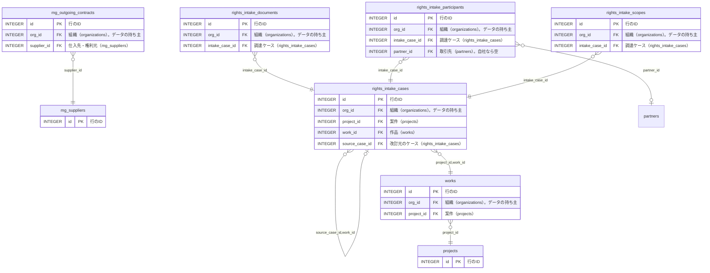

<!-- 生成物。直さない。正本は DB の定義（src/**/*.sql）と docs/database/dictionary.json。作り直しは node scripts/build-db-docs.mjs -->
# 企画（planning）の表

[目次へ戻る](README.md)

## ER 図

主キーと参照の列だけを載せる。組織（organizations・memberships）への参照は省く。

## 表の一覧

| 表 | 論理名 | 説明 |
|---|---|---|
| [mg_outgoing_contracts](#mg_outgoing_contracts) | 支払MGの契約 | 1行は、仕入先・権利元へ MG を払う契約（支払MG）1件。条件は条件版（mg_term_versions）で持ち、変更・削除はできない。 |
| [mg_suppliers](#mg_suppliers) | MGの仕入先 | 1行は、支払MGの相手（仕入先・権利元）1社。MG契約の画面で登録し、取引先（partners）とは別の ID で持つ。 |
| [projects](#projects) | 案件 | 案件1件。作品は案件にぶら下がる。案件の画面や一括登録で作り、作ったあとに書き換える画面・API は無い。予算は財務の権限がある人だけが見られる |
| [rights_intake_cases](#rights_intake_cases) | 権利の調達ケース | 作品の権利をどう調達したか（製作委員会・単独保有・権利受託）の下書き1件。改訂は新しい行を足し、書き換えない。 |
| [rights_intake_documents](#rights_intake_documents) | 調達の契約書参照 | 調達ケースの元になる契約書の参照1件（名前・参照先・版）。ケースと同時に作り、書き換えない。 |
| [rights_intake_participants](#rights_intake_participants) | 調達の参加者 | 調達ケースの参加者1件（自社か取引先、役割・出資額・持分）。ケースと同時に作り、書き換えない。 |
| [rights_intake_scopes](#rights_intake_scopes) | 調達した権利の範囲 | 調達ケースで得た権利の範囲1件（流通・地域・期間・独占か）。ケースと同時に作り、書き換えない。 |
| [works](#works) | 作品 | 作品1本。案件にぶら下がり、売上・経費・契約などが作品を参照する。作品の画面や一括登録で作る。 |

## mg_outgoing_contracts

**支払MGの契約** — 1行は、仕入先・権利元へ MG を払う契約（支払MG）1件。条件は条件版（mg_term_versions）で持ち、変更・削除はできない。

| No | カラム名 | データ型 | 説明 | NULL | デフォルト値 | 制約 |
|---|---|---|---|---|---|---|
| 1 | id | INTEGER | 行のID | 不可 | - | PK |
| 2 | org_id | INTEGER | 組織（organizations）。データの持ち主 | 不可 | - | - |
| 3 | code | TEXT | 契約コード（組織の中で一意） | 不可 | - | - |
| 4 | title | TEXT | 契約名 | 不可 | - | - |
| 5 | supplier_id | INTEGER | 仕入先・権利元（mg_suppliers） | 不可 | - | FK（複合）→ mg_suppliers |
| 6 | contract_date | TEXT | 契約締結日 | 不可 | - | - |
| 7 | source_reference | TEXT | 契約資料の参照 | 不可 | - | - |
| 8 | created_by | INTEGER | 作成した利用者（users） | 不可 | - | FK（複合）→ memberships |
| 9 | created_at | TEXT | 作成日時 | 不可 | 現在時刻 | - |

表の制約:

- 複合の一意: (org_id, id)
- 複合の一意: (org_id, code)
- 複合の参照: (org_id, created_by) → memberships(org_id, user_id)
- 複合の参照: (org_id, supplier_id) → mg_suppliers(org_id, id)
- トリガー mg_outgoing_no_delete: 削除の前
- トリガー mg_outgoing_no_update: 更新の前

## mg_suppliers

**MGの仕入先** — 1行は、支払MGの相手（仕入先・権利元）1社。MG契約の画面で登録し、取引先（partners）とは別の ID で持つ。

| No | カラム名 | データ型 | 説明 | NULL | デフォルト値 | 制約 |
|---|---|---|---|---|---|---|
| 1 | id | INTEGER | 行のID | 不可 | - | PK |
| 2 | org_id | INTEGER | 組織（organizations）。データの持ち主 | 不可 | - | FK → organizations.id |
| 3 | code | TEXT | 仕入先コード（SUP- で始まる。組織の中で一意） | 不可 | - | CHECK: code GLOB 'SUP-*' |
| 4 | name | TEXT | 仕入先・権利元の名前 | 不可 | - | - |
| 5 | note | TEXT | メモ | 不可 | （空文字） | - |
| 6 | created_by | INTEGER | 作成した利用者（users） | 不可 | - | FK（複合）→ memberships |
| 7 | created_at | TEXT | 作成日時 | 不可 | 現在時刻 | - |

表の制約:

- 複合の一意: (org_id, id)
- 複合の一意: (org_id, code)
- 複合の参照: (org_id, created_by) → memberships(org_id, user_id)

## projects

**案件** — 案件1件。作品は案件にぶら下がる。案件の画面や一括登録で作り、作ったあとに書き換える画面・API は無い。予算は財務の権限がある人だけが見られる

| No | カラム名 | データ型 | 説明 | NULL | デフォルト値 | 制約 |
|---|---|---|---|---|---|---|
| 1 | id | INTEGER | 行のID | 不可 | - | PK |
| 2 | org_id | INTEGER | 組織（organizations）。データの持ち主 | 不可 | - | FK → organizations.id |
| 3 | code | TEXT | 案件コード（組織内で一意） | 不可 | - | - |
| 4 | title | TEXT | 案件名 | 不可 | - | - |
| 5 | status | TEXT（列挙） | 状態（企画中・進行中・完了・休止中の4つ） | 不可 | planning | 値: planning / active / complete / paused |
| 6 | budget_yen | INTEGER | 予算（円）。税込か税抜かは未確認 | 可 | - | CHECK: budget_yen IS NULL OR budget_yen>=0 |
| 7 | version | INTEGER | 行の版。いまは案件を書き換える経路が無いので、1のまま | 不可 | 1 | - |
| 8 | created_at | TEXT | 作成日時 | 不可 | 現在時刻 | - |

表の制約:

- 複合の一意: (org_id, id)
- 複合の一意: (org_id, code)

## rights_intake_cases

**権利の調達ケース** — 作品の権利をどう調達したか（製作委員会・単独保有・権利受託）の下書き1件。改訂は新しい行を足し、書き換えない。

| No | カラム名 | データ型 | 説明 | NULL | デフォルト値 | 制約 |
|---|---|---|---|---|---|---|
| 1 | id | INTEGER | 行のID | 不可 | - | PK |
| 2 | org_id | INTEGER | 組織（organizations）。データの持ち主 | 不可 | - | - |
| 3 | project_id | INTEGER | 案件（projects） | 不可 | - | FK（複合）→ works |
| 4 | work_id | INTEGER | 作品（works） | 不可 | - | FK（複合）→ rights_intake_cases、FK（複合）→ works |
| 5 | case_code | TEXT | ケースコード（組織内で一意） | 不可 | - | - |
| 6 | title | TEXT | ケースの名前 | 不可 | - | - |
| 7 | intake_type | TEXT（列挙） | 調達の入口（製作委員会・単独保有・権利受託） | 不可 | - | 値: committee / sole_owned / entrusted |
| 8 | source_case_id | INTEGER | 改訂元のケース（rights_intake_cases） | 可 | - | FK（複合）→ rights_intake_cases |
| 9 | snapshot_version | INTEGER | 改訂の版番号。改訂するたびに1つ進む | 不可 | 1 | CHECK: snapshot_version>0 |
| 10 | status | TEXT | 状態。いまは draft（下書き）だけ | 不可 | draft | CHECK: status='draft' |
| 11 | created_by | INTEGER | 作成した利用者（users） | 不可 | - | FK（複合）→ memberships |
| 12 | created_at | TEXT | 作成日時 | 不可 | 現在時刻 | - |

表の制約:

- 複合の一意: (org_id, id)
- 複合の一意: (org_id, id, work_id)
- 複合の一意: (org_id, case_code)
- 複合の参照: (org_id, created_by) → memberships(org_id, user_id)
- 複合の参照: (org_id, source_case_id, work_id) → rights_intake_cases(org_id, id, work_id)
- 複合の参照: (org_id, project_id, work_id) → works(org_id, project_id, id)
- トリガー rights_intake_case_immutable: 更新の前

## rights_intake_documents

**調達の契約書参照** — 調達ケースの元になる契約書の参照1件（名前・参照先・版）。ケースと同時に作り、書き換えない。

| No | カラム名 | データ型 | 説明 | NULL | デフォルト値 | 制約 |
|---|---|---|---|---|---|---|
| 1 | id | INTEGER | 行のID | 不可 | - | PK |
| 2 | org_id | INTEGER | 組織（organizations）。データの持ち主 | 不可 | - | - |
| 3 | intake_case_id | INTEGER | 調達ケース（rights_intake_cases） | 不可 | - | FK（複合）→ rights_intake_cases |
| 4 | title | TEXT | 契約書の名前 | 可 | - | - |
| 5 | reference | TEXT | 契約書の参照先（1000字まで） | 可 | - | - |
| 6 | version_label | TEXT | 契約書の版の表示 | 可 | - | - |
| 7 | content_hash | TEXT | 契約書の SHA-256（64桁。空も可） | 可 | - | - |
| 8 | created_at | TEXT | 作成日時 | 不可 | 現在時刻 | - |

表の制約:

- 複合の一意: (org_id, id)
- 複合の参照: (org_id, intake_case_id) → rights_intake_cases(org_id, id)
- 索引 rights_intake_documents_case_uidx: (org_id, intake_case_id, id) 一意
- トリガー rights_intake_document_immutable: 更新の前

## rights_intake_participants

**調達の参加者** — 調達ケースの参加者1件（自社か取引先、役割・出資額・持分）。ケースと同時に作り、書き換えない。

| No | カラム名 | データ型 | 説明 | NULL | デフォルト値 | 制約 |
|---|---|---|---|---|---|---|
| 1 | id | INTEGER | 行のID | 不可 | - | PK |
| 2 | org_id | INTEGER | 組織（organizations）。データの持ち主 | 不可 | - | - |
| 3 | intake_case_id | INTEGER | 調達ケース（rights_intake_cases） | 不可 | - | FK（複合）→ rights_intake_cases |
| 4 | party_kind | TEXT（列挙） | 参加者の種類。current_org＝自社、partner＝取引先 | 不可 | - | 値: current_org / partner |
| 5 | partner_id | INTEGER | 取引先（partners）。自社なら空 | 可 | - | FK（複合）→ partners |
| 6 | role | TEXT | 役割（自由記述） | 可 | - | - |
| 7 | investment_yen | INTEGER | 出資額（円） | 可 | - | CHECK: investment_yen IS NULL OR investment_yen>=0 |
| 8 | explicit_share_bps | INTEGER | 契約に書かれた持分（bps。10000＝100%） | 可 | - | CHECK: explicit_share_bps IS NULL OR explicit_share_bps BETWEEN 0 AND 10000 |
| 9 | created_at | TEXT | 作成日時 | 不可 | 現在時刻 | - |

表の制約:

- 複合の一意: (org_id, id)
- 複合の参照: (org_id, partner_id) → partners(org_id, id)
- 複合の参照: (org_id, intake_case_id) → rights_intake_cases(org_id, id)
- CHECK: (party_kind='current_org' AND partner_id IS NULL) OR party_kind='partner'
- トリガー rights_intake_participant_immutable: 更新の前

## rights_intake_scopes

**調達した権利の範囲** — 調達ケースで得た権利の範囲1件（流通・地域・期間・独占か）。ケースと同時に作り、書き換えない。

| No | カラム名 | データ型 | 説明 | NULL | デフォルト値 | 制約 |
|---|---|---|---|---|---|---|
| 1 | id | INTEGER | 行のID | 不可 | - | PK |
| 2 | org_id | INTEGER | 組織（organizations）。データの持ち主 | 不可 | - | - |
| 3 | intake_case_id | INTEGER | 調達ケース（rights_intake_cases） | 不可 | - | FK（複合）→ rights_intake_cases |
| 4 | channel | TEXT | 流通（自由記述） | 可 | - | - |
| 5 | territory | TEXT | 地域（自由記述） | 可 | - | - |
| 6 | rights_start | TEXT | 権利期間の開始日 | 可 | - | - |
| 7 | rights_end | TEXT | 権利期間の終了日 | 可 | - | - |
| 8 | exclusivity | TEXT（列挙） | 独占か（独占・非独占・未確認） | 可 | - | 値: exclusive / nonexclusive / unknown |
| 9 | created_at | TEXT | 作成日時 | 不可 | 現在時刻 | - |

表の制約:

- 複合の一意: (org_id, id)
- 複合の参照: (org_id, intake_case_id) → rights_intake_cases(org_id, id)
- CHECK: rights_end IS NULL OR rights_start IS NULL OR rights_end>=rights_start
- トリガー rights_intake_scope_immutable: 更新の前

## works

**作品** — 作品1本。案件にぶら下がり、売上・経費・契約などが作品を参照する。作品の画面や一括登録で作る。

| No | カラム名 | データ型 | 説明 | NULL | デフォルト値 | 制約 |
|---|---|---|---|---|---|---|
| 1 | id | INTEGER | 行のID | 不可 | - | PK |
| 2 | org_id | INTEGER | 組織（organizations）。データの持ち主 | 不可 | - | - |
| 3 | project_id | INTEGER | 案件（projects） | 不可 | - | FK（複合）→ projects |
| 4 | code | TEXT | 作品コード（組織内で一意） | 不可 | - | - |
| 5 | title | TEXT | 作品名 | 不可 | - | - |
| 6 | format | TEXT | 形式。画面の選択肢は film＝映画、series＝シリーズ（DB では値を制限しない） | 不可 | film | - |
| 7 | forecast_yen | INTEGER | 売上見込（円）。税込か税抜かは未確認 | 可 | - | CHECK: forecast_yen IS NULL OR forecast_yen>=0 |
| 8 | version | INTEGER | 行の版。更新のたびに1つ進み、同時の更新を見つける | 不可 | 1 | - |
| 9 | created_at | TEXT | 作成日時 | 不可 | 現在時刻 | - |

表の制約:

- 複合の一意: (org_id, id)
- 複合の一意: (org_id, project_id, id)
- 複合の一意: (org_id, code)
- 複合の参照: (org_id, project_id) → projects(org_id, id)
