<!-- 生成物。直さない。正本は DB の定義（src/**/*.sql）と docs/database/dictionary.json。作り直しは node scripts/build-db-docs.mjs -->
# 制作（production）の表

[目次へ戻る](README.md)

## ER 図

```mermaid
erDiagram
  day_scene_assignments {
    INTEGER id PK "行のID"
    INTEGER org_id FK "組織（organizations）。データの持ち主"
    INTEGER work_id FK "作品（works）"
    INTEGER shooting_day_id FK "撮影日（shooting_days）"
    INTEGER scene_id FK "シーン（scenes）"
  }
  prep_tasks {
    INTEGER id PK "行のID"
    INTEGER org_id FK "組織（organizations）。データの持ち主"
    INTEGER project_id FK "案件（projects）"
    INTEGER work_id FK "作品（works）"
    INTEGER shooting_day_id FK "関係する撮影日（shooting_days）。空でもよい"
    INTEGER scene_id FK "関係するシーン（scenes）。空でもよい"
  }
  production_appearances {
    INTEGER org_id PK, FK "組織（organizations）。データの持ち主"
    INTEGER work_id PK, FK "作品（works）"
    INTEGER scene_id PK, FK "シーン（scenes）"
    TEXT character_key PK, FK "役（production_characters）"
  }
  production_calls {
    INTEGER org_id PK, FK "組織（organizations）。データの持ち主"
    INTEGER work_id PK, FK "作品（works）"
    INTEGER day_id PK, FK "撮影日（shooting_days）"
    TEXT character_key PK, FK "役（production_characters）"
  }
  production_characters {
    INTEGER org_id PK, FK "組織（organizations）。データの持ち主"
    INTEGER work_id PK, FK "作品（works）"
    TEXT key PK "役の識別子。画面では自動の値、台本の確定では「role:役名」"
  }
  production_day_slots {
    INTEGER org_id PK, FK "組織（organizations）。データの持ち主"
    INTEGER work_id PK, FK "作品（works）"
    INTEGER day_id PK, FK "撮影日（shooting_days）"
    TEXT key PK "項目の識別子（画面で自動に作る）"
  }
  production_location_plans {
    INTEGER org_id PK, FK "組織（organizations）。データの持ち主"
    INTEGER work_id PK, FK "作品（works）"
    TEXT location_key PK, FK "ロケ地（production_locations）"
  }
  production_locations {
    INTEGER org_id PK, FK "組織（organizations）。データの持ち主"
    INTEGER work_id PK, FK "作品（works）"
    TEXT key PK "ロケ地の識別子（画面で自動に作る）"
  }
  production_looks {
    INTEGER org_id PK, FK "組織（organizations）。データの持ち主"
    INTEGER work_id PK, FK "作品（works）"
    TEXT key PK "衣装・メイクの識別子（画面で自動に作る）"
    TEXT character_key FK "役（production_characters）"
  }
  production_revisions {
    INTEGER org_id PK, FK "組織（organizations）。データの持ち主"
    INTEGER work_id PK, FK "作品（works）"
  }
  production_scene_details {
    INTEGER org_id PK, FK "組織（organizations）。データの持ち主"
    INTEGER work_id PK, FK "作品（works）"
    INTEGER scene_id PK, FK "シーン（scenes）"
    TEXT location_key FK "ロケ地（production_locations）"
  }
  production_scene_looks {
    INTEGER org_id PK, FK "組織（organizations）。データの持ち主"
    INTEGER work_id PK, FK "作品（works）"
    INTEGER scene_id PK, FK "シーン（scenes）"
    TEXT look_key PK, FK "衣装・メイク（production_looks）"
  }
  scenes {
    INTEGER id PK "行のID"
    INTEGER org_id FK "組織（organizations）。データの持ち主"
    INTEGER project_id FK "案件（projects）"
    INTEGER work_id FK "作品（works）"
  }
  shooting_days {
    INTEGER id PK "行のID"
    INTEGER org_id FK "組織（organizations）。データの持ち主"
    INTEGER project_id FK "案件（projects）"
    INTEGER work_id FK "作品（works）"
  }
  workflow_raw_artifacts {
    INTEGER id PK "行のID"
    INTEGER org_id FK "組織（organizations）。データの持ち主"
    INTEGER project_id FK "案件（projects）"
    INTEGER work_id FK "作品（works）"
  }
  workflow_schedule_previews {
    TEXT token PK "日程案の識別子（確定のときに送る）"
    INTEGER org_id FK "組織（organizations）。データの持ち主"
    INTEGER artifact_id FK "台本の原本（workflow_raw_artifacts）"
    INTEGER review_id FK "元にした台本の確認（workflow_script_reviews）"
  }
  workflow_script_commit_days {
    INTEGER org_id PK, FK "組織（organizations）。データの持ち主"
    INTEGER commit_id PK, FK "台本の登録確定（workflow_script_commits）"
    INTEGER work_id FK "作品（works）"
    INTEGER shooting_day_id PK, FK "撮影日（shooting_days）"
  }
  workflow_script_commit_scenes {
    INTEGER org_id PK, FK "組織（organizations）。データの持ち主"
    INTEGER commit_id PK, FK "台本の登録確定（workflow_script_commits）"
    INTEGER work_id FK "作品（works）"
    INTEGER scene_id PK, FK "作ったシーン（scenes）"
  }
  workflow_script_commits {
    INTEGER id PK "行のID"
    INTEGER org_id FK "組織（organizations）。データの持ち主"
    INTEGER artifact_id FK "台本の原本（workflow_raw_artifacts）"
    INTEGER review_id FK "確定に使った台本の確認（workflow_script_reviews）"
  }
  workflow_script_reviews {
    INTEGER id PK "行のID"
    INTEGER org_id FK "組織（organizations）。データの持ち主"
    INTEGER artifact_id FK "台本の原本（workflow_raw_artifacts）"
    INTEGER work_id FK "作品（works）"
  }
  day_scene_assignments }o--|| scenes : "work_id,scene_id"
  day_scene_assignments }o--|| shooting_days : "work_id,shooting_day_id"
  prep_tasks }o--o| scenes : "work_id,scene_id"
  prep_tasks }o--o| shooting_days : "work_id,shooting_day_id"
  prep_tasks }o--|| works : "project_id,work_id"
  production_appearances }o--|| production_characters : "work_id,character_key"
  production_appearances }o--|| scenes : "work_id,scene_id"
  production_calls }o--|| production_characters : "work_id,character_key"
  production_calls }o--|| shooting_days : "work_id,day_id"
  production_characters }o--|| works : "work_id"
  production_day_slots }o--|| shooting_days : "work_id,day_id"
  production_location_plans }o--|| production_locations : "work_id,location_key"
  production_locations }o--|| works : "work_id"
  production_looks }o--|| production_characters : "work_id,character_key"
  production_revisions }o--|| works : "work_id"
  production_scene_details }o--o| production_locations : "work_id,location_key"
  production_scene_details }o--|| scenes : "work_id,scene_id"
  production_scene_looks }o--|| production_looks : "work_id,look_key"
  production_scene_looks }o--|| scenes : "work_id,scene_id"
  scenes }o--|| works : "project_id,work_id"
  scenes }o--|| projects : "project_id"
  shooting_days }o--|| works : "project_id,work_id"
  workflow_raw_artifacts }o--|| works : "project_id,work_id"
  workflow_schedule_previews }o--|| workflow_script_reviews : "review_id"
  workflow_schedule_previews }o--|| workflow_raw_artifacts : "artifact_id"
  workflow_script_commit_days }o--|| shooting_days : "work_id,shooting_day_id"
  workflow_script_commit_days }o--|| workflow_script_commits : "commit_id"
  workflow_script_commit_scenes }o--|| scenes : "work_id,scene_id"
  workflow_script_commit_scenes }o--|| workflow_script_commits : "commit_id"
  workflow_script_commits }o--|| workflow_script_reviews : "review_id"
  workflow_script_commits }o--|| workflow_raw_artifacts : "artifact_id"
  workflow_script_reviews }o--|| workflow_raw_artifacts : "work_id,artifact_id"
```

主キーと参照の列だけを載せる。組織（organizations・memberships）への参照は省く。

## 表の一覧

| 表 | 論理名 | 説明 |
|---|---|---|
| [day_scene_assignments](#day_scene_assignments) | 撮影日ごとのシーン | 撮影日1日に割り当てたシーン1つと、その撮影順・予定・実績を表す。撮影日を更新すると、その日の割り当てを消して作り直す。 |
| [prep_tasks](#prep_tasks) | 撮影準備の作業 | 撮影に向けた準備の作業1件を表す。撮影日やシーンに結びつけてもよく、日々スケの画面で登録・更新する。 |
| [production_appearances](#production_appearances) | 出演（シーン×役） | どのシーンにどの役が出るかを1行ずつ持つ。台本の確定で出演者から作り、制作の画面の保存で入れ直す。 |
| [production_calls](#production_calls) | 役の入り時間 | 撮影日ごとに、役の入り時間と支度完了の時刻を1行ずつ持つ。制作の画面で保存するたびに入れ直す。 |
| [production_characters](#production_characters) | 役 | 作品に出てくる役を1行ずつ持つ。制作の画面で保存するたびに作品の分を消して入れ直し、台本の確定では出演者名から自動で足す。 |
| [production_day_slots](#production_day_slots) | 日々スケの項目 | 撮影日の中の、シーン以外の項目（移動・食事など）を1行ずつ持つ。予定と実績の時刻を持ち、制作の画面の保存で入れ直す。 |
| [production_location_plans](#production_location_plans) | ロケ地の見取り図 | ロケ地1か所の手描きの見取り図を1行で持つ。制作の画面で保存するたびに入れ直す。 |
| [production_locations](#production_locations) | ロケ地 | 作品で使うロケ地を1行ずつ持つ。制作の画面で保存するたびに作品の分を消して入れ直す。 |
| [production_looks](#production_looks) | 衣装・メイク | 役ごとの衣装・メイクの組み合わせ（衣装番号）を1行ずつ持つ。制作の画面で保存するたびに入れ直す。 |
| [production_revisions](#production_revisions) | 制作情報の版 | 作品ごとに、制作情報（役・ロケ地・香盤の詳細など）の版の番号を1行で持つ。保存と台本の確定のたびに番号を1つ上げ、同時の保存の衝突を見分けるのに使う。 |
| [production_scene_details](#production_scene_details) | シーンの詳細 | シーン（scenes）1つに、ページ数・予定尺・ロケ地を足す行。制作の画面の保存で入れ直し、台本の確定でも予定尺とページ数を入れる。 |
| [production_scene_looks](#production_scene_looks) | シーンの衣装・メイク | どのシーンでどの衣装・メイクを使うかを1行ずつ持つ。出演する役のシーンにだけ付けられ、制作の画面の保存で入れ直す。 |
| [scenes](#scenes) | シーン | 作品の台本の1シーン。台本の取込を確定したときや制作の画面で作り、版を確かめて書き換える。撮影日への割り当てや準備タスクがついたシーンは、案件・作品を変えられない |
| [shooting_days](#shooting_days) | 撮影日 | 作品の撮影日1日分を班ごとに表す。台本の日程の確定か日々スケの画面で作り、同じ作品・日付・班は1行だけ。 |
| [workflow_raw_artifacts](#workflow_raw_artifacts) | 受領した原本 | 取り込んだ台本または売上報告のファイル1つを、原本のまま1行で持つ。取り込みの画面で書き、変更も削除もできない。 |
| [workflow_schedule_previews](#workflow_schedule_previews) | 日程案（確定前） | 確認済みの台本から作った撮影の日程案を、確定の前に1行で持つ。作った本人が15分のうちに1回だけ確定に使え、使うと consumed を1にする。 |
| [workflow_script_commit_days](#workflow_script_commit_days) | 台本確定の撮影日 | 台本の確定のとき、日程案の日ごとに、同じ日付・同じ班の撮影日を1行ずつ持つ（新しく作った日と、もとからあった日）。確定の記録を書いたときにトリガーが自動で入れる。 |
| [workflow_script_commit_scenes](#workflow_script_commit_scenes) | 台本確定のシーン | 台本の確定で作ったシーンを1行ずつ持つ。確定の記録を書いたときにトリガーが自動で入れる。 |
| [workflow_script_commits](#workflow_script_commits) | 台本の登録確定 | 台本の日程案を確定し、シーン・撮影日・割り当てを作った記録を1行で持つ。原本1つにつき1回だけ書く。 |
| [workflow_script_reviews](#workflow_script_reviews) | 台本の確認（版） | 台本の原本から読み取ったシーンの一覧を、人が確かめて直した版を1行で持つ。確かめるたびに版を積み、変更も削除もできない。 |

## day_scene_assignments

**撮影日ごとのシーン** — 撮影日1日に割り当てたシーン1つと、その撮影順・予定・実績を表す。撮影日を更新すると、その日の割り当てを消して作り直す。

| No | カラム名 | データ型 | 説明 | NULL | デフォルト値 | 制約 |
|---|---|---|---|---|---|---|
| 1 | id | INTEGER | 行のID | 不可 | - | PK |
| 2 | org_id | INTEGER | 組織（organizations）。データの持ち主 | 不可 | - | - |
| 3 | work_id | INTEGER | 作品（works） | 不可 | - | FK（複合）→ scenes、FK（複合）→ shooting_days |
| 4 | shooting_day_id | INTEGER | 撮影日（shooting_days） | 不可 | - | FK（複合）→ shooting_days |
| 5 | scene_id | INTEGER | シーン（scenes） | 不可 | - | FK（複合）→ scenes |
| 6 | sequence_order | INTEGER | その日の撮影順（1から） | 不可 | - | CHECK: sequence_order>0 |
| 7 | planned_start | TEXT | 予定の開始日時（日本時間。撮影日か翌日） | 可 | - | - |
| 8 | planned_end | TEXT | 予定の終了日時 | 可 | - | - |
| 9 | actual_start | TEXT | 実際の開始日時 | 可 | - | - |
| 10 | actual_end | TEXT | 実際の終了日時 | 可 | - | - |
| 11 | outcome | TEXT（列挙） | 撮影結果（予定・一部撮影・撮影済み・未撮影） | 不可 | planned | 値: planned / partial / shot / not_shot |
| 12 | notes | TEXT | 備考 | 可 | - | - |

表の制約:

- 複合の一意: (org_id, id)
- 複合の一意: (org_id, shooting_day_id, scene_id)
- 複合の一意: (org_id, shooting_day_id, sequence_order)
- 複合の参照: (org_id, work_id, scene_id) → scenes(org_id, work_id, id)
- 複合の参照: (org_id, work_id, shooting_day_id) → shooting_days(org_id, work_id, id)
- CHECK: planned_end IS NULL OR planned_start IS NULL OR planned_end>planned_start
- CHECK: actual_end IS NULL OR actual_start IS NULL OR actual_end>actual_start

## prep_tasks

**撮影準備の作業** — 撮影に向けた準備の作業1件を表す。撮影日やシーンに結びつけてもよく、日々スケの画面で登録・更新する。

| No | カラム名 | データ型 | 説明 | NULL | デフォルト値 | 制約 |
|---|---|---|---|---|---|---|
| 1 | id | INTEGER | 行のID | 不可 | - | PK |
| 2 | org_id | INTEGER | 組織（organizations）。データの持ち主 | 不可 | - | - |
| 3 | project_id | INTEGER | 案件（projects） | 不可 | - | FK（複合）→ works |
| 4 | work_id | INTEGER | 作品（works） | 不可 | - | FK（複合）→ scenes、FK（複合）→ shooting_days、FK（複合）→ works |
| 5 | shooting_day_id | INTEGER | 関係する撮影日（shooting_days）。空でもよい | 可 | - | FK（複合）→ shooting_days |
| 6 | scene_id | INTEGER | 関係するシーン（scenes）。空でもよい | 可 | - | FK（複合）→ scenes |
| 7 | title | TEXT | 作業の名前 | 不可 | - | CHECK: length(trim(title)) BETWEEN 1 AND 200 |
| 8 | owner_label | TEXT | 担当者の名前（文字で入れる） | 可 | - | - |
| 9 | due_on | TEXT | 期限 | 可 | - | - |
| 10 | status | TEXT（列挙） | 準備の状態（未準備・準備済み・保留） | 不可 | pending | 値: pending / ready / blocked |
| 11 | note | TEXT | 備考 | 可 | - | - |
| 12 | version | INTEGER | 更新のたびに1増える番号（同時更新の検出用） | 不可 | 1 | - |
| 13 | created_by | INTEGER | 作成した利用者（users） | 不可 | - | FK（複合）→ memberships |
| 14 | created_at | TEXT | 作成日時 | 不可 | 現在時刻 | - |

表の制約:

- 複合の一意: (org_id, id)
- 複合の参照: (org_id, created_by) → memberships(org_id, user_id)
- 複合の参照: (org_id, work_id, scene_id) → scenes(org_id, work_id, id)
- 複合の参照: (org_id, work_id, shooting_day_id) → shooting_days(org_id, work_id, id)
- 複合の参照: (org_id, project_id, work_id) → works(org_id, project_id, id)

## production_appearances

**出演（シーン×役）** — どのシーンにどの役が出るかを1行ずつ持つ。台本の確定で出演者から作り、制作の画面の保存で入れ直す。

| No | カラム名 | データ型 | 説明 | NULL | デフォルト値 | 制約 |
|---|---|---|---|---|---|---|
| 1 | org_id | INTEGER | 組織（organizations）。データの持ち主 | 不可 | - | PK（複合） |
| 2 | work_id | INTEGER | 作品（works） | 不可 | - | PK（複合）、FK（複合）→ production_characters、FK（複合）→ scenes |
| 3 | scene_id | INTEGER | シーン（scenes） | 不可 | - | PK（複合）、FK（複合）→ scenes |
| 4 | character_key | TEXT | 役（production_characters） | 不可 | - | PK（複合）、FK（複合）→ production_characters |

表の制約:

- 複合の主キー: (org_id, work_id, scene_id, character_key)
- 複合の参照: (org_id, work_id, character_key) → production_characters(org_id, work_id, key)
- 複合の参照: (org_id, work_id, scene_id) → scenes(org_id, work_id, id)

## production_calls

**役の入り時間** — 撮影日ごとに、役の入り時間と支度完了の時刻を1行ずつ持つ。制作の画面で保存するたびに入れ直す。

| No | カラム名 | データ型 | 説明 | NULL | デフォルト値 | 制約 |
|---|---|---|---|---|---|---|
| 1 | org_id | INTEGER | 組織（organizations）。データの持ち主 | 不可 | - | PK（複合） |
| 2 | work_id | INTEGER | 作品（works） | 不可 | - | PK（複合）、FK（複合）→ production_characters、FK（複合）→ shooting_days |
| 3 | day_id | INTEGER | 撮影日（shooting_days） | 不可 | - | PK（複合）、FK（複合）→ shooting_days |
| 4 | character_key | TEXT | 役（production_characters） | 不可 | - | PK（複合）、FK（複合）→ production_characters |
| 5 | call_time | TEXT | 入り時間（撮影日か翌日の日時） | 可 | - | - |
| 6 | ready_time | TEXT | 支度完了の時刻（撮影日か翌日の日時） | 可 | - | - |
| 7 | note | TEXT | 備考 | 可 | - | - |

表の制約:

- 複合の主キー: (org_id, work_id, day_id, character_key)
- 複合の参照: (org_id, work_id, character_key) → production_characters(org_id, work_id, key)
- 複合の参照: (org_id, work_id, day_id) → shooting_days(org_id, work_id, id)

## production_characters

**役** — 作品に出てくる役を1行ずつ持つ。制作の画面で保存するたびに作品の分を消して入れ直し、台本の確定では出演者名から自動で足す。

| No | カラム名 | データ型 | 説明 | NULL | デフォルト値 | 制約 |
|---|---|---|---|---|---|---|
| 1 | org_id | INTEGER | 組織（organizations）。データの持ち主 | 不可 | - | PK（複合） |
| 2 | work_id | INTEGER | 作品（works） | 不可 | - | PK（複合）、FK（複合）→ works |
| 3 | key | TEXT | 役の識別子。画面では自動の値、台本の確定では「role:役名」 | 不可 | - | PK（複合） |
| 4 | name | TEXT | 役名。作品の中で重ならない | 不可 | - | - |
| 5 | short_name | TEXT | 略称（香盤の列の見出しに使う） | 可 | - | - |
| 6 | actor_name | TEXT | 演じる俳優の名前 | 可 | - | - |
| 7 | note | TEXT | 備考 | 可 | - | - |

表の制約:

- 複合の主キー: (org_id, work_id, key)
- 複合の一意: (org_id, work_id, name)
- 複合の参照: (org_id, work_id) → works(org_id, id)

## production_day_slots

**日々スケの項目** — 撮影日の中の、シーン以外の項目（移動・食事など）を1行ずつ持つ。予定と実績の時刻を持ち、制作の画面の保存で入れ直す。

| No | カラム名 | データ型 | 説明 | NULL | デフォルト値 | 制約 |
|---|---|---|---|---|---|---|
| 1 | org_id | INTEGER | 組織（organizations）。データの持ち主 | 不可 | - | PK（複合） |
| 2 | work_id | INTEGER | 作品（works） | 不可 | - | PK（複合）、FK（複合）→ shooting_days |
| 3 | day_id | INTEGER | 撮影日（shooting_days） | 不可 | - | PK（複合）、FK（複合）→ shooting_days |
| 4 | key | TEXT | 項目の識別子（画面で自動に作る） | 不可 | - | PK（複合） |
| 5 | after_scene_order | INTEGER | 置く位置。0＝最初、n＝その日のn番目のシーンの後 | 不可 | - | CHECK: after_scene_order>=0 |
| 6 | kind | TEXT（列挙） | move＝移動、meal＝食事、wrap＝撤収、prep＝準備、other＝その他 | 不可 | - | 値: move / meal / wrap / prep / other |
| 7 | label | TEXT | 項目名 | 不可 | - | - |
| 8 | planned_start | TEXT | 予定の開始日時（撮影日か翌日。YYYY-MM-DDTHH:MM） | 可 | - | - |
| 9 | planned_end | TEXT | 予定の終了日時（開始より後） | 可 | - | - |
| 10 | actual_start | TEXT | 実績の開始日時 | 可 | - | - |
| 11 | actual_end | TEXT | 実績の終了日時（開始より後） | 可 | - | - |
| 12 | note | TEXT | 備考 | 可 | - | - |

表の制約:

- 複合の主キー: (org_id, work_id, day_id, key)
- 複合の参照: (org_id, work_id, day_id) → shooting_days(org_id, work_id, id)
- CHECK: planned_end IS NULL OR planned_start IS NULL OR planned_end>planned_start
- CHECK: actual_end IS NULL OR actual_start IS NULL OR actual_end>actual_start

## production_location_plans

**ロケ地の見取り図** — ロケ地1か所の手描きの見取り図を1行で持つ。制作の画面で保存するたびに入れ直す。

| No | カラム名 | データ型 | 説明 | NULL | デフォルト値 | 制約 |
|---|---|---|---|---|---|---|
| 1 | org_id | INTEGER | 組織（organizations）。データの持ち主 | 不可 | - | PK（複合） |
| 2 | work_id | INTEGER | 作品（works） | 不可 | - | PK（複合）、FK（複合）→ production_locations |
| 3 | location_key | TEXT | ロケ地（production_locations） | 不可 | - | PK（複合）、FK（複合）→ production_locations |
| 4 | strokes_json | TEXT | 描いた線（ペン・太さ・0〜1の座標）の一覧のJSON | 不可 | - | CHECK: json_valid(strokes_json) AND json_type(strokes_json)='array' AND length(strokes_json)<=262144 |

表の制約:

- 複合の主キー: (org_id, work_id, location_key)
- 複合の参照: (org_id, work_id, location_key) → production_locations(org_id, work_id, key)

## production_locations

**ロケ地** — 作品で使うロケ地を1行ずつ持つ。制作の画面で保存するたびに作品の分を消して入れ直す。

| No | カラム名 | データ型 | 説明 | NULL | デフォルト値 | 制約 |
|---|---|---|---|---|---|---|
| 1 | org_id | INTEGER | 組織（organizations）。データの持ち主 | 不可 | - | PK（複合） |
| 2 | work_id | INTEGER | 作品（works） | 不可 | - | PK（複合）、FK（複合）→ works |
| 3 | key | TEXT | ロケ地の識別子（画面で自動に作る） | 不可 | - | PK（複合） |
| 4 | name | TEXT | ロケ地名。作品の中で重ならない | 不可 | - | - |
| 5 | address | TEXT | 住所 | 可 | - | - |
| 6 | floor | TEXT | 階 | 可 | - | - |
| 7 | green_room | TEXT | 控室 | 可 | - | - |
| 8 | parking | TEXT | 駐車場 | 可 | - | - |
| 9 | facilities | TEXT | 設備 | 可 | - | - |
| 10 | contact | TEXT | 連絡先 | 可 | - | - |
| 11 | note | TEXT | 備考 | 可 | - | - |

表の制約:

- 複合の主キー: (org_id, work_id, key)
- 複合の一意: (org_id, work_id, name)
- 複合の参照: (org_id, work_id) → works(org_id, id)

## production_looks

**衣装・メイク** — 役ごとの衣装・メイクの組み合わせ（衣装番号）を1行ずつ持つ。制作の画面で保存するたびに入れ直す。

| No | カラム名 | データ型 | 説明 | NULL | デフォルト値 | 制約 |
|---|---|---|---|---|---|---|
| 1 | org_id | INTEGER | 組織（organizations）。データの持ち主 | 不可 | - | PK（複合） |
| 2 | work_id | INTEGER | 作品（works） | 不可 | - | PK（複合）、FK（複合）→ production_characters |
| 3 | key | TEXT | 衣装・メイクの識別子（画面で自動に作る） | 不可 | - | PK（複合） |
| 4 | character_key | TEXT | 役（production_characters） | 不可 | - | FK（複合）→ production_characters |
| 5 | label | TEXT | 衣装番号。同じ役の中で重ならない | 不可 | - | - |
| 6 | makeup | TEXT | メイク | 可 | - | - |
| 7 | props | TEXT | 持ち道具 | 可 | - | - |
| 8 | shoes | TEXT | 靴 | 可 | - | - |
| 9 | accessories | TEXT | 装飾品 | 可 | - | - |
| 10 | note | TEXT | 備考 | 可 | - | - |

表の制約:

- 複合の主キー: (org_id, work_id, key)
- 複合の一意: (org_id, work_id, character_key, label)
- 複合の参照: (org_id, work_id, character_key) → production_characters(org_id, work_id, key)

## production_revisions

**制作情報の版** — 作品ごとに、制作情報（役・ロケ地・香盤の詳細など）の版の番号を1行で持つ。保存と台本の確定のたびに番号を1つ上げ、同時の保存の衝突を見分けるのに使う。

| No | カラム名 | データ型 | 説明 | NULL | デフォルト値 | 制約 |
|---|---|---|---|---|---|---|
| 1 | org_id | INTEGER | 組織（organizations）。データの持ち主 | 不可 | - | PK（複合） |
| 2 | work_id | INTEGER | 作品（works） | 不可 | - | PK（複合）、FK（複合）→ works |
| 3 | version | INTEGER | 制作情報の版の番号。保存のたびに1増える | 不可 | 1 | CHECK: version>0 |

表の制約:

- 複合の主キー: (org_id, work_id)
- 複合の参照: (org_id, work_id) → works(org_id, id)

## production_scene_details

**シーンの詳細** — シーン（scenes）1つに、ページ数・予定尺・ロケ地を足す行。制作の画面の保存で入れ直し、台本の確定でも予定尺とページ数を入れる。

| No | カラム名 | データ型 | 説明 | NULL | デフォルト値 | 制約 |
|---|---|---|---|---|---|---|
| 1 | org_id | INTEGER | 組織（organizations）。データの持ち主 | 不可 | - | PK（複合） |
| 2 | work_id | INTEGER | 作品（works） | 不可 | - | PK（複合）、FK（複合）→ production_locations、FK（複合）→ scenes |
| 3 | scene_id | INTEGER | シーン（scenes） | 不可 | - | PK（複合）、FK（複合）→ scenes |
| 4 | page_eighths | INTEGER | 台本のページ数（1/8ページ単位。8で1ページ） | 可 | - | CHECK: page_eighths IS NULL OR page_eighths>=0 |
| 5 | estimated_minutes | INTEGER | 予定尺（分） | 可 | - | CHECK: estimated_minutes IS NULL OR estimated_minutes>0 |
| 6 | location_key | TEXT | ロケ地（production_locations） | 可 | - | FK（複合）→ production_locations |
| 7 | note | TEXT | 備考 | 可 | - | - |

表の制約:

- 複合の主キー: (org_id, work_id, scene_id)
- 複合の参照: (org_id, work_id, location_key) → production_locations(org_id, work_id, key)
- 複合の参照: (org_id, work_id, scene_id) → scenes(org_id, work_id, id)

## production_scene_looks

**シーンの衣装・メイク** — どのシーンでどの衣装・メイクを使うかを1行ずつ持つ。出演する役のシーンにだけ付けられ、制作の画面の保存で入れ直す。

| No | カラム名 | データ型 | 説明 | NULL | デフォルト値 | 制約 |
|---|---|---|---|---|---|---|
| 1 | org_id | INTEGER | 組織（organizations）。データの持ち主 | 不可 | - | PK（複合） |
| 2 | work_id | INTEGER | 作品（works） | 不可 | - | PK（複合）、FK（複合）→ production_looks、FK（複合）→ scenes |
| 3 | scene_id | INTEGER | シーン（scenes） | 不可 | - | PK（複合）、FK（複合）→ scenes |
| 4 | look_key | TEXT | 衣装・メイク（production_looks） | 不可 | - | PK（複合）、FK（複合）→ production_looks |

表の制約:

- 複合の主キー: (org_id, work_id, scene_id, look_key)
- 複合の参照: (org_id, work_id, look_key) → production_looks(org_id, work_id, key)
- 複合の参照: (org_id, work_id, scene_id) → scenes(org_id, work_id, id)

## scenes

**シーン** — 作品の台本の1シーン。台本の取込を確定したときや制作の画面で作り、版を確かめて書き換える。撮影日への割り当てや準備タスクがついたシーンは、案件・作品を変えられない

| No | カラム名 | データ型 | 説明 | NULL | デフォルト値 | 制約 |
|---|---|---|---|---|---|---|
| 1 | id | INTEGER | 行のID | 不可 | - | PK |
| 2 | org_id | INTEGER | 組織（organizations）。データの持ち主 | 不可 | - | - |
| 3 | project_id | INTEGER | 案件（projects） | 不可 | - | FK（複合）→ works、FK（複合）→ projects |
| 4 | work_id | INTEGER | 作品（works） | 不可 | - | FK（複合）→ works |
| 5 | scene_no | TEXT | シーン番号（作品の中で一意） | 不可 | - | - |
| 6 | day_night | TEXT（列挙） | 昼夜。D＝昼、N＝夜、DN＝薄暮 | 可 | - | 値: D / N / DN |
| 7 | location | TEXT | 場所 | 可 | - | - |
| 8 | synopsis | TEXT | シーンの内容 | 不可 | （空文字） | - |
| 9 | status | TEXT（列挙） | 状態。draft＝下書き、ready＝撮影準備済み、shot＝撮影済み | 不可 | draft | 値: draft / ready / shot |
| 10 | version | INTEGER | 行の版。更新のたびに1つ進み、同時の更新を見つける | 不可 | 1 | - |

表の制約:

- 複合の一意: (org_id, id)
- 複合の一意: (org_id, project_id, work_id, scene_no)
- 複合の参照: (org_id, project_id, work_id) → works(org_id, project_id, id)
- 複合の参照: (org_id, project_id) → projects(org_id, id)
- 索引 scenes_org_work_id_uidx: (org_id, work_id, id) 一意
- トリガー scene_scope_locked_by_field: 更新（org_id,project_id,work_id）の前

## shooting_days

**撮影日** — 作品の撮影日1日分を班ごとに表す。台本の日程の確定か日々スケの画面で作り、同じ作品・日付・班は1行だけ。

| No | カラム名 | データ型 | 説明 | NULL | デフォルト値 | 制約 |
|---|---|---|---|---|---|---|
| 1 | id | INTEGER | 行のID | 不可 | - | PK |
| 2 | org_id | INTEGER | 組織（organizations）。データの持ち主 | 不可 | - | - |
| 3 | project_id | INTEGER | 案件（projects） | 不可 | - | FK（複合）→ works |
| 4 | work_id | INTEGER | 作品（works） | 不可 | - | FK（複合）→ works |
| 5 | shoot_date | TEXT | 撮影日 | 不可 | - | - |
| 6 | unit | TEXT | 班の名前（同じ日に複数の班がありうる） | 不可 | - | CHECK: length(trim(unit)) BETWEEN 1 AND 80 |
| 7 | label | TEXT | 撮影日の表示名 | 不可 | - | CHECK: length(trim(label)) BETWEEN 1 AND 160 |
| 8 | notes | TEXT | 備考 | 可 | - | - |
| 9 | version | INTEGER | 更新のたびに1増える番号（同時更新の検出用） | 不可 | 1 | - |
| 10 | created_by | INTEGER | 作成した利用者（users） | 不可 | - | FK（複合）→ memberships |
| 11 | created_at | TEXT | 作成日時 | 不可 | 現在時刻 | - |

表の制約:

- 複合の一意: (org_id, id)
- 複合の一意: (org_id, work_id, id)
- 複合の一意: (org_id, work_id, shoot_date, unit)
- 複合の参照: (org_id, created_by) → memberships(org_id, user_id)
- 複合の参照: (org_id, project_id, work_id) → works(org_id, project_id, id)
- トリガー shooting_day_scope_immutable: 更新（org_id,project_id,work_id）の前

## workflow_raw_artifacts

**受領した原本** — 取り込んだ台本または売上報告のファイル1つを、原本のまま1行で持つ。取り込みの画面で書き、変更も削除もできない。

| No | カラム名 | データ型 | 説明 | NULL | デフォルト値 | 制約 |
|---|---|---|---|---|---|---|
| 1 | id | INTEGER | 行のID | 不可 | - | PK |
| 2 | org_id | INTEGER | 組織（organizations）。データの持ち主 | 不可 | - | - |
| 3 | project_id | INTEGER | 案件（projects） | 不可 | - | FK（複合）→ works |
| 4 | work_id | INTEGER | 作品（works） | 不可 | - | FK（複合）→ works |
| 5 | kind | TEXT（列挙） | script＝台本、sales_report＝売上報告 | 不可 | - | 値: script / sales_report |
| 6 | file_name | TEXT | ファイル名 | 不可 | - | - |
| 7 | media_type | TEXT | ファイルの種類（画面から送られた値。空欄あり） | 可 | - | - |
| 8 | byte_length | INTEGER | ファイルの大きさ（バイト） | 不可 | - | CHECK: byte_length>0 |
| 9 | raw_sha256 | TEXT | 原本の照合値（SHA-256）。同じ原本の二重取込を止める | 不可 | - | - |
| 10 | original_base64 | TEXT | 原本のファイルそのもの（base64） | 不可 | - | - |
| 11 | extractor_name | TEXT | 読み取りに使った部品の名前 | 不可 | - | - |
| 12 | extractor_version | TEXT | 読み取りに使った部品の版 | 不可 | - | - |
| 13 | extraction_json | TEXT | 読み取った中身（文やシートの表）のJSON | 不可 | - | - |
| 14 | extraction_status | TEXT（列挙） | extracted＝読み取り済み、ocr_pending＝画像PDFの文字認識待ち | 不可 | - | 値: extracted / ocr_pending |
| 15 | created_by | INTEGER | 作成した利用者（users） | 不可 | - | FK（複合）→ memberships |
| 16 | created_at | TEXT | 作成日時 | 不可 | 現在時刻 | - |

表の制約:

- 複合の一意: (org_id, id)
- 複合の一意: (org_id, work_id, id)
- 複合の一意: (org_id, kind, raw_sha256)
- 複合の参照: (org_id, created_by) → memberships(org_id, user_id)
- 複合の参照: (org_id, project_id, work_id) → works(org_id, project_id, id)
- トリガー workflow_raw_artifacts_immutable: 更新の前
- トリガー workflow_raw_artifacts_no_delete: 削除の前

## workflow_schedule_previews

**日程案（確定前）** — 確認済みの台本から作った撮影の日程案を、確定の前に1行で持つ。作った本人が15分のうちに1回だけ確定に使え、使うと consumed を1にする。

| No | カラム名 | データ型 | 説明 | NULL | デフォルト値 | 制約 |
|---|---|---|---|---|---|---|
| 1 | token | TEXT | 日程案の識別子（確定のときに送る） | 可 | - | PK |
| 2 | org_id | INTEGER | 組織（organizations）。データの持ち主 | 不可 | - | - |
| 3 | artifact_id | INTEGER | 台本の原本（workflow_raw_artifacts） | 不可 | - | FK（複合）→ workflow_raw_artifacts |
| 4 | review_id | INTEGER | 元にした台本の確認（workflow_script_reviews） | 不可 | - | FK（複合）→ workflow_script_reviews |
| 5 | work_id | INTEGER | 作品（works） | 不可 | - | - |
| 6 | user_id | INTEGER | 日程案を作った利用者（users）。本人だけが確定できる | 不可 | - | - |
| 7 | input_json | TEXT | 撮影日・時間予算・出演者と場所の候補日・班のJSON | 不可 | - | - |
| 8 | input_hash | TEXT | 入力の照合値 | 不可 | - | - |
| 9 | proposal_json | TEXT | 日程案（日ごとのシーン・入らないシーン）のJSON | 不可 | - | - |
| 10 | proposal_hash | TEXT | 日程案の照合値 | 不可 | - | - |
| 11 | consumed | INTEGER（真偽 0/1） | 0＝未使用、1＝確定に使った | 不可 | 0 | - |
| 12 | expires_at | TEXT | 使える期限の日時 | 不可 | - | - |
| 13 | created_at | TEXT | 作成日時 | 不可 | 現在時刻 | - |

表の制約:

- 複合の参照: (org_id, review_id) → workflow_script_reviews(org_id, id)
- 複合の参照: (org_id, artifact_id) → workflow_raw_artifacts(org_id, id)

## workflow_script_commit_days

**台本確定の撮影日** — 台本の確定のとき、日程案の日ごとに、同じ日付・同じ班の撮影日を1行ずつ持つ（新しく作った日と、もとからあった日）。確定の記録を書いたときにトリガーが自動で入れる。

| No | カラム名 | データ型 | 説明 | NULL | デフォルト値 | 制約 |
|---|---|---|---|---|---|---|
| 1 | org_id | INTEGER | 組織（organizations）。データの持ち主 | 不可 | - | PK（複合） |
| 2 | commit_id | INTEGER | 台本の登録確定（workflow_script_commits） | 不可 | - | PK（複合）、FK（複合）→ workflow_script_commits |
| 3 | work_id | INTEGER | 作品（works） | 不可 | - | FK（複合）→ shooting_days |
| 4 | shooting_day_id | INTEGER | 撮影日（shooting_days） | 不可 | - | PK（複合）、FK（複合）→ shooting_days |
| 5 | proposal_index | INTEGER | 日程案の中の日の順番（0から） | 不可 | - | - |

表の制約:

- 複合の主キー: (org_id, commit_id, shooting_day_id)
- 複合の一意: (org_id, commit_id, proposal_index)
- 複合の参照: (org_id, work_id, shooting_day_id) → shooting_days(org_id, work_id, id)
- 複合の参照: (org_id, commit_id) → workflow_script_commits(org_id, id)

## workflow_script_commit_scenes

**台本確定のシーン** — 台本の確定で作ったシーンを1行ずつ持つ。確定の記録を書いたときにトリガーが自動で入れる。

| No | カラム名 | データ型 | 説明 | NULL | デフォルト値 | 制約 |
|---|---|---|---|---|---|---|
| 1 | org_id | INTEGER | 組織（organizations）。データの持ち主 | 不可 | - | PK（複合） |
| 2 | commit_id | INTEGER | 台本の登録確定（workflow_script_commits） | 不可 | - | PK（複合）、FK（複合）→ workflow_script_commits |
| 3 | work_id | INTEGER | 作品（works） | 不可 | - | FK（複合）→ scenes |
| 4 | scene_id | INTEGER | 作ったシーン（scenes） | 不可 | - | PK（複合）、FK（複合）→ scenes |
| 5 | source_index | INTEGER | 確認済みのシーン一覧での順番（0から） | 不可 | - | - |

表の制約:

- 複合の主キー: (org_id, commit_id, scene_id)
- 複合の一意: (org_id, commit_id, source_index)
- 複合の参照: (org_id, work_id, scene_id) → scenes(org_id, work_id, id)
- 複合の参照: (org_id, commit_id) → workflow_script_commits(org_id, id)

## workflow_script_commits

**台本の登録確定** — 台本の日程案を確定し、シーン・撮影日・割り当てを作った記録を1行で持つ。原本1つにつき1回だけ書く。

| No | カラム名 | データ型 | 説明 | NULL | デフォルト値 | 制約 |
|---|---|---|---|---|---|---|
| 1 | id | INTEGER | 行のID | 不可 | - | PK |
| 2 | org_id | INTEGER | 組織（organizations）。データの持ち主 | 不可 | - | - |
| 3 | artifact_id | INTEGER | 台本の原本（workflow_raw_artifacts） | 不可 | - | FK（複合）→ workflow_raw_artifacts |
| 4 | review_id | INTEGER | 確定に使った台本の確認（workflow_script_reviews） | 不可 | - | FK（複合）→ workflow_script_reviews |
| 5 | work_id | INTEGER | 作品（works） | 不可 | - | - |
| 6 | preview_token | TEXT | 使った日程案（workflow_schedule_previews） | 不可 | - | Unique |
| 7 | proposal_hash | TEXT | 確定した日程案の照合値 | 不可 | - | - |
| 8 | committed_by | INTEGER | 確定した利用者（users） | 不可 | - | - |
| 9 | committed_at | TEXT | 確定した日時 | 不可 | 現在時刻 | - |

表の制約:

- 複合の一意: (org_id, id)
- 複合の一意: (org_id, artifact_id)
- 複合の参照: (org_id, review_id) → workflow_script_reviews(org_id, id)
- 複合の参照: (org_id, artifact_id) → workflow_raw_artifacts(org_id, id)
- トリガー workflow_script_commit_link_days: 追加の後
- トリガー workflow_script_commit_link_scenes: 追加の後

## workflow_script_reviews

**台本の確認（版）** — 台本の原本から読み取ったシーンの一覧を、人が確かめて直した版を1行で持つ。確かめるたびに版を積み、変更も削除もできない。

| No | カラム名 | データ型 | 説明 | NULL | デフォルト値 | 制約 |
|---|---|---|---|---|---|---|
| 1 | id | INTEGER | 行のID | 不可 | - | PK |
| 2 | org_id | INTEGER | 組織（organizations）。データの持ち主 | 不可 | - | - |
| 3 | artifact_id | INTEGER | 台本の原本（workflow_raw_artifacts） | 不可 | - | FK（複合）→ workflow_raw_artifacts |
| 4 | work_id | INTEGER | 作品（works） | 不可 | - | FK（複合）→ workflow_raw_artifacts |
| 5 | version_no | INTEGER | 原本ごとの確認の版の番号 | 不可 | - | - |
| 6 | scenes_json | TEXT | 確かめたシーンの一覧（番号・昼夜・場所・出演・予定尺など）のJSON | 不可 | - | - |
| 7 | review_hash | TEXT | 確かめた中身の照合値 | 不可 | - | - |
| 8 | reviewed_by | INTEGER | 確かめた利用者（users） | 不可 | - | FK（複合）→ memberships |
| 9 | reviewed_at | TEXT | 確かめた日時 | 不可 | 現在時刻 | - |

表の制約:

- 複合の一意: (org_id, id)
- 複合の一意: (org_id, work_id, id)
- 複合の一意: (org_id, artifact_id, version_no)
- 複合の一意: (org_id, artifact_id, review_hash)
- 複合の参照: (org_id, reviewed_by) → memberships(org_id, user_id)
- 複合の参照: (org_id, work_id, artifact_id) → workflow_raw_artifacts(org_id, work_id, id)
- トリガー workflow_script_reviews_immutable: 更新の前
- トリガー workflow_script_reviews_no_delete: 削除の前
