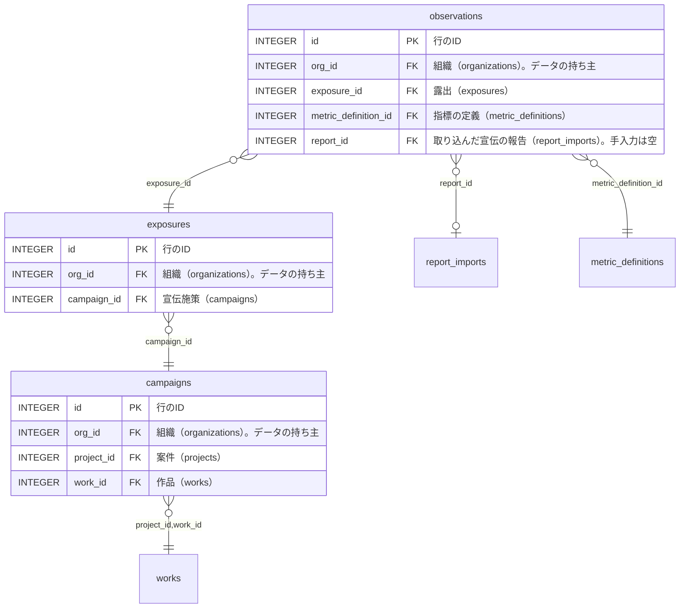

<!-- 生成物。直さない。正本は DB の定義（src/**/*.sql）と docs/database/dictionary.json。作り直しは node scripts/build-db-docs.mjs -->
# 宣伝（publicity）の表

[目次へ戻る](README.md)

## ER 図

主キーと参照の列だけを載せる。組織（organizations・memberships）への参照は省く。

## 表の一覧

| 表 | 論理名 | 説明 |
|---|---|---|
| [campaigns](#campaigns) | 宣伝施策 | 作品ごとの宣伝の施策1件（目的・期間・対象）を表す。宣伝の画面で登録し、version をそろえて変更できる。 |
| [exposures](#exposures) | 露出 | 宣伝施策の中の露出1件（どの媒体に、いつ出したか）を表す。宣伝の画面で登録し、version をそろえて変更できる。 |
| [observations](#observations) | 指標の観測値 | 露出1件について、ある期間に測った指標の値1つを表す。宣伝の画面で入れるか宣伝の報告をCSVで取り込んで作り、売上との因果は決めない。 |

## campaigns

**宣伝施策** — 作品ごとの宣伝の施策1件（目的・期間・対象）を表す。宣伝の画面で登録し、version をそろえて変更できる。

| No | カラム名 | データ型 | 説明 | NULL | デフォルト値 | 制約 |
|---|---|---|---|---|---|---|
| 1 | id | INTEGER | 行のID | 不可 | - | PK |
| 2 | org_id | INTEGER | 組織（organizations）。データの持ち主 | 不可 | - | - |
| 3 | project_id | INTEGER | 案件（projects） | 不可 | - | FK（複合）→ works |
| 4 | work_id | INTEGER | 作品（works） | 不可 | - | FK（複合）→ works |
| 5 | name | TEXT | 施策の名前 | 不可 | - | - |
| 6 | objective | TEXT | 施策の目的 | 不可 | - | - |
| 7 | audience_hypothesis | TEXT | 対象とする人の仮説 | 可 | - | - |
| 8 | starts_on | TEXT | 開始日 | 不可 | - | - |
| 9 | ends_on | TEXT | 終了日 | 不可 | - | - |
| 10 | target_region | TEXT | 対象地域 | 可 | - | - |
| 11 | target_channel | TEXT | 対象の流通 | 可 | - | - |
| 12 | version | INTEGER | 更新のたびに1増える番号（同時更新の検出用） | 不可 | 1 | - |

表の制約:

- 複合の一意: (org_id, id)
- 複合の参照: (org_id, project_id, work_id) → works(org_id, project_id, id)
- CHECK: ends_on>=starts_on

## exposures

**露出** — 宣伝施策の中の露出1件（どの媒体に、いつ出したか）を表す。宣伝の画面で登録し、version をそろえて変更できる。

| No | カラム名 | データ型 | 説明 | NULL | デフォルト値 | 制約 |
|---|---|---|---|---|---|---|
| 1 | id | INTEGER | 行のID | 不可 | - | PK |
| 2 | org_id | INTEGER | 組織（organizations）。データの持ち主 | 不可 | - | - |
| 3 | campaign_id | INTEGER | 宣伝施策（campaigns） | 不可 | - | FK（複合）→ campaigns |
| 4 | medium | TEXT | 媒体 | 不可 | - | - |
| 5 | asset_version | TEXT | 使った素材の版 | 可 | - | - |
| 6 | scheduled_at | TEXT | 予定日時 | 可 | - | - |
| 7 | happened_at | TEXT | 実施日時 | 可 | - | - |
| 8 | source_url | TEXT | 出典のURL | 可 | - | - |
| 9 | region | TEXT | 地域 | 可 | - | - |
| 10 | version | INTEGER | 更新のたびに1増える番号（同時更新の検出用） | 不可 | 1 | - |

表の制約:

- 複合の一意: (org_id, id)
- 複合の参照: (org_id, campaign_id) → campaigns(org_id, id)

## observations

**指標の観測値** — 露出1件について、ある期間に測った指標の値1つを表す。宣伝の画面で入れるか宣伝の報告をCSVで取り込んで作り、売上との因果は決めない。

| No | カラム名 | データ型 | 説明 | NULL | デフォルト値 | 制約 |
|---|---|---|---|---|---|---|
| 1 | id | INTEGER | 行のID | 不可 | - | PK |
| 2 | org_id | INTEGER | 組織（organizations）。データの持ち主 | 不可 | - | - |
| 3 | exposure_id | INTEGER | 露出（exposures） | 不可 | - | FK（複合）→ exposures |
| 4 | metric_definition_id | INTEGER | 指標の定義（metric_definitions） | 不可 | - | FK（複合）→ metric_definitions |
| 5 | report_id | INTEGER | 取り込んだ宣伝の報告（report_imports）。手入力は空 | 可 | - | FK（複合）→ report_imports |
| 6 | source_row | INTEGER | 取り込んだ報告の行番号 | 可 | - | - |
| 7 | period_from | TEXT | 観測期間の開始日 | 不可 | - | - |
| 8 | period_to | TEXT | 観測期間の終了日 | 不可 | - | - |
| 9 | granularity | TEXT（列挙） | 観測の粒度（日・週・月・露出単位・未確認） | 不可 | - | 値: day / week / month / event / unknown |
| 10 | value_number | REAL | 数値の値（はい/いいえは1/0） | 可 | - | - |
| 11 | value_text | TEXT | 文字の値（文字の指標だけ） | 可 | - | - |
| 12 | verification | TEXT（列挙） | 値を確認したか（verified/unverified） | 不可 | unverified | 値: verified / unverified |
| 13 | acquired_at | TEXT | 値を取得した日時 | 不可 | - | - |
| 14 | paid_organic | TEXT（列挙） | 広告か自然か（paid・organic・mixed・unknown） | 可 | - | 値: paid / organic / mixed / unknown |
| 15 | source | TEXT | 値の出典 | 可 | - | - |
| 16 | region | TEXT | 地域 | 可 | - | - |

表の制約:

- 複合の一意: (org_id, id)
- 複合の参照: (org_id, report_id) → report_imports(org_id, id)
- 複合の参照: (org_id, metric_definition_id) → metric_definitions(org_id, id)
- 複合の参照: (org_id, exposure_id) → exposures(org_id, id)
- CHECK: period_to>=period_from
- CHECK: NOT(value_number IS NOT NULL AND value_text IS NOT NULL)
- 索引 observation_report_row_uidx: (org_id, report_id, source_row) 一意 WHERE report_id IS NOT NULL
- トリガー observation_value_type_insert: 追加の前
