<!-- 生成物。直さない。正本は DB の定義（src/**/*.sql）と docs/database/dictionary.json。作り直しは node scripts/build-db-docs.mjs -->
# 売上（revenue）の表

[目次へ戻る](README.md)

## ER 図

```mermaid
erDiagram
  billing_invoice_line_works {
    INTEGER org_id PK, FK "組織（organizations）。データの持ち主"
    INTEGER invoice_id PK, FK "請求書（billing_invoices）"
    INTEGER sale_id PK, FK "売上明細（sale_lines）"
    INTEGER work_id PK, FK "作品（works）"
  }
  billing_invoice_lines {
    INTEGER org_id PK, FK "組織（organizations）。データの持ち主"
    INTEGER invoice_id PK, FK "請求書（billing_invoices）"
    INTEGER sale_id PK, FK "売上明細（sale_lines）"
    INTEGER report_id FK "売上報告（report_imports）"
    INTEGER project_id FK "案件（projects）"
    INTEGER work_id FK "作品（works）"
    INTEGER product_id FK "商品（products）"
    INTEGER partner_id FK "取引先（partners）"
  }
  billing_invoice_sequences {
    INTEGER org_id PK "組織（organizations）。データの持ち主"
    TEXT year_month PK "請求日の年月（YYYYMM）"
  }
  billing_invoice_voids {
    INTEGER org_id PK, FK "組織（organizations）。データの持ち主"
    INTEGER invoice_id PK, FK "取り消した請求書（billing_invoices）"
  }
  billing_invoices {
    INTEGER id PK "行のID"
    INTEGER org_id FK "組織（organizations）。データの持ち主"
    INTEGER partner_id FK "請求先の取引先（partners）"
  }
  billing_receipt_allocations {
    INTEGER org_id PK, FK "組織（organizations）。データの持ち主"
    INTEGER receipt_id PK, FK "入金（billing_receipts）"
    INTEGER invoice_id PK, FK "請求書（billing_invoices）"
  }
  billing_receipt_reversals {
    INTEGER org_id PK, FK "組織（organizations）。データの持ち主"
    INTEGER receipt_id PK, FK "取り消した入金（billing_receipts）"
  }
  billing_receipts {
    INTEGER id PK "行のID"
    INTEGER org_id FK "組織（organizations）。データの持ち主"
    INTEGER partner_id FK "入金した取引先（partners）"
  }
  billing_sale_claims {
    INTEGER org_id PK, FK "組織（organizations）。データの持ち主"
    INTEGER sale_id PK, FK "売上明細（sale_lines）"
    INTEGER invoice_id FK "請求書（billing_invoices）"
  }
  digital_sale_details {
    INTEGER org_id PK, FK "組織（organizations）。データの持ち主"
    INTEGER sale_id PK, FK "売上明細（sale_lines）"
  }
  expected_report_closures {
    INTEGER org_id PK, FK "組織（organizations）。データの持ち主"
    INTEGER expected_report_id PK, FK "届くはずの報告（expected_reports）"
  }
  expected_reports {
    INTEGER id PK "行のID"
    INTEGER org_id FK "組織（organizations）。データの持ち主"
    INTEGER partner_id FK "報告を送る取引先（partners）"
    INTEGER work_id FK "作品（works）。空なら作品を問わない"
  }
  import_previews {
    TEXT token PK "プレビューの鍵（ランダムな文字列）"
    INTEGER org_id FK "組織（organizations）。データの持ち主"
    INTEGER project_id FK "案件（projects）"
    INTEGER work_id FK "取り込む先の作品（works）"
  }
  mapping_import_provenance {
    INTEGER org_id PK, FK "組織（organizations）。データの持ち主"
    INTEGER report_id PK, FK "登録した売上報告（report_imports）。1報告に1行"
    INTEGER work_id FK "作品（works）"
    INTEGER partner_id FK "報告元の取引先（partners）"
    INTEGER mapping_version_id FK "使った読み替えの版（report_mapping_versions）"
  }
  package_observation_products {
    INTEGER org_id PK, FK "組織（organizations）。データの持ち主"
    INTEGER report_id PK, FK "売上報告（report_imports）"
    INTEGER source_row PK, FK "報告書の行番号"
    TEXT metric PK, FK "数の種類（package_report_observations と同じ）"
    INTEGER product_id FK "商品（products）"
  }
  package_report_observations {
    INTEGER org_id PK, FK "組織（organizations）。データの持ち主"
    INTEGER report_id PK, FK "売上報告（report_imports。ビデオグラムだけ）"
    INTEGER source_row PK "報告書の行番号"
    TEXT metric PK "数の種類（出荷・稼働・在庫・返品）"
  }
  package_sale_details {
    INTEGER org_id PK, FK "組織（organizations）。データの持ち主"
    INTEGER sale_id PK, FK "売上明細（sale_lines）"
  }
  receipt_plan_decisions {
    INTEGER org_id PK, FK "組織（organizations）。データの持ち主"
    INTEGER request_id PK, FK "変更申請（receipt_plan_requests）"
    INTEGER invoice_id FK "請求書（billing_invoices）"
  }
  receipt_plan_requests {
    INTEGER id PK "行のID"
    INTEGER org_id FK "組織（organizations）。データの持ち主"
    INTEGER invoice_id FK "請求書（billing_invoices）"
  }
  recognition_bases {
    INTEGER id PK "基準の番号（1〜5で固定）"
  }
  report_channel_fact_seals {
    INTEGER org_id PK, FK "組織（organizations）。データの持ち主"
    INTEGER report_id PK, FK "売上報告（report_imports）"
  }
  report_imports {
    INTEGER id PK "行のID"
    INTEGER org_id FK "組織（organizations）。データの持ち主"
    INTEGER work_id FK "作品（works）"
    INTEGER partner_id FK "報告元の取引先（partners）。宣伝の取込では空"
    INTEGER supersedes_id FK "この版が訂正した前の報告（report_imports）"
    INTEGER created_by FK "作成した利用者（users）"
  }
  report_mapping_profiles {
    INTEGER id PK "行のID"
    INTEGER org_id FK "組織（organizations）。データの持ち主"
    INTEGER partner_id FK "報告を出す取引先（partners）"
  }
  report_mapping_versions {
    INTEGER id PK "行のID"
    INTEGER org_id FK "組織（organizations）。データの持ち主"
    INTEGER profile_id FK "読み替え定義（report_mapping_profiles）"
  }
  report_recognition {
    INTEGER org_id PK, FK "組織（organizations）。データの持ち主"
    INTEGER report_id PK, FK "売上報告（report_imports）。1報告に1行"
    INTEGER recognition_basis_id FK "計上基準（recognition_bases）"
  }
  report_source_controls {
    INTEGER org_id PK, FK "組織（organizations）。データの持ち主"
    INTEGER report_id PK, FK "売上報告（report_imports）"
    TEXT scope_kind PK "範囲。report＝報告全体、channel＝流通ごと"
    TEXT channel PK "流通（範囲が channel のときだけ。ほかは空文字）"
    TEXT metric PK "何の合計か（行数・税抜額・税額・税込額）"
  }
  sale_attribute_values {
    INTEGER org_id PK, FK "組織（organizations）。データの持ち主"
    INTEGER sale_id PK, FK "売上明細（sale_lines）"
    TEXT column_key PK "拡張属性の列キー（sales_sheet_column_versions）"
    INTEGER version_no PK "売上×列ごとの版の連番"
  }
  sale_currency_versions {
    INTEGER org_id PK, FK "組織（organizations）。データの持ち主"
    INTEGER sale_id PK, FK "売上明細（sale_lines）"
    INTEGER version_no PK "売上ごとの版の連番"
  }
  sale_lines {
    INTEGER id PK "行のID"
    INTEGER org_id FK "組織（organizations）。データの持ち主"
    INTEGER project_id FK "案件（projects）"
    INTEGER work_id FK "作品（works）"
    INTEGER report_id FK "元の売上報告（report_imports）"
    INTEGER product_id FK "商品（products）。空なら明細の作品の売上とする"
    INTEGER partner_id FK "取引先（partners）"
  }
  sale_royalty_basis_versions {
    INTEGER org_id PK, FK "組織（organizations）。データの持ち主"
    INTEGER sale_id PK, FK "売上明細（sale_lines）"
    INTEGER version_no PK "売上ごとの版の連番"
  }
  sales_sheet_column_versions {
    INTEGER org_id PK "組織（organizations）。データの持ち主"
    TEXT column_key PK "列キー（英小文字・数字・_。版をまたいで同じ列）"
    INTEGER version_no PK "列ごとの版の連番"
  }
  sales_sheet_view_versions {
    INTEGER org_id PK, FK "組織（organizations）。データの持ち主"
    INTEGER view_id PK, FK "保存した形（sales_sheet_views）"
    INTEGER version_no PK "形ごとの版の連番"
  }
  sales_sheet_views {
    INTEGER id PK "行のID"
  }
  sales_source_bindings {
    INTEGER id PK "行のID"
    INTEGER org_id FK "組織（organizations）。データの持ち主"
    INTEGER file_id FK "原本（sales_source_files）"
    INTEGER project_id FK "案件（projects）。1つの作品のときだけ"
    INTEGER work_id FK "作品（works）。1つの作品のときだけ"
  }
  sales_source_commits {
    INTEGER id PK "行のID"
    INTEGER org_id FK "組織（organizations）。データの持ち主"
    INTEGER file_id FK "原本（sales_source_files）"
    INTEGER partition_id FK "分割（sales_source_partitions）"
    INTEGER work_id FK "作品（works）"
    INTEGER mapping_version_id FK "使った列対応の版（report_mapping_versions）"
    INTEGER report_id FK "登録した売上報告（report_imports）"
  }
  sales_source_files {
    INTEGER id PK "行のID"
    INTEGER org_id FK "組織（organizations）。データの持ち主"
    INTEGER legacy_artifact_id FK "引き継いだ旧方式の原本（workflow_raw_artifacts）"
  }
  sales_source_partitions {
    INTEGER id PK "行のID"
    INTEGER org_id FK "組織（organizations）。データの持ち主"
    INTEGER file_id FK "原本（sales_source_files）"
    INTEGER selection_id FK "使った取込範囲の版（sales_source_selections）"
    INTEGER binding_id FK "使った割り当ての版（sales_source_bindings）"
    INTEGER project_id FK "案件（projects）"
    INTEGER work_id FK "分けた先の作品（works）"
  }
  sales_source_selections {
    INTEGER id PK "行のID"
    INTEGER org_id FK "組織（organizations）。データの持ち主"
    INTEGER file_id FK "原本（sales_source_files）"
    INTEGER legacy_selection_id FK "写した旧方式の選択（workflow_report_selections）"
  }
  tax_calculation_lines {
    INTEGER org_id PK, FK "組織（organizations）。データの持ち主"
    INTEGER snapshot_id PK, FK "税計算（tax_calculation_snapshots）"
    INTEGER sale_id PK, FK "元の売上明細（sale_lines）"
    INTEGER report_id FK "元の売上報告（report_imports）"
  }
  tax_calculation_snapshots {
    INTEGER id PK "行のID"
    INTEGER org_id FK "組織（organizations）。データの持ち主"
    INTEGER invoice_id FK "請求（billing_invoices）"
    INTEGER rule_version_id FK "使った税ルールの版（tax_rule_versions）"
  }
  tax_invoice_links {
    INTEGER org_id PK, FK "組織（organizations）。データの持ち主"
    INTEGER invoice_id PK, FK "再発行した請求（billing_invoices）"
    INTEGER prior_invoice_id FK "取り消した元の請求（billing_invoices）"
  }
  tax_invoice_rate_totals {
    INTEGER org_id PK, FK "組織（organizations）。データの持ち主"
    INTEGER snapshot_id PK, FK "税計算（tax_calculation_snapshots）"
    TEXT category PK "税区分（課税10%・軽減8%・免税・非課税・不課税）"
    INTEGER rate_bps PK "税率（bps。1000＝10%）"
  }
  theatrical_sale_details {
    INTEGER org_id PK, FK "組織（organizations）。データの持ち主"
    INTEGER sale_id PK, FK "売上明細（sale_lines）"
  }
  workflow_report_commits {
    INTEGER id PK "行のID"
    INTEGER org_id FK "組織（organizations）。データの持ち主"
    INTEGER work_id FK "作品（works）"
    INTEGER artifact_id FK "売上報告の原本（workflow_raw_artifacts）"
    INTEGER selection_id FK "使った取込範囲（workflow_report_selections）"
    INTEGER mapping_version_id FK "使った列対応の版（report_mapping_versions）"
    INTEGER report_id FK "登録した売上報告（report_imports）"
  }
  workflow_report_selections {
    INTEGER id PK "行のID"
    INTEGER org_id FK "組織（organizations）。データの持ち主"
    INTEGER artifact_id FK "売上報告の原本（workflow_raw_artifacts）"
  }
  billing_invoice_line_works }o--|| works : "work_id"
  billing_invoice_line_works }o--|| billing_invoice_lines : "invoice_id,sale_id"
  billing_invoice_lines }o--|| partners : "partner_id"
  billing_invoice_lines }o--o| products : "product_id"
  billing_invoice_lines }o--|| works : "project_id,work_id"
  billing_invoice_lines }o--|| report_imports : "report_id"
  billing_invoice_lines }o--|| sale_lines : "sale_id"
  billing_invoice_lines }o--|| billing_invoices : "invoice_id"
  billing_invoice_voids }o--|| billing_invoices : "invoice_id"
  billing_invoices }o--|| partners : "partner_id"
  billing_receipt_allocations }o--|| billing_invoices : "invoice_id"
  billing_receipt_allocations }o--|| billing_receipts : "receipt_id"
  billing_receipt_reversals }o--|| billing_receipts : "receipt_id"
  billing_receipts }o--|| partners : "partner_id"
  billing_sale_claims }o--|| billing_invoice_lines : "invoice_id,sale_id"
  digital_sale_details }o--|| sale_lines : "sale_id"
  expected_report_closures }o--|| expected_reports : "expected_report_id"
  expected_reports }o--o| works : "work_id"
  expected_reports }o--|| partners : "partner_id"
  import_previews }o--|| works : "project_id,work_id"
  mapping_import_provenance }o--|| report_mapping_versions : "mapping_version_id"
  mapping_import_provenance }o--|| partners : "partner_id"
  mapping_import_provenance }o--|| report_imports : "work_id,report_id"
  package_observation_products }o--|| products : "product_id"
  package_observation_products }o--|| package_report_observations : "report_id,source_row,metric"
  package_report_observations }o--|| report_imports : "report_id"
  package_sale_details }o--|| sale_lines : "sale_id"
  receipt_plan_decisions }o--|| receipt_plan_requests : "invoice_id,request_id"
  receipt_plan_requests }o--|| billing_invoices : "invoice_id"
  report_channel_fact_seals }o--|| report_imports : "report_id"
  report_imports }o--o| report_imports : "supersedes_id"
  report_imports }o--o| partners : "partner_id"
  report_imports }o--|| works : "work_id"
  report_imports }o--|| users : "created_by"
  report_imports }o--o| report_imports : "supersedes_id"
  report_mapping_profiles }o--|| partners : "partner_id"
  report_mapping_versions }o--|| report_mapping_profiles : "profile_id"
  report_recognition }o--|| report_imports : "report_id"
  report_recognition }o--|| recognition_bases : "recognition_basis_id"
  report_source_controls }o--|| report_imports : "report_id"
  sale_attribute_values }o--|| sale_lines : "sale_id"
  sale_currency_versions }o--|| sale_lines : "sale_id"
  sale_lines }o--|| partners : "partner_id"
  sale_lines }o--o| products : "product_id"
  sale_lines }o--o| report_imports : "work_id,report_id"
  sale_lines }o--|| works : "project_id,work_id"
  sale_royalty_basis_versions }o--|| sale_lines : "sale_id"
  sales_sheet_view_versions }o--|| sales_sheet_views : "view_id"
  sales_source_bindings }o--o| works : "project_id,work_id"
  sales_source_bindings }o--|| sales_source_files : "file_id"
  sales_source_commits }o--|| report_mapping_versions : "mapping_version_id"
  sales_source_commits }o--|| report_imports : "work_id,report_id"
  sales_source_commits }o--|| sales_source_partitions : "work_id,partition_id"
  sales_source_commits }o--|| sales_source_files : "file_id"
  sales_source_files }o--o| workflow_raw_artifacts : "legacy_artifact_id"
  sales_source_partitions }o--|| works : "project_id,work_id"
  sales_source_partitions }o--|| sales_source_bindings : "file_id,binding_id"
  sales_source_partitions }o--|| sales_source_selections : "file_id,selection_id"
  sales_source_selections }o--o| workflow_report_selections : "legacy_selection_id"
  sales_source_selections }o--|| sales_source_files : "file_id"
  tax_calculation_lines }o--|| report_imports : "report_id"
  tax_calculation_lines }o--|| sale_lines : "sale_id"
  tax_calculation_lines }o--|| tax_calculation_snapshots : "snapshot_id"
  tax_calculation_snapshots }o--|| tax_rule_versions : "rule_version_id"
  tax_calculation_snapshots }o--o| billing_invoices : "invoice_id"
  tax_invoice_links }o--|| billing_invoices : "prior_invoice_id"
  tax_invoice_links }o--|| billing_invoices : "invoice_id"
  tax_invoice_rate_totals }o--|| tax_calculation_snapshots : "snapshot_id"
  theatrical_sale_details }o--|| sale_lines : "sale_id"
  workflow_report_commits }o--|| report_imports : "work_id,report_id"
  workflow_report_commits }o--|| report_mapping_versions : "mapping_version_id"
  workflow_report_commits }o--|| workflow_report_selections : "work_id,selection_id"
  workflow_report_commits }o--|| workflow_raw_artifacts : "work_id,artifact_id"
  workflow_report_selections }o--|| workflow_raw_artifacts : "artifact_id"
```

主キーと参照の列だけを載せる。組織（organizations・memberships）への参照は省く。

## 表の一覧

| 表 | 論理名 | 説明 |
|---|---|---|
| [billing_invoice_line_works](#billing_invoice_line_works) | 請求明細の作品配賦 | 請求明細1行の金額を作品へ分ける割合を、請求時の商品の配賦のまま写したものを表す。明細ごとに合計1万（100%）で、変更・削除できない。 |
| [billing_invoice_lines](#billing_invoice_lines) | 請求明細 | 請求書に含めた売上明細1行を、請求時の値のまま写したものを表す。元の売上明細と完全に一致するときだけ作れ、変更・削除できない。 |
| [billing_invoice_sequences](#billing_invoice_sequences) | 請求番号の採番 | 組織ごと・請求日の年月ごとに、最後に出した請求番号の連番を表す。請求書を作るたびに1進める。 |
| [billing_invoice_voids](#billing_invoice_voids) | 請求の取消 | 請求書1通を取り消した記録（日付と理由）を表す。有効な入金をすべて取り消してからでないと作れず、変更・削除できない。 |
| [billing_invoices](#billing_invoices) | 請求書 | 取引先1社へ出した請求書1通を表す。同じ取引先の有効な売上報告を選んで作り、そのときの明細・配賦・税計算を写して固定し、変えられるのは取消（void）への1回だけ。 |
| [billing_receipt_allocations](#billing_receipt_allocations) | 入金の消込 | 入金1回のうち、請求書1通に充てた額を表す。入金ごとの合計は入金額と一致し、請求の税込額を超えられず、変更・削除できない。 |
| [billing_receipt_reversals](#billing_receipt_reversals) | 入金の取消 | 入金1回を取り消した記録（逆仕訳の日と理由）を表す。取消日以後はその入金の消込を無いものとして残高を出し、変更・削除できない。 |
| [billing_receipts](#billing_receipts) | 入金 | 取引先からの入金1回を表す。請求書への消込（billing_receipt_allocations）と同時に作って変更・削除できず、直すときは入金の取消を足す。 |
| [billing_sale_claims](#billing_sale_claims) | 請求済みの売上 | 売上明細1行がどの請求書で請求済みかを表す。1つの売上は1つの請求書でしか請求できず、請求を取り消すとこの行を消す。 |
| [digital_sale_details](#digital_sale_details) | 配信売上の詳細 | 配信の売上報告の売上明細1行について、方式・サービス・販売数・視聴など報告にある値を表す。方式ごとに入れられる列が決まり、ここの額（小数も入る文字）は合算しない。 |
| [expected_report_closures](#expected_report_closures) | 届くはずの報告の終了 | 届くはずの報告1件の終わり（最後の対象月と理由）を表す。1件に1行だけ足し、変更・削除できない。 |
| [expected_reports](#expected_reports) | 届くはずの報告 | 取引先×報告の種類（×作品）ごとに、報告が届く頻度・期限・開始月を表し、受領進捗の母集合になる。変更・削除できず、やめるときは終了の記録を足す。 |
| [import_previews](#import_previews) | 報告取込のプレビュー | 売上報告や宣伝の指標の CSV を登録する前のプレビュー1件。登録の時に中身を照合し、一度使ったら consumed を1にする。期限は15分。 |
| [mapping_import_provenance](#mapping_import_provenance) | 読み替え取込の出どころ | 読み替えを通して取り込んだ売上報告1件の出どころ。受け取った原文と読み替え後の CSV を両方残し、書き換えない。 |
| [package_observation_products](#package_observation_products) | ビデオグラム観測の対象商品 | ビデオグラム報告の観測値1つ（report_id・source_row・metric で指す）が、どの商品の数かを表す。商品が決まる行だけに作り、無ければ作品全体の数として扱う。 |
| [package_report_observations](#package_report_observations) | ビデオグラム報告の観測値 | ビデオグラムの報告の1行にある、出荷・稼働・在庫・返品の数1つを表す。売上ではないので売上額と合算せず、変更・削除できない。 |
| [package_sale_details](#package_sale_details) | ビデオグラム売上の詳細 | ビデオグラムの売上報告の売上明細1行について、方式・回転数・単価など報告にある値を表す。金額の正本は売上明細で、ここの額（小数も入る文字）は合算しない。 |
| [receipt_plan_decisions](#receipt_plan_decisions) | 入金予定の変更判断 | 入金予定の変更申請1件への管理者の承認か却下を表す。承認すると入金予定の版が1進み、適用日以後はその予定日を使う。 |
| [receipt_plan_requests](#receipt_plan_requests) | 入金予定の変更申請 | 請求書1通の入金予定日を変えたいという申請1件を表す。入金表の画面で出して管理者が承認・却下し、変更・削除できない。 |
| [recognition_bases](#recognition_bases) | 計上基準 | 売上の計上月を決める基準のマスタ。5件で固定で、DB を作るときに入り、書き換えない。 |
| [report_channel_fact_seals](#report_channel_fact_seals) | 報告の流通別の封印 | 売上報告1件の流通別の詳細（劇場・ビデオグラム・配信の詳細と観測値）を入れ終えた印を表す。報告の登録で最後に足し、以後その報告の詳細は足せない。 |
| [report_imports](#report_imports) | 売上報告の取込 | 取り込んだ売上報告（宣伝の指標の報告も含む）1件の原文と情報。訂正は新しい行を足し、前の行を superseded（訂正版あり）にする。 |
| [report_mapping_profiles](#report_mapping_profiles) | 報告書の読み替え定義 | 取引先ごと・報告の種類ごとに、報告書の列を共通の形へ読み替える定義の見出し1件。中身は版に持ち、書き換えない。 |
| [report_mapping_versions](#report_mapping_versions) | 読み替え定義の版 | 読み替え定義の中身の版1件。直すときは新しい版を足し、書き換えない。取込の登録の時にハッシュで同じ版か確かめる。 |
| [report_recognition](#report_recognition) | 報告の計上基準 | 売上報告1件ごとの計上基準と、その基準から決めた計上月。基準の列を含む報告を取り込むときに作り、あとから変えられない。 |
| [report_source_controls](#report_source_controls) | 報告原本の合計値 | 売上報告の原本に書かれた合計（行数・税抜・税額・税込）を書き写した値1件。報告を登録して封をしたあと、取り込んだ明細の合計と一致するときだけ入る。入ったあとは、その報告の明細（パッケージの観測値を含む）を足すことも変えることも消すこともできず、この値も変更・削除できない |
| [sale_attribute_values](#sale_attribute_values) | 売上の拡張属性の値（版） | 売上明細1件×拡張属性の列1つの値の版。ほかの表に置き場の無い値（劇場名・券種など）を、財務の権限で手入力か売上報告の取込で積み、書き換えない。 |
| [sale_currency_versions](#sale_currency_versions) | 売上の外貨（版） | 売上明細1件ごとの通貨・外貨の額・為替レートの版。円の計上額と外貨×レートが1円まで合うときだけ積め、書き換えない。 |
| [sale_lines](#sale_lines) | 売上明細 | 売上報告から取り込んだ売上の明細1行。取込の登録で作る。請求に使った行と、原本の合計で照合済みの報告の行は変えられない。 |
| [sale_royalty_basis_versions](#sale_royalty_basis_versions) | ロイヤリティ計上の基準（版） | 売上明細1件ごとの、ロイヤリティ計上月と計上額（税抜・税込）の版。記録の無い売上は計上月・計上額と同じとみなし、書き換えない。 |
| [sales_sheet_column_versions](#sales_sheet_column_versions) | 売上集計シートの列（版） | 売上集計シートの列1つの定義（見出し・型・集計の決まり・値の取り方）の版。管理者が初期の83列の採用や列の追加で積み、書き換えない。 |
| [sales_sheet_view_versions](#sales_sheet_view_versions) | 保存した形の中身（版） | 保存した形ごとの列の並び・粒度・切り口・月と税の基準・絞り込みの版。保存し直すたびに積み、書き換えない。 |
| [sales_sheet_views](#sales_sheet_views) | 売上集計シートの保存した形 | 売上集計シートの見せ方に名前をつけて保存したもの1件。名前は変えず（変えるときは新しく作る）、中身は sales_sheet_view_versions に版で持つ。 |
| [sales_source_bindings](#sales_source_bindings) | 売上原本の割り当て（版） | 原本の行をどの作品へ割り当てるかの決め方の版1つを表す。付け替えるたびに理由を付けて足し、登録を始めた後は足せず、最大の版番号が今の割り当て。 |
| [sales_source_commits](#sales_source_commits) | 売上原本の分割の登録 | 分割1つを売上報告1件として登録した記録を表す。1つの原本の登録はすべて同じ割り当て・取込範囲・分け方・取引先・報告の種類にそろえ、変更・削除できない。 |
| [sales_source_files](#sales_source_files) | 受領した売上原本 | 受け取った売上報告のファイル1つを、作品から切り離して表す。原本取り込みで保存し、同じ中身は組織で1回だけで、変更・削除できない。 |
| [sales_source_partitions](#sales_source_partitions) | 売上原本の作品別の分割 | 1回の分け方で、原本から1つの作品へ分けた行の組を表す（分け方1回×作品ごとに1行）。分けた表そのものは保存せず、取込範囲の版と行番号から作り直す。 |
| [sales_source_selections](#sales_source_selections) | 売上原本の取込範囲（版） | 原本のどのシートの、どの行を見出しにし、どの行を取り込まないかの版1つを表す。登録を始める前だけ足せて変更・削除できず、最大の版番号が今の選択。 |
| [tax_calculation_lines](#tax_calculation_lines) | 税計算の明細 | 1行は、税計算に使った元の売上明細1件と、その税区分・税率・参考の税額。変更・削除はできない。 |
| [tax_calculation_snapshots](#tax_calculation_snapshots) | 請求の税計算 | 1行は、請求1件を確定したときの税計算の結果。元の売上明細の税額と、税率ごとに1回丸めた請求の税額を並べて残す。変更・削除はできない。 |
| [tax_invoice_links](#tax_invoice_links) | 請求の再発行のつながり | 1行は、再発行した請求と、取り消した元の請求のつながり。変更・削除はできない。 |
| [tax_invoice_rate_totals](#tax_invoice_rate_totals) | 税計算の税率別合計 | 1行は、税計算の税区分×税率ごとの合計と、1回だけ丸めた請求の税額。変更・削除はできない。 |
| [theatrical_sale_details](#theatrical_sale_details) | 劇場売上の詳細 | 劇場の売上報告の売上明細1行について、方式・券種・動員など報告にある値を表す。金額の正本は売上明細で、ここの額（小数も入る文字）は合算しない。 |
| [workflow_report_commits](#workflow_report_commits) | 報告の登録確定 | 売上報告の原本を売上明細へ登録した記録を1行で持つ。原本1つ・報告1つにつき1回だけ書き、変更も削除もできない。 |
| [workflow_report_selections](#workflow_report_selections) | 報告の取込範囲 | 売上報告の原本から、取り込むシートと見出し行を選んだ版を1行で持つ。選び直すたびに版を積み、変更も削除もできない。 |

## billing_invoice_line_works

**請求明細の作品配賦** — 請求明細1行の金額を作品へ分ける割合を、請求時の商品の配賦のまま写したものを表す。明細ごとに合計1万（100%）で、変更・削除できない。

| No | カラム名 | データ型 | 説明 | NULL | デフォルト値 | 制約 |
|---|---|---|---|---|---|---|
| 1 | org_id | INTEGER | 組織（organizations）。データの持ち主 | 不可 | - | PK（複合） |
| 2 | invoice_id | INTEGER | 請求書（billing_invoices） | 不可 | - | PK（複合）、FK（複合）→ billing_invoice_lines |
| 3 | sale_id | INTEGER | 売上明細（sale_lines） | 不可 | - | PK（複合）、FK（複合）→ billing_invoice_lines |
| 4 | work_id | INTEGER | 作品（works） | 不可 | - | PK（複合）、FK（複合）→ works |
| 5 | allocation_bps | INTEGER | 作品への配賦率（bps。1万で100%） | 不可 | - | CHECK: allocation_bps BETWEEN 1 AND 10000 |

表の制約:

- 複合の主キー: (org_id, invoice_id, sale_id, work_id)
- 複合の参照: (org_id, work_id) → works(org_id, id)
- 複合の参照: (org_id, invoice_id, sale_id) → billing_invoice_lines(org_id, invoice_id, sale_id)
- 索引 billing_line_work_idx: (org_id, work_id, invoice_id)
- トリガー billing_line_work_immutable: 更新の前
- トリガー billing_line_work_no_delete: 削除の前
- トリガー billing_line_work_validate: 追加の前

## billing_invoice_lines

**請求明細** — 請求書に含めた売上明細1行を、請求時の値のまま写したものを表す。元の売上明細と完全に一致するときだけ作れ、変更・削除できない。

| No | カラム名 | データ型 | 説明 | NULL | デフォルト値 | 制約 |
|---|---|---|---|---|---|---|
| 1 | org_id | INTEGER | 組織（organizations）。データの持ち主 | 不可 | - | PK（複合） |
| 2 | invoice_id | INTEGER | 請求書（billing_invoices） | 不可 | - | PK（複合）、FK（複合）→ billing_invoices |
| 3 | sale_id | INTEGER | 売上明細（sale_lines） | 不可 | - | PK（複合）、FK（複合）→ sale_lines |
| 4 | report_id | INTEGER | 売上報告（report_imports） | 不可 | - | FK（複合）→ report_imports |
| 5 | project_id | INTEGER | 案件（projects） | 不可 | - | FK（複合）→ works |
| 6 | work_id | INTEGER | 作品（works） | 不可 | - | FK（複合）→ works |
| 7 | product_id | INTEGER | 商品（products） | 可 | - | FK（複合）→ products |
| 8 | partner_id | INTEGER | 取引先（partners） | 不可 | - | FK（複合）→ partners |
| 9 | description | TEXT | 明細の内容 | 不可 | - | - |
| 10 | accounting_month | TEXT | 計上月（YYYY-MM） | 不可 | - | - |
| 11 | source_row | INTEGER | 元の報告書の行番号 | 可 | - | - |
| 12 | amount_ex_tax | INTEGER | 金額（円・税抜） | 不可 | - | - |
| 13 | tax_amount | INTEGER | 税額（円。元の報告の値） | 不可 | - | - |
| 14 | amount_inc_tax | INTEGER | 金額（円・税込） | 不可 | - | - |

表の制約:

- 複合の主キー: (org_id, invoice_id, sale_id)
- 複合の一意: (org_id, sale_id, invoice_id)
- 複合の参照: (org_id, partner_id) → partners(org_id, id)
- 複合の参照: (org_id, product_id) → products(org_id, id)
- 複合の参照: (org_id, project_id, work_id) → works(org_id, project_id, id)
- 複合の参照: (org_id, report_id) → report_imports(org_id, id)
- 複合の参照: (org_id, sale_id) → sale_lines(org_id, id)
- 複合の参照: (org_id, invoice_id) → billing_invoices(org_id, id)
- CHECK: amount_inc_tax=amount_ex_tax+tax_amount
- トリガー billing_invoice_line_immutable: 更新の前
- トリガー billing_invoice_line_no_delete: 削除の前
- トリガー billing_invoice_line_validate: 追加の前

## billing_invoice_sequences

**請求番号の採番** — 組織ごと・請求日の年月ごとに、最後に出した請求番号の連番を表す。請求書を作るたびに1進める。

| No | カラム名 | データ型 | 説明 | NULL | デフォルト値 | 制約 |
|---|---|---|---|---|---|---|
| 1 | org_id | INTEGER | 組織（organizations）。データの持ち主 | 不可 | - | PK（複合）、FK → organizations.id |
| 2 | year_month | TEXT | 請求日の年月（YYYYMM） | 不可 | - | PK（複合）、CHECK: year_month GLOB '[0-9][0-9][0-9][0-9][0-9][0-9]' |
| 3 | last_number | INTEGER | 最後に使った連番 | 不可 | - | CHECK: last_number>0 |

表の制約:

- 複合の主キー: (org_id, year_month)

## billing_invoice_voids

**請求の取消** — 請求書1通を取り消した記録（日付と理由）を表す。有効な入金をすべて取り消してからでないと作れず、変更・削除できない。

| No | カラム名 | データ型 | 説明 | NULL | デフォルト値 | 制約 |
|---|---|---|---|---|---|---|
| 1 | org_id | INTEGER | 組織（organizations）。データの持ち主 | 不可 | - | PK（複合） |
| 2 | invoice_id | INTEGER | 取り消した請求書（billing_invoices） | 不可 | - | PK（複合）、FK（複合）→ billing_invoices |
| 3 | voided_on | TEXT | 取消日（請求日以後） | 不可 | - | - |
| 4 | reason | TEXT | 取消の理由 | 不可 | - | CHECK: length(trim(reason)) BETWEEN 1 AND 1000 |
| 5 | created_by | INTEGER | 作成した利用者（users） | 不可 | - | FK（複合）→ memberships |
| 6 | created_at | TEXT | 作成日時 | 不可 | 現在時刻 | - |

表の制約:

- 複合の主キー: (org_id, invoice_id)
- 複合の参照: (org_id, created_by) → memberships(org_id, user_id)
- 複合の参照: (org_id, invoice_id) → billing_invoices(org_id, id)
- トリガー billing_invoice_void_immutable: 更新の前
- トリガー billing_invoice_void_no_delete: 削除の前
- トリガー billing_invoice_void_validate: 追加の前

## billing_invoices

**請求書** — 取引先1社へ出した請求書1通を表す。同じ取引先の有効な売上報告を選んで作り、そのときの明細・配賦・税計算を写して固定し、変えられるのは取消（void）への1回だけ。

| No | カラム名 | データ型 | 説明 | NULL | デフォルト値 | 制約 |
|---|---|---|---|---|---|---|
| 1 | id | INTEGER | 行のID | 不可 | - | PK |
| 2 | org_id | INTEGER | 組織（organizations）。データの持ち主 | 不可 | - | - |
| 3 | invoice_number | TEXT | 請求番号（ON-INV-年月-連番。組織内で一意） | 不可 | - | - |
| 4 | partner_id | INTEGER | 請求先の取引先（partners） | 不可 | - | FK（複合）→ partners |
| 5 | invoice_date | TEXT | 請求日 | 不可 | - | - |
| 6 | due_date | TEXT | 契約上の支払期日 | 不可 | - | - |
| 7 | source_amount_basis | TEXT | 元の報告額の基準。platform_net（PF控除後）だけ | 不可 | - | CHECK: source_amount_basis='platform_net' |
| 8 | amount_ex_tax | INTEGER | 請求額（円・税抜） | 不可 | - | - |
| 9 | tax_amount | INTEGER | 税額（円） | 不可 | - | - |
| 10 | amount_inc_tax | INTEGER | 請求額（円・税込） | 不可 | - | CHECK: amount_inc_tax>0 |
| 11 | status | TEXT（列挙） | 状態（issued=発行済み、void=取消済み） | 不可 | issued | 値: issued / void |
| 12 | note | TEXT | 備考 | 可 | - | - |
| 13 | snapshot_json | TEXT | 請求時の報告・明細・配賦・税計算の写し | 不可 | - | - |
| 14 | snapshot_hash | TEXT | 写しの照合値（組織内で一意） | 不可 | - | - |
| 15 | version | INTEGER | 取消で1増える番号（同時更新の検出用） | 不可 | 1 | - |
| 16 | created_by | INTEGER | 作成した利用者（users） | 不可 | - | FK（複合）→ memberships |
| 17 | created_at | TEXT | 作成日時 | 不可 | 現在時刻 | - |

表の制約:

- 複合の一意: (org_id, id)
- 複合の一意: (org_id, invoice_number)
- 複合の一意: (org_id, snapshot_hash)
- 複合の参照: (org_id, created_by) → memberships(org_id, user_id)
- 複合の参照: (org_id, partner_id) → partners(org_id, id)
- CHECK: due_date>=invoice_date
- CHECK: amount_inc_tax=amount_ex_tax+tax_amount
- 索引 billing_invoice_partner_due_idx: (org_id, partner_id, due_date)
- トリガー billing_invoice_no_delete: 削除の前
- トリガー billing_invoice_update: 更新の前

## billing_receipt_allocations

**入金の消込** — 入金1回のうち、請求書1通に充てた額を表す。入金ごとの合計は入金額と一致し、請求の税込額を超えられず、変更・削除できない。

| No | カラム名 | データ型 | 説明 | NULL | デフォルト値 | 制約 |
|---|---|---|---|---|---|---|
| 1 | org_id | INTEGER | 組織（organizations）。データの持ち主 | 不可 | - | PK（複合） |
| 2 | receipt_id | INTEGER | 入金（billing_receipts） | 不可 | - | PK（複合）、FK（複合）→ billing_receipts |
| 3 | invoice_id | INTEGER | 請求書（billing_invoices） | 不可 | - | PK（複合）、FK（複合）→ billing_invoices |
| 4 | amount_yen | INTEGER | 充てた額（円。請求の税込額に対して） | 不可 | - | CHECK: amount_yen>0 |

表の制約:

- 複合の主キー: (org_id, receipt_id, invoice_id)
- 複合の参照: (org_id, invoice_id) → billing_invoices(org_id, id)
- 複合の参照: (org_id, receipt_id) → billing_receipts(org_id, id)
- 索引 billing_receipt_invoice_idx: (org_id, invoice_id, receipt_id)
- トリガー billing_receipt_allocation_complete: 追加の後
- トリガー billing_receipt_allocation_immutable: 更新の前
- トリガー billing_receipt_allocation_no_delete: 削除の前
- トリガー billing_receipt_allocation_validate: 追加の前

## billing_receipt_reversals

**入金の取消** — 入金1回を取り消した記録（逆仕訳の日と理由）を表す。取消日以後はその入金の消込を無いものとして残高を出し、変更・削除できない。

| No | カラム名 | データ型 | 説明 | NULL | デフォルト値 | 制約 |
|---|---|---|---|---|---|---|
| 1 | org_id | INTEGER | 組織（organizations）。データの持ち主 | 不可 | - | PK（複合） |
| 2 | receipt_id | INTEGER | 取り消した入金（billing_receipts） | 不可 | - | PK（複合）、FK（複合）→ billing_receipts |
| 3 | reversed_on | TEXT | 取消日（入金日以後） | 不可 | - | - |
| 4 | reason | TEXT | 取消の理由 | 不可 | - | CHECK: length(trim(reason)) BETWEEN 1 AND 1000 |
| 5 | created_by | INTEGER | 作成した利用者（users） | 不可 | - | FK（複合）→ memberships |
| 6 | created_at | TEXT | 作成日時 | 不可 | 現在時刻 | - |

表の制約:

- 複合の主キー: (org_id, receipt_id)
- 複合の参照: (org_id, created_by) → memberships(org_id, user_id)
- 複合の参照: (org_id, receipt_id) → billing_receipts(org_id, id)
- トリガー billing_receipt_reversal_immutable: 更新の前
- トリガー billing_receipt_reversal_no_delete: 削除の前
- トリガー billing_receipt_reversal_validate: 追加の前
- トリガー expense_offset_reverse_together: 追加の前

## billing_receipts

**入金** — 取引先からの入金1回を表す。請求書への消込（billing_receipt_allocations）と同時に作って変更・削除できず、直すときは入金の取消を足す。

| No | カラム名 | データ型 | 説明 | NULL | デフォルト値 | 制約 |
|---|---|---|---|---|---|---|
| 1 | id | INTEGER | 行のID | 不可 | - | PK |
| 2 | org_id | INTEGER | 組織（organizations）。データの持ち主 | 不可 | - | - |
| 3 | partner_id | INTEGER | 入金した取引先（partners） | 不可 | - | FK（複合）→ partners |
| 4 | reference | TEXT | 入金の参照番号（取引先ごとに一意） | 不可 | - | CHECK: length(trim(reference)) BETWEEN 1 AND 160 |
| 5 | received_on | TEXT | 入金日 | 不可 | - | - |
| 6 | amount_yen | INTEGER | 入金額（円。請求の税込額に充てる） | 不可 | - | CHECK: amount_yen>0 |
| 7 | allocation_count | INTEGER | 消し込む請求書の件数（1〜10） | 不可 | - | CHECK: allocation_count>0 |
| 8 | note | TEXT | 備考 | 可 | - | - |
| 9 | recorded_at | TEXT | 記録した日時 | 不可 | 現在時刻 | - |
| 10 | created_by | INTEGER | 作成した利用者（users） | 不可 | - | FK（複合）→ memberships |

表の制約:

- 複合の一意: (org_id, id)
- 複合の一意: (org_id, partner_id, reference)
- 複合の参照: (org_id, created_by) → memberships(org_id, user_id)
- 複合の参照: (org_id, partner_id) → partners(org_id, id)
- トリガー billing_receipt_immutable: 更新の前
- トリガー billing_receipt_no_delete: 削除の前

## billing_sale_claims

**請求済みの売上** — 売上明細1行がどの請求書で請求済みかを表す。1つの売上は1つの請求書でしか請求できず、請求を取り消すとこの行を消す。

| No | カラム名 | データ型 | 説明 | NULL | デフォルト値 | 制約 |
|---|---|---|---|---|---|---|
| 1 | org_id | INTEGER | 組織（organizations）。データの持ち主 | 不可 | - | PK（複合） |
| 2 | sale_id | INTEGER | 売上明細（sale_lines） | 不可 | - | PK（複合）、FK（複合）→ billing_invoice_lines |
| 3 | invoice_id | INTEGER | 請求書（billing_invoices） | 不可 | - | FK（複合）→ billing_invoice_lines |
| 4 | claimed_at | TEXT | 請求に使った日時 | 不可 | 現在時刻 | - |

表の制約:

- 複合の主キー: (org_id, sale_id)
- 複合の参照: (org_id, invoice_id, sale_id) → billing_invoice_lines(org_id, invoice_id, sale_id)
- 索引 billing_claim_invoice_idx: (org_id, invoice_id)
- トリガー billing_claim_delete: 削除の前
- トリガー billing_claim_update: 更新の前
- トリガー billing_claim_validate: 追加の前

## digital_sale_details

**配信売上の詳細** — 配信の売上報告の売上明細1行について、方式・サービス・販売数・視聴など報告にある値を表す。方式ごとに入れられる列が決まり、ここの額（小数も入る文字）は合算しない。

| No | カラム名 | データ型 | 説明 | NULL | デフォルト値 | 制約 |
|---|---|---|---|---|---|---|
| 1 | org_id | INTEGER | 組織（organizations）。データの持ち主 | 不可 | - | PK（複合） |
| 2 | sale_id | INTEGER | 売上明細（sale_lines） | 不可 | - | PK（複合）、FK（複合）→ sale_lines |
| 3 | model | TEXT（列挙） | 方式（EST・TVOD・SVOD・AVOD・FLAT・MG） | 不可 | - | 値: est / tvod / svod / avod / flat / mg |
| 4 | service_code | TEXT | 配信サービスのコード（必須） | 不可 | - | CHECK: length(trim(service_code))>0 |
| 5 | sales_count | INTEGER | 販売数（EST・TVOD） | 可 | - | CHECK: sales_count IS NULL OR sales_count>=0 |
| 6 | view_count | INTEGER | 視聴回数（SVOD・AVOD） | 可 | - | CHECK: view_count IS NULL OR view_count>=0 |
| 7 | view_seconds | INTEGER | 視聴秒数（SVOD・AVOD） | 可 | - | CHECK: view_seconds IS NULL OR view_seconds>=0 |
| 8 | unit_price_ex_tax | TEXT | 販売単価（円・税抜。EST・TVOD） | 可 | - | - |
| 9 | holder_unit_price_ex_tax | TEXT | 当社の単価（円・税抜） | 可 | - | - |
| 10 | contract_amount_ex_tax | TEXT | 契約額（円・税抜。FLATだけ） | 可 | - | - |
| 11 | contract_period_from | TEXT | 契約期間の開始日（FLATだけ） | 可 | - | - |
| 12 | contract_period_to | TEXT | 契約期間の終了日（FLATだけ） | 可 | - | - |
| 13 | reported_actual_ex_tax | TEXT | 報告にある実績額（円・税抜。合算しない） | 可 | - | - |
| 14 | reported_recognized_ex_tax | TEXT | 報告にある計上額（円・税抜。合算しない） | 可 | - | - |
| 15 | calculated_actual_ex_tax | TEXT | 実績額の計算照合値（円・税抜。合算しない） | 可 | - | - |

表の制約:

- 複合の主キー: (org_id, sale_id)
- 複合の参照: (org_id, sale_id) → sale_lines(org_id, id)
- CHECK: (model IN ('est','tvod') AND view_count IS NULL AND view_seconds IS NULL AND contract_amount_ex_tax IS NULL) OR (model IN ('svod','avod') AND sales_count IS NULL AND unit_price_ex_tax IS NULL AND contract_amount_ex_tax IS NULL) OR (model IN ('flat','mg') AND sales_count IS NULL AND view_count IS NULL AND view_seconds IS NULL AND unit_price_ex_tax IS NULL)
- CHECK: model='flat' OR (contract_amount_ex_tax IS NULL AND contract_period_from IS NULL AND contract_period_to IS NULL)
- CHECK: contract_amount_ex_tax IS NULL OR (contract_period_from IS NOT NULL AND contract_period_to IS NOT NULL AND contract_period_to>=contract_period_from)
- トリガー digital_detail_immutable_delete: 削除の前
- トリガー digital_detail_immutable_update: 更新の前
- トリガー digital_detail_scope: 追加の前
- トリガー digital_detail_sealed: 追加の前

## expected_report_closures

**届くはずの報告の終了** — 届くはずの報告1件の終わり（最後の対象月と理由）を表す。1件に1行だけ足し、変更・削除できない。

| No | カラム名 | データ型 | 説明 | NULL | デフォルト値 | 制約 |
|---|---|---|---|---|---|---|
| 1 | org_id | INTEGER | 組織（organizations）。データの持ち主 | 不可 | - | PK（複合） |
| 2 | expected_report_id | INTEGER | 届くはずの報告（expected_reports） | 不可 | - | PK（複合）、FK（複合）→ expected_reports |
| 3 | last_month | TEXT（年月 YYYY-MM） | 最後の対象月（YYYY-MM） | 不可 | - | - |
| 4 | reason | TEXT | 終了の理由 | 不可 | - | CHECK: length(trim(reason)) BETWEEN 1 AND 500 |
| 5 | created_by | INTEGER | 作成した利用者（users） | 不可 | - | FK（複合）→ memberships |
| 6 | created_at | TEXT | 作成日時 | 不可 | 現在時刻 | - |

表の制約:

- 複合の主キー: (org_id, expected_report_id)
- 複合の参照: (org_id, created_by) → memberships(org_id, user_id)
- 複合の参照: (org_id, expected_report_id) → expected_reports(org_id, id)
- トリガー expected_report_closures_after_start: 追加の前
- トリガー expected_report_closures_no_delete: 削除の前
- トリガー expected_report_closures_no_update: 更新の前

## expected_reports

**届くはずの報告** — 取引先×報告の種類（×作品）ごとに、報告が届く頻度・期限・開始月を表し、受領進捗の母集合になる。変更・削除できず、やめるときは終了の記録を足す。

| No | カラム名 | データ型 | 説明 | NULL | デフォルト値 | 制約 |
|---|---|---|---|---|---|---|
| 1 | id | INTEGER | 行のID | 不可 | - | PK |
| 2 | org_id | INTEGER | 組織（organizations）。データの持ち主 | 不可 | - | FK → organizations.id |
| 3 | partner_id | INTEGER | 報告を送る取引先（partners） | 不可 | - | FK（複合）→ partners |
| 4 | kind | TEXT（列挙） | 報告の種類（劇場・配信・ビデオグラム・放送・その他） | 不可 | - | 値: theatrical / digital / package / broadcast / other |
| 5 | work_id | INTEGER | 作品（works）。空なら作品を問わない | 可 | - | FK（複合）→ works |
| 6 | frequency | TEXT（列挙） | 頻度（毎月・四半期・半年・毎年） | 不可 | - | 値: monthly / quarterly / semiannual / annual |
| 7 | due_day | INTEGER | 期限の日。対象期間の最後の月の翌月のこの日（空は翌月末。月末を超える日はその月の末日） | 可 | - | CHECK: due_day IS NULL OR due_day BETWEEN 1 AND 31 |
| 8 | active_from | TEXT（年月 YYYY-MM） | 有効期間の開始月（YYYY-MM） | 不可 | - | - |
| 9 | note | TEXT | 備考 | 可 | - | CHECK: note IS NULL OR length(note)<=500 |
| 10 | created_by | INTEGER | 作成した利用者（users） | 不可 | - | FK（複合）→ memberships |
| 11 | created_at | TEXT | 作成日時 | 不可 | 現在時刻 | - |

表の制約:

- 複合の一意: (org_id, id)
- 複合の参照: (org_id, created_by) → memberships(org_id, user_id)
- 複合の参照: (org_id, work_id) → works(org_id, id)
- 複合の参照: (org_id, partner_id) → partners(org_id, id)
- 索引 expected_reports_by_partner: (org_id, partner_id, kind)
- トリガー expected_reports_no_delete: 削除の前
- トリガー expected_reports_no_overlap: 追加の前
- トリガー expected_reports_no_update: 更新の前

## import_previews

**報告取込のプレビュー** — 売上報告や宣伝の指標の CSV を登録する前のプレビュー1件。登録の時に中身を照合し、一度使ったら consumed を1にする。期限は15分。

| No | カラム名 | データ型 | 説明 | NULL | デフォルト値 | 制約 |
|---|---|---|---|---|---|---|
| 1 | token | TEXT | プレビューの鍵（ランダムな文字列） | 可 | - | PK |
| 2 | org_id | INTEGER | 組織（organizations）。データの持ち主 | 不可 | - | - |
| 3 | user_id | INTEGER | プレビューした利用者（users） | 不可 | - | FK（複合）→ memberships |
| 4 | project_id | INTEGER | 案件（projects） | 不可 | - | FK（複合）→ works |
| 5 | work_id | INTEGER | 取り込む先の作品（works） | 不可 | - | FK（複合）→ works |
| 6 | payload_json | TEXT | プレビューの中身（原文・行・誤り・計上基準など） | 不可 | - | - |
| 7 | expires_at | TEXT | 期限（作ってから15分） | 不可 | - | - |
| 8 | consumed | INTEGER（真偽 0/1） | 登録に使ったか。1＝使用済み | 不可 | 0 | - |
| 9 | created_at | TEXT | 作成日時 | 不可 | 現在時刻 | - |

表の制約:

- 複合の参照: (org_id, project_id, work_id) → works(org_id, project_id, id)
- 複合の参照: (org_id, user_id) → memberships(org_id, user_id)

## mapping_import_provenance

**読み替え取込の出どころ** — 読み替えを通して取り込んだ売上報告1件の出どころ。受け取った原文と読み替え後の CSV を両方残し、書き換えない。

| No | カラム名 | データ型 | 説明 | NULL | デフォルト値 | 制約 |
|---|---|---|---|---|---|---|
| 1 | org_id | INTEGER | 組織（organizations）。データの持ち主 | 不可 | - | PK（複合） |
| 2 | report_id | INTEGER | 登録した売上報告（report_imports）。1報告に1行 | 不可 | - | PK（複合）、FK（複合）→ report_imports |
| 3 | work_id | INTEGER | 作品（works） | 不可 | - | FK（複合）→ report_imports |
| 4 | partner_id | INTEGER | 報告元の取引先（partners） | 不可 | - | FK（複合）→ partners |
| 5 | kind | TEXT（列挙） | 報告の種類（劇場・配信・ビデオグラム・放送・その他） | 不可 | - | 値: theatrical / digital / package / broadcast / other |
| 6 | mapping_version_id | INTEGER | 使った読み替えの版（report_mapping_versions） | 不可 | - | FK（複合）→ report_mapping_versions |
| 7 | original_text | TEXT | 受け取った原文（CSV） | 不可 | - | - |
| 8 | original_hash | TEXT | 原文の SHA-256。同じ作品・取引先・種類で同じ原文は二度入らない | 不可 | - | - |
| 9 | canonical_text | TEXT | 読み替えた後の共通の形の CSV | 不可 | - | - |
| 10 | canonical_hash | TEXT | 読み替え後の CSV の SHA-256 | 不可 | - | - |
| 11 | created_at | TEXT | 作成日時 | 不可 | 現在時刻 | - |

表の制約:

- 複合の主キー: (org_id, report_id)
- 複合の一意: (org_id, work_id, partner_id, kind, original_hash)
- 複合の参照: (org_id, mapping_version_id) → report_mapping_versions(org_id, id)
- 複合の参照: (org_id, partner_id) → partners(org_id, id)
- 複合の参照: (org_id, work_id, report_id) → report_imports(org_id, work_id, id)
- トリガー mapping_provenance_immutable: 更新の前

## package_observation_products

**ビデオグラム観測の対象商品** — ビデオグラム報告の観測値1つ（report_id・source_row・metric で指す）が、どの商品の数かを表す。商品が決まる行だけに作り、無ければ作品全体の数として扱う。

| No | カラム名 | データ型 | 説明 | NULL | デフォルト値 | 制約 |
|---|---|---|---|---|---|---|
| 1 | org_id | INTEGER | 組織（organizations）。データの持ち主 | 不可 | - | PK（複合） |
| 2 | report_id | INTEGER | 売上報告（report_imports） | 不可 | - | PK（複合）、FK（複合）→ package_report_observations |
| 3 | source_row | INTEGER | 報告書の行番号 | 不可 | - | PK（複合）、FK（複合）→ package_report_observations |
| 4 | metric | TEXT | 数の種類（package_report_observations と同じ） | 不可 | - | PK（複合）、FK（複合）→ package_report_observations |
| 5 | product_id | INTEGER | 商品（products） | 不可 | - | FK（複合）→ products |

表の制約:

- 複合の主キー: (org_id, report_id, source_row, metric)
- 複合の参照: (org_id, product_id) → products(org_id, id)
- 複合の参照: (org_id, report_id, source_row, metric) → package_report_observations(org_id, report_id, source_row, metric)
- トリガー package_observation_product_immutable_delete: 削除の前
- トリガー package_observation_product_immutable_update: 更新の前
- トリガー package_observation_product_sealed: 追加の前

## package_report_observations

**ビデオグラム報告の観測値** — ビデオグラムの報告の1行にある、出荷・稼働・在庫・返品の数1つを表す。売上ではないので売上額と合算せず、変更・削除できない。

| No | カラム名 | データ型 | 説明 | NULL | デフォルト値 | 制約 |
|---|---|---|---|---|---|---|
| 1 | org_id | INTEGER | 組織（organizations）。データの持ち主 | 不可 | - | PK（複合） |
| 2 | report_id | INTEGER | 売上報告（report_imports。ビデオグラムだけ） | 不可 | - | PK（複合）、FK（複合）→ report_imports |
| 3 | source_row | INTEGER | 報告書の行番号 | 不可 | - | PK（複合）、CHECK: source_row>=1 |
| 4 | metric | TEXT（列挙） | 数の種類（出荷・稼働・在庫・返品） | 不可 | - | PK（複合）、値: delivered / active / inventory / returned |
| 5 | count | INTEGER | 数 | 不可 | - | CHECK: count>=0 |
| 6 | unit | TEXT | 数の単位（観測単位） | 不可 | - | CHECK: length(trim(unit))>0 |
| 7 | scope | TEXT | 数の範囲（観測範囲） | 不可 | - | CHECK: length(trim(scope))>0 |
| 8 | basis | TEXT | 数の根拠（観測根拠） | 不可 | - | CHECK: length(trim(basis))>0 |
| 9 | observed_on | TEXT | 在庫を数えた日（在庫のときは必須） | 可 | - | - |

表の制約:

- 複合の主キー: (org_id, report_id, source_row, metric)
- 複合の参照: (org_id, report_id) → report_imports(org_id, id)
- CHECK: metric<>'inventory' OR observed_on IS NOT NULL
- トリガー package_observation_immutable_delete: 削除の前
- トリガー package_observation_immutable_update: 更新の前
- トリガー package_observation_scope: 追加の前
- トリガー package_observation_sealed: 追加の前
- トリガー report_source_control_observation_delete: 削除の前
- トリガー report_source_control_observation_insert: 追加の前
- トリガー report_source_control_observation_update: 更新の前

## package_sale_details

**ビデオグラム売上の詳細** — ビデオグラムの売上報告の売上明細1行について、方式・回転数・単価など報告にある値を表す。金額の正本は売上明細で、ここの額（小数も入る文字）は合算しない。

| No | カラム名 | データ型 | 説明 | NULL | デフォルト値 | 制約 |
|---|---|---|---|---|---|---|
| 1 | org_id | INTEGER | 組織（organizations）。データの持ち主 | 不可 | - | PK（複合） |
| 2 | sale_id | INTEGER | 売上明細（sale_lines） | 不可 | - | PK（複合）、FK（複合）→ sale_lines |
| 3 | model | TEXT（列挙） | 方式（rental=レンタル、sell_through=セル、license） | 不可 | - | 値: rental / sell_through / license |
| 4 | turns_count | INTEGER | レンタル回数（レンタルだけ） | 可 | - | CHECK: turns_count IS NULL OR turns_count>=0 |
| 5 | average_rental_price_ex_tax | TEXT | 平均レンタル単価（円・税抜。レンタルだけ） | 可 | - | - |
| 6 | holder_unit_price_ex_tax | TEXT | 当社の単価（円・税抜） | 可 | - | - |
| 7 | reported_actual_ex_tax | TEXT | 報告にある実績額（円・税抜。合算しない） | 可 | - | - |
| 8 | reported_recognized_ex_tax | TEXT | 報告にある計上額（円・税抜。合算しない） | 可 | - | - |
| 9 | calculated_actual_ex_tax | TEXT | 実績額の計算照合値（円・税抜。合算しない） | 可 | - | - |

表の制約:

- 複合の主キー: (org_id, sale_id)
- 複合の参照: (org_id, sale_id) → sale_lines(org_id, id)
- CHECK: model='rental' OR (turns_count IS NULL AND average_rental_price_ex_tax IS NULL)
- トリガー package_detail_immutable_delete: 削除の前
- トリガー package_detail_immutable_update: 更新の前
- トリガー package_detail_scope: 追加の前
- トリガー package_detail_sealed: 追加の前

## receipt_plan_decisions

**入金予定の変更判断** — 入金予定の変更申請1件への管理者の承認か却下を表す。承認すると入金予定の版が1進み、適用日以後はその予定日を使う。

| No | カラム名 | データ型 | 説明 | NULL | デフォルト値 | 制約 |
|---|---|---|---|---|---|---|
| 1 | org_id | INTEGER | 組織（organizations）。データの持ち主 | 不可 | - | PK（複合） |
| 2 | request_id | INTEGER | 変更申請（receipt_plan_requests） | 不可 | - | PK（複合）、FK（複合）→ receipt_plan_requests |
| 3 | invoice_id | INTEGER | 請求書（billing_invoices） | 不可 | - | FK（複合）→ receipt_plan_requests |
| 4 | decision | TEXT（列挙） | 判断（approved=承認、rejected=却下） | 不可 | - | 値: approved / rejected |
| 5 | version_no | INTEGER | 承認で決まる入金予定の版。却下は空 | 可 | - | - |
| 6 | effective_on | TEXT | 適用日（この日以後の基準日で新しい予定を使う） | 不可 | - | - |
| 7 | reason | TEXT | 判断の理由 | 不可 | - | CHECK: length(trim(reason)) BETWEEN 1 AND 1000 |
| 8 | created_by | INTEGER | 判断した管理者（memberships） | 不可 | - | FK（複合）→ memberships |
| 9 | created_at | TEXT | 判断した日時 | 不可 | 現在時刻 | - |

表の制約:

- 複合の主キー: (org_id, request_id)
- 複合の一意: (org_id, invoice_id, version_no)
- 複合の参照: (org_id, created_by) → memberships(org_id, user_id)
- 複合の参照: (org_id, invoice_id, request_id) → receipt_plan_requests(org_id, invoice_id, id)
- CHECK: (decision='approved' AND version_no>0) OR (decision='rejected' AND version_no IS NULL)
- トリガー plan_approval_guard: 追加の前
- トリガー plan_decision_no_delete: 削除の前
- トリガー plan_decision_no_update: 更新の前

## receipt_plan_requests

**入金予定の変更申請** — 請求書1通の入金予定日を変えたいという申請1件を表す。入金表の画面で出して管理者が承認・却下し、変更・削除できない。

| No | カラム名 | データ型 | 説明 | NULL | デフォルト値 | 制約 |
|---|---|---|---|---|---|---|
| 1 | id | INTEGER | 行のID | 不可 | - | PK |
| 2 | org_id | INTEGER | 組織（organizations）。データの持ち主 | 不可 | - | - |
| 3 | invoice_id | INTEGER | 請求書（billing_invoices） | 不可 | - | FK（複合）→ billing_invoices |
| 4 | base_version | INTEGER | 申請時の入金予定の版（0=請求書の支払期日のまま） | 不可 | - | CHECK: base_version>=0 |
| 5 | previous_due_date | TEXT | 変更前の入金予定日 | 不可 | - | - |
| 6 | proposed_due_date | TEXT | 変更後の入金予定日（請求日以後） | 不可 | - | - |
| 7 | reason | TEXT | 申請の理由 | 不可 | - | CHECK: length(trim(reason)) BETWEEN 1 AND 1000 |
| 8 | created_by | INTEGER | 作成した利用者（users） | 不可 | - | FK（複合）→ memberships |
| 9 | created_at | TEXT | 作成日時 | 不可 | 現在時刻 | - |

表の制約:

- 複合の一意: (org_id, id)
- 複合の一意: (org_id, invoice_id, id)
- 複合の参照: (org_id, created_by) → memberships(org_id, user_id)
- 複合の参照: (org_id, invoice_id) → billing_invoices(org_id, id)
- トリガー plan_request_no_delete: 削除の前
- トリガー plan_request_no_update: 更新の前

## recognition_bases

**計上基準** — 売上の計上月を決める基準のマスタ。5件で固定で、DB を作るときに入り、書き換えない。

| No | カラム名 | データ型 | 説明 | NULL | デフォルト値 | 制約 |
|---|---|---|---|---|---|---|
| 1 | id | INTEGER（列挙） | 基準の番号（1〜5で固定） | 不可 | - | PK、値: 1 / 2 / 3 / 4 / 5 |
| 2 | code | TEXT | 基準のコード（sales_month・broadcast_month など） | 不可 | - | Unique |
| 3 | name | TEXT | 基準の名前（販売月・報告受領月・放送月など） | 不可 | - | - |
| 4 | source_field | TEXT | 計上月を取り出す列（report_recognition の列名。販売月は年月、ほかは日付） | 不可 | - | Unique |

表の制約:

- CHECK: (id=1 AND code='sales_month' AND source_field='sales_month') OR (id=2 AND code='report_received_month' AND source_field='report_received_on') OR (id=3 AND code='contract_start_month' AND source_field='contract_start_on') OR (id=4 AND code='license_start_month' AND source_field='license_start_on') OR (id=5 AND code='broadcast_month' AND source_field='broadcast_on')

## report_channel_fact_seals

**報告の流通別の封印** — 売上報告1件の流通別の詳細（劇場・ビデオグラム・配信の詳細と観測値）を入れ終えた印を表す。報告の登録で最後に足し、以後その報告の詳細は足せない。

| No | カラム名 | データ型 | 説明 | NULL | デフォルト値 | 制約 |
|---|---|---|---|---|---|---|
| 1 | org_id | INTEGER | 組織（organizations）。データの持ち主 | 不可 | - | PK（複合） |
| 2 | report_id | INTEGER | 売上報告（report_imports） | 不可 | - | PK（複合）、FK（複合）→ report_imports |
| 3 | sealed_at | TEXT | 封印した日時 | 不可 | 現在時刻 | - |

表の制約:

- 複合の主キー: (org_id, report_id)
- 複合の参照: (org_id, report_id) → report_imports(org_id, id)
- トリガー report_channel_fact_seal_immutable_delete: 削除の前
- トリガー report_channel_fact_seal_immutable_update: 更新の前

## report_imports

**売上報告の取込** — 取り込んだ売上報告（宣伝の指標の報告も含む）1件の原文と情報。訂正は新しい行を足し、前の行を superseded（訂正版あり）にする。

| No | カラム名 | データ型 | 説明 | NULL | デフォルト値 | 制約 |
|---|---|---|---|---|---|---|
| 1 | id | INTEGER | 行のID | 不可 | - | PK |
| 2 | org_id | INTEGER | 組織（organizations）。データの持ち主 | 不可 | - | FK → organizations.id |
| 3 | work_id | INTEGER | 作品（works） | 不可 | - | FK（複合）→ works |
| 4 | partner_id | INTEGER | 報告元の取引先（partners）。宣伝の取込では空 | 可 | - | FK（複合）→ partners |
| 5 | report_key | TEXT | 報告書キー（1〜200字）。訂正版を同じキーで束ねる | 不可 | - | - |
| 6 | kind | TEXT（列挙） | 報告の種類（劇場・配信・ビデオグラム・放送・その他・宣伝） | 不可 | - | 値: theatrical / digital / package / broadcast / other / publicity |
| 7 | period_from | TEXT | 報告の対象期間の開始日 | 不可 | - | - |
| 8 | period_to | TEXT | 報告の対象期間の終了日 | 不可 | - | - |
| 9 | accounting_month | TEXT（年月 YYYY-MM） | 計上月（YYYY-MM） | 不可 | - | - |
| 10 | raw_text | TEXT | 取り込んだ原文（CSV の文字） | 不可 | - | - |
| 11 | content_hash | TEXT | 原文の SHA-256。同じキーで同じ原文は二度入らない | 不可 | - | - |
| 12 | status | TEXT（列挙） | 状態。active＝有効、superseded＝訂正版あり、void＝取消済み。いまコードが入れるのは active と superseded だけで、void にする処理は無い | 不可 | active | 値: active / superseded / void |
| 13 | supersedes_id | INTEGER | この版が訂正した前の報告（report_imports） | 可 | - | FK（複合）→ report_imports、FK → report_imports.id |
| 14 | created_by | INTEGER | 作成した利用者（users） | 不可 | - | FK → users.id |
| 15 | created_at | TEXT | 作成日時 | 不可 | 現在時刻 | - |

表の制約:

- 複合の一意: (org_id, report_key, content_hash)
- 複合の一意: (org_id, id)
- 複合の一意: (org_id, work_id, id)
- 複合の参照: (org_id, supersedes_id) → report_imports(org_id, id)
- 複合の参照: (org_id, partner_id) → partners(org_id, id)
- 複合の参照: (org_id, work_id) → works(org_id, id)
- CHECK: period_to>=period_from
- CHECK: supersedes_id IS NULL OR supersedes_id<>id
- 索引 report_active_key_uidx: (org_id, work_id, report_key) 一意 WHERE status='active'
- トリガー billed_report_locked_delete: 削除の前
- トリガー billed_report_locked_update: 更新の前
- トリガー channel_report_kind_locked: 更新（kind）の前
- トリガー report_recognition_report_update: 更新（accounting_month）の前
- トリガー report_source_control_report_identity_update: 更新（org_id,report_key,content_hash,kind）の前
- トリガー report_supersede_scope: 追加の前

## report_mapping_profiles

**報告書の読み替え定義** — 取引先ごと・報告の種類ごとに、報告書の列を共通の形へ読み替える定義の見出し1件。中身は版に持ち、書き換えない。

| No | カラム名 | データ型 | 説明 | NULL | デフォルト値 | 制約 |
|---|---|---|---|---|---|---|
| 1 | id | INTEGER | 行のID | 不可 | - | PK |
| 2 | org_id | INTEGER | 組織（organizations）。データの持ち主 | 不可 | - | - |
| 3 | partner_id | INTEGER | 報告を出す取引先（partners） | 不可 | - | FK（複合）→ partners |
| 4 | kind | TEXT（列挙） | 報告の種類（劇場・配信・ビデオグラム・放送・その他） | 不可 | - | 値: theatrical / digital / package / broadcast / other |
| 5 | name | TEXT | 読み替え定義の名前 | 不可 | - | - |
| 6 | created_by | INTEGER | 作成した利用者（users） | 不可 | - | FK（複合）→ memberships |
| 7 | created_at | TEXT | 作成日時 | 不可 | 現在時刻 | - |

表の制約:

- 複合の一意: (org_id, id)
- 複合の一意: (org_id, partner_id, kind, name)
- 複合の参照: (org_id, created_by) → memberships(org_id, user_id)
- 複合の参照: (org_id, partner_id) → partners(org_id, id)
- トリガー report_mapping_profile_immutable: 更新の前

## report_mapping_versions

**読み替え定義の版** — 読み替え定義の中身の版1件。直すときは新しい版を足し、書き換えない。取込の登録の時にハッシュで同じ版か確かめる。

| No | カラム名 | データ型 | 説明 | NULL | デフォルト値 | 制約 |
|---|---|---|---|---|---|---|
| 1 | id | INTEGER | 行のID | 不可 | - | PK |
| 2 | org_id | INTEGER | 組織（organizations）。データの持ち主 | 不可 | - | - |
| 3 | profile_id | INTEGER | 読み替え定義（report_mapping_profiles） | 不可 | - | FK（複合）→ report_mapping_profiles |
| 4 | version_no | INTEGER | 定義の中の版番号（1から） | 不可 | - | CHECK: version_no>0 |
| 5 | definition_json | TEXT | 列の対応（元の列・固定値・足し引き掛け）と無視する列 | 不可 | - | - |
| 6 | definition_hash | TEXT | 定義の SHA-256 | 不可 | - | - |
| 7 | created_by | INTEGER | 作成した利用者（users） | 不可 | - | FK（複合）→ memberships |
| 8 | created_at | TEXT | 作成日時 | 不可 | 現在時刻 | - |

表の制約:

- 複合の一意: (org_id, id)
- 複合の一意: (org_id, profile_id, id)
- 複合の一意: (org_id, profile_id, version_no)
- 複合の参照: (org_id, created_by) → memberships(org_id, user_id)
- 複合の参照: (org_id, profile_id) → report_mapping_profiles(org_id, id)
- トリガー report_mapping_version_immutable: 更新の前

## report_recognition

**報告の計上基準** — 売上報告1件ごとの計上基準と、その基準から決めた計上月。基準の列を含む報告を取り込むときに作り、あとから変えられない。

| No | カラム名 | データ型 | 説明 | NULL | デフォルト値 | 制約 |
|---|---|---|---|---|---|---|
| 1 | org_id | INTEGER | 組織（organizations）。データの持ち主 | 不可 | - | PK（複合） |
| 2 | report_id | INTEGER | 売上報告（report_imports）。1報告に1行 | 不可 | - | PK（複合）、FK（複合）→ report_imports |
| 3 | recognition_basis_id | INTEGER | 計上基準（recognition_bases） | 不可 | - | FK → recognition_bases.id |
| 4 | sales_month | TEXT（年月 YYYY-MM） | 販売月（YYYY-MM）。販売月の基準で使う | 可 | - | - |
| 5 | report_received_on | TEXT（日付 YYYY-MM-DD） | 報告受領日。報告受領月の基準で使う | 可 | - | - |
| 6 | contract_start_on | TEXT（日付 YYYY-MM-DD） | 契約開始日。契約開始月の基準で使う | 可 | - | - |
| 7 | license_start_on | TEXT（日付 YYYY-MM-DD） | ライセンス利用開始日。利用開始月の基準で使う | 可 | - | - |
| 8 | broadcast_on | TEXT（日付 YYYY-MM-DD） | 放送日。放送月の基準で使う | 可 | - | - |
| 9 | basis_reason | TEXT | 計上根拠（1〜1000字） | 不可 | - | CHECK: length(trim(basis_reason)) BETWEEN 1 AND 1000 |
| 10 | accounting_status | TEXT | 会計の確認状態。いまは unverified（未確認）だけ | 不可 | unverified | CHECK: accounting_status='unverified' |
| 11 | resolved_month | TEXT（年月 YYYY-MM） | 基準から出した計上月。報告と明細の計上月に一致 | 不可 | - | - |
| 12 | created_at | TEXT | 作成日時 | 不可 | 現在時刻 | - |

表の制約:

- 複合の主キー: (org_id, report_id)
- 複合の参照: (org_id, report_id) → report_imports(org_id, id)
- CHECK: (recognition_basis_id=1 AND sales_month IS NOT NULL AND resolved_month=sales_month) OR (recognition_basis_id=2 AND report_received_on IS NOT NULL AND resolved_month=substr(report_received_on,1,7)) OR (recognition_basis_id=3 AND contract_start_on IS NOT NULL AND resolved_month=substr(contract_start_on,1,7)) OR (recognition_basis_id=4 AND license_start_on IS NOT NULL AND resolved_month=substr(license_start_on,1,7)) OR (recognition_basis_id=5 AND broadcast_on IS NOT NULL AND resolved_month=substr(broadcast_on,1,7))
- トリガー report_recognition_immutable: 更新の前
- トリガー report_recognition_month_insert: 追加の前
- トリガー report_recognition_month_update: 更新の前

## report_source_controls

**報告原本の合計値** — 売上報告の原本に書かれた合計（行数・税抜・税額・税込）を書き写した値1件。報告を登録して封をしたあと、取り込んだ明細の合計と一致するときだけ入る。入ったあとは、その報告の明細（パッケージの観測値を含む）を足すことも変えることも消すこともできず、この値も変更・削除できない

| No | カラム名 | データ型 | 説明 | NULL | デフォルト値 | 制約 |
|---|---|---|---|---|---|---|
| 1 | org_id | INTEGER | 組織（organizations）。データの持ち主 | 不可 | - | PK（複合） |
| 2 | report_id | INTEGER | 売上報告（report_imports） | 不可 | - | PK（複合）、FK（複合）→ report_imports |
| 3 | scope_kind | TEXT（列挙） | 範囲。report＝報告全体、channel＝流通ごと | 不可 | - | PK（複合）、値: report / channel |
| 4 | channel | TEXT | 流通（範囲が channel のときだけ。ほかは空文字） | 不可 | （空文字） | PK（複合） |
| 5 | metric | TEXT（列挙） | 何の合計か（行数・税抜額・税額・税込額） | 不可 | - | PK（複合）、値: row_count / amount_ex_tax / tax_amount / amount_inc_tax |
| 6 | expected_value | INTEGER | 原本の値（行数は件、額は円） | 不可 | - | CHECK: expected_value BETWEEN -9007199254740991 AND 9007199254740991 |
| 7 | created_at | TEXT | 作成日時 | 不可 | 現在時刻 | - |

表の制約:

- 複合の主キー: (org_id, report_id, scope_kind, channel, metric)
- 複合の参照: (org_id, report_id) → report_imports(org_id, id)
- CHECK: (scope_kind='report' AND channel='') OR (scope_kind='channel' AND channel IN ('theatrical','digital','package','broadcast','other'))
- CHECK: metric<>'row_count' OR expected_value>=0
- トリガー report_source_control_channel_scope: 追加の前
- トリガー report_source_control_immutable_delete: 削除の前
- トリガー report_source_control_immutable_update: 更新の前
- トリガー report_source_control_matches_sealed_report: 追加の前

## sale_attribute_values

**売上の拡張属性の値（版）** — 売上明細1件×拡張属性の列1つの値の版。ほかの表に置き場の無い値（劇場名・券種など）を、財務の権限で手入力か売上報告の取込で積み、書き換えない。

| No | カラム名 | データ型 | 説明 | NULL | デフォルト値 | 制約 |
|---|---|---|---|---|---|---|
| 1 | org_id | INTEGER | 組織（organizations）。データの持ち主 | 不可 | - | PK（複合） |
| 2 | sale_id | INTEGER | 売上明細（sale_lines） | 不可 | - | PK（複合）、FK（複合）→ sale_lines |
| 3 | column_key | TEXT | 拡張属性の列キー（sales_sheet_column_versions） | 不可 | - | PK（複合） |
| 4 | version_no | INTEGER | 売上×列ごとの版の連番 | 不可 | - | PK（複合）、CHECK: version_no>0 |
| 5 | value_text | TEXT | 文字・日付・年月の値 | 可 | - | CHECK: value_text IS NULL OR length(value_text) BETWEEN 1 AND 500 |
| 6 | value_number | 型なし | 金額・数・率・はい/いいえの値（両方空は値を消した版） | 可 | - | CHECK: value_number IS NULL OR typeof(value_number) IN ('integer','real') |
| 7 | origin | TEXT（列挙） | manual＝画面で手入力、report_import＝売上報告の取込 | 不可 | - | 値: manual / report_import |
| 8 | reason | TEXT | この版を登録した理由 | 不可 | - | CHECK: length(trim(reason)) BETWEEN 1 AND 1000 |
| 9 | created_by | INTEGER | 作成した利用者（users） | 不可 | - | FK（複合）→ memberships |
| 10 | created_at | TEXT | 作成日時 | 不可 | 現在時刻 | - |

表の制約:

- 複合の主キー: (org_id, sale_id, column_key, version_no)
- 複合の参照: (org_id, created_by) → memberships(org_id, user_id)
- 複合の参照: (org_id, sale_id) → sale_lines(org_id, id)
- CHECK: value_text IS NULL OR value_number IS NULL
- 索引 sale_attribute_values_column_idx: (org_id, column_key)
- トリガー sale_attribute_values_check: 追加の前
- トリガー sale_attribute_values_no_delete: 削除の前
- トリガー sale_attribute_values_no_update: 更新の前

## sale_currency_versions

**売上の外貨（版）** — 売上明細1件ごとの通貨・外貨の額・為替レートの版。円の計上額と外貨×レートが1円まで合うときだけ積め、書き換えない。

| No | カラム名 | データ型 | 説明 | NULL | デフォルト値 | 制約 |
|---|---|---|---|---|---|---|
| 1 | org_id | INTEGER | 組織（organizations）。データの持ち主 | 不可 | - | PK（複合） |
| 2 | sale_id | INTEGER | 売上明細（sale_lines） | 不可 | - | PK（複合）、FK（複合）→ sale_lines |
| 3 | version_no | INTEGER | 売上ごとの版の連番 | 不可 | - | PK（複合）、CHECK: version_no>0 |
| 4 | currency_code | TEXT | 通貨コード（USD など3文字。円は JPY） | 不可 | - | CHECK: length(currency_code)=3 AND currency_code NOT GLOB '*[^A-Z]*' |
| 5 | original_amount_x100 | INTEGER | 外貨の計上額（税抜。100倍した整数。円のときは空） | 可 | - | CHECK: original_amount_x100 IS NULL OR typeof(original_amount_x100)='integer' |
| 6 | original_royalty_x100 | INTEGER | 外貨のロイヤリティ計上額（100倍した整数） | 可 | - | CHECK: original_royalty_x100 IS NULL OR typeof(original_royalty_x100)='integer' |
| 7 | exchange_rate_x10000 | INTEGER | 為替レート（1外貨あたりの円。1万倍した整数） | 不可 | - | CHECK: typeof(exchange_rate_x10000)='integer' AND exchange_rate_x10000>0 |
| 8 | rate_date | TEXT | レートの適用日 | 不可 | - | CHECK: rate_date GLOB '[0-9][0-9][0-9][0-9]-[01][0-9]-[0-3][0-9]' |
| 9 | basis | TEXT | レートの根拠（出典） | 不可 | - | CHECK: length(trim(basis)) BETWEEN 1 AND 500 |
| 10 | reason | TEXT | この版を登録した理由 | 不可 | - | CHECK: length(trim(reason)) BETWEEN 1 AND 1000 |
| 11 | created_by | INTEGER | 作成した利用者（users） | 不可 | - | FK（複合）→ memberships |
| 12 | created_at | TEXT | 作成日時 | 不可 | 現在時刻 | - |

表の制約:

- 複合の主キー: (org_id, sale_id, version_no)
- 複合の参照: (org_id, created_by) → memberships(org_id, user_id)
- 複合の参照: (org_id, sale_id) → sale_lines(org_id, id)
- CHECK: currency_code<>'JPY' OR exchange_rate_x10000=10000
- CHECK: currency_code='JPY' OR original_amount_x100 IS NOT NULL
- トリガー sale_currency_versions_check: 追加の前
- トリガー sale_currency_versions_no_delete: 削除の前
- トリガー sale_currency_versions_no_update: 更新の前

## sale_lines

**売上明細** — 売上報告から取り込んだ売上の明細1行。取込の登録で作る。請求に使った行と、原本の合計で照合済みの報告の行は変えられない。

| No | カラム名 | データ型 | 説明 | NULL | デフォルト値 | 制約 |
|---|---|---|---|---|---|---|
| 1 | id | INTEGER | 行のID | 不可 | - | PK |
| 2 | org_id | INTEGER | 組織（organizations）。データの持ち主 | 不可 | - | - |
| 3 | project_id | INTEGER | 案件（projects） | 不可 | - | FK（複合）→ works |
| 4 | work_id | INTEGER | 作品（works） | 不可 | - | FK（複合）→ report_imports、FK（複合）→ works |
| 5 | report_id | INTEGER | 元の売上報告（report_imports） | 可 | - | FK（複合）→ report_imports |
| 6 | product_id | INTEGER | 商品（products）。空なら明細の作品の売上とする | 可 | - | FK（複合）→ products |
| 7 | partner_id | INTEGER | 取引先（partners） | 不可 | - | FK（複合）→ partners |
| 8 | sales_period_from | TEXT | 販売期間の開始日 | 不可 | - | - |
| 9 | sales_period_to | TEXT | 販売期間の終了日 | 不可 | - | - |
| 10 | accounting_month | TEXT（年月 YYYY-MM） | 計上月（YYYY-MM） | 不可 | - | - |
| 11 | description | TEXT | 明細の内容（なければ「報告明細」） | 不可 | - | - |
| 12 | quantity | INTEGER | 数量（空も可） | 可 | - | CHECK: quantity IS NULL OR quantity>=0 |
| 13 | amount_ex_tax | INTEGER | 税抜額（円）。マイナスも入る | 不可 | - | - |
| 14 | tax_amount | INTEGER | 税額（円）。マイナスも入る | 不可 | - | - |
| 15 | amount_inc_tax | INTEGER | 税込額（円）。税抜額＋税額 | 不可 | - | - |
| 16 | source_row | INTEGER | 原本の行番号 | 可 | - | - |
| 17 | created_at | TEXT | 作成日時 | 不可 | 現在時刻 | - |

表の制約:

- 複合の一意: (org_id, id)
- 複合の参照: (org_id, partner_id) → partners(org_id, id)
- 複合の参照: (org_id, product_id) → products(org_id, id)
- 複合の参照: (org_id, work_id, report_id) → report_imports(org_id, work_id, id)
- 複合の参照: (org_id, project_id, work_id) → works(org_id, project_id, id)
- CHECK: amount_inc_tax=amount_ex_tax+tax_amount
- CHECK: sales_period_to>=sales_period_from
- 索引 committee_sale_lines_product_month_idx: (org_id, product_id, accounting_month)
- 索引 committee_sale_lines_work_month_idx: (org_id, work_id, accounting_month)
- 索引 sale_report_row_uidx: (org_id, report_id, source_row) 一意 WHERE report_id IS NOT NULL
- トリガー billed_sale_locked_delete: 削除の前
- トリガー billed_sale_locked_update: 更新の前
- トリガー channel_sale_parent_locked: 更新（org_id,report_id）の前
- トリガー report_recognition_sale_insert: 追加の前
- トリガー report_recognition_sale_update: 更新（accounting_month,report_id,sales_period_from,sales_period_to）の前
- トリガー report_source_control_sale_delete: 削除の前
- トリガー report_source_control_sale_insert: 追加の前
- トリガー report_source_control_sale_update: 更新の前

## sale_royalty_basis_versions

**ロイヤリティ計上の基準（版）** — 売上明細1件ごとの、ロイヤリティ計上月と計上額（税抜・税込）の版。記録の無い売上は計上月・計上額と同じとみなし、書き換えない。

| No | カラム名 | データ型 | 説明 | NULL | デフォルト値 | 制約 |
|---|---|---|---|---|---|---|
| 1 | org_id | INTEGER | 組織（organizations）。データの持ち主 | 不可 | - | PK（複合） |
| 2 | sale_id | INTEGER | 売上明細（sale_lines） | 不可 | - | PK（複合）、FK（複合）→ sale_lines |
| 3 | version_no | INTEGER | 売上ごとの版の連番 | 不可 | - | PK（複合）、CHECK: version_no>0 |
| 4 | royalty_month | TEXT | ロイヤリティ計上月（YYYY-MM） | 不可 | - | CHECK: royalty_month GLOB '[0-9][0-9][0-9][0-9]-[01][0-9]' AND CAST(substr(royalty_month,6,2) AS INTEGER) BETWEEN 1 AND 12 |
| 5 | royalty_amount_ex_tax | INTEGER | ロイヤリティ計上額（円・税抜） | 不可 | - | CHECK: typeof(royalty_amount_ex_tax)='integer' |
| 6 | royalty_tax_amount | INTEGER | ロイヤリティ計上額の消費税（円） | 不可 | - | CHECK: typeof(royalty_tax_amount)='integer' |
| 7 | royalty_amount_inc_tax | INTEGER | ロイヤリティ計上額（円・税込＝税抜＋消費税） | 不可 | - | CHECK: typeof(royalty_amount_inc_tax)='integer' |
| 8 | reason | TEXT | この版を登録した理由 | 不可 | - | CHECK: length(trim(reason)) BETWEEN 1 AND 1000 |
| 9 | created_by | INTEGER | 作成した利用者（users） | 不可 | - | FK（複合）→ memberships |
| 10 | created_at | TEXT | 作成日時 | 不可 | 現在時刻 | - |

表の制約:

- 複合の主キー: (org_id, sale_id, version_no)
- 複合の参照: (org_id, created_by) → memberships(org_id, user_id)
- 複合の参照: (org_id, sale_id) → sale_lines(org_id, id)
- CHECK: royalty_amount_inc_tax=royalty_amount_ex_tax+royalty_tax_amount
- トリガー sale_royalty_basis_versions_no_delete: 削除の前
- トリガー sale_royalty_basis_versions_no_update: 更新の前
- トリガー sale_royalty_basis_versions_sequence: 追加の前

## sales_sheet_column_versions

**売上集計シートの列（版）** — 売上集計シートの列1つの定義（見出し・型・集計の決まり・値の取り方）の版。管理者が初期の83列の採用や列の追加で積み、書き換えない。

| No | カラム名 | データ型 | 説明 | NULL | デフォルト値 | 制約 |
|---|---|---|---|---|---|---|
| 1 | org_id | INTEGER | 組織（organizations）。データの持ち主 | 不可 | - | PK（複合）、FK → organizations.id |
| 2 | column_key | TEXT | 列キー（英小文字・数字・_。版をまたいで同じ列） | 不可 | - | PK（複合）、CHECK: length(column_key) BETWEEN 1 AND 48 AND substr(column_key,1,1) GLOB '[a-z]' AND column_key NOT GLOB '*[^a-z0-9_]*' |
| 3 | version_no | INTEGER | 列ごとの版の連番 | 不可 | - | PK（複合）、CHECK: version_no>0 |
| 4 | label | TEXT | 見出し | 不可 | - | CHECK: length(trim(label)) BETWEEN 1 AND 60 |
| 5 | legacy_position | INTEGER | 旧シート（83列）での列番号（1〜83） | 可 | - | CHECK: legacy_position IS NULL OR legacy_position BETWEEN 1 AND 83 |
| 6 | group_key | TEXT（列挙） | 列のまとまり（識別・日付・数量・外貨など） | 不可 | - | 値: identity / dates / quantity / unit_price / rate / partner_gross / holder_sales / currency / booking / mg_balance / theatre / note / audit / reference / helper / custom |
| 7 | value_type | TEXT（列挙） | 値の型（yen＝円、rate_pct＝率（%）、date＝日付など） | 不可 | - | 値: yen / integer / decimal / rate_pct / date / month / text / bool |
| 8 | aggregation | TEXT（列挙） | 集計の決まり（sum＝合計、ratio＝分子と分母で再計算など） | 不可 | - | 値: sum / period_end / ratio / min_max / distinct |
| 9 | numerator_key | TEXT | 比率を出すときの分子の列キー | 可 | - | - |
| 10 | denominator_key | TEXT | 比率を出すときの分母の列キー | 可 | - | - |
| 11 | ratio_scale | INTEGER（列挙） | 比率に掛ける数（1か、%で表す100） | 可 | - | 値: 1 / 100 |
| 12 | digits | INTEGER | 小数の桁数（0〜6） | 可 | - | CHECK: digits IS NULL OR digits BETWEEN 0 AND 6 |
| 13 | source_kind | TEXT（列挙） | 値の取り方（登録済みの表から・計算で作る・拡張属性） | 不可 | - | 値: core / derived / attribute |
| 14 | source_ref | TEXT | 値の取り方の許可リストのキー（SQL は持たない） | 可 | - | CHECK: source_ref IS NULL OR (length(source_ref) BETWEEN 1 AND 60 AND source_ref NOT GLOB '*[^a-z0-9_.]*') |
| 15 | formula_json | TEXT | 計算で作る列の式（JSON） | 可 | - | CHECK: formula_json IS NULL OR (length(formula_json) BETWEEN 2 AND 2000 AND json_valid(formula_json)) |
| 16 | description | TEXT | 列の説明 | 可 | - | CHECK: description IS NULL OR length(trim(description)) BETWEEN 1 AND 500 |
| 17 | sort_order | INTEGER | 並び順 | 不可 | - | CHECK: sort_order BETWEEN 0 AND 100000 |
| 18 | active | INTEGER（真偽 0/1） | 1＝使う、0＝使うのをやめた | 不可 | - | - |
| 19 | reason | TEXT | この版を登録した理由 | 不可 | - | CHECK: length(trim(reason)) BETWEEN 1 AND 1000 |
| 20 | created_by | INTEGER | 作成した利用者（users） | 不可 | - | FK（複合）→ memberships |
| 21 | created_at | TEXT | 作成日時 | 不可 | 現在時刻 | - |

表の制約:

- 複合の主キー: (org_id, column_key, version_no)
- 複合の参照: (org_id, created_by) → memberships(org_id, user_id)
- CHECK: (aggregation='ratio') = (numerator_key IS NOT NULL AND denominator_key IS NOT NULL AND ratio_scale IS NOT NULL)
- CHECK: aggregation<>'ratio' OR value_type IN ('decimal','rate_pct','yen','integer')
- CHECK: aggregation NOT IN ('sum','period_end') OR value_type IN ('yen','integer','decimal')
- CHECK: aggregation<>'min_max' OR value_type IN ('date','month','text','integer')
- CHECK: source_kind<>'core' OR (source_ref IS NOT NULL AND formula_json IS NULL)
- CHECK: source_kind<>'derived' OR (source_ref IS NULL) <> (formula_json IS NULL)
- CHECK: source_kind<>'attribute' OR (source_ref IS NULL AND formula_json IS NULL)
- トリガー sales_sheet_column_versions_no_delete: 削除の前
- トリガー sales_sheet_column_versions_no_update: 更新の前
- トリガー sales_sheet_column_versions_sequence: 追加の前

## sales_sheet_view_versions

**保存した形の中身（版）** — 保存した形ごとの列の並び・粒度・切り口・月と税の基準・絞り込みの版。保存し直すたびに積み、書き換えない。

| No | カラム名 | データ型 | 説明 | NULL | デフォルト値 | 制約 |
|---|---|---|---|---|---|---|
| 1 | org_id | INTEGER | 組織（organizations）。データの持ち主 | 不可 | - | PK（複合） |
| 2 | view_id | INTEGER | 保存した形（sales_sheet_views） | 不可 | - | PK（複合）、FK（複合）→ sales_sheet_views |
| 3 | version_no | INTEGER | 形ごとの版の連番 | 不可 | - | PK（複合）、CHECK: version_no>0 |
| 4 | column_keys_json | TEXT | 表示する列キーの並び（JSON） | 不可 | - | CHECK: json_valid(column_keys_json) AND json_type(column_keys_json)='array' AND json_array_length(column_keys_json) BETWEEN 1 AND 200 AND length(column_keys_json)<=12000 |
| 5 | grain | TEXT（列挙） | 粒度（detail＝明細、aggregate＝集計） | 不可 | - | 値: detail / aggregate |
| 6 | dimensions_json | TEXT | 集計の切り口（最大3つ。JSON） | 不可 | - | CHECK: json_valid(dimensions_json) AND json_type(dimensions_json)='array' AND json_array_length(dimensions_json)<=3 |
| 7 | month_basis | TEXT（列挙） | 月の基準（計上月・販売月・ロイヤリティ計上月） | 不可 | - | 値: accounting / sales / royalty |
| 8 | tax_basis | TEXT（列挙） | 税の基準（ex＝税抜、inc＝税込） | 不可 | - | 値: ex / inc |
| 9 | pivot_months | INTEGER（真偽 0/1） | 月を横に並べるか（1＝並べる） | 不可 | - | - |
| 10 | hide_empty | INTEGER（真偽 0/1） | 全行が空の列を隠すか（1＝隠す） | 不可 | - | - |
| 11 | filters_json | TEXT | 絞り込みの条件（JSON） | 不可 | - | CHECK: json_valid(filters_json) AND json_type(filters_json)='object' AND length(filters_json)<=4000 |
| 12 | active | INTEGER（真偽 0/1） | 1＝使う、0＝使うのをやめた | 不可 | - | - |
| 13 | reason | TEXT | この版を登録した理由 | 不可 | - | CHECK: length(trim(reason)) BETWEEN 1 AND 1000 |
| 14 | created_by | INTEGER | 作成した利用者（users） | 不可 | - | FK（複合）→ memberships |
| 15 | created_at | TEXT | 作成日時 | 不可 | 現在時刻 | - |

表の制約:

- 複合の主キー: (org_id, view_id, version_no)
- 複合の参照: (org_id, created_by) → memberships(org_id, user_id)
- 複合の参照: (org_id, view_id) → sales_sheet_views(org_id, id)
- CHECK: grain='aggregate' OR (json_array_length(dimensions_json)=0 AND pivot_months=0)
- トリガー sales_sheet_view_versions_no_delete: 削除の前
- トリガー sales_sheet_view_versions_no_update: 更新の前
- トリガー sales_sheet_view_versions_sequence: 追加の前

## sales_sheet_views

**売上集計シートの保存した形** — 売上集計シートの見せ方に名前をつけて保存したもの1件。名前は変えず（変えるときは新しく作る）、中身は sales_sheet_view_versions に版で持つ。

| No | カラム名 | データ型 | 説明 | NULL | デフォルト値 | 制約 |
|---|---|---|---|---|---|---|
| 1 | id | INTEGER | 行のID | 不可 | - | PK |
| 2 | org_id | INTEGER | 組織（organizations）。データの持ち主 | 不可 | - | FK → organizations.id |
| 3 | name | TEXT | 保存した形の名前（組織の中で重ねない） | 不可 | - | CHECK: length(trim(name)) BETWEEN 1 AND 60 |
| 4 | created_by | INTEGER | 作成した利用者（users） | 不可 | - | FK（複合）→ memberships |
| 5 | created_at | TEXT | 作成日時 | 不可 | 現在時刻 | - |

表の制約:

- 複合の一意: (org_id, id)
- 複合の一意: (org_id, name)
- 複合の参照: (org_id, created_by) → memberships(org_id, user_id)
- トリガー sales_sheet_views_no_delete: 削除の前
- トリガー sales_sheet_views_no_update: 更新の前

## sales_source_bindings

**売上原本の割り当て（版）** — 原本の行をどの作品へ割り当てるかの決め方の版1つを表す。付け替えるたびに理由を付けて足し、登録を始めた後は足せず、最大の版番号が今の割り当て。

| No | カラム名 | データ型 | 説明 | NULL | デフォルト値 | 制約 |
|---|---|---|---|---|---|---|
| 1 | id | INTEGER | 行のID | 不可 | - | PK |
| 2 | org_id | INTEGER | 組織（organizations）。データの持ち主 | 不可 | - | - |
| 3 | file_id | INTEGER | 原本（sales_source_files） | 不可 | - | FK（複合）→ sales_source_files |
| 4 | version_no | INTEGER | 版番号（原本ごとに1から連番） | 不可 | - | CHECK: version_no>0 |
| 5 | mode | TEXT（列挙） | 決め方（1つの作品・商品コードの列・作品コードの列） | 不可 | - | 値: single_work / by_product / by_work_column |
| 6 | project_id | INTEGER | 案件（projects）。1つの作品のときだけ | 可 | - | FK（複合）→ works |
| 7 | work_id | INTEGER | 作品（works）。1つの作品のときだけ | 可 | - | FK（複合）→ works |
| 8 | product_column | TEXT | 商品コードの列の見出し | 可 | - | - |
| 9 | work_column | TEXT | 作品コードの列の見出し | 可 | - | - |
| 10 | reason | TEXT | 割り当て・付け替えの理由 | 不可 | - | CHECK: length(trim(reason)) BETWEEN 1 AND 500 |
| 11 | created_by | INTEGER | 作成した利用者（users） | 不可 | - | FK（複合）→ memberships |
| 12 | created_at | TEXT | 作成日時 | 不可 | 現在時刻 | - |

表の制約:

- 複合の一意: (org_id, id)
- 複合の一意: (org_id, file_id, id)
- 複合の一意: (org_id, file_id, version_no)
- 複合の参照: (org_id, created_by) → memberships(org_id, user_id)
- 複合の参照: (org_id, project_id, work_id) → works(org_id, project_id, id)
- 複合の参照: (org_id, file_id) → sales_source_files(org_id, id)
- CHECK: (mode='single_work' AND project_id IS NOT NULL AND work_id IS NOT NULL AND product_column IS NULL AND work_column IS NULL) OR (mode='by_product' AND project_id IS NULL AND work_id IS NULL AND length(trim(product_column)) BETWEEN 1 AND 200 AND work_column IS NULL) OR (mode='by_work_column' AND project_id IS NULL AND work_id IS NULL AND length(trim(work_column)) BETWEEN 1 AND 200 AND (product_column IS NULL OR length(trim(product_column)) BETWEEN 1 AND 200))
- トリガー sales_source_bindings_before_commit: 追加の前
- トリガー sales_source_bindings_no_delete: 削除の前
- トリガー sales_source_bindings_no_update: 更新の前

## sales_source_commits

**売上原本の分割の登録** — 分割1つを売上報告1件として登録した記録を表す。1つの原本の登録はすべて同じ割り当て・取込範囲・分け方・取引先・報告の種類にそろえ、変更・削除できない。

| No | カラム名 | データ型 | 説明 | NULL | デフォルト値 | 制約 |
|---|---|---|---|---|---|---|
| 1 | id | INTEGER | 行のID | 不可 | - | PK |
| 2 | org_id | INTEGER | 組織（organizations）。データの持ち主 | 不可 | - | - |
| 3 | file_id | INTEGER | 原本（sales_source_files） | 不可 | - | FK（複合）→ sales_source_files |
| 4 | partition_id | INTEGER | 分割（sales_source_partitions） | 不可 | - | FK（複合）→ sales_source_partitions |
| 5 | binding_id | INTEGER | 割り当ての版（sales_source_bindings） | 不可 | - | - |
| 6 | selection_id | INTEGER | 取込範囲の版（sales_source_selections） | 不可 | - | - |
| 7 | work_id | INTEGER | 作品（works） | 不可 | - | FK（複合）→ report_imports、FK（複合）→ sales_source_partitions |
| 8 | mapping_version_id | INTEGER | 使った列対応の版（report_mapping_versions） | 不可 | - | FK（複合）→ report_mapping_versions |
| 9 | report_id | INTEGER | 登録した売上報告（report_imports） | 不可 | - | FK（複合）→ report_imports |
| 10 | preview_token | TEXT | 登録前の確認の鍵（一意。二重登録を防ぐ） | 不可 | - | Unique |
| 11 | created_by | INTEGER | 作成した利用者（users） | 不可 | - | FK（複合）→ memberships |
| 12 | created_at | TEXT | 作成日時 | 不可 | 現在時刻 | - |

表の制約:

- 複合の一意: (org_id, id)
- 複合の一意: (org_id, partition_id)
- 複合の一意: (org_id, report_id)
- 複合の参照: (org_id, created_by) → memberships(org_id, user_id)
- 複合の参照: (org_id, mapping_version_id) → report_mapping_versions(org_id, id)
- 複合の参照: (org_id, work_id, report_id) → report_imports(org_id, work_id, id)
- 複合の参照: (org_id, work_id, partition_id) → sales_source_partitions(org_id, work_id, id)
- 複合の参照: (org_id, file_id) → sales_source_files(org_id, id)
- 索引 sales_source_commits_file_idx: (org_id, file_id)
- トリガー sales_source_commits_consistent: 追加の前
- トリガー sales_source_commits_no_delete: 削除の前
- トリガー sales_source_commits_no_update: 更新の前
- トリガー sales_source_commits_same_terms: 追加の前

## sales_source_files

**受領した売上原本** — 受け取った売上報告のファイル1つを、作品から切り離して表す。原本取り込みで保存し、同じ中身は組織で1回だけで、変更・削除できない。

| No | カラム名 | データ型 | 説明 | NULL | デフォルト値 | 制約 |
|---|---|---|---|---|---|---|
| 1 | id | INTEGER | 行のID | 不可 | - | PK |
| 2 | org_id | INTEGER | 組織（organizations）。データの持ち主 | 不可 | - | - |
| 3 | storage | TEXT（列挙） | 中身の置き方（inline=保存、legacy_artifact=旧原本を参照） | 不可 | - | 値: inline / legacy_artifact |
| 4 | file_name | TEXT | ファイル名 | 不可 | - | CHECK: length(trim(file_name)) BETWEEN 1 AND 240 |
| 5 | media_type | TEXT | ファイルの種類（MIME） | 可 | - | - |
| 6 | byte_length | INTEGER | 大きさ（バイト） | 不可 | - | CHECK: byte_length>0 |
| 7 | raw_sha256 | TEXT | 原本の照合値（SHA-256。組織内で一意） | 不可 | - | CHECK: length(raw_sha256)=64 |
| 8 | original_base64 | TEXT | 原本の中身（base64。inline のときだけ） | 可 | - | - |
| 9 | extraction_json | TEXT | 読み取ったシートと表の中身（inline のときだけ） | 可 | - | - |
| 10 | extractor_name | TEXT | 読み取った部品の名前 | 不可 | - | - |
| 11 | extractor_version | TEXT | 読み取った部品の版 | 不可 | - | - |
| 12 | extraction_status | TEXT（列挙） | 読み取りの状態（抽出済み・文字認識待ち） | 不可 | - | 値: extracted / ocr_pending |
| 13 | legacy_artifact_id | INTEGER | 引き継いだ旧方式の原本（workflow_raw_artifacts） | 可 | - | FK（複合）→ workflow_raw_artifacts |
| 14 | created_by | INTEGER | 作成した利用者（users） | 不可 | - | FK（複合）→ memberships |
| 15 | created_at | TEXT | 作成日時 | 不可 | 現在時刻 | - |

表の制約:

- 複合の一意: (org_id, id)
- 複合の一意: (org_id, raw_sha256)
- 複合の一意: (org_id, legacy_artifact_id)
- 複合の参照: (org_id, created_by) → memberships(org_id, user_id)
- 複合の参照: (org_id, legacy_artifact_id) → workflow_raw_artifacts(org_id, id)
- CHECK: (storage='inline' AND original_base64 IS NOT NULL AND extraction_json IS NOT NULL AND legacy_artifact_id IS NULL) OR (storage='legacy_artifact' AND original_base64 IS NULL AND extraction_json IS NULL AND legacy_artifact_id IS NOT NULL)
- トリガー sales_source_files_inline_not_legacy: 追加の前
- トリガー sales_source_files_legacy_takeover: 追加の前
- トリガー sales_source_files_no_delete: 削除の前
- トリガー sales_source_files_no_update: 更新の前

## sales_source_partitions

**売上原本の作品別の分割** — 1回の分け方で、原本から1つの作品へ分けた行の組を表す（分け方1回×作品ごとに1行）。分けた表そのものは保存せず、取込範囲の版と行番号から作り直す。

| No | カラム名 | データ型 | 説明 | NULL | デフォルト値 | 制約 |
|---|---|---|---|---|---|---|
| 1 | id | INTEGER | 行のID | 不可 | - | PK |
| 2 | org_id | INTEGER | 組織（organizations）。データの持ち主 | 不可 | - | - |
| 3 | file_id | INTEGER | 原本（sales_source_files） | 不可 | - | FK（複合）→ sales_source_bindings、FK（複合）→ sales_source_selections |
| 4 | selection_id | INTEGER | 使った取込範囲の版（sales_source_selections） | 不可 | - | FK（複合）→ sales_source_selections |
| 5 | binding_id | INTEGER | 使った割り当ての版（sales_source_bindings） | 不可 | - | FK（複合）→ sales_source_bindings |
| 6 | plan_sha256 | TEXT | 分け方全体の照合値 | 不可 | - | CHECK: length(plan_sha256)=64 |
| 7 | project_id | INTEGER | 案件（projects） | 不可 | - | FK（複合）→ works |
| 8 | work_id | INTEGER | 分けた先の作品（works） | 不可 | - | FK（複合）→ works |
| 9 | row_count | INTEGER | 分けた行数 | 不可 | - | CHECK: row_count>0 |
| 10 | source_rows_json | TEXT | この作品へ分けた元の行番号 | 不可 | - | - |
| 11 | product_map_json | TEXT | 商品コードと商品ID・そのときの配賦の写し | 不可 | [] | - |
| 12 | partition_sha256 | TEXT | 分けた表（CSV）の照合値 | 不可 | - | CHECK: length(partition_sha256)=64 |
| 13 | created_by | INTEGER | 作成した利用者（users） | 不可 | - | FK（複合）→ memberships |
| 14 | created_at | TEXT | 作成日時 | 不可 | 現在時刻 | - |

表の制約:

- 複合の一意: (org_id, id)
- 複合の一意: (org_id, work_id, id)
- 複合の一意: (org_id, file_id, id)
- 複合の一意: (org_id, binding_id, selection_id, plan_sha256, work_id)
- 複合の参照: (org_id, created_by) → memberships(org_id, user_id)
- 複合の参照: (org_id, project_id, work_id) → works(org_id, project_id, id)
- 複合の参照: (org_id, file_id, binding_id) → sales_source_bindings(org_id, file_id, id)
- 複合の参照: (org_id, file_id, selection_id) → sales_source_selections(org_id, file_id, id)
- トリガー sales_source_partitions_consistent: 追加の前
- トリガー sales_source_partitions_no_delete: 削除の前
- トリガー sales_source_partitions_no_update: 更新の前

## sales_source_selections

**売上原本の取込範囲（版）** — 原本のどのシートの、どの行を見出しにし、どの行を取り込まないかの版1つを表す。登録を始める前だけ足せて変更・削除できず、最大の版番号が今の選択。

| No | カラム名 | データ型 | 説明 | NULL | デフォルト値 | 制約 |
|---|---|---|---|---|---|---|
| 1 | id | INTEGER | 行のID | 不可 | - | PK |
| 2 | org_id | INTEGER | 組織（organizations）。データの持ち主 | 不可 | - | - |
| 3 | file_id | INTEGER | 原本（sales_source_files） | 不可 | - | FK（複合）→ sales_source_files |
| 4 | version_no | INTEGER | 版番号（原本ごとに1から連番） | 不可 | - | CHECK: version_no>0 |
| 5 | sheet_name | TEXT | シート名 | 不可 | - | - |
| 6 | header_row | INTEGER | 見出しの行番号 | 不可 | - | CHECK: header_row>0 |
| 7 | canonical_csv | TEXT | 取り込む表を整えたCSV | 不可 | - | - |
| 8 | canonical_sha256 | TEXT | そのCSVの照合値 | 不可 | - | CHECK: length(canonical_sha256)=64 |
| 9 | source_rows_json | TEXT | CSVの各行の元の行番号 | 不可 | - | - |
| 10 | excluded_json | TEXT | 取り込まない行・理由・金額 | 不可 | [] | - |
| 11 | suggestions_json | TEXT | 列対応の候補（見出しから決めたもの） | 不可 | [] | - |
| 12 | suggestion_source | TEXT（列挙） | 候補の出どころ（規則・AI取込・AI） | 不可 | - | 値: rule-based / imported-ai / configured-ai |
| 13 | legacy_selection_id | INTEGER | 写した旧方式の選択（workflow_report_selections） | 可 | - | FK（複合）→ workflow_report_selections |
| 14 | created_by | INTEGER | 作成した利用者（users） | 不可 | - | FK（複合）→ memberships |
| 15 | created_at | TEXT | 作成日時 | 不可 | 現在時刻 | - |

表の制約:

- 複合の一意: (org_id, id)
- 複合の一意: (org_id, file_id, id)
- 複合の一意: (org_id, file_id, version_no)
- 複合の参照: (org_id, created_by) → memberships(org_id, user_id)
- 複合の参照: (org_id, legacy_selection_id) → workflow_report_selections(org_id, id)
- 複合の参照: (org_id, file_id) → sales_source_files(org_id, id)
- トリガー sales_source_selections_before_commit: 追加の前
- トリガー sales_source_selections_legacy_match: 追加の前
- トリガー sales_source_selections_no_delete: 削除の前
- トリガー sales_source_selections_no_update: 更新の前

## tax_calculation_lines

**税計算の明細** — 1行は、税計算に使った元の売上明細1件と、その税区分・税率・参考の税額。変更・削除はできない。

| No | カラム名 | データ型 | 説明 | NULL | デフォルト値 | 制約 |
|---|---|---|---|---|---|---|
| 1 | org_id | INTEGER | 組織（organizations）。データの持ち主 | 不可 | - | PK（複合） |
| 2 | snapshot_id | INTEGER | 税計算（tax_calculation_snapshots） | 不可 | - | PK（複合）、FK（複合）→ tax_calculation_snapshots |
| 3 | sale_id | INTEGER | 元の売上明細（sale_lines） | 不可 | - | PK（複合）、FK（複合）→ sale_lines |
| 4 | report_id | INTEGER | 元の売上報告（report_imports） | 不可 | - | FK（複合）→ report_imports |
| 5 | voucher_id | TEXT | 伝票の識別（元の売上報告の報告キー） | 不可 | - | - |
| 6 | category | TEXT（列挙） | 税区分（課税10%・軽減8%・免税・非課税・不課税） | 不可 | - | 値: standard / reduced / zero / exempt / non_taxable |
| 7 | rate_bps | INTEGER（列挙） | 税率（bps。1000＝10%） | 不可 | - | 値: 0 / 800 / 1000 |
| 8 | amount_ex_tax | INTEGER | 元の明細の税抜額（円） | 不可 | - | - |
| 9 | source_tax | INTEGER | 元の明細の税額（円） | 不可 | - | - |
| 10 | amount_inc_tax | INTEGER | 元の明細の税込額（円） | 不可 | - | - |
| 11 | exact_numerator | TEXT | 丸める前の税額を分数にしたときの分子 | 不可 | - | - |
| 12 | exact_denominator | TEXT | 丸める前の税額を分数にしたときの分母 | 不可 | - | - |
| 13 | reference_tax_scaled | INTEGER | 参考の税額を10の（桁数）乗倍した整数 | 不可 | - | - |
| 14 | reference_precision | INTEGER | 参考の税額の小数の桁数（0〜4） | 不可 | - | CHECK: reference_precision BETWEEN 0 AND 4 |

表の制約:

- 複合の主キー: (org_id, snapshot_id, sale_id)
- 複合の参照: (org_id, report_id) → report_imports(org_id, id)
- 複合の参照: (org_id, sale_id) → sale_lines(org_id, id)
- 複合の参照: (org_id, snapshot_id) → tax_calculation_snapshots(org_id, id)
- CHECK: (category='standard' AND rate_bps=1000) OR (category='reduced' AND rate_bps=800) OR (category IN ('zero','exempt','non_taxable') AND rate_bps=0)
- トリガー tax_line_immutable: 更新の前
- トリガー tax_line_no_delete: 削除の前

## tax_calculation_snapshots

**請求の税計算** — 1行は、請求1件を確定したときの税計算の結果。元の売上明細の税額と、税率ごとに1回丸めた請求の税額を並べて残す。変更・削除はできない。

| No | カラム名 | データ型 | 説明 | NULL | デフォルト値 | 制約 |
|---|---|---|---|---|---|---|
| 1 | id | INTEGER | 行のID | 不可 | - | PK |
| 2 | org_id | INTEGER | 組織（organizations）。データの持ち主 | 不可 | - | - |
| 3 | invoice_id | INTEGER | 請求（billing_invoices） | 可 | - | FK（複合）→ billing_invoices |
| 4 | preview_hash | TEXT | 確認の画面で見た入力と計算の SHA-256 | 不可 | - | - |
| 5 | rule_version_id | INTEGER | 使った税ルールの版（tax_rule_versions） | 不可 | - | FK（複合）→ tax_rule_versions |
| 6 | invoice_date | TEXT | 請求日 | 不可 | - | - |
| 7 | source_period_from | TEXT | 元の売上報告の期間の最初の日 | 不可 | - | - |
| 8 | source_period_to | TEXT | 元の売上報告の期間の最後の日 | 不可 | - | - |
| 9 | calculation_json | TEXT | 計算の内容（明細・参考の計算・税率別の合計。JSON） | 不可 | - | - |
| 10 | amount_ex_tax | INTEGER | 請求の税抜額（円） | 不可 | - | - |
| 11 | source_tax | INTEGER | 元の売上明細の税額の合計（円） | 不可 | - | - |
| 12 | billed_tax | INTEGER | 請求の税額（円） | 不可 | - | - |
| 13 | delta | INTEGER | 請求の税額−元の税額（円） | 不可 | - | - |
| 14 | created_by | INTEGER | 作成した利用者（users） | 不可 | - | FK（複合）→ memberships |
| 15 | created_at | TEXT | 作成日時 | 不可 | 現在時刻 | - |

表の制約:

- 複合の一意: (org_id, id)
- 複合の一意: (org_id, invoice_id)
- 複合の参照: (org_id, created_by) → memberships(org_id, user_id)
- 複合の参照: (org_id, rule_version_id) → tax_rule_versions(org_id, id)
- 複合の参照: (org_id, invoice_id) → billing_invoices(org_id, id)
- CHECK: delta=billed_tax-source_tax
- CHECK: source_period_to>=source_period_from
- 索引 tax_snapshot_month_idx: (org_id, invoice_date, invoice_id)
- トリガー tax_snapshot_immutable: 更新の前
- トリガー tax_snapshot_no_delete: 削除の前

## tax_invoice_links

**請求の再発行のつながり** — 1行は、再発行した請求と、取り消した元の請求のつながり。変更・削除はできない。

| No | カラム名 | データ型 | 説明 | NULL | デフォルト値 | 制約 |
|---|---|---|---|---|---|---|
| 1 | org_id | INTEGER | 組織（organizations）。データの持ち主 | 不可 | - | PK（複合） |
| 2 | invoice_id | INTEGER | 再発行した請求（billing_invoices） | 不可 | - | PK（複合）、FK（複合）→ billing_invoices |
| 3 | prior_invoice_id | INTEGER | 取り消した元の請求（billing_invoices） | 不可 | - | FK（複合）→ billing_invoices |
| 4 | reason | TEXT | 再発行の理由 | 不可 | - | CHECK: length(trim(reason)) BETWEEN 1 AND 1000 |
| 5 | created_by | INTEGER | 作成した利用者（users） | 不可 | - | FK（複合）→ memberships |
| 6 | created_at | TEXT | 作成日時 | 不可 | 現在時刻 | - |

表の制約:

- 複合の主キー: (org_id, invoice_id)
- 複合の参照: (org_id, created_by) → memberships(org_id, user_id)
- 複合の参照: (org_id, prior_invoice_id) → billing_invoices(org_id, id)
- 複合の参照: (org_id, invoice_id) → billing_invoices(org_id, id)
- CHECK: invoice_id<>prior_invoice_id
- トリガー tax_link_immutable: 更新の前
- トリガー tax_link_no_delete: 削除の前

## tax_invoice_rate_totals

**税計算の税率別合計** — 1行は、税計算の税区分×税率ごとの合計と、1回だけ丸めた請求の税額。変更・削除はできない。

| No | カラム名 | データ型 | 説明 | NULL | デフォルト値 | 制約 |
|---|---|---|---|---|---|---|
| 1 | org_id | INTEGER | 組織（organizations）。データの持ち主 | 不可 | - | PK（複合） |
| 2 | snapshot_id | INTEGER | 税計算（tax_calculation_snapshots） | 不可 | - | PK（複合）、FK（複合）→ tax_calculation_snapshots |
| 3 | category | TEXT（列挙） | 税区分（課税10%・軽減8%・免税・非課税・不課税） | 不可 | - | PK（複合）、値: standard / reduced / zero / exempt / non_taxable |
| 4 | rate_bps | INTEGER（列挙） | 税率（bps。1000＝10%） | 不可 | - | PK（複合）、値: 0 / 800 / 1000 |
| 5 | amount_ex_tax | INTEGER | 税抜額（円）。税込起点では税込額−請求の税額 | 不可 | - | - |
| 6 | exact_numerator | TEXT | 丸める前の税額を分数にしたときの分子 | 不可 | - | - |
| 7 | exact_denominator | TEXT | 丸める前の税額を分数にしたときの分母 | 不可 | - | - |
| 8 | billed_tax | INTEGER | 請求の税額（円）。税率ごとに1回丸める | 不可 | - | - |
| 9 | source_tax | INTEGER | 元の明細の税額の合計（円） | 不可 | - | - |
| 10 | delta | INTEGER | 請求の税額−元の税額（円） | 不可 | - | - |

表の制約:

- 複合の主キー: (org_id, snapshot_id, category, rate_bps)
- 複合の参照: (org_id, snapshot_id) → tax_calculation_snapshots(org_id, id)
- CHECK: delta=billed_tax-source_tax
- トリガー tax_total_immutable: 更新の前
- トリガー tax_total_no_delete: 削除の前

## theatrical_sale_details

**劇場売上の詳細** — 劇場の売上報告の売上明細1行について、方式・券種・動員など報告にある値を表す。金額の正本は売上明細で、ここの額（小数も入る文字）は合算しない。

| No | カラム名 | データ型 | 説明 | NULL | デフォルト値 | 制約 |
|---|---|---|---|---|---|---|
| 1 | org_id | INTEGER | 組織（organizations）。データの持ち主 | 不可 | - | PK（複合） |
| 2 | sale_id | INTEGER | 売上明細（sale_lines） | 不可 | - | PK（複合）、FK（複合）→ sale_lines |
| 3 | model | TEXT（列挙） | 方式（劇場・非劇場×歩合・定額） | 不可 | - | 値: theatrical_rs / theatrical_flat / non_theatrical_rs / non_theatrical_flat |
| 4 | ticket_type_code | TEXT | 券種 | 可 | - | - |
| 5 | purchase_channel | TEXT | 購入経路 | 可 | - | - |
| 6 | admissions_count | INTEGER | 動員数 | 可 | - | CHECK: admissions_count IS NULL OR admissions_count>=0 |
| 7 | gross_box_office_ex_tax | TEXT | 興行収入（円・税抜。報告の値） | 可 | - | - |
| 8 | reported_actual_ex_tax | TEXT | 報告にある実績額（円・税抜。合算しない） | 可 | - | - |
| 9 | reported_recognized_ex_tax | TEXT | 報告にある計上額（円・税抜。合算しない） | 可 | - | - |
| 10 | calculated_actual_ex_tax | TEXT | 実績額の計算照合値（円・税抜。合算しない） | 可 | - | - |

表の制約:

- 複合の主キー: (org_id, sale_id)
- 複合の参照: (org_id, sale_id) → sale_lines(org_id, id)
- トリガー theatrical_detail_immutable_delete: 削除の前
- トリガー theatrical_detail_immutable_update: 更新の前
- トリガー theatrical_detail_scope: 追加の前
- トリガー theatrical_detail_sealed: 追加の前

## workflow_report_commits

**報告の登録確定** — 売上報告の原本を売上明細へ登録した記録を1行で持つ。原本1つ・報告1つにつき1回だけ書き、変更も削除もできない。

| No | カラム名 | データ型 | 説明 | NULL | デフォルト値 | 制約 |
|---|---|---|---|---|---|---|
| 1 | id | INTEGER | 行のID | 不可 | - | PK |
| 2 | org_id | INTEGER | 組織（organizations）。データの持ち主 | 不可 | - | - |
| 3 | work_id | INTEGER | 作品（works） | 不可 | - | FK（複合）→ report_imports、FK（複合）→ workflow_report_selections、FK（複合）→ workflow_raw_artifacts |
| 4 | artifact_id | INTEGER | 売上報告の原本（workflow_raw_artifacts） | 不可 | - | FK（複合）→ workflow_raw_artifacts |
| 5 | selection_id | INTEGER | 使った取込範囲（workflow_report_selections） | 不可 | - | FK（複合）→ workflow_report_selections |
| 6 | mapping_version_id | INTEGER | 使った列対応の版（report_mapping_versions） | 不可 | - | FK（複合）→ report_mapping_versions |
| 7 | report_id | INTEGER | 登録した売上報告（report_imports） | 不可 | - | FK（複合）→ report_imports |
| 8 | preview_token | TEXT | 使った取込の確認（import_previews） | 不可 | - | Unique |
| 9 | committed_by | INTEGER | 登録した利用者（users） | 不可 | - | - |
| 10 | committed_at | TEXT | 登録した日時 | 不可 | 現在時刻 | - |

表の制約:

- 複合の一意: (org_id, id)
- 複合の一意: (org_id, artifact_id)
- 複合の一意: (org_id, report_id)
- 複合の参照: (org_id, work_id, report_id) → report_imports(org_id, work_id, id)
- 複合の参照: (org_id, mapping_version_id) → report_mapping_versions(org_id, id)
- 複合の参照: (org_id, work_id, selection_id) → workflow_report_selections(org_id, work_id, id)
- 複合の参照: (org_id, work_id, artifact_id) → workflow_raw_artifacts(org_id, work_id, id)
- トリガー workflow_report_commits_immutable: 更新の前
- トリガー workflow_report_commits_no_delete: 削除の前

## workflow_report_selections

**報告の取込範囲** — 売上報告の原本から、取り込むシートと見出し行を選んだ版を1行で持つ。選び直すたびに版を積み、変更も削除もできない。

| No | カラム名 | データ型 | 説明 | NULL | デフォルト値 | 制約 |
|---|---|---|---|---|---|---|
| 1 | id | INTEGER | 行のID | 不可 | - | PK |
| 2 | org_id | INTEGER | 組織（organizations）。データの持ち主 | 不可 | - | - |
| 3 | artifact_id | INTEGER | 売上報告の原本（workflow_raw_artifacts） | 不可 | - | FK（複合）→ workflow_raw_artifacts |
| 4 | work_id | INTEGER | 作品（works） | 不可 | - | - |
| 5 | version_no | INTEGER | 原本ごとの版の番号 | 不可 | - | - |
| 6 | sheet_name | TEXT | 選んだシート名 | 不可 | - | - |
| 7 | header_row | INTEGER | 見出しの行の番号（1から） | 不可 | - | CHECK: header_row>0 |
| 8 | canonical_csv | TEXT | 選んだ範囲を見出しつきの CSV にしたもの | 不可 | - | - |
| 9 | canonical_sha256 | TEXT | その CSV の照合値（SHA-256） | 不可 | - | - |
| 10 | source_rows_json | TEXT | CSV の各行が原本の何行目かの一覧（JSON） | 不可 | [] | - |
| 11 | suggestions_json | TEXT | 列の対応の候補（共通の列と原本の見出し）のJSON | 不可 | - | - |
| 12 | suggestion_source | TEXT（列挙） | 候補の出どころ。rule-based＝見出しの語から決まりで出した候補、imported-ai＝画面から持ち込んだAIの候補、configured-ai＝設定したAIが出した候補 | 不可 | - | 値: rule-based / imported-ai / configured-ai |
| 13 | created_by | INTEGER | 作成した利用者（users） | 不可 | - | - |
| 14 | created_at | TEXT | 作成日時 | 不可 | 現在時刻 | - |

表の制約:

- 複合の一意: (org_id, id)
- 複合の一意: (org_id, work_id, id)
- 複合の一意: (org_id, artifact_id, version_no)
- 複合の参照: (org_id, artifact_id) → workflow_raw_artifacts(org_id, id)
- トリガー workflow_report_selections_immutable: 更新の前
- トリガー workflow_report_selections_no_delete: 削除の前
