<!-- 生成物。直さない。正本は DB の定義（src/**/*.sql）と docs/database/dictionary.json。作り直しは node scripts/build-db-docs.mjs -->
# 営業（sales）の表

[目次へ戻る](README.md)

## ER 図

```mermaid
erDiagram
  broadcast_airings {
    INTEGER id PK "行のID"
    INTEGER org_id FK "組織（organizations）。データの持ち主"
    INTEGER work_id FK "作品（works）"
    INTEGER slot_id FK "放送枠（broadcast_slots）"
  }
  broadcast_availability_previews {
    TEXT token PK "確認の識別子（登録のときに送る）"
  }
  broadcast_availability_rates {
    INTEGER org_id PK, FK "組織（organizations）。データの持ち主"
    INTEGER availability_version_id PK, FK "販売条件の版（sales_availability_versions）"
  }
  broadcast_entry_term_versions {
    INTEGER org_id PK, FK "組織（organizations）。データの持ち主"
    INTEGER entry_id PK, FK "取引先リストの明細（partner_list_entries）"
    INTEGER version_no PK "明細ごとの版の番号"
  }
  broadcast_import_previews {
    TEXT token PK "確認の識別子（登録のときに送る）"
    INTEGER org_id FK "組織（organizations）。データの持ち主"
    INTEGER work_id FK "作品（works）"
  }
  broadcast_proposal_draft_deletions {
    INTEGER org_id PK, FK "組織（organizations）。データの持ち主"
    INTEGER slot_id PK, FK "削除した下書き（broadcast_proposal_drafts）"
    INTEGER revision FK "削除で積んだ中止の版の番号（broadcast_slot_versions）"
  }
  broadcast_proposal_drafts {
    INTEGER org_id PK, FK "組織（organizations）。データの持ち主"
    INTEGER slot_id PK, FK "作った放送枠（broadcast_slots）"
    INTEGER work_id FK "作品（works）"
    INTEGER product_id FK "放送用の商品（products）。空欄＝作品全体"
    INTEGER station_partner_id FK "放送局の取引先（partners）"
  }
  broadcast_sale_links {
    INTEGER id PK "行のID"
    INTEGER org_id FK "組織（organizations）。データの持ち主"
    INTEGER work_id FK "作品（works）"
    INTEGER slot_id FK "放送枠（broadcast_slots）"
    INTEGER sale_id FK "売上明細（sale_lines）。1つの売上は1枠だけ"
  }
  broadcast_slot_versions {
    INTEGER org_id PK, FK "組織（organizations）。データの持ち主"
    INTEGER work_id FK "作品（works）"
    INTEGER slot_id PK, FK "放送枠（broadcast_slots）"
    INTEGER revision PK "放送枠ごとの版の番号"
    INTEGER customer_partner_id FK "売上の相手の取引先（partners）。提案から作った枠では放送局"
    INTEGER agency_partner_id FK "代理店（partners）"
    INTEGER agreement_id FK "放送の販売契約（sales_agreements）"
  }
  broadcast_slots {
    INTEGER id PK "行のID"
    INTEGER org_id FK "組織（organizations）。データの持ち主"
    INTEGER work_id FK "作品（works）"
  }
  broadcast_station_type_versions {
    INTEGER org_id PK, FK "組織（organizations）。データの持ち主"
    INTEGER partner_id PK, FK "放送局の取引先（partners）"
    INTEGER version_no PK "取引先ごとの版の番号"
  }
  partner_list_entries {
    INTEGER id PK "行のID"
    INTEGER org_id FK "組織（organizations）。データの持ち主"
    INTEGER list_id FK "取引先別リスト（partner_lists）"
    INTEGER work_id FK "作品（works）"
    INTEGER renews_entry_id FK "再契約の元の明細（partner_list_entries）"
    INTEGER created_batch_id FK "作った取込（partner_list_import_batches）"
  }
  partner_list_entry_versions {
    INTEGER id PK "行のID"
    INTEGER org_id FK "組織（organizations）。データの持ち主"
    INTEGER list_id FK "取引先別リスト（partner_lists）"
    INTEGER entry_id FK "明細（partner_list_entries）"
    INTEGER work_id FK "作品（works）。明細の作品と同じ"
    TEXT distribution_code FK "流通ID（distribution_types。流通マスタにあるものだけ）"
    INTEGER product_id FK "商品（product_works で作品に配賦した商品）"
    INTEGER billing_partner_id FK "請求先（partners）。リストの取引先と違うとき"
    INTEGER agreement_id FK "販売契約（sales_agreements）"
    INTEGER import_batch_id FK "作った取込（partner_list_import_batches）"
  }
  partner_list_field_definitions {
    INTEGER id PK "行のID"
    INTEGER org_id FK "組織（organizations）。データの持ち主"
    TEXT list_kind FK "使うリストの種類（partner_list_kinds）。空欄＝すべて"
    INTEGER partner_id FK "使う取引先（partners）。空欄＝すべて"
  }
  partner_list_field_states {
    INTEGER org_id PK, FK "組織（organizations）。データの持ち主"
    INTEGER definition_id PK, FK "追加の列（partner_list_field_definitions）"
    INTEGER version_no PK "列ごとの版の番号"
  }
  partner_list_field_values {
    INTEGER org_id PK, FK "組織（organizations）。データの持ち主"
    INTEGER entry_version_id PK, FK "明細の版（partner_list_entry_versions）"
    INTEGER definition_id PK, FK "追加の列（partner_list_field_definitions）"
  }
  partner_list_import_batches {
    INTEGER id PK "行のID"
    INTEGER org_id FK "組織（organizations）。データの持ち主"
    INTEGER list_id FK "取引先別リスト（partner_lists）"
  }
  partner_list_import_previews {
    TEXT token PK "確認の識別子（登録のときに送る）"
    INTEGER org_id FK "組織（organizations）。データの持ち主"
    INTEGER list_id FK "取引先別リスト（partner_lists）"
  }
  partner_list_kinds {
    TEXT code PK "種類のコード（distribution＝配信リスト、sales＝販売リスト）"
  }
  partner_lists {
    INTEGER id PK "行のID"
    INTEGER org_id FK "組織（organizations）。データの持ち主"
    INTEGER partner_id FK "取引先（partners）"
    TEXT list_kind FK "リストの種類（partner_list_kinds）"
  }
  release_window_import_previews {
    TEXT token PK "確認の識別子（登録のときに送る）"
  }
  release_window_type_distributions {
    INTEGER org_id PK, FK "組織（organizations）。データの持ち主"
    INTEGER type_id PK, FK "種別（release_window_types）"
    INTEGER version_no PK, FK "種別の版（release_window_type_versions）"
    TEXT distribution_code PK, FK "流通ID（distribution_types）"
  }
  release_window_type_fields {
    INTEGER org_id PK, FK "組織（organizations）。データの持ち主"
    INTEGER type_id PK, FK "種別（release_window_types）"
    INTEGER version_no PK, FK "種別の版（release_window_type_versions）"
    TEXT field_key PK "項目のキー（英小文字・数字・_）"
  }
  release_window_type_versions {
    INTEGER org_id PK, FK "組織（organizations）。データの持ち主"
    INTEGER type_id PK, FK "種別（release_window_types）"
    INTEGER version_no PK "種別ごとの版の番号"
  }
  release_window_types {
    INTEGER id PK "行のID"
  }
  sales_activities {
    INTEGER id PK "行のID"
    INTEGER org_id FK "組織（organizations）。データの持ち主"
    INTEGER project_id FK "案件（projects）"
    INTEGER work_id FK "作品（works）"
    INTEGER opportunity_id FK "営業案件（sales_opportunities）"
    INTEGER partner_id FK "相手の取引先（partners。営業案件から写す）"
  }
  sales_agreement_term_versions {
    INTEGER id PK "行のID"
    INTEGER org_id FK "組織（organizations）。データの持ち主"
    INTEGER agreement_id FK "販売契約（sales_agreements）"
    INTEGER source_version_id FK "改訂元の条件版（sales_agreement_term_versions）"
  }
  sales_agreements {
    INTEGER id PK "行のID"
    INTEGER org_id FK "組織（organizations）。データの持ち主"
    INTEGER project_id FK "案件（projects）"
    INTEGER work_id FK "作品（works）"
    INTEGER opportunity_id FK "もとの営業案件（sales_opportunities）"
    INTEGER partner_id FK "契約の相手（partners）"
    INTEGER product_id FK "対象の商品（products。作品に配賦済みのもの）"
    INTEGER intake_case_id FK "権利の調達案件（rights_intake_cases）"
  }
  sales_availability_versions {
    INTEGER id PK "行のID"
    INTEGER org_id FK "組織（organizations）。データの持ち主"
    INTEGER work_id FK "作品（works）"
    TEXT distribution_code FK "流通ID（distribution_types）"
    INTEGER intake_case_id FK "権利の調達案件（rights_intake_cases）"
    INTEGER document_id FK "根拠の契約書類（rights_intake_documents）"
  }
  sales_deliverables {
    INTEGER id PK "行のID"
    INTEGER org_id FK "組織（organizations）。データの持ち主"
    INTEGER project_id FK "案件（projects）"
    INTEGER work_id FK "作品（works）"
    INTEGER agreement_id FK "販売契約（sales_agreements）"
    INTEGER term_version_id FK "根拠の条件版（sales_agreement_term_versions）"
  }
  sales_material_snapshots {
    INTEGER id PK "行のID"
    INTEGER org_id FK "組織（organizations）。データの持ち主"
    INTEGER project_id FK "案件（projects）"
    INTEGER work_id FK "作品（works）"
    INTEGER opportunity_id FK "営業案件（sales_opportunities）"
    INTEGER partner_id FK "提案先の取引先（partners）"
    INTEGER product_id FK "対象の商品（products）。空でもよい"
  }
  sales_opportunities {
    INTEGER id PK "行のID"
    INTEGER org_id FK "組織（organizations）。データの持ち主"
    INTEGER project_id FK "案件（projects）"
    INTEGER work_id FK "作品（works）"
    INTEGER partner_id FK "商談の相手の取引先（partners）"
  }
  sales_report_links {
    INTEGER org_id PK, FK "組織（organizations）。データの持ち主"
    INTEGER work_id PK, FK "作品（works）"
    INTEGER report_id PK, FK "売上報告（report_imports）"
    INTEGER agreement_id FK "販売契約（sales_agreements）"
    INTEGER term_version_id FK "結んだ時点の最新の条件版（sales_agreement_term_versions）"
  }
  work_proposal_profiles {
    INTEGER org_id PK, FK "組織（organizations）。データの持ち主"
    INTEGER work_id PK, FK "作品（works）"
    INTEGER revision PK "作品ごとの版の番号（1から順に）"
  }
  work_release_window_field_values {
    INTEGER org_id PK, FK "組織（organizations）。データの持ち主"
    INTEGER window_id PK, FK "作品のウィンドウ（work_release_windows）"
    INTEGER version_no PK, FK "ウィンドウの版（work_release_window_versions）"
    TEXT field_key PK "項目のキー（release_window_type_fields）"
  }
  work_release_window_versions {
    INTEGER org_id PK, FK "組織（organizations）。データの持ち主"
    INTEGER window_id PK, FK "作品のウィンドウ（work_release_windows）"
    INTEGER version_no PK "ウィンドウごとの版の番号"
    INTEGER availability_version_id FK "根拠にした販売条件の版（sales_availability_versions）"
  }
  work_release_windows {
    INTEGER id PK "行のID"
    INTEGER org_id FK "組織（organizations）。データの持ち主"
    INTEGER work_id FK "作品（works）"
    INTEGER type_id FK "種別（release_window_types）"
  }
  broadcast_airings }o--|| broadcast_slots : "work_id,slot_id"
  broadcast_availability_rates }o--|| sales_availability_versions : "availability_version_id"
  broadcast_entry_term_versions }o--|| partner_list_entries : "entry_id"
  broadcast_import_previews }o--|| works : "work_id"
  broadcast_proposal_draft_deletions }o--|| broadcast_slot_versions : "slot_id,revision"
  broadcast_proposal_draft_deletions }o--|| broadcast_proposal_drafts : "slot_id"
  broadcast_proposal_drafts }o--|| partners : "station_partner_id"
  broadcast_proposal_drafts }o--o| products : "product_id"
  broadcast_proposal_drafts }o--|| broadcast_slots : "work_id,slot_id"
  broadcast_sale_links }o--|| sale_lines : "sale_id"
  broadcast_sale_links }o--|| broadcast_slots : "work_id,slot_id"
  broadcast_slot_versions }o--o| sales_agreements : "agreement_id,work_id"
  broadcast_slot_versions }o--o| partners : "agency_partner_id"
  broadcast_slot_versions }o--o| partners : "customer_partner_id"
  broadcast_slot_versions }o--|| broadcast_slots : "work_id,slot_id"
  broadcast_slots }o--|| works : "work_id"
  broadcast_station_type_versions }o--|| partners : "partner_id"
  partner_list_entries }o--o| partner_list_import_batches : "created_batch_id"
  partner_list_entries }o--o| partner_list_entries : "renews_entry_id"
  partner_list_entries }o--|| works : "work_id"
  partner_list_entries }o--|| partner_lists : "list_id"
  partner_list_entry_versions }o--o| partner_list_import_batches : "import_batch_id"
  partner_list_entry_versions }o--o| sales_agreements : "agreement_id,work_id"
  partner_list_entry_versions }o--o| partners : "billing_partner_id"
  partner_list_entry_versions }o--o| product_works : "product_id,work_id"
  partner_list_entry_versions }o--|| partner_list_entries : "work_id,entry_id"
  partner_list_entry_versions }o--|| partner_list_entries : "list_id,entry_id"
  partner_list_entry_versions }o--|| distribution_types : "distribution_code"
  partner_list_field_definitions }o--o| partners : "partner_id"
  partner_list_field_definitions }o--o| partner_list_kinds : "list_kind"
  partner_list_field_states }o--|| partner_list_field_definitions : "definition_id"
  partner_list_field_values }o--|| partner_list_field_definitions : "definition_id"
  partner_list_field_values }o--|| partner_list_entry_versions : "entry_version_id"
  partner_list_import_batches }o--|| partner_lists : "list_id"
  partner_list_import_previews }o--|| partner_lists : "list_id"
  partner_lists }o--|| partners : "partner_id"
  partner_lists }o--|| partner_list_kinds : "list_kind"
  release_window_type_distributions }o--|| release_window_type_versions : "type_id,version_no"
  release_window_type_distributions }o--|| distribution_types : "distribution_code"
  release_window_type_fields }o--|| release_window_type_versions : "type_id,version_no"
  release_window_type_versions }o--|| release_window_types : "type_id"
  sales_activities }o--|| sales_opportunities : "project_id,work_id,partner_id,opportunity_id"
  sales_agreement_term_versions }o--o| sales_agreement_term_versions : "agreement_id,source_version_id"
  sales_agreement_term_versions }o--|| sales_agreements : "agreement_id"
  sales_agreements }o--o| rights_intake_cases : "intake_case_id,work_id"
  sales_agreements }o--o| product_works : "product_id,work_id"
  sales_agreements }o--|| sales_opportunities : "project_id,work_id,partner_id,opportunity_id"
  sales_availability_versions }o--o| rights_intake_documents : "document_id"
  sales_availability_versions }o--o| rights_intake_cases : "intake_case_id,work_id"
  sales_availability_versions }o--|| works : "work_id"
  sales_availability_versions }o--|| distribution_types : "distribution_code"
  sales_deliverables }o--|| sales_agreement_term_versions : "agreement_id,term_version_id"
  sales_deliverables }o--|| sales_agreements : "agreement_id,work_id"
  sales_deliverables }o--|| works : "project_id,work_id"
  sales_material_snapshots }o--o| product_works : "product_id,work_id"
  sales_material_snapshots }o--|| sales_opportunities : "project_id,work_id,partner_id,opportunity_id"
  sales_opportunities }o--|| partners : "partner_id"
  sales_opportunities }o--|| works : "project_id,work_id"
  sales_report_links }o--|| sales_agreement_term_versions : "agreement_id,term_version_id"
  sales_report_links }o--|| sales_agreements : "agreement_id,work_id"
  sales_report_links }o--|| report_imports : "report_id"
  work_proposal_profiles }o--|| works : "work_id"
  work_release_window_field_values }o--|| work_release_window_versions : "window_id,version_no"
  work_release_window_versions }o--o| sales_availability_versions : "availability_version_id"
  work_release_window_versions }o--|| work_release_windows : "window_id"
  work_release_windows }o--|| release_window_types : "type_id"
  work_release_windows }o--|| works : "work_id"
```

主キーと参照の列だけを載せる。組織（organizations・memberships）への参照は省く。

## 表の一覧

| 表 | 論理名 | 説明 |
|---|---|---|
| [broadcast_airings](#broadcast_airings) | 放送実績 | 放送枠で実際に放送した日と回数を1行ずつ持つ。予定回数を超えては足せず、変更も削除もできない。 |
| [broadcast_availability_previews](#broadcast_availability_previews) | 販売条件の取込の確認 | 流通別の販売条件（sales_availability_versions）への Excel 取込を登録する前の確認を1行で持つ。本人だけが15分のうちに1回だけ使え、使うと consumed を1にする。 |
| [broadcast_availability_rates](#broadcast_availability_rates) | 販売条件の料率 | 流通別の販売条件の版1つに、料率を1行で足す。販売条件を1件ずつ保存する受け口で書き、変更も削除もできない。 |
| [broadcast_entry_term_versions](#broadcast_entry_term_versions) | 明細ごとの放送条件（版） | 取引先別リストの放送の明細ごとに、許諾放送回数とホールドバックを版で1行に持つ。流通が放送の明細にだけ付けられ、変更も削除もできない。 |
| [broadcast_import_previews](#broadcast_import_previews) | 放送枠の取込の確認 | 作品の放送枠への Excel 取込を登録する前の確認を1行で持つ。本人だけが15分のうちに1回だけ登録に使え、使うと consumed を1にする。 |
| [broadcast_proposal_draft_deletions](#broadcast_proposal_draft_deletions) | 提案の下書きの削除 | 提案から作った下書きのうち、合意に至らず削除にした放送枠を1行で持つ。同時に中止の版を積み、この行がある枠は一覧と Excel から外す。 |
| [broadcast_proposal_drafts](#broadcast_proposal_drafts) | 提案から作った下書き | 放送ウィンドウ提案から作った放送枠の下書き1つにつき、提案の内容を1行で持つ。放送枠そのものは放送枠の表に作り、この行は変更も削除もできない。 |
| [broadcast_sale_links](#broadcast_sale_links) | 放送枠と売上の対応 | 放送枠と売上明細の結びつきを1行ずつ持つ。1つの売上は1つの放送枠にだけ結べ、変更はできない。 |
| [broadcast_slot_versions](#broadcast_slot_versions) | 放送枠の版 | 放送枠の中身（放送月・局・期間・状態）を版ごとに1行で持つ。修正・申請・承認・中止のたびに次の版を足し、変更も削除もできない。 |
| [broadcast_slots](#broadcast_slots) | 放送枠 | 作品の放送枠1つを1行で持つ（放送月・局などの中身は版の表に積む）。番販・放送の画面、Excel 取込、放送ウィンドウ提案から作る。 |
| [broadcast_station_type_versions](#broadcast_station_type_versions) | 放送局の種別（版） | 放送局である取引先ごとに、局の種別（地上波・BS など）を版で1行に持つ。直すたびに次の版を足し、変更も削除もできない。 |
| [partner_list_entries](#partner_list_entries) | 取引先リストの明細 | 取引先別リストの中の、作品1本の1つの契約を1行で持つ（中身は版の表に積む）。再契約は新しい明細を作って前の明細を指し、変更も削除もできない。 |
| [partner_list_entry_versions](#partner_list_entry_versions) | リスト明細の版 | 明細の中身（流通・期間・条件）を版ごとに1行で持つ。修正は次の版、取り下げは status＝withdrawn の版で積み、変更も削除もできない。 |
| [partner_list_field_definitions](#partner_list_field_definitions) | リストの追加の列 | 取引先別リストに足した列の定義（キー・型・使う範囲）を1行で持つ。表示名や選択肢は状態の版で持ち、この行は変更も削除もできない。 |
| [partner_list_field_states](#partner_list_field_states) | 追加の列の状態（版） | 追加の列の表示名・使う／やめる・並び順・選択肢を版ごとに1行で持つ。直すたびに次の版を足し、変更も削除もできない。 |
| [partner_list_field_values](#partner_list_field_values) | 追加の列の値 | 明細の版ごとに、追加の列の値を1行ずつ持つ。変わっていない値も次の版へ写し、変更も削除もできない。 |
| [partner_list_import_batches](#partner_list_import_batches) | リストのExcel取込記録 | 取引先別リストへ Excel を1回取り込んだ記録を1行で持つ。同じリストに同じ中身を2回入れられず、変更も削除もできない。 |
| [partner_list_import_previews](#partner_list_import_previews) | リスト取込の確認 | 取引先別リストへの Excel 取込を登録する前の確認を1行で持つ。確かめた本人だけが30分のうちに1回だけ登録に使え、使うと consumed を1にする。 |
| [partner_list_kinds](#partner_list_kinds) | 取引先リストの種類 | 取引先別リストの種類（配信リスト・販売リスト）を1行ずつ持つ。組織に関係なく共通で、行を足すと種類が増え、変更も削除もできない。 |
| [partner_lists](#partner_lists) | 取引先別リスト | 取引先ごとの配信リスト・販売リストの見出しを1行で持つ。営業の画面で作り、変更も削除もできない。 |
| [release_window_import_previews](#release_window_import_previews) | ウィンドウ取込の確認 | 全作品のウィンドウへの Excel 取込を登録する前の確認を1行で持つ。本人だけが30分のうちに1回だけ登録に使え、使うと consumed を1にする。 |
| [release_window_type_distributions](#release_window_type_distributions) | 種別と流通IDの対応 | 種別の版ごとに、対応する流通IDを1行ずつ持つ。販売条件や売上との突き合わせ（期間外の警告）に使い、変更も削除もできない。 |
| [release_window_type_fields](#release_window_type_fields) | 種別の追加項目 | 種別の版ごとに、日付のほかに持つ項目（販売予定価格・独占種別など）を1行ずつ持つ。変更も削除もできない。 |
| [release_window_type_versions](#release_window_type_versions) | ウィンドウ種別の版 | 種別の表示名・分類・日付の形・使う／使わないを版ごとに1行で持つ。直すたびに次の版を足し、変更も削除もできない。 |
| [release_window_types](#release_window_types) | ウィンドウの種別 | 劇場公開・配信・放送などのウィンドウの種別を組織ごとに1行で持つ。中身は版の表に積み、種別を1つ足すと画面の列と Excel の見出しが増える。 |
| [sales_activities](#sales_activities) | 営業の活動記録 | 営業案件で行った連絡・提案・交渉などの活動1回を表す。営業の画面で足し、あとから変更・削除できない。 |
| [sales_agreement_term_versions](#sales_agreement_term_versions) | 販売契約の条件版 | 販売契約の条件（販路・地域・期間・見込額）の版1つを表す。契約の登録と改訂のたびに足して変更・削除できず、最大の版番号が今の条件。 |
| [sales_agreements](#sales_agreements) | 販売契約 | 営業案件から結んだ販売契約1件の見出し（相手・商品・契約コード）を表す。条件は条件版（sales_agreement_term_versions）に持ち、見出しは変えられない。 |
| [sales_availability_versions](#sales_availability_versions) | 流通別の販売条件（版） | 作品×流通ID×地域ごとに、解禁日・販売終了日・条件・独占の版1つを表す。営業作品一覧や番販の画面で足して変更・削除できず、最大の版番号が今の条件。 |
| [sales_deliverables](#sales_deliverables) | 納品物 | 販売契約で相手に納める物1件と、その提出・受領の状況を表す。営業の画面で登録し、version をそろえて更新する。 |
| [sales_material_snapshots](#sales_material_snapshots) | 営業資料の版 | 営業案件ごとに作った営業資料（あらすじ・提案・条件）の版1つを表す。作ったときの作品・営業案件・取引先・商品の情報を写して固定し、変更・削除できない。 |
| [sales_opportunities](#sales_opportunities) | 営業案件 | 作品を取引先へ売り込む営業案件1件（見込から受注・失注まで）。営業の画面で作り、版を確かめて段階や見込額を書き換える。活動の記録や販売契約がついたら、案件・作品・取引先は変えられない |
| [sales_report_links](#sales_report_links) | 販売契約と売上報告の対応 | 売上報告1件がどの販売契約の条件版にもとづくかを表す。報告が有効で取引先と販路が契約と合うときだけ作れ、変更・削除できない。 |
| [work_proposal_profiles](#work_proposal_profiles) | 提案用の作品情報 | 提案資料に出す作品情報（フリガナ・英題・イントロダクションなど）を、作品ごとの版で1行に持つ。直すたびに次の版を足し、変更も削除もできない。 |
| [work_release_window_field_values](#work_release_window_field_values) | ウィンドウの追加項目の値 | 作品のウィンドウの版ごとに、追加項目の値を1行ずつ持つ。型は種別の版の項目とトリガーで照らし合わせ、変更も削除もできない。 |
| [work_release_window_versions](#work_release_window_versions) | 作品のウィンドウの版 | 作品のウィンドウの日付と状態を版ごとに1行で持つ。画面の入力や Excel 取込で次の版を足し、変更も削除もできない。 |
| [work_release_windows](#work_release_windows) | 作品のウィンドウ | 作品×種別×地域の組み合わせ（系列）を1行で持つ。日付などの中身は版の表に積み、変更も削除もできない。 |

## broadcast_airings

**放送実績** — 放送枠で実際に放送した日と回数を1行ずつ持つ。予定回数を超えては足せず、変更も削除もできない。

| No | カラム名 | データ型 | 説明 | NULL | デフォルト値 | 制約 |
|---|---|---|---|---|---|---|
| 1 | id | INTEGER | 行のID | 不可 | - | PK |
| 2 | org_id | INTEGER | 組織（organizations）。データの持ち主 | 不可 | - | - |
| 3 | work_id | INTEGER | 作品（works） | 不可 | - | FK（複合）→ broadcast_slots |
| 4 | slot_id | INTEGER | 放送枠（broadcast_slots） | 不可 | - | FK（複合）→ broadcast_slots |
| 5 | aired_on | TEXT | 放送日 | 不可 | - | - |
| 6 | run_count | INTEGER | 放送した回数 | 不可 | - | CHECK: run_count BETWEEN 1 AND 9999 |
| 7 | source_reference | TEXT | 根拠（必須） | 不可 | - | CHECK: length(trim(source_reference))>0 |
| 8 | note | TEXT | 備考 | 可 | - | - |
| 9 | created_by | INTEGER | 作成した利用者（users） | 不可 | - | FK（複合）→ memberships |
| 10 | created_at | TEXT | 作成日時 | 不可 | 現在時刻 | - |

表の制約:

- 複合の一意: (org_id, id)
- 複合の参照: (org_id, created_by) → memberships(org_id, user_id)
- 複合の参照: (org_id, work_id, slot_id) → broadcast_slots(org_id, work_id, id)
- トリガー broadcast_airing_no_delete: 削除の前
- トリガー broadcast_airing_no_update: 更新の前

## broadcast_availability_previews

**販売条件の取込の確認** — 流通別の販売条件（sales_availability_versions）への Excel 取込を登録する前の確認を1行で持つ。本人だけが15分のうちに1回だけ使え、使うと consumed を1にする。

| No | カラム名 | データ型 | 説明 | NULL | デフォルト値 | 制約 |
|---|---|---|---|---|---|---|
| 1 | token | TEXT | 確認の識別子（登録のときに送る） | 可 | - | PK |
| 2 | org_id | INTEGER | 組織（organizations）。データの持ち主 | 不可 | - | - |
| 3 | user_id | INTEGER | 確かめた利用者（users） | 不可 | - | FK（複合）→ memberships |
| 4 | payload_json | TEXT | 登録する販売条件の行の一覧のJSON | 不可 | - | - |
| 5 | expires_at | TEXT | 使える期限の日時 | 不可 | - | - |
| 6 | consumed | INTEGER（真偽 0/1） | 0＝未使用、1＝登録に使った | 不可 | 0 | - |

表の制約:

- 複合の参照: (org_id, user_id) → memberships(org_id, user_id)

## broadcast_availability_rates

**販売条件の料率** — 流通別の販売条件の版1つに、料率を1行で足す。販売条件を1件ずつ保存する受け口で書き、変更も削除もできない。

| No | カラム名 | データ型 | 説明 | NULL | デフォルト値 | 制約 |
|---|---|---|---|---|---|---|
| 1 | org_id | INTEGER | 組織（organizations）。データの持ち主 | 不可 | - | PK（複合） |
| 2 | availability_version_id | INTEGER | 販売条件の版（sales_availability_versions） | 不可 | - | PK（複合）、FK（複合）→ sales_availability_versions |
| 3 | rate_bps | INTEGER | 料率（bps。10000＝100%）。空欄は未入力 | 可 | - | CHECK: rate_bps IS NULL OR rate_bps BETWEEN 0 AND 10000 |

表の制約:

- 複合の主キー: (org_id, availability_version_id)
- 複合の参照: (org_id, availability_version_id) → sales_availability_versions(org_id, id)
- トリガー broadcast_availability_rate_no_delete: 削除の前
- トリガー broadcast_availability_rate_no_update: 更新の前

## broadcast_entry_term_versions

**明細ごとの放送条件（版）** — 取引先別リストの放送の明細ごとに、許諾放送回数とホールドバックを版で1行に持つ。流通が放送の明細にだけ付けられ、変更も削除もできない。

| No | カラム名 | データ型 | 説明 | NULL | デフォルト値 | 制約 |
|---|---|---|---|---|---|---|
| 1 | org_id | INTEGER | 組織（organizations）。データの持ち主 | 不可 | - | PK（複合） |
| 2 | entry_id | INTEGER | 取引先リストの明細（partner_list_entries） | 不可 | - | PK（複合）、FK（複合）→ partner_list_entries |
| 3 | version_no | INTEGER | 明細ごとの版の番号 | 不可 | - | PK（複合）、CHECK: version_no>0 |
| 4 | licensed_runs | INTEGER | 許諾放送回数。空欄＝未確認 | 可 | - | CHECK: licensed_runs IS NULL OR licensed_runs BETWEEN 1 AND 9999 |
| 5 | holdback_months | INTEGER | 放送期間の後、他局へ提案しない月数。空欄＝未確認 | 可 | - | CHECK: holdback_months IS NULL OR holdback_months BETWEEN 0 AND 120 |
| 6 | reason | TEXT | 版を作った理由 | 不可 | - | CHECK: length(trim(reason)) BETWEEN 1 AND 1000 |
| 7 | created_by | INTEGER | 作成した利用者（users） | 不可 | - | FK（複合）→ memberships |
| 8 | created_at | TEXT | 作成日時 | 不可 | 現在時刻 | - |

表の制約:

- 複合の主キー: (org_id, entry_id, version_no)
- 複合の参照: (org_id, created_by) → memberships(org_id, user_id)
- 複合の参照: (org_id, entry_id) → partner_list_entries(org_id, id)
- トリガー broadcast_entry_term_versions_broadcast_only: 追加の前
- トリガー broadcast_entry_term_versions_no_delete: 削除の前
- トリガー broadcast_entry_term_versions_no_update: 更新の前
- トリガー broadcast_entry_term_versions_sequence: 追加の前

## broadcast_import_previews

**放送枠の取込の確認** — 作品の放送枠への Excel 取込を登録する前の確認を1行で持つ。本人だけが15分のうちに1回だけ登録に使え、使うと consumed を1にする。

| No | カラム名 | データ型 | 説明 | NULL | デフォルト値 | 制約 |
|---|---|---|---|---|---|---|
| 1 | token | TEXT | 確認の識別子（登録のときに送る） | 可 | - | PK |
| 2 | org_id | INTEGER | 組織（organizations）。データの持ち主 | 不可 | - | - |
| 3 | user_id | INTEGER | 確かめた利用者（users） | 不可 | - | FK（複合）→ memberships |
| 4 | work_id | INTEGER | 作品（works） | 不可 | - | FK（複合）→ works |
| 5 | payload_json | TEXT | 登録する行の一覧のJSON | 不可 | - | - |
| 6 | expires_at | TEXT | 使える期限の日時 | 不可 | - | - |
| 7 | consumed | INTEGER（真偽 0/1） | 0＝未使用、1＝登録に使った | 不可 | 0 | - |

表の制約:

- 複合の参照: (org_id, user_id) → memberships(org_id, user_id)
- 複合の参照: (org_id, work_id) → works(org_id, id)

## broadcast_proposal_draft_deletions

**提案の下書きの削除** — 提案から作った下書きのうち、合意に至らず削除にした放送枠を1行で持つ。同時に中止の版を積み、この行がある枠は一覧と Excel から外す。

| No | カラム名 | データ型 | 説明 | NULL | デフォルト値 | 制約 |
|---|---|---|---|---|---|---|
| 1 | org_id | INTEGER | 組織（organizations）。データの持ち主 | 不可 | - | PK（複合） |
| 2 | slot_id | INTEGER | 削除した下書き（broadcast_proposal_drafts） | 不可 | - | PK（複合）、FK（複合）→ broadcast_slot_versions、FK（複合）→ broadcast_proposal_drafts |
| 3 | revision | INTEGER | 削除で積んだ中止の版の番号（broadcast_slot_versions） | 不可 | - | FK（複合）→ broadcast_slot_versions、CHECK: revision>1 |
| 4 | reason | TEXT | 削除の理由 | 不可 | - | CHECK: length(trim(reason)) BETWEEN 1 AND 1000 |
| 5 | deleted_by | INTEGER | 削除した利用者（users） | 不可 | - | FK（複合）→ memberships |
| 6 | deleted_at | TEXT | 削除した日時 | 不可 | 現在時刻 | - |

表の制約:

- 複合の主キー: (org_id, slot_id)
- 複合の参照: (org_id, deleted_by) → memberships(org_id, user_id)
- 複合の参照: (org_id, slot_id, revision) → broadcast_slot_versions(org_id, slot_id, revision)
- 複合の参照: (org_id, slot_id) → broadcast_proposal_drafts(org_id, slot_id)
- トリガー broadcast_proposal_draft_deletions_draft_only: 追加の前
- トリガー broadcast_proposal_draft_deletions_no_delete: 削除の前
- トリガー broadcast_proposal_draft_deletions_no_update: 更新の前

## broadcast_proposal_drafts

**提案から作った下書き** — 放送ウィンドウ提案から作った放送枠の下書き1つにつき、提案の内容を1行で持つ。放送枠そのものは放送枠の表に作り、この行は変更も削除もできない。

| No | カラム名 | データ型 | 説明 | NULL | デフォルト値 | 制約 |
|---|---|---|---|---|---|---|
| 1 | org_id | INTEGER | 組織（organizations）。データの持ち主 | 不可 | - | PK（複合） |
| 2 | slot_id | INTEGER | 作った放送枠（broadcast_slots） | 不可 | - | PK（複合）、FK（複合）→ broadcast_slots |
| 3 | work_id | INTEGER | 作品（works） | 不可 | - | FK（複合）→ broadcast_slots |
| 4 | proposal_key | TEXT | 1回の提案の操作で作った下書きに共通の目印 | 不可 | - | CHECK: length(proposal_key) BETWEEN 1 AND 64 |
| 5 | product_id | INTEGER | 放送用の商品（products）。空欄＝作品全体 | 可 | - | FK（複合）→ products |
| 6 | station_partner_id | INTEGER | 放送局の取引先（partners） | 不可 | - | FK（複合）→ partners |
| 7 | broadcast_month | TEXT（年月 YYYY-MM） | 放送月（YYYY-MM） | 不可 | - | - |
| 8 | run_kind | TEXT（列挙） | first＝初回、rerun＝再放送 | 不可 | - | 値: first / rerun |
| 9 | as_of | TEXT（日付 YYYY-MM-DD） | 提案の基準日 | 不可 | - | - |
| 10 | proposal_from | TEXT（日付 YYYY-MM-DD） | 提案する期間の開始日 | 不可 | - | - |
| 11 | proposal_to | TEXT（日付 YYYY-MM-DD） | 提案する期間の終了日 | 不可 | - | - |
| 12 | basis_text | TEXT | 提案の根拠の文 | 不可 | - | CHECK: length(basis_text) BETWEEN 1 AND 4000 |
| 13 | memo | TEXT | メモ | 可 | - | CHECK: memo IS NULL OR length(memo) BETWEEN 1 AND 1000 |
| 14 | created_by | INTEGER | 作成した利用者（users） | 不可 | - | FK（複合）→ memberships |
| 15 | created_at | TEXT | 作成日時 | 不可 | 現在時刻 | - |

表の制約:

- 複合の主キー: (org_id, slot_id)
- 複合の参照: (org_id, created_by) → memberships(org_id, user_id)
- 複合の参照: (org_id, station_partner_id) → partners(org_id, id)
- 複合の参照: (org_id, product_id) → products(org_id, id)
- 複合の参照: (org_id, work_id, slot_id) → broadcast_slots(org_id, work_id, id)
- CHECK: proposal_to>=proposal_from
- トリガー broadcast_proposal_drafts_new_draft: 追加の前
- トリガー broadcast_proposal_drafts_no_delete: 削除の前
- トリガー broadcast_proposal_drafts_no_update: 更新の前

## broadcast_sale_links

**放送枠と売上の対応** — 放送枠と売上明細の結びつきを1行ずつ持つ。1つの売上は1つの放送枠にだけ結べ、変更はできない。

| No | カラム名 | データ型 | 説明 | NULL | デフォルト値 | 制約 |
|---|---|---|---|---|---|---|
| 1 | id | INTEGER | 行のID | 不可 | - | PK |
| 2 | org_id | INTEGER | 組織（organizations）。データの持ち主 | 不可 | - | - |
| 3 | work_id | INTEGER | 作品（works） | 不可 | - | FK（複合）→ broadcast_slots |
| 4 | slot_id | INTEGER | 放送枠（broadcast_slots） | 不可 | - | FK（複合）→ broadcast_slots |
| 5 | sale_id | INTEGER | 売上明細（sale_lines）。1つの売上は1枠だけ | 不可 | - | FK（複合）→ sale_lines |
| 6 | note | TEXT | 備考 | 可 | - | - |
| 7 | created_by | INTEGER | 作成した利用者（users） | 不可 | - | FK（複合）→ memberships |
| 8 | created_at | TEXT | 作成日時 | 不可 | 現在時刻 | - |

表の制約:

- 複合の一意: (org_id, id)
- 複合の一意: (org_id, sale_id)
- 複合の参照: (org_id, created_by) → memberships(org_id, user_id)
- 複合の参照: (org_id, sale_id) → sale_lines(org_id, id)
- 複合の参照: (org_id, work_id, slot_id) → broadcast_slots(org_id, work_id, id)
- トリガー broadcast_sale_link_no_update: 更新の前
- トリガー broadcast_sale_link_scope: 追加の前
- トリガー broadcast_sale_links_not_deleted_draft: 追加の前

## broadcast_slot_versions

**放送枠の版** — 放送枠の中身（放送月・局・期間・状態）を版ごとに1行で持つ。修正・申請・承認・中止のたびに次の版を足し、変更も削除もできない。

| No | カラム名 | データ型 | 説明 | NULL | デフォルト値 | 制約 |
|---|---|---|---|---|---|---|
| 1 | org_id | INTEGER | 組織（organizations）。データの持ち主 | 不可 | - | PK（複合） |
| 2 | work_id | INTEGER | 作品（works） | 不可 | - | FK（複合）→ sales_agreements、FK（複合）→ broadcast_slots |
| 3 | slot_id | INTEGER | 放送枠（broadcast_slots） | 不可 | - | PK（複合）、FK（複合）→ broadcast_slots |
| 4 | revision | INTEGER | 放送枠ごとの版の番号 | 不可 | - | PK（複合）、CHECK: revision>0 |
| 5 | broadcast_month | TEXT（年月 YYYY-MM） | 放送月（YYYY-MM） | 不可 | - | - |
| 6 | station_name | TEXT | 放送局の名前（一覧にない局名も入れられる） | 不可 | - | CHECK: length(trim(station_name)) BETWEEN 1 AND 200 |
| 7 | customer_partner_id | INTEGER | 売上の相手の取引先（partners）。提案から作った枠では放送局 | 可 | - | FK（複合）→ partners |
| 8 | agency_partner_id | INTEGER | 代理店（partners） | 可 | - | FK（複合）→ partners |
| 9 | agreement_id | INTEGER | 放送の販売契約（sales_agreements） | 可 | - | FK（複合）→ sales_agreements |
| 10 | period_from | TEXT | 放送期間の開始日（放送月の中） | 不可 | - | - |
| 11 | period_to | TEXT | 放送期間の終了日（放送月の中） | 不可 | - | - |
| 12 | planned_on | TEXT | 放送予定日（期間の中。未定は空欄） | 可 | - | - |
| 13 | planned_runs | INTEGER | 予定の放送回数 | 不可 | 1 | CHECK: planned_runs BETWEEN 1 AND 9999 |
| 14 | status | TEXT（列挙） | draft＝下書き、pending_first＝一次承認の申請中、tentative＝仮押さえ、pending_final＝最終承認の申請中、confirmed＝確定、rejected＝差戻し、cancelled＝中止 | 不可 | - | 値: draft / pending_first / tentative / pending_final / confirmed / rejected / cancelled |
| 15 | reason | TEXT | 版を作った理由（差し戻し・中止のときなど） | 可 | - | - |
| 16 | source_reference | TEXT | 根拠（編成表・メールなど） | 可 | - | - |
| 17 | changed_by | INTEGER | この版を作った利用者（users） | 不可 | - | FK（複合）→ memberships |
| 18 | created_at | TEXT | 作成日時 | 不可 | 現在時刻 | - |

表の制約:

- 複合の主キー: (org_id, slot_id, revision)
- 複合の参照: (org_id, changed_by) → memberships(org_id, user_id)
- 複合の参照: (org_id, agreement_id, work_id) → sales_agreements(org_id, id, work_id)
- 複合の参照: (org_id, agency_partner_id) → partners(org_id, id)
- 複合の参照: (org_id, customer_partner_id) → partners(org_id, id)
- 複合の参照: (org_id, work_id, slot_id) → broadcast_slots(org_id, work_id, id)
- CHECK: period_to>=period_from
- CHECK: substr(period_from,1,7)=broadcast_month
- CHECK: substr(period_to,1,7)=broadcast_month
- CHECK: planned_on IS NULL OR (planned_on>=period_from AND planned_on<=period_to)
- 索引 broadcast_slot_month: (org_id, work_id, broadcast_month, station_name)
- トリガー broadcast_slot_versions_not_deleted: 追加の前
- トリガー broadcast_version_no_delete: 削除の前
- トリガー broadcast_version_no_update: 更新の前

## broadcast_slots

**放送枠** — 作品の放送枠1つを1行で持つ（放送月・局などの中身は版の表に積む）。番販・放送の画面、Excel 取込、放送ウィンドウ提案から作る。

| No | カラム名 | データ型 | 説明 | NULL | デフォルト値 | 制約 |
|---|---|---|---|---|---|---|
| 1 | id | INTEGER | 行のID | 不可 | - | PK |
| 2 | org_id | INTEGER | 組織（organizations）。データの持ち主 | 不可 | - | - |
| 3 | work_id | INTEGER | 作品（works） | 不可 | - | FK（複合）→ works |
| 4 | created_by | INTEGER | 作成した利用者（users） | 不可 | - | FK（複合）→ memberships |
| 5 | created_at | TEXT | 作成日時 | 不可 | 現在時刻 | - |

表の制約:

- 複合の一意: (org_id, id)
- 複合の一意: (org_id, work_id, id)
- 複合の参照: (org_id, created_by) → memberships(org_id, user_id)
- 複合の参照: (org_id, work_id) → works(org_id, id)

## broadcast_station_type_versions

**放送局の種別（版）** — 放送局である取引先ごとに、局の種別（地上波・BS など）を版で1行に持つ。直すたびに次の版を足し、変更も削除もできない。

| No | カラム名 | データ型 | 説明 | NULL | デフォルト値 | 制約 |
|---|---|---|---|---|---|---|
| 1 | org_id | INTEGER | 組織（organizations）。データの持ち主 | 不可 | - | PK（複合） |
| 2 | partner_id | INTEGER | 放送局の取引先（partners） | 不可 | - | PK（複合）、FK（複合）→ partners |
| 3 | version_no | INTEGER | 取引先ごとの版の番号 | 不可 | - | PK（複合）、CHECK: version_no>0 |
| 4 | station_type | TEXT（列挙） | 局の種別（terrestrial＝地上波、streaming＝配信など） | 不可 | - | 値: terrestrial / bs / cs / catv / streaming / other |
| 5 | reason | TEXT | 版を作った理由 | 不可 | - | CHECK: length(trim(reason)) BETWEEN 1 AND 1000 |
| 6 | created_by | INTEGER | 作成した利用者（users） | 不可 | - | FK（複合）→ memberships |
| 7 | created_at | TEXT | 作成日時 | 不可 | 現在時刻 | - |

表の制約:

- 複合の主キー: (org_id, partner_id, version_no)
- 複合の参照: (org_id, created_by) → memberships(org_id, user_id)
- 複合の参照: (org_id, partner_id) → partners(org_id, id)
- トリガー broadcast_station_type_versions_no_delete: 削除の前
- トリガー broadcast_station_type_versions_no_update: 更新の前
- トリガー broadcast_station_type_versions_sequence: 追加の前

## partner_list_entries

**取引先リストの明細** — 取引先別リストの中の、作品1本の1つの契約を1行で持つ（中身は版の表に積む）。再契約は新しい明細を作って前の明細を指し、変更も削除もできない。

| No | カラム名 | データ型 | 説明 | NULL | デフォルト値 | 制約 |
|---|---|---|---|---|---|---|
| 1 | id | INTEGER | 行のID | 不可 | - | PK |
| 2 | org_id | INTEGER | 組織（organizations）。データの持ち主 | 不可 | - | - |
| 3 | list_id | INTEGER | 取引先別リスト（partner_lists） | 不可 | - | FK（複合）→ partner_lists |
| 4 | work_id | INTEGER | 作品（works） | 不可 | - | FK（複合）→ works |
| 5 | renews_entry_id | INTEGER | 再契約の元の明細（partner_list_entries） | 可 | - | FK（複合）→ partner_list_entries |
| 6 | created_batch_id | INTEGER | 作った取込（partner_list_import_batches） | 可 | - | FK（複合）→ partner_list_import_batches |
| 7 | created_source_row | INTEGER | 作ったときの取込ファイルの行番号 | 可 | - | CHECK: created_source_row IS NULL OR created_source_row>0 |
| 8 | created_by | INTEGER | 作成した利用者（users） | 不可 | - | FK（複合）→ memberships |
| 9 | created_at | TEXT | 作成日時 | 不可 | 現在時刻 | - |

表の制約:

- 複合の一意: (org_id, id)
- 複合の一意: (org_id, list_id, id)
- 複合の一意: (org_id, work_id, id)
- 複合の参照: (org_id, created_by) → memberships(org_id, user_id)
- 複合の参照: (org_id, created_batch_id) → partner_list_import_batches(org_id, id)
- 複合の参照: (org_id, renews_entry_id) → partner_list_entries(org_id, id)
- 複合の参照: (org_id, work_id) → works(org_id, id)
- 複合の参照: (org_id, list_id) → partner_lists(org_id, id)
- CHECK: (created_batch_id IS NULL) = (created_source_row IS NULL)
- 索引 partner_list_entries_batch_row: (org_id, created_batch_id, created_source_row) 一意 WHERE created_batch_id IS NOT NULL
- 索引 partner_list_entries_list_idx: (org_id, list_id)
- トリガー partner_list_entries_no_delete: 削除の前
- トリガー partner_list_entries_no_update: 更新の前
- トリガー partner_list_entries_renewal_scope: 追加の前

## partner_list_entry_versions

**リスト明細の版** — 明細の中身（流通・期間・条件）を版ごとに1行で持つ。修正は次の版、取り下げは status＝withdrawn の版で積み、変更も削除もできない。

| No | カラム名 | データ型 | 説明 | NULL | デフォルト値 | 制約 |
|---|---|---|---|---|---|---|
| 1 | id | INTEGER | 行のID | 不可 | - | PK |
| 2 | org_id | INTEGER | 組織（organizations）。データの持ち主 | 不可 | - | - |
| 3 | list_id | INTEGER | 取引先別リスト（partner_lists） | 不可 | - | FK（複合）→ partner_list_entries |
| 4 | entry_id | INTEGER | 明細（partner_list_entries） | 不可 | - | FK（複合）→ partner_list_entries、FK（複合）→ partner_list_entries |
| 5 | work_id | INTEGER | 作品（works）。明細の作品と同じ | 不可 | - | FK（複合）→ sales_agreements、FK（複合）→ product_works、FK（複合）→ partner_list_entries |
| 6 | version_no | INTEGER | 明細ごとの版の番号（1から順に） | 不可 | - | CHECK: version_no>0 |
| 7 | distribution_code | TEXT | 流通ID（distribution_types。流通マスタにあるものだけ） | 不可 | - | FK → distribution_types.code |
| 8 | partner_category | TEXT | 取引先の書類の区分の原文（見放題・レンタルなど） | 可 | - | CHECK: partner_category IS NULL OR length(trim(partner_category)) BETWEEN 1 AND 200 |
| 9 | territory | TEXT | 地域（既定は日本） | 不可 | 日本 | CHECK: length(trim(territory)) BETWEEN 1 AND 100 |
| 10 | product_id | INTEGER | 商品（product_works で作品に配賦した商品） | 可 | - | FK（複合）→ product_works |
| 11 | partner_work_code | TEXT | 取引先側の作品コード | 可 | - | CHECK: partner_work_code IS NULL OR length(trim(partner_work_code)) BETWEEN 1 AND 200 |
| 12 | contract_start | TEXT | 契約開始日。契約済なら必須 | 可 | - | CHECK: contract_start IS NULL OR contract_start GLOB '[0-9][0-9][0-9][0-9]-[01][0-9]-[0-3][0-9]' |
| 13 | contract_end | TEXT | 契約終了日 | 可 | - | CHECK: contract_end IS NULL OR contract_end GLOB '[0-9][0-9][0-9][0-9]-[01][0-9]-[0-3][0-9]' |
| 14 | end_rule | TEXT（列挙） | 終了の扱い。date＝日付、auto_renew＝自動更新、perpetual＝期限なし、unknown＝未確認 | 不可 | - | 値: date / auto_renew / perpetual / unknown |
| 15 | announce_on | TEXT | 告知解禁日 | 可 | - | CHECK: announce_on IS NULL OR announce_on GLOB '[0-9][0-9][0-9][0-9]-[01][0-9]-[0-3][0-9]' |
| 16 | exclusivity | TEXT（列挙） | 独占の別。exclusive＝独占、nonexclusive＝非独占、unknown＝未確認 | 不可 | - | 値: unknown / exclusive / nonexclusive |
| 17 | status | TEXT（列挙） | planned＝予定、contracted＝契約済、withdrawn＝取り下げ | 不可 | - | 値: planned / contracted / withdrawn |
| 18 | settlement_method | TEXT（列挙） | 取引方法（FLAT・MG・RS・other＝その他・unverified＝未確認） | 不可 | unverified | 値: unverified / FLAT / MG / RS / other |
| 19 | amount_ex_tax | INTEGER | 契約金額（円・税抜）。FLAT・MG の額 | 可 | - | CHECK: amount_ex_tax IS NULL OR amount_ex_tax>=0 |
| 20 | rate_bps | INTEGER | RS の料率（bps。10000＝100%） | 可 | - | CHECK: rate_bps IS NULL OR rate_bps BETWEEN 0 AND 10000 |
| 21 | billing_partner_id | INTEGER | 請求先（partners）。リストの取引先と違うとき | 可 | - | FK（複合）→ partners |
| 22 | agreement_id | INTEGER | 販売契約（sales_agreements） | 可 | - | FK（複合）→ sales_agreements |
| 23 | source_reference | TEXT | 根拠（契約書・許諾通知書などの参照） | 可 | - | CHECK: source_reference IS NULL OR length(trim(source_reference)) BETWEEN 1 AND 1000 |
| 24 | note | TEXT | 備考 | 可 | - | CHECK: note IS NULL OR length(trim(note)) BETWEEN 1 AND 1000 |
| 25 | import_batch_id | INTEGER | 作った取込（partner_list_import_batches） | 可 | - | FK（複合）→ partner_list_import_batches |
| 26 | source_row | INTEGER | 取込ファイルの行番号 | 可 | - | CHECK: source_row IS NULL OR source_row>0 |
| 27 | reason | TEXT | 版を作った理由 | 不可 | - | CHECK: length(trim(reason)) BETWEEN 1 AND 1000 |
| 28 | created_by | INTEGER | 作成した利用者（users） | 不可 | - | FK（複合）→ memberships |
| 29 | created_at | TEXT | 作成日時 | 不可 | 現在時刻 | - |

表の制約:

- 複合の一意: (org_id, id)
- 複合の一意: (org_id, entry_id, version_no)
- 複合の参照: (org_id, created_by) → memberships(org_id, user_id)
- 複合の参照: (org_id, import_batch_id) → partner_list_import_batches(org_id, id)
- 複合の参照: (org_id, agreement_id, work_id) → sales_agreements(org_id, id, work_id)
- 複合の参照: (org_id, billing_partner_id) → partners(org_id, id)
- 複合の参照: (org_id, product_id, work_id) → product_works(org_id, product_id, work_id)
- 複合の参照: (org_id, work_id, entry_id) → partner_list_entries(org_id, work_id, id)
- 複合の参照: (org_id, list_id, entry_id) → partner_list_entries(org_id, list_id, id)
- CHECK: contract_end IS NULL OR contract_start IS NULL OR contract_end>=contract_start
- CHECK: end_rule<>'date' OR contract_end IS NOT NULL
- CHECK: status<>'contracted' OR contract_start IS NOT NULL
- 索引 partner_list_entry_versions_batch_entry: (org_id, import_batch_id, entry_id) 一意 WHERE import_batch_id IS NOT NULL
- 索引 partner_list_entry_versions_work_idx: (org_id, work_id, distribution_code)
- トリガー partner_list_entry_versions_no_delete: 削除の前
- トリガー partner_list_entry_versions_no_update: 更新の前
- トリガー partner_list_entry_versions_sequence: 追加の前

## partner_list_field_definitions

**リストの追加の列** — 取引先別リストに足した列の定義（キー・型・使う範囲）を1行で持つ。表示名や選択肢は状態の版で持ち、この行は変更も削除もできない。

| No | カラム名 | データ型 | 説明 | NULL | デフォルト値 | 制約 |
|---|---|---|---|---|---|---|
| 1 | id | INTEGER | 行のID | 不可 | - | PK |
| 2 | org_id | INTEGER | 組織（organizations）。データの持ち主 | 不可 | - | FK → organizations.id |
| 3 | field_key | TEXT | 列のキー（英小文字・数字・_） | 不可 | - | CHECK: length(field_key) BETWEEN 1 AND 40 AND substr(field_key,1,1) GLOB '[a-z]' AND field_key NOT GLOB '*[^a-z0-9_]*' |
| 4 | value_type | TEXT（列挙） | 型（yen＝金額（円）、month＝年月、choice＝選択肢など） | 不可 | - | 値: text / integer / yen / date / month / choice |
| 5 | list_kind | TEXT | 使うリストの種類（partner_list_kinds）。空欄＝すべて | 可 | - | FK → partner_list_kinds.code |
| 6 | partner_id | INTEGER | 使う取引先（partners）。空欄＝すべて | 可 | - | FK（複合）→ partners |
| 7 | created_by | INTEGER | 作成した利用者（users） | 不可 | - | FK（複合）→ memberships |
| 8 | created_at | TEXT | 作成日時 | 不可 | 現在時刻 | - |

表の制約:

- 複合の一意: (org_id, id)
- 複合の一意: (org_id, field_key)
- 複合の参照: (org_id, created_by) → memberships(org_id, user_id)
- 複合の参照: (org_id, partner_id) → partners(org_id, id)
- トリガー partner_list_field_definitions_no_delete: 削除の前
- トリガー partner_list_field_definitions_no_update: 更新の前

## partner_list_field_states

**追加の列の状態（版）** — 追加の列の表示名・使う／やめる・並び順・選択肢を版ごとに1行で持つ。直すたびに次の版を足し、変更も削除もできない。

| No | カラム名 | データ型 | 説明 | NULL | デフォルト値 | 制約 |
|---|---|---|---|---|---|---|
| 1 | org_id | INTEGER | 組織（organizations）。データの持ち主 | 不可 | - | PK（複合） |
| 2 | definition_id | INTEGER | 追加の列（partner_list_field_definitions） | 不可 | - | PK（複合）、FK（複合）→ partner_list_field_definitions |
| 3 | version_no | INTEGER | 列ごとの版の番号 | 不可 | - | PK（複合）、CHECK: version_no>0 |
| 4 | label | TEXT | 表示名 | 不可 | - | CHECK: length(trim(label)) BETWEEN 1 AND 40 |
| 5 | active | INTEGER（真偽 0/1） | 1＝使う、0＝やめた | 不可 | - | - |
| 6 | sort_order | INTEGER | 並び順 | 不可 | - | CHECK: sort_order BETWEEN 0 AND 100000 |
| 7 | options_json | TEXT | 選択肢の一覧（choice のとき。文字の配列のJSON） | 可 | - | CHECK: options_json IS NULL OR length(options_json) BETWEEN 2 AND 4000 |
| 8 | reason | TEXT | 版を作った理由 | 不可 | - | CHECK: length(trim(reason)) BETWEEN 1 AND 1000 |
| 9 | created_by | INTEGER | 作成した利用者（users） | 不可 | - | FK（複合）→ memberships |
| 10 | created_at | TEXT | 作成日時 | 不可 | 現在時刻 | - |

表の制約:

- 複合の主キー: (org_id, definition_id, version_no)
- 複合の参照: (org_id, created_by) → memberships(org_id, user_id)
- 複合の参照: (org_id, definition_id) → partner_list_field_definitions(org_id, id)
- トリガー partner_list_field_states_no_delete: 削除の前
- トリガー partner_list_field_states_no_update: 更新の前
- トリガー partner_list_field_states_sequence: 追加の前

## partner_list_field_values

**追加の列の値** — 明細の版ごとに、追加の列の値を1行ずつ持つ。変わっていない値も次の版へ写し、変更も削除もできない。

| No | カラム名 | データ型 | 説明 | NULL | デフォルト値 | 制約 |
|---|---|---|---|---|---|---|
| 1 | org_id | INTEGER | 組織（organizations）。データの持ち主 | 不可 | - | PK（複合） |
| 2 | entry_version_id | INTEGER | 明細の版（partner_list_entry_versions） | 不可 | - | PK（複合）、FK（複合）→ partner_list_entry_versions |
| 3 | definition_id | INTEGER | 追加の列（partner_list_field_definitions） | 不可 | - | PK（複合）、FK（複合）→ partner_list_field_definitions |
| 4 | value_text | TEXT | 文字の値（文字・日付・年月・選択肢） | 可 | - | CHECK: value_text IS NULL OR length(value_text) BETWEEN 1 AND 500 |
| 5 | value_number | INTEGER | 数の値（整数・金額（円）） | 可 | - | - |

表の制約:

- 複合の主キー: (org_id, entry_version_id, definition_id)
- 複合の参照: (org_id, definition_id) → partner_list_field_definitions(org_id, id)
- 複合の参照: (org_id, entry_version_id) → partner_list_entry_versions(org_id, id)
- CHECK: (value_text IS NULL) <> (value_number IS NULL)
- トリガー partner_list_field_values_no_delete: 削除の前
- トリガー partner_list_field_values_no_update: 更新の前
- トリガー partner_list_field_values_type_check: 追加の前

## partner_list_import_batches

**リストのExcel取込記録** — 取引先別リストへ Excel を1回取り込んだ記録を1行で持つ。同じリストに同じ中身を2回入れられず、変更も削除もできない。

| No | カラム名 | データ型 | 説明 | NULL | デフォルト値 | 制約 |
|---|---|---|---|---|---|---|
| 1 | id | INTEGER | 行のID | 不可 | - | PK |
| 2 | org_id | INTEGER | 組織（organizations）。データの持ち主 | 不可 | - | - |
| 3 | list_id | INTEGER | 取引先別リスト（partner_lists） | 不可 | - | FK（複合）→ partner_lists |
| 4 | file_name | TEXT | ファイル名 | 可 | - | CHECK: file_name IS NULL OR length(file_name) BETWEEN 1 AND 200 |
| 5 | content_hash | TEXT | 読み取った表（見出しと行）の照合値 | 不可 | - | CHECK: length(content_hash)=64 AND content_hash NOT GLOB '*[^0-9a-f]*' |
| 6 | template_version | TEXT | Excel のひな形の版（partner-list-v1 など） | 不可 | - | CHECK: length(template_version) BETWEEN 1 AND 40 |
| 7 | mode | TEXT（列挙） | partial＝ファイルの行だけ、full＝全件（ファイルに無い明細を取り下げの候補にし、登録のときに選べば取り下げる） | 不可 | - | 値: partial / full |
| 8 | appended | INTEGER | 足した明細の数 | 不可 | - | CHECK: appended>=0 |
| 9 | revised | INTEGER | 直した（次の版を積んだ）明細の数 | 不可 | - | CHECK: revised>=0 |
| 10 | withdrawn | INTEGER | 取り下げた明細の数 | 不可 | - | CHECK: withdrawn>=0 |
| 11 | unchanged | INTEGER | 変わらなかった行の数 | 不可 | - | CHECK: unchanged>=0 |
| 12 | reason | TEXT | 取り込んだ理由 | 不可 | - | CHECK: length(trim(reason)) BETWEEN 1 AND 1000 |
| 13 | created_by | INTEGER | 作成した利用者（users） | 不可 | - | FK（複合）→ memberships |
| 14 | created_at | TEXT | 作成日時 | 不可 | 現在時刻 | - |

表の制約:

- 複合の一意: (org_id, id)
- 複合の一意: (org_id, list_id, content_hash)
- 複合の参照: (org_id, created_by) → memberships(org_id, user_id)
- 複合の参照: (org_id, list_id) → partner_lists(org_id, id)
- トリガー partner_list_import_batches_no_delete: 削除の前
- トリガー partner_list_import_batches_no_update: 更新の前

## partner_list_import_previews

**リスト取込の確認** — 取引先別リストへの Excel 取込を登録する前の確認を1行で持つ。確かめた本人だけが30分のうちに1回だけ登録に使え、使うと consumed を1にする。

| No | カラム名 | データ型 | 説明 | NULL | デフォルト値 | 制約 |
|---|---|---|---|---|---|---|
| 1 | token | TEXT | 確認の識別子（登録のときに送る） | 可 | - | PK |
| 2 | org_id | INTEGER | 組織（organizations）。データの持ち主 | 不可 | - | - |
| 3 | user_id | INTEGER | 確かめた利用者（users） | 不可 | - | FK（複合）→ memberships |
| 4 | list_id | INTEGER | 取引先別リスト（partner_lists） | 不可 | - | FK（複合）→ partner_lists |
| 5 | file_name | TEXT | ファイル名 | 可 | - | CHECK: file_name IS NULL OR length(file_name) BETWEEN 1 AND 200 |
| 6 | content_hash | TEXT | 読み取った表の照合値 | 不可 | - | CHECK: length(content_hash)=64 |
| 7 | template_version | TEXT | Excel のひな形の版 | 不可 | - | - |
| 8 | mode | TEXT（列挙） | partial＝ファイルの行だけ、full＝全件（ファイルに無い明細を取り下げの候補にし、登録のときに選べば取り下げる） | 不可 | - | 値: partial / full |
| 9 | payload_json | TEXT | 登録する版の一覧（短いキーのJSON） | 不可 | - | - |
| 10 | unchanged | INTEGER | 変わらなかった行の数 | 不可 | 0 | CHECK: unchanged>=0 |
| 11 | expires_at | TEXT | 使える期限の日時 | 不可 | - | - |
| 12 | consumed | INTEGER（真偽 0/1） | 0＝未使用、1＝登録に使った | 不可 | 0 | - |
| 13 | created_at | TEXT | 作成日時 | 不可 | 現在時刻 | - |

表の制約:

- 複合の参照: (org_id, list_id) → partner_lists(org_id, id)
- 複合の参照: (org_id, user_id) → memberships(org_id, user_id)
- トリガー partner_list_import_previews_consume_only: 更新の前
- トリガー partner_list_import_previews_no_delete: 削除の前

## partner_list_kinds

**取引先リストの種類** — 取引先別リストの種類（配信リスト・販売リスト）を1行ずつ持つ。組織に関係なく共通で、行を足すと種類が増え、変更も削除もできない。

| No | カラム名 | データ型 | 説明 | NULL | デフォルト値 | 制約 |
|---|---|---|---|---|---|---|
| 1 | code | TEXT | 種類のコード（distribution＝配信リスト、sales＝販売リスト） | 可 | - | PK、CHECK: length(code) BETWEEN 1 AND 40 AND substr(code,1,1) GLOB '[a-z]' AND code NOT GLOB '*[^a-z0-9_]*' |
| 2 | label | TEXT | 表示名 | 不可 | - | CHECK: length(trim(label)) BETWEEN 1 AND 40 |
| 3 | sort_order | INTEGER | 並び順 | 不可 | - | CHECK: sort_order BETWEEN 0 AND 100000 |

表の制約:

- トリガー partner_list_kinds_no_delete: 削除の前
- トリガー partner_list_kinds_no_update: 更新の前

## partner_lists

**取引先別リスト** — 取引先ごとの配信リスト・販売リストの見出しを1行で持つ。営業の画面で作り、変更も削除もできない。

| No | カラム名 | データ型 | 説明 | NULL | デフォルト値 | 制約 |
|---|---|---|---|---|---|---|
| 1 | id | INTEGER | 行のID | 不可 | - | PK |
| 2 | org_id | INTEGER | 組織（organizations）。データの持ち主 | 不可 | - | FK → organizations.id |
| 3 | partner_id | INTEGER | 取引先（partners） | 不可 | - | FK（複合）→ partners |
| 4 | list_kind | TEXT | リストの種類（partner_list_kinds） | 不可 | - | FK → partner_list_kinds.code |
| 5 | name | TEXT | リスト名。同じ取引先・種類の中で重ならない | 不可 | - | CHECK: length(trim(name)) BETWEEN 1 AND 200 |
| 6 | service_name | TEXT | サービス名（1社に複数のサービスがあるとき） | 可 | - | CHECK: service_name IS NULL OR length(trim(service_name)) BETWEEN 1 AND 200 |
| 7 | contract_reference | TEXT | 基本契約の参照 | 可 | - | CHECK: contract_reference IS NULL OR length(trim(contract_reference)) BETWEEN 1 AND 1000 |
| 8 | reason | TEXT | 作った理由 | 不可 | - | CHECK: length(trim(reason)) BETWEEN 1 AND 1000 |
| 9 | created_by | INTEGER | 作成した利用者（users） | 不可 | - | FK（複合）→ memberships |
| 10 | created_at | TEXT | 作成日時 | 不可 | 現在時刻 | - |

表の制約:

- 複合の一意: (org_id, id)
- 複合の一意: (org_id, partner_id, list_kind, name)
- 複合の参照: (org_id, created_by) → memberships(org_id, user_id)
- 複合の参照: (org_id, partner_id) → partners(org_id, id)
- 索引 partner_lists_partner_idx: (org_id, partner_id)
- トリガー partner_lists_no_delete: 削除の前
- トリガー partner_lists_no_update: 更新の前

## release_window_import_previews

**ウィンドウ取込の確認** — 全作品のウィンドウへの Excel 取込を登録する前の確認を1行で持つ。本人だけが30分のうちに1回だけ登録に使え、使うと consumed を1にする。

| No | カラム名 | データ型 | 説明 | NULL | デフォルト値 | 制約 |
|---|---|---|---|---|---|---|
| 1 | token | TEXT | 確認の識別子（登録のときに送る） | 可 | - | PK |
| 2 | org_id | INTEGER | 組織（organizations）。データの持ち主 | 不可 | - | - |
| 3 | user_id | INTEGER | 確かめた利用者（users） | 不可 | - | FK（複合）→ memberships |
| 4 | payload_json | TEXT | 登録する版の一覧（変わった系列だけ）のJSON | 不可 | - | - |
| 5 | expires_at | TEXT | 使える期限の日時 | 不可 | - | - |
| 6 | consumed | INTEGER（真偽 0/1） | 0＝未使用、1＝登録に使った | 不可 | 0 | - |
| 7 | created_at | TEXT | 作成日時 | 不可 | 現在時刻 | - |

表の制約:

- 複合の参照: (org_id, user_id) → memberships(org_id, user_id)
- トリガー release_window_import_previews_consume_only: 更新の前
- トリガー release_window_import_previews_no_delete: 削除の前

## release_window_type_distributions

**種別と流通IDの対応** — 種別の版ごとに、対応する流通IDを1行ずつ持つ。販売条件や売上との突き合わせ（期間外の警告）に使い、変更も削除もできない。

| No | カラム名 | データ型 | 説明 | NULL | デフォルト値 | 制約 |
|---|---|---|---|---|---|---|
| 1 | org_id | INTEGER | 組織（organizations）。データの持ち主 | 不可 | - | PK（複合） |
| 2 | type_id | INTEGER | 種別（release_window_types） | 不可 | - | PK（複合）、FK（複合）→ release_window_type_versions |
| 3 | version_no | INTEGER | 種別の版（release_window_type_versions） | 不可 | - | PK（複合）、FK（複合）→ release_window_type_versions |
| 4 | distribution_code | TEXT | 流通ID（distribution_types） | 不可 | - | PK（複合）、FK → distribution_types.code |

表の制約:

- 複合の主キー: (org_id, type_id, version_no, distribution_code)
- 複合の参照: (org_id, type_id, version_no) → release_window_type_versions(org_id, type_id, version_no)
- トリガー release_window_type_distributions_no_delete: 削除の前
- トリガー release_window_type_distributions_no_update: 更新の前

## release_window_type_fields

**種別の追加項目** — 種別の版ごとに、日付のほかに持つ項目（販売予定価格・独占種別など）を1行ずつ持つ。変更も削除もできない。

| No | カラム名 | データ型 | 説明 | NULL | デフォルト値 | 制約 |
|---|---|---|---|---|---|---|
| 1 | org_id | INTEGER | 組織（organizations）。データの持ち主 | 不可 | - | PK（複合） |
| 2 | type_id | INTEGER | 種別（release_window_types） | 不可 | - | PK（複合）、FK（複合）→ release_window_type_versions |
| 3 | version_no | INTEGER | 種別の版（release_window_type_versions） | 不可 | - | PK（複合）、FK（複合）→ release_window_type_versions |
| 4 | field_key | TEXT | 項目のキー（英小文字・数字・_） | 不可 | - | PK（複合）、CHECK: length(field_key) BETWEEN 1 AND 40 AND substr(field_key,1,1) GLOB '[a-z]' AND field_key NOT GLOB '*[^a-z0-9_]*' |
| 5 | label | TEXT | 項目の表示名 | 不可 | - | CHECK: length(trim(label)) BETWEEN 1 AND 30 |
| 6 | value_type | TEXT（列挙） | 型（yen＝金額（円）、choice＝選択肢など） | 不可 | - | 値: date / integer / yen / text / choice |
| 7 | choice_domain | TEXT | 選択肢の辞書の名前（choice のとき。いまは exclusivity） | 可 | - | - |
| 8 | sort_order | INTEGER | 並び順 | 不可 | - | CHECK: sort_order BETWEEN 0 AND 1000 |

表の制約:

- 複合の主キー: (org_id, type_id, version_no, field_key)
- 複合の参照: (org_id, type_id, version_no) → release_window_type_versions(org_id, type_id, version_no)
- CHECK: (value_type='choice' AND length(choice_domain) BETWEEN 1 AND 40) OR (value_type<>'choice' AND choice_domain IS NULL)
- トリガー release_window_type_fields_no_delete: 削除の前
- トリガー release_window_type_fields_no_update: 更新の前

## release_window_type_versions

**ウィンドウ種別の版** — 種別の表示名・分類・日付の形・使う／使わないを版ごとに1行で持つ。直すたびに次の版を足し、変更も削除もできない。

| No | カラム名 | データ型 | 説明 | NULL | デフォルト値 | 制約 |
|---|---|---|---|---|---|---|
| 1 | org_id | INTEGER | 組織（organizations）。データの持ち主 | 不可 | - | PK（複合） |
| 2 | type_id | INTEGER | 種別（release_window_types） | 不可 | - | PK（複合）、FK（複合）→ release_window_types |
| 3 | version_no | INTEGER | 種別ごとの版の番号 | 不可 | - | PK（複合）、CHECK: version_no>0 |
| 4 | label | TEXT | 種別の表示名 | 不可 | - | CHECK: length(trim(label)) BETWEEN 1 AND 40 |
| 5 | group_label | TEXT | 画面でまとめる見出しの名前 | 不可 | - | CHECK: length(trim(group_label)) BETWEEN 1 AND 40 |
| 6 | family | TEXT（列挙） | 分類（theatrical＝劇場、digital＝配信など6つ） | 不可 | - | 値: theatrical / digital / package / broadcast / overseas / other |
| 7 | date_mode | TEXT（列挙） | point＝1日（公開日など）、period＝期間（解禁日〜期限） | 不可 | - | 値: point / period |
| 8 | start_label | TEXT | 開始の日付の見出し（解禁日・公開日など） | 不可 | - | CHECK: length(trim(start_label)) BETWEEN 1 AND 30 |
| 9 | end_label | TEXT | 終了の日付の見出し。period のときだけ | 可 | - | - |
| 10 | has_announce | INTEGER（真偽 0/1） | 告知解禁日を持つか（1＝持つ） | 不可 | - | - |
| 11 | default_territory | TEXT | 系列の既定の地域 | 不可 | 日本 | CHECK: length(trim(default_territory)) BETWEEN 1 AND 100 |
| 12 | sort_order | INTEGER | 並び順 | 不可 | - | CHECK: sort_order BETWEEN 0 AND 100000 |
| 13 | active | INTEGER（真偽 0/1） | 1＝使う、0＝使わない | 不可 | - | - |
| 14 | reason | TEXT | 版を作った理由 | 不可 | - | CHECK: length(trim(reason)) BETWEEN 1 AND 1000 |
| 15 | created_by | INTEGER | 作成した利用者（users） | 不可 | - | FK（複合）→ memberships |
| 16 | created_at | TEXT | 作成日時 | 不可 | 現在時刻 | - |

表の制約:

- 複合の主キー: (org_id, type_id, version_no)
- 複合の参照: (org_id, created_by) → memberships(org_id, user_id)
- 複合の参照: (org_id, type_id) → release_window_types(org_id, id)
- CHECK: (date_mode='point' AND end_label IS NULL) OR (date_mode='period' AND end_label IS NOT NULL AND length(trim(end_label)) BETWEEN 1 AND 30)
- トリガー release_window_type_versions_no_delete: 削除の前
- トリガー release_window_type_versions_no_update: 更新の前
- トリガー release_window_type_versions_sequence: 追加の前

## release_window_types

**ウィンドウの種別** — 劇場公開・配信・放送などのウィンドウの種別を組織ごとに1行で持つ。中身は版の表に積み、種別を1つ足すと画面の列と Excel の見出しが増える。

| No | カラム名 | データ型 | 説明 | NULL | デフォルト値 | 制約 |
|---|---|---|---|---|---|---|
| 1 | id | INTEGER | 行のID | 不可 | - | PK |
| 2 | org_id | INTEGER | 組織（organizations）。データの持ち主 | 不可 | - | FK → organizations.id |
| 3 | type_key | TEXT | 種別のキー（英小文字・数字・_） | 不可 | - | CHECK: length(type_key) BETWEEN 1 AND 40 AND substr(type_key,1,1) GLOB '[a-z]' AND type_key NOT GLOB '*[^a-z0-9_]*' |
| 4 | created_by | INTEGER | 作成した利用者（users） | 不可 | - | FK（複合）→ memberships |
| 5 | created_at | TEXT | 作成日時 | 不可 | 現在時刻 | - |

表の制約:

- 複合の一意: (org_id, id)
- 複合の一意: (org_id, type_key)
- 複合の参照: (org_id, created_by) → memberships(org_id, user_id)
- トリガー release_window_types_no_delete: 削除の前
- トリガー release_window_types_no_update: 更新の前

## sales_activities

**営業の活動記録** — 営業案件で行った連絡・提案・交渉などの活動1回を表す。営業の画面で足し、あとから変更・削除できない。

| No | カラム名 | データ型 | 説明 | NULL | デフォルト値 | 制約 |
|---|---|---|---|---|---|---|
| 1 | id | INTEGER | 行のID | 不可 | - | PK |
| 2 | org_id | INTEGER | 組織（organizations）。データの持ち主 | 不可 | - | - |
| 3 | project_id | INTEGER | 案件（projects） | 不可 | - | FK（複合）→ sales_opportunities |
| 4 | work_id | INTEGER | 作品（works） | 不可 | - | FK（複合）→ sales_opportunities |
| 5 | opportunity_id | INTEGER | 営業案件（sales_opportunities） | 不可 | - | FK（複合）→ sales_opportunities |
| 6 | partner_id | INTEGER | 相手の取引先（partners。営業案件から写す） | 不可 | - | FK（複合）→ sales_opportunities |
| 7 | occurred_on | TEXT | 活動した日 | 不可 | - | - |
| 8 | activity_type | TEXT（列挙） | 活動の種類（連絡・提案・交渉・メモ） | 不可 | - | 値: contact / proposal / negotiation / note |
| 9 | summary | TEXT | 活動の内容 | 不可 | - | - |
| 10 | next_action | TEXT | 次にすること | 可 | - | - |
| 11 | next_due_on | TEXT | 次にすることの期限 | 可 | - | - |
| 12 | created_by | INTEGER | 作成した利用者（users） | 不可 | - | FK（複合）→ memberships |
| 13 | created_at | TEXT | 作成日時 | 不可 | 現在時刻 | - |

表の制約:

- 複合の一意: (org_id, id)
- 複合の参照: (org_id, created_by) → memberships(org_id, user_id)
- 複合の参照: (org_id, project_id, work_id, partner_id, opportunity_id) → sales_opportunities(org_id, project_id, work_id, partner_id, id)
- トリガー sales_activity_immutable: 更新の前
- トリガー sales_activity_no_delete: 削除の前

## sales_agreement_term_versions

**販売契約の条件版** — 販売契約の条件（販路・地域・期間・見込額）の版1つを表す。契約の登録と改訂のたびに足して変更・削除できず、最大の版番号が今の条件。

| No | カラム名 | データ型 | 説明 | NULL | デフォルト値 | 制約 |
|---|---|---|---|---|---|---|
| 1 | id | INTEGER | 行のID | 不可 | - | PK |
| 2 | org_id | INTEGER | 組織（organizations）。データの持ち主 | 不可 | - | - |
| 3 | agreement_id | INTEGER | 販売契約（sales_agreements） | 不可 | - | FK（複合）→ sales_agreement_term_versions、FK（複合）→ sales_agreements |
| 4 | version_no | INTEGER | 版番号（契約ごとに1から） | 不可 | - | CHECK: version_no>0 |
| 5 | source_version_id | INTEGER | 改訂元の条件版（sales_agreement_term_versions） | 可 | - | FK（複合）→ sales_agreement_term_versions |
| 6 | document_reference | TEXT | 契約書の参照先 | 可 | - | - |
| 7 | version_label | TEXT | 版の名前 | 可 | - | - |
| 8 | channel | TEXT（列挙） | 販路（配信・放送・劇場・ビデオグラム・その他） | 不可 | - | 値: digital / broadcast / theatrical / package / other |
| 9 | territory | TEXT | 地域 | 可 | - | - |
| 10 | license_start | TEXT | 利用開始日 | 可 | - | - |
| 11 | license_end | TEXT | 利用終了日 | 可 | - | - |
| 12 | expected_amount_yen | INTEGER | 契約見込額（円）。税込か税抜かはコードに無い | 可 | - | CHECK: expected_amount_yen IS NULL OR expected_amount_yen>=0 |
| 13 | note | TEXT | 備考 | 可 | - | - |
| 14 | created_by | INTEGER | 作成した利用者（users） | 不可 | - | FK（複合）→ memberships |
| 15 | created_at | TEXT | 作成日時 | 不可 | 現在時刻 | - |

表の制約:

- 複合の一意: (org_id, id)
- 複合の一意: (org_id, agreement_id, id)
- 複合の一意: (org_id, agreement_id, version_no)
- 複合の参照: (org_id, created_by) → memberships(org_id, user_id)
- 複合の参照: (org_id, agreement_id, source_version_id) → sales_agreement_term_versions(org_id, agreement_id, id)
- 複合の参照: (org_id, agreement_id) → sales_agreements(org_id, id)
- CHECK: license_end IS NULL OR license_start IS NULL OR license_end>=license_start
- トリガー sales_term_immutable: 更新の前
- トリガー sales_term_no_delete: 削除の前

## sales_agreements

**販売契約** — 営業案件から結んだ販売契約1件の見出し（相手・商品・契約コード）を表す。条件は条件版（sales_agreement_term_versions）に持ち、見出しは変えられない。

| No | カラム名 | データ型 | 説明 | NULL | デフォルト値 | 制約 |
|---|---|---|---|---|---|---|
| 1 | id | INTEGER | 行のID | 不可 | - | PK |
| 2 | org_id | INTEGER | 組織（organizations）。データの持ち主 | 不可 | - | - |
| 3 | project_id | INTEGER | 案件（projects） | 不可 | - | FK（複合）→ sales_opportunities |
| 4 | work_id | INTEGER | 作品（works） | 不可 | - | FK（複合）→ rights_intake_cases、FK（複合）→ product_works、FK（複合）→ sales_opportunities |
| 5 | opportunity_id | INTEGER | もとの営業案件（sales_opportunities） | 不可 | - | FK（複合）→ sales_opportunities |
| 6 | partner_id | INTEGER | 契約の相手（partners） | 不可 | - | FK（複合）→ sales_opportunities |
| 7 | product_id | INTEGER | 対象の商品（products。作品に配賦済みのもの） | 可 | - | FK（複合）→ product_works |
| 8 | intake_case_id | INTEGER | 権利の調達案件（rights_intake_cases） | 可 | - | FK（複合）→ rights_intake_cases |
| 9 | contract_code | TEXT | 契約コード（組織内で一意） | 不可 | - | - |
| 10 | title | TEXT | 契約の名前 | 不可 | - | - |
| 11 | version | INTEGER | 条件版を足すたびに1増える番号 | 不可 | 1 | - |
| 12 | created_by | INTEGER | 作成した利用者（users） | 不可 | - | FK（複合）→ memberships |
| 13 | created_at | TEXT | 作成日時 | 不可 | 現在時刻 | - |

表の制約:

- 複合の一意: (org_id, id)
- 複合の一意: (org_id, work_id, id)
- 複合の一意: (org_id, contract_code)
- 複合の参照: (org_id, created_by) → memberships(org_id, user_id)
- 複合の参照: (org_id, intake_case_id, work_id) → rights_intake_cases(org_id, id, work_id)
- 複合の参照: (org_id, product_id, work_id) → product_works(org_id, product_id, work_id)
- 複合の参照: (org_id, project_id, work_id, partner_id, opportunity_id) → sales_opportunities(org_id, project_id, work_id, partner_id, id)
- トリガー sales_agreement_scope_immutable: 更新（org_id,project_id,work_id,opportunity_id,partner_id,product_id,intake_case_id,contract_code,title）の前

## sales_availability_versions

**流通別の販売条件（版）** — 作品×流通ID×地域ごとに、解禁日・販売終了日・条件・独占の版1つを表す。営業作品一覧や番販の画面で足して変更・削除できず、最大の版番号が今の条件。

| No | カラム名 | データ型 | 説明 | NULL | デフォルト値 | 制約 |
|---|---|---|---|---|---|---|
| 1 | id | INTEGER | 行のID | 不可 | - | PK |
| 2 | org_id | INTEGER | 組織（organizations）。データの持ち主 | 不可 | - | - |
| 3 | work_id | INTEGER | 作品（works） | 不可 | - | FK（複合）→ rights_intake_cases、FK（複合）→ works |
| 4 | distribution_code | TEXT | 流通ID（distribution_types） | 不可 | - | FK → distribution_types.code |
| 5 | territory | TEXT | 地域 | 不可 | - | CHECK: length(trim(territory))>0 |
| 6 | version_no | INTEGER | 版番号（作品×流通×地域ごとに1から） | 不可 | - | CHECK: version_no>0 |
| 7 | release_on | TEXT | 解禁日（発売・配信開始日） | 可 | - | - |
| 8 | sales_end_on | TEXT | 販売終了日 | 可 | - | - |
| 9 | terms_text | TEXT | 販売条件の文面 | 不可 | - | - |
| 10 | source_reference | TEXT | 条件の根拠 | 不可 | - | CHECK: length(trim(source_reference))>0 |
| 11 | intake_case_id | INTEGER | 権利の調達案件（rights_intake_cases） | 可 | - | FK（複合）→ rights_intake_cases |
| 12 | document_id | INTEGER | 根拠の契約書類（rights_intake_documents） | 可 | - | FK（複合）→ rights_intake_documents |
| 13 | exclusivity | TEXT（列挙） | 独占か（独占・非独占・未確認） | 不可 | - | 値: unknown / exclusive / nonexclusive |
| 14 | status | TEXT（列挙） | 状態（条件未確定・確認済み・取り下げ） | 不可 | - | 値: draft / confirmed / withdrawn |
| 15 | created_by | INTEGER | 作成した利用者（users） | 不可 | - | FK（複合）→ memberships |
| 16 | created_at | TEXT | 作成日時 | 不可 | 現在時刻 | - |

表の制約:

- 複合の一意: (org_id, id)
- 複合の一意: (org_id, work_id, distribution_code, territory, version_no)
- 複合の参照: (org_id, created_by) → memberships(org_id, user_id)
- 複合の参照: (org_id, document_id) → rights_intake_documents(org_id, id)
- 複合の参照: (org_id, intake_case_id, work_id) → rights_intake_cases(org_id, id, work_id)
- 複合の参照: (org_id, work_id) → works(org_id, id)
- CHECK: sales_end_on IS NULL OR release_on IS NULL OR sales_end_on>=release_on
- CHECK: status<>'confirmed' OR (release_on IS NOT NULL AND sales_end_on IS NOT NULL AND length(trim(terms_text))>0)
- トリガー availability_document_scope: 追加の前
- トリガー availability_no_delete: 削除の前
- トリガー availability_no_update: 更新の前

## sales_deliverables

**納品物** — 販売契約で相手に納める物1件と、その提出・受領の状況を表す。営業の画面で登録し、version をそろえて更新する。

| No | カラム名 | データ型 | 説明 | NULL | デフォルト値 | 制約 |
|---|---|---|---|---|---|---|
| 1 | id | INTEGER | 行のID | 不可 | - | PK |
| 2 | org_id | INTEGER | 組織（organizations）。データの持ち主 | 不可 | - | - |
| 3 | project_id | INTEGER | 案件（projects） | 不可 | - | FK（複合）→ works |
| 4 | work_id | INTEGER | 作品（works） | 不可 | - | FK（複合）→ sales_agreements、FK（複合）→ works |
| 5 | agreement_id | INTEGER | 販売契約（sales_agreements） | 不可 | - | FK（複合）→ sales_agreement_term_versions、FK（複合）→ sales_agreements |
| 6 | term_version_id | INTEGER | 根拠の条件版（sales_agreement_term_versions） | 不可 | - | FK（複合）→ sales_agreement_term_versions |
| 7 | title | TEXT | 納品物の名前 | 不可 | - | CHECK: length(trim(title)) BETWEEN 1 AND 200 |
| 8 | due_on | TEXT | 納期 | 可 | - | - |
| 9 | status | TEXT（列挙） | 状態（未提出・提出済み・受領済み・保留） | 不可 | pending | 値: pending / submitted / accepted / blocked |
| 10 | submitted_on | TEXT | 提出した日 | 可 | - | - |
| 11 | accepted_on | TEXT | 相手が受領した日 | 可 | - | - |
| 12 | note | TEXT | 備考 | 可 | - | - |
| 13 | version | INTEGER | 更新のたびに1増える番号（同時更新の検出用） | 不可 | 1 | - |
| 14 | created_by | INTEGER | 作成した利用者（users） | 不可 | - | FK（複合）→ memberships |
| 15 | created_at | TEXT | 作成日時 | 不可 | 現在時刻 | - |

表の制約:

- 複合の一意: (org_id, id)
- 複合の参照: (org_id, created_by) → memberships(org_id, user_id)
- 複合の参照: (org_id, agreement_id, term_version_id) → sales_agreement_term_versions(org_id, agreement_id, id)
- 複合の参照: (org_id, agreement_id, work_id) → sales_agreements(org_id, id, work_id)
- 複合の参照: (org_id, project_id, work_id) → works(org_id, project_id, id)
- CHECK: (status NOT IN ('submitted','accepted')) OR submitted_on IS NOT NULL
- CHECK: status<>'accepted' OR accepted_on IS NOT NULL
- CHECK: accepted_on IS NULL OR submitted_on IS NOT NULL
- CHECK: accepted_on IS NULL OR accepted_on>=submitted_on

## sales_material_snapshots

**営業資料の版** — 営業案件ごとに作った営業資料（あらすじ・提案・条件）の版1つを表す。作ったときの作品・営業案件・取引先・商品の情報を写して固定し、変更・削除できない。

| No | カラム名 | データ型 | 説明 | NULL | デフォルト値 | 制約 |
|---|---|---|---|---|---|---|
| 1 | id | INTEGER | 行のID | 不可 | - | PK |
| 2 | org_id | INTEGER | 組織（organizations）。データの持ち主 | 不可 | - | - |
| 3 | project_id | INTEGER | 案件（projects） | 不可 | - | FK（複合）→ sales_opportunities |
| 4 | work_id | INTEGER | 作品（works） | 不可 | - | FK（複合）→ product_works、FK（複合）→ sales_opportunities |
| 5 | opportunity_id | INTEGER | 営業案件（sales_opportunities） | 不可 | - | FK（複合）→ sales_opportunities |
| 6 | partner_id | INTEGER | 提案先の取引先（partners） | 不可 | - | FK（複合）→ sales_opportunities |
| 7 | product_id | INTEGER | 対象の商品（products）。空でもよい | 可 | - | FK（複合）→ product_works |
| 8 | version_no | INTEGER | 版番号（作品×営業案件ごとに1から） | 不可 | - | CHECK: version_no>0 |
| 9 | title | TEXT | 資料の題 | 不可 | - | CHECK: length(trim(title)) BETWEEN 1 AND 200 |
| 10 | synopsis | TEXT | あらすじ | 不可 | - | CHECK: length(trim(synopsis)) BETWEEN 1 AND 5000 |
| 11 | pitch | TEXT | 提案の要点 | 不可 | - | CHECK: length(trim(pitch)) BETWEEN 1 AND 5000 |
| 12 | terms_text | TEXT | 条件の文面 | 不可 | - | CHECK: length(trim(terms_text)) BETWEEN 1 AND 5000 |
| 13 | source_json | TEXT | 作成時の作品・営業案件・取引先・商品・本文の写し | 不可 | - | - |
| 14 | snapshot_hash | TEXT | 写しの照合値（組織内で一意） | 不可 | - | - |
| 15 | created_by | INTEGER | 作成した利用者（users） | 不可 | - | FK（複合）→ memberships |
| 16 | created_at | TEXT | 作成日時 | 不可 | 現在時刻 | - |

表の制約:

- 複合の一意: (org_id, id)
- 複合の一意: (org_id, work_id, opportunity_id, version_no)
- 複合の一意: (org_id, snapshot_hash)
- 複合の参照: (org_id, created_by) → memberships(org_id, user_id)
- 複合の参照: (org_id, product_id, work_id) → product_works(org_id, product_id, work_id)
- 複合の参照: (org_id, project_id, work_id, partner_id, opportunity_id) → sales_opportunities(org_id, project_id, work_id, partner_id, id)
- 索引 sales_material_work_idx: (org_id, work_id, created_at)
- トリガー sales_material_immutable: 更新の前
- トリガー sales_material_no_delete: 削除の前

## sales_opportunities

**営業案件** — 作品を取引先へ売り込む営業案件1件（見込から受注・失注まで）。営業の画面で作り、版を確かめて段階や見込額を書き換える。活動の記録や販売契約がついたら、案件・作品・取引先は変えられない

| No | カラム名 | データ型 | 説明 | NULL | デフォルト値 | 制約 |
|---|---|---|---|---|---|---|
| 1 | id | INTEGER | 行のID | 不可 | - | PK |
| 2 | org_id | INTEGER | 組織（organizations）。データの持ち主 | 不可 | - | - |
| 3 | project_id | INTEGER | 案件（projects） | 不可 | - | FK（複合）→ works |
| 4 | work_id | INTEGER | 作品（works） | 不可 | - | FK（複合）→ works |
| 5 | partner_id | INTEGER | 商談の相手の取引先（partners） | 不可 | - | FK（複合）→ partners |
| 6 | name | TEXT | 営業案件の名前 | 不可 | - | - |
| 7 | stage | TEXT（列挙） | 段階（見込・提案・交渉・受注・失注） | 不可 | - | 値: lead / proposal / negotiation / won / lost |
| 8 | expected_yen | INTEGER | 見込額（円）。未確認なら空。税込か税抜かは未確認 | 可 | - | CHECK: expected_yen IS NULL OR expected_yen>=0 |
| 9 | close_date | TEXT | 予定日。受注か失注が決まる見込みの日（推測） | 可 | - | - |
| 10 | version | INTEGER | 行の版。更新のたびに1つ進み、同時の更新を見つける | 不可 | 1 | - |

表の制約:

- 複合の一意: (org_id, id)
- 複合の参照: (org_id, partner_id) → partners(org_id, id)
- 複合の参照: (org_id, project_id, work_id) → works(org_id, project_id, id)
- 索引 opportunities_org_scope_id_uidx: (org_id, project_id, work_id, partner_id, id) 一意
- トリガー opportunity_scope_locked: 更新（org_id,project_id,work_id,partner_id）の前

## sales_report_links

**販売契約と売上報告の対応** — 売上報告1件がどの販売契約の条件版にもとづくかを表す。報告が有効で取引先と販路が契約と合うときだけ作れ、変更・削除できない。

| No | カラム名 | データ型 | 説明 | NULL | デフォルト値 | 制約 |
|---|---|---|---|---|---|---|
| 1 | org_id | INTEGER | 組織（organizations）。データの持ち主 | 不可 | - | PK（複合） |
| 2 | work_id | INTEGER | 作品（works） | 不可 | - | PK（複合）、FK（複合）→ sales_agreements |
| 3 | report_id | INTEGER | 売上報告（report_imports） | 不可 | - | PK（複合）、FK（複合）→ report_imports |
| 4 | agreement_id | INTEGER | 販売契約（sales_agreements） | 不可 | - | FK（複合）→ sales_agreement_term_versions、FK（複合）→ sales_agreements |
| 5 | term_version_id | INTEGER | 結んだ時点の最新の条件版（sales_agreement_term_versions） | 不可 | - | FK（複合）→ sales_agreement_term_versions |
| 6 | created_by | INTEGER | 作成した利用者（users） | 不可 | - | FK（複合）→ memberships |
| 7 | created_at | TEXT | 作成日時 | 不可 | 現在時刻 | - |

表の制約:

- 複合の主キー: (org_id, work_id, report_id)
- 複合の参照: (org_id, created_by) → memberships(org_id, user_id)
- 複合の参照: (org_id, agreement_id, term_version_id) → sales_agreement_term_versions(org_id, agreement_id, id)
- 複合の参照: (org_id, agreement_id, work_id) → sales_agreements(org_id, id, work_id)
- 複合の参照: (org_id, report_id) → report_imports(org_id, id)
- トリガー sales_report_link_immutable: 更新の前
- トリガー sales_report_link_no_delete: 削除の前
- トリガー sales_report_link_validate: 追加の前

## work_proposal_profiles

**提案用の作品情報** — 提案資料に出す作品情報（フリガナ・英題・イントロダクションなど）を、作品ごとの版で1行に持つ。直すたびに次の版を足し、変更も削除もできない。

| No | カラム名 | データ型 | 説明 | NULL | デフォルト値 | 制約 |
|---|---|---|---|---|---|---|
| 1 | org_id | INTEGER | 組織（organizations）。データの持ち主 | 不可 | - | PK（複合） |
| 2 | work_id | INTEGER | 作品（works） | 不可 | - | PK（複合）、FK（複合）→ works |
| 3 | revision | INTEGER | 作品ごとの版の番号（1から順に） | 不可 | - | PK（複合）、CHECK: revision>0 |
| 4 | title_kana | TEXT | 題名のフリガナ | 可 | - | CHECK: title_kana IS NULL OR length(trim(title_kana)) BETWEEN 1 AND 200 |
| 5 | title_en | TEXT | 英題 | 可 | - | CHECK: title_en IS NULL OR length(trim(title_en)) BETWEEN 1 AND 300 |
| 6 | genre | TEXT | ジャンル | 可 | - | CHECK: genre IS NULL OR length(trim(genre)) BETWEEN 1 AND 100 |
| 7 | copyright_notice | TEXT | コピーライトの表記 | 可 | - | CHECK: copyright_notice IS NULL OR length(trim(copyright_notice)) BETWEEN 1 AND 300 |
| 8 | caution | TEXT | 提案のときの注意事項 | 可 | - | CHECK: caution IS NULL OR length(trim(caution)) BETWEEN 1 AND 2000 |
| 9 | intro_short | TEXT | イントロダクション（短） | 可 | - | CHECK: intro_short IS NULL OR length(trim(intro_short)) BETWEEN 1 AND 1000 |
| 10 | intro_long | TEXT | イントロダクション（長） | 可 | - | CHECK: intro_long IS NULL OR length(trim(intro_long)) BETWEEN 1 AND 4000 |
| 11 | info_url | TEXT | 作品情報のURL | 可 | - | CHECK: info_url IS NULL OR (length(info_url) BETWEEN 10 AND 1000 AND (info_url GLOB 'https://?*' OR info_url GLOB 'http://?*')) |
| 12 | image_url | TEXT | 画像のURL（キーとどちらか一方） | 可 | - | CHECK: image_url IS NULL OR (length(image_url) BETWEEN 10 AND 1000 AND (image_url GLOB 'https://?*' OR image_url GLOB 'http://?*')) |
| 13 | image_key | TEXT | 保存済みの画像のキー（URLとどちらか一方） | 可 | - | CHECK: image_key IS NULL OR (length(image_key) BETWEEN 1 AND 300 AND image_key NOT GLOB '*[^A-Za-z0-9/._-]*') |
| 14 | image_file_name | TEXT | 画像のファイル名 | 可 | - | CHECK: image_file_name IS NULL OR length(trim(image_file_name)) BETWEEN 1 AND 240 |
| 15 | source_reference | TEXT | 出所・改訂の理由（必須） | 不可 | - | CHECK: length(trim(source_reference)) BETWEEN 1 AND 1000 |
| 16 | created_by | INTEGER | 作成した利用者（users） | 不可 | - | FK（複合）→ memberships |
| 17 | created_at | TEXT | 作成日時 | 不可 | 現在時刻 | - |

表の制約:

- 複合の主キー: (org_id, work_id, revision)
- 複合の参照: (org_id, created_by) → memberships(org_id, user_id)
- 複合の参照: (org_id, work_id) → works(org_id, id)
- CHECK: image_url IS NULL OR image_key IS NULL
- CHECK: image_file_name IS NULL OR image_url IS NOT NULL OR image_key IS NOT NULL
- トリガー work_proposal_profiles_no_delete: 削除の前
- トリガー work_proposal_profiles_no_update: 更新の前
- トリガー work_proposal_profiles_sequence: 追加の前

## work_release_window_field_values

**ウィンドウの追加項目の値** — 作品のウィンドウの版ごとに、追加項目の値を1行ずつ持つ。型は種別の版の項目とトリガーで照らし合わせ、変更も削除もできない。

| No | カラム名 | データ型 | 説明 | NULL | デフォルト値 | 制約 |
|---|---|---|---|---|---|---|
| 1 | org_id | INTEGER | 組織（organizations）。データの持ち主 | 不可 | - | PK（複合） |
| 2 | window_id | INTEGER | 作品のウィンドウ（work_release_windows） | 不可 | - | PK（複合）、FK（複合）→ work_release_window_versions |
| 3 | version_no | INTEGER | ウィンドウの版（work_release_window_versions） | 不可 | - | PK（複合）、FK（複合）→ work_release_window_versions |
| 4 | field_key | TEXT | 項目のキー（release_window_type_fields） | 不可 | - | PK（複合） |
| 5 | value_text | TEXT | 文字の値（文字・日付・選択肢のコード） | 可 | - | CHECK: value_text IS NULL OR length(value_text) BETWEEN 1 AND 500 |
| 6 | value_number | INTEGER | 数の値（整数・金額（円））。税抜などは項目名で示す | 可 | - | - |

表の制約:

- 複合の主キー: (org_id, window_id, version_no, field_key)
- 複合の参照: (org_id, window_id, version_no) → work_release_window_versions(org_id, window_id, version_no)
- CHECK: (value_text IS NULL) <> (value_number IS NULL)
- トリガー work_release_window_field_values_no_delete: 削除の前
- トリガー work_release_window_field_values_no_update: 更新の前
- トリガー work_release_window_field_values_type_check: 追加の前

## work_release_window_versions

**作品のウィンドウの版** — 作品のウィンドウの日付と状態を版ごとに1行で持つ。画面の入力や Excel 取込で次の版を足し、変更も削除もできない。

| No | カラム名 | データ型 | 説明 | NULL | デフォルト値 | 制約 |
|---|---|---|---|---|---|---|
| 1 | org_id | INTEGER | 組織（organizations）。データの持ち主 | 不可 | - | PK（複合） |
| 2 | window_id | INTEGER | 作品のウィンドウ（work_release_windows） | 不可 | - | PK（複合）、FK（複合）→ work_release_windows |
| 3 | version_no | INTEGER | ウィンドウごとの版の番号 | 不可 | - | PK（複合）、CHECK: version_no>0 |
| 4 | type_version_no | INTEGER | 使った種別の版の番号（release_window_type_versions） | 不可 | - | CHECK: type_version_no>0 |
| 5 | start_on | TEXT | 開始の日付（日・月・年のどれかの細かさ） | 可 | - | - |
| 6 | end_on | TEXT | 終了の日付（日・月・年のどれか） | 可 | - | CHECK: end_on IS NULL OR end_on GLOB '[0-9][0-9][0-9][0-9]-[01][0-9]-[0-3][0-9]' OR end_on GLOB '[0-9][0-9][0-9][0-9]-[01][0-9]' OR end_on GLOB '[0-9][0-9][0-9][0-9]' |
| 7 | announce_on | TEXT | 告知解禁日（日・月・年のどれか） | 可 | - | CHECK: announce_on IS NULL OR announce_on GLOB '[0-9][0-9][0-9][0-9]-[01][0-9]-[0-3][0-9]' OR announce_on GLOB '[0-9][0-9][0-9][0-9]-[01][0-9]' OR announce_on GLOB '[0-9][0-9][0-9][0-9]' |
| 8 | date_precision | TEXT（列挙） | 開始の細かさ。day・month・year・range＝時期の原文・tbd＝未定 | 不可 | - | 値: day / month / range / year / tbd |
| 9 | timing_raw | TEXT | 時期の原文（range・tbd のとき） | 可 | - | CHECK: timing_raw IS NULL OR length(trim(timing_raw)) BETWEEN 1 AND 200 |
| 10 | status | TEXT（列挙） | draft＝予定、confirmed＝確定、withdrawn＝取り下げ | 不可 | - | 値: draft / confirmed / withdrawn |
| 11 | availability_version_id | INTEGER | 根拠にした販売条件の版（sales_availability_versions） | 可 | - | FK（複合）→ sales_availability_versions |
| 12 | source_kind | TEXT（列挙） | 入れ方。manual＝画面、excel_import＝Excel 取込、from_availability＝販売条件から写した | 不可 | - | 値: manual / excel_import / from_availability |
| 13 | source_reference | TEXT | 根拠。Excel 取込ではファイル名 | 可 | - | CHECK: source_reference IS NULL OR length(trim(source_reference)) BETWEEN 1 AND 1000 |
| 14 | reason | TEXT | 版を作った理由 | 不可 | - | CHECK: length(trim(reason)) BETWEEN 1 AND 1000 |
| 15 | import_batch_id | TEXT | 取込の確認（release_window_import_previews） | 可 | - | CHECK: import_batch_id IS NULL OR length(import_batch_id) BETWEEN 1 AND 80 |
| 16 | created_by | INTEGER | 作成した利用者（users） | 不可 | - | FK（複合）→ memberships |
| 17 | created_at | TEXT | 作成日時 | 不可 | 現在時刻 | - |

表の制約:

- 複合の主キー: (org_id, window_id, version_no)
- 複合の参照: (org_id, created_by) → memberships(org_id, user_id)
- 複合の参照: (org_id, availability_version_id) → sales_availability_versions(org_id, id)
- 複合の参照: (org_id, window_id) → work_release_windows(org_id, id)
- CHECK: (date_precision='day' AND start_on GLOB '[0-9][0-9][0-9][0-9]-[01][0-9]-[0-3][0-9]') OR (date_precision='month' AND start_on GLOB '[0-9][0-9][0-9][0-9]-[01][0-9]') OR (date_precision='year' AND start_on GLOB '[0-9][0-9][0-9][0-9]') OR (date_precision='range' AND timing_raw IS NOT NULL AND (start_on IS NULL OR start_on GLOB '[0-9][0-9][0-9][0-9]-[01][0-9]')) OR (date_precision='tbd' AND start_on IS NULL)
- CHECK: end_on IS NULL OR start_on IS NULL OR substr(end_on,1,min(length(end_on),length(start_on)))>=substr(start_on,1,min(length(end_on),length(start_on)))
- CHECK: status<>'confirmed' OR start_on IS NOT NULL
- トリガー work_release_window_versions_no_delete: 削除の前
- トリガー work_release_window_versions_no_update: 更新の前
- トリガー work_release_window_versions_sequence: 追加の前
- トリガー work_release_window_versions_type_scope: 追加の前

## work_release_windows

**作品のウィンドウ** — 作品×種別×地域の組み合わせ（系列）を1行で持つ。日付などの中身は版の表に積み、変更も削除もできない。

| No | カラム名 | データ型 | 説明 | NULL | デフォルト値 | 制約 |
|---|---|---|---|---|---|---|
| 1 | id | INTEGER | 行のID | 不可 | - | PK |
| 2 | org_id | INTEGER | 組織（organizations）。データの持ち主 | 不可 | - | - |
| 3 | work_id | INTEGER | 作品（works） | 不可 | - | FK（複合）→ works |
| 4 | type_id | INTEGER | 種別（release_window_types） | 不可 | - | FK（複合）→ release_window_types |
| 5 | territory | TEXT | 地域（既定は日本） | 不可 | 日本 | CHECK: length(trim(territory)) BETWEEN 1 AND 100 |
| 6 | created_by | INTEGER | 作成した利用者（users） | 不可 | - | FK（複合）→ memberships |
| 7 | created_at | TEXT | 作成日時 | 不可 | 現在時刻 | - |

表の制約:

- 複合の一意: (org_id, id)
- 複合の一意: (org_id, work_id, type_id, territory)
- 複合の参照: (org_id, created_by) → memberships(org_id, user_id)
- 複合の参照: (org_id, type_id) → release_window_types(org_id, id)
- 複合の参照: (org_id, work_id) → works(org_id, id)
- 索引 work_release_windows_type_idx: (org_id, type_id)
- トリガー work_release_windows_no_delete: 削除の前
- トリガー work_release_windows_no_update: 更新の前
